# Cours complet DevOps — édition septembre 2026

> **Dernière vérification des sources : 30 septembre 2026.**
> Ce cours couvre l'ensemble du DevOps (culture, CI/CD, IaC, conteneurs, Kubernetes, GitOps, observabilité, sécurité, SRE, Platform Engineering, FinOps, IA) avec les évolutions récentes vérifiées par recherche web. Les schémas sont en **Mermaid** (rendu natif sur GitHub et GitLab).
>
> ⚠️ Les versions logicielles changent vite : les numéros donnés ici sont ceux constatés à la date ci-dessus. Vérifiez toujours les pages officielles listées dans la section [Sources](#sources).

---

## Sommaire

1. [Vue d'ensemble](#1-vue-densemble)
2. [Ce qui a changé en 2026 (à retenir)](#2-ce-qui-a-changé-en-2026-à-retenir)
3. [Culture et principes](#3-culture-et-principes)
4. [Git et workflows de branches](#4-git-et-workflows-de-branches)
5. [CI/CD](#5-cicd)
6. [Infrastructure as Code](#6-infrastructure-as-code)
7. [Conteneurs et Kubernetes](#7-conteneurs-et-kubernetes)
8. [GitOps](#8-gitops)
9. [Observabilité](#9-observabilité)
10. [DevSecOps et sécurité de la supply chain](#10-devsecops-et-sécurité-de-la-supply-chain)
11. [Réglementation européenne (CRA, NIS2)](#11-réglementation-européenne-cra-nis2)
12. [SRE et fiabilité](#12-sre-et-fiabilité)
13. [Platform Engineering](#13-platform-engineering)
14. [FinOps et GreenOps](#14-finops-et-greenops)
15. [IA, agents et DevOps](#15-ia-agents-et-devops)
16. [Mesurer la performance : DORA](#16-mesurer-la-performance--dora)
17. [Feuille de route d'apprentissage](#17-feuille-de-route-dapprentissage)
18. [Sources](#sources)

---

## 1. Vue d'ensemble

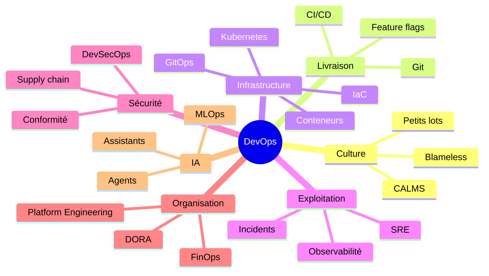

---

## 2. Ce qui a changé en 2026 (à retenir)

| Sujet | État constaté (sept. 2026) |
|---|---|
| **Kubernetes** | Version **1.37** publiée le 26 août 2026 ; branches supportées : 1.37, 1.36, 1.35. **1.34 arrive en fin de vie le 27 octobre 2026.** |
| **Ingress-NGINX** | **Retiré** le 24 mars 2026 (plus de correctifs, même de sécurité). Migration vers **Gateway API** recommandée. |
| **OpenTofu** | Version **1.12** (14 mai 2026), branche 1.13 en bêta. La branche 1.11 a reçu son dernier patch. |
| **GitOps** | **Argo CD 3.5** (4 août 2026) ; **Flux 2.8** (février 2026) avec support de Helm v4 et un tableau de bord web via Flux Operator. |
| **OpenTelemetry** | Configuration déclarative **stable** (mars 2026) ; signal **Profiles** en alpha publique ; traces, métriques, logs stables. |
| **DORA** | Le cadre utilise désormais **cinq** métriques (ajout du *rework rate*), et le rapport 2025 s'intitule « State of AI-assisted Software Development ». |
| **Supply chain** | Vagues de vers npm/PyPI en 2026 (Mini Shai-Hulud, ChainDrop) : une **provenance SLSA valide ne garantit pas qu'un paquet soit sain**. |
| **GitHub Actions** | Feuille de route sécurité 2026 : verrouillage des dépendances de workflow, politiques d'exécution, secrets à portée limitée, pare-feu de sortie. |
| **CRA (UE)** | **Depuis le 11 septembre 2026** : obligation de signaler les vulnérabilités activement exploitées et incidents graves (24 h / 72 h / 14 jours). |
| **NIS2 (France)** | Transposition **non promulguée** à mi-septembre 2026 ; la France a été renvoyée devant la CJUE le 8 juillet 2026. |
| **MCP / agents** | MCP est passé sous la gouvernance de l'**Agentic AI Foundation** (Linux Foundation) ; les agents IA deviennent des « consommateurs » des plateformes. |

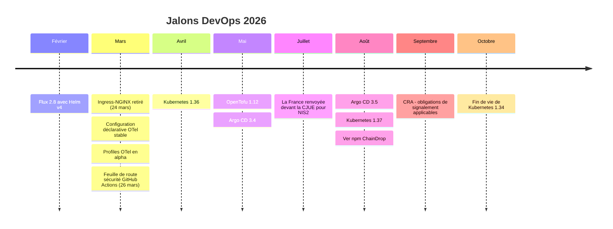

---

## 3. Culture et principes

Le DevOps est d'abord une **culture** : supprimer le mur entre développement et exploitation pour livrer **souvent, en petits lots, avec fiabilité**.

Modèle **CALMS** :

| Lettre | Signification | Idée |
|---|---|---|
| C | Culture | Responsabilité partagée, post-mortems sans blâme |
| A | Automation | Tout ce qui est répétitif est automatisé |
| L | Lean | Petits lots, flux continu, réduction du gaspillage |
| M | Measurement | Décisions fondées sur des métriques |
| S | Sharing | Partage de connaissances et de pratiques |

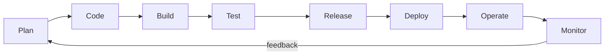

---

## 4. Git et workflows de branches

- **Git** est la source de vérité : code, configuration, infrastructure, pipelines.
- **Trunk-based development** (branches très courtes, merge quotidien, *feature flags*) : modèle privilégié pour la livraison continue.
- **GitFlow** : plus lourd, adapté aux releases planifiées.
- Bonnes pratiques : PR courtes, revue de code, commits signés, protection de branche, [Conventional Commits](https://www.conventionalcommits.org).

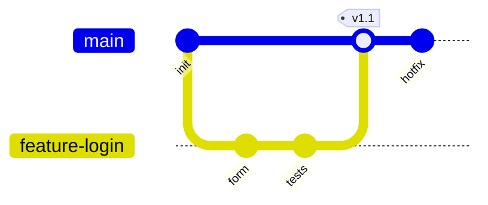

---

## 5. CI/CD

- **CI** : à chaque changement, on compile, teste et analyse.
- **Continuous Delivery** : prêt à déployer, validation manuelle. **Continuous Deployment** : automatique jusqu'en production.
- Outils courants : GitHub Actions, GitLab CI, Jenkins, CircleCI, Azure DevOps, Tekton, Dagger.

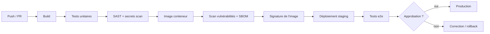

### Stratégies de déploiement

| Stratégie | Principe | Point d'attention |
|---|---|---|
| Rolling update | Remplacement progressif | Simple, rollback plus lent |
| Blue/Green | Deux environnements, bascule du trafic | Rollback instantané, coût doublé |
| Canary | Petit pourcentage du trafic vers la nouvelle version | Nécessite bonne observabilité |
| Feature flags | Activation fonctionnelle découplée du déploiement | Dette de flags à nettoyer |

### Sécuriser GitHub Actions (priorité 2026)

Constat : les références mutables (`@v4`) permettent le détournement de tags. GitHub a publié le **26 mars 2026** une feuille de route sécurité : verrouillage des dépendances au niveau workflow (section `dependencies:`), protections d'exécution via *rulesets*, secrets à portée limitée, *Actions Data Stream*, pare-feu de sortie natif. Vérifiez l'état actuel (préversion ou GA) dans la documentation GitHub avant adoption.

À appliquer dès maintenant :

```yaml
name: ci
on:
  pull_request:
  push:
    branches: [main]

permissions:
  contents: read            # moindre privilège par défaut

jobs:
  build:
    runs-on: ubuntu-latest
    permissions:
      contents: read
      id-token: write       # uniquement si authentification OIDC nécessaire
    steps:
      # Épingler chaque action sur un SHA complet (commentaire = version lisible)
      - uses: actions/checkout@<SHA-complet-du-commit>  # vX.Y.Z
      - run: make test
```

Bonnes pratiques :
- épingler les actions sur des **SHA complets** et activer Dependabot/Renovate pour les mettre à jour ;
- **OIDC** vers le cloud plutôt que des clés statiques ;
- restreindre les workflows déclenchés par des contributeurs externes (`pull_request_target` avec prudence) ;
- ne jamais interpoler du contenu non fiable (titres d'issues, noms de branches) dans des commandes shell.

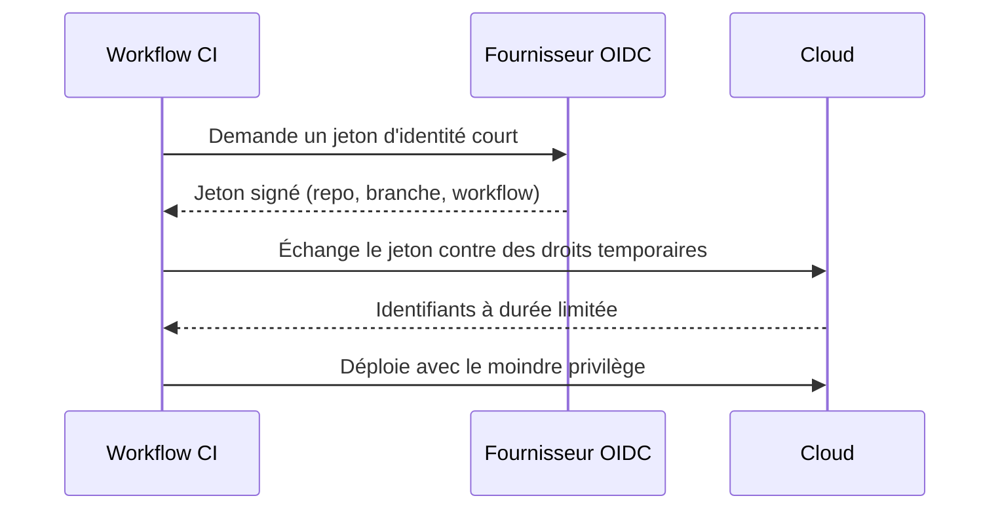

---

## 6. Infrastructure as Code

Décrire l'infrastructure dans des fichiers versionnés, reproductibles et testables.

| Approche | Outils |
|---|---|
| Déclaratif | Terraform, **OpenTofu**, CloudFormation, Bicep, Crossplane |
| Langages généralistes | Pulumi, CDK |
| Configuration de machines | Ansible, Puppet, Chef |
| Policy as code | OPA/Conftest, Kyverno, Checkov |

### OpenTofu (Linux Foundation, licence MPL 2.0)

- **1.11** : *ephemeral resources* et attributs *write-only* (les secrets ne sont plus persistés dans le state ni les plans), méta-argument `enabled`.
- **1.12** (14 mai 2026) : `prevent_destroy` dynamique, import par *resource identity*, option `-json-into=FICHIER` (sortie lisible + sortie JSON simultanées), meilleure gestion des checksums de providers.

```hcl
variable "protect_db" {
  type    = bool
  default = true
}

resource "example_database" "main" {
  # ...
  lifecycle {
    prevent_destroy = var.protect_db   # dynamique depuis OpenTofu 1.12
  }
}
```

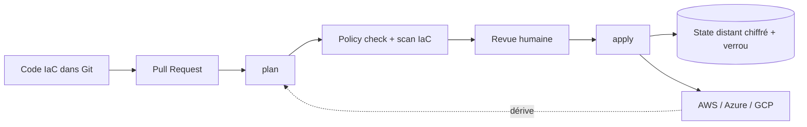

Règles d'or : state distant et verrouillé, modules versionnés, aucun secret en clair, détection de dérive planifiée, tests (`tofu test` / `terraform test`, Terratest).

---

## 7. Conteneurs et Kubernetes

### Conteneurs

- Runtimes : containerd, CRI-O, Podman, Docker.
- Bonnes pratiques : images minimales (distroless), *multi-stage builds*, utilisateur non-root, références par **digest**, scan et SBOM au build.

```dockerfile
FROM golang:1.23 AS build
WORKDIR /src
COPY . .
RUN CGO_ENABLED=0 go build -o /app

FROM gcr.io/distroless/static
COPY --from=build /app /app
USER 65532
ENTRYPOINT ["/app"]
```

### Kubernetes : versions et cycle de vie

| Version | Sortie | Fin de vie | Dernier patch constaté |
|---|---|---|---|
| **1.37** | 26 août 2026 | 28 oct. 2027 | 1.37.1 (15 sept. 2026) |
| **1.36** | 22 avril 2026 | 28 juin 2027 | 1.36.5 |
| **1.35** | 17 déc. 2025 | 28 févr. 2027 | 1.35.9 |
| 1.34 | 27 août 2025 | **27 oct. 2026** | 1.34.12 |

Le projet maintient les trois dernières versions mineures. Planifiez la sortie de 1.34 dès maintenant.

### Nouveautés notables de Kubernetes 1.37

- **HPA scale to zero** passe en bêta et est activé par défaut (pour métriques d'objet ou externes) ;
- **KYAML** (sous-ensemble strict de YAML pour kubectl) et **Pod Certificates** passent en stable ;
- **Manifest-based admission control** en bêta ;
- **DRA** (Dynamic Resource Allocation, GPU et accélérateurs) : *extended resource support* en GA ;
- **Workload-aware scheduling** : API Workload/PodGroup (gang scheduling) en bêta, nouvelle API alpha **CompositePodGroup** ;
- mode **rootless du kubelet** en bêta, histogrammes natifs pour les métriques en bêta.

### Réseau : de Ingress à Gateway API

Le contrôleur **ingress-nginx** est **retiré depuis le 24 mars 2026** : plus aucune version ni correctif de sécurité. L'API `Ingress` elle-même n'est pas supprimée, mais son développement est figé. La **Gateway API** est la cible recommandée ; l'outil officiel **ingress2gateway** (1.0 le 20 mars 2026) aide à convertir les annotations courantes (certaines n'ont pas d'équivalent).

Implémentations : Envoy Gateway, NGINX Gateway Fabric, Istio, Cilium, kgateway, offres cloud.

```yaml
apiVersion: gateway.networking.k8s.io/v1
kind: HTTPRoute
metadata:
  name: api
spec:
  parentRefs:
    - name: prod-gateway
  hostnames: ["api.example.com"]
  rules:
    - matches:
        - path: { type: PathPrefix, value: /v1 }
      backendRefs:
        - name: api-v1
          port: 80
          weight: 90
        - name: api-v2
          port: 80
          weight: 10        # canary natif, sans annotation
```

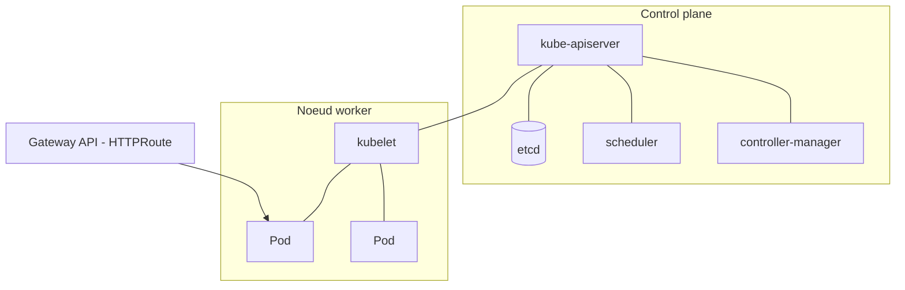

Écosystème : Helm (Helm 4 supporté par Flux 2.8) et Kustomize pour le packaging, service mesh (Istio, Linkerd), **Cilium/eBPF** pour réseau et sécurité, **KEDA** pour l'autoscaling événementiel, **Karpenter** pour le scaling des nœuds, WebAssembly comme option émergente.

---

## 8. GitOps

**Principe** : Git décrit l'état désiré ; un agent dans le cluster **tire** cet état et réconcilie en continu.

| | Argo CD | Flux |
|---|---|---|
| Dernière version constatée | 3.5.x (3.5.3 le 14 sept. 2026) | 2.8 (févr. 2026) |
| Versions supportées | Les 3 dernières mineures (3.5, 3.4, 3.3) | Voir la page de release Flux |
| Cadence | Une mineure tous les 3 mois | Selon le projet |
| Points forts | Interface riche, ApplicationSets, Source Hydrator | Approche modulaire native Kubernetes, support Helm v4, GPG natif sur les dépôts |

Nouveautés 2026 :
- **Argo CD 3.5** : mTLS interne, vérification d'intégrité des sources (*Source Integrity*), aperçu des ApplicationSets ; *impersonation* et Source Hydrator en bêta.
- **Flux 2.8** : support de Helm v4, évaluation de santé via expressions CEL, annulation des health checks lors d'un nouveau commit (récupération plus rapide), commentaires de PR depuis les notifications, tableau de bord web via Flux Operator.

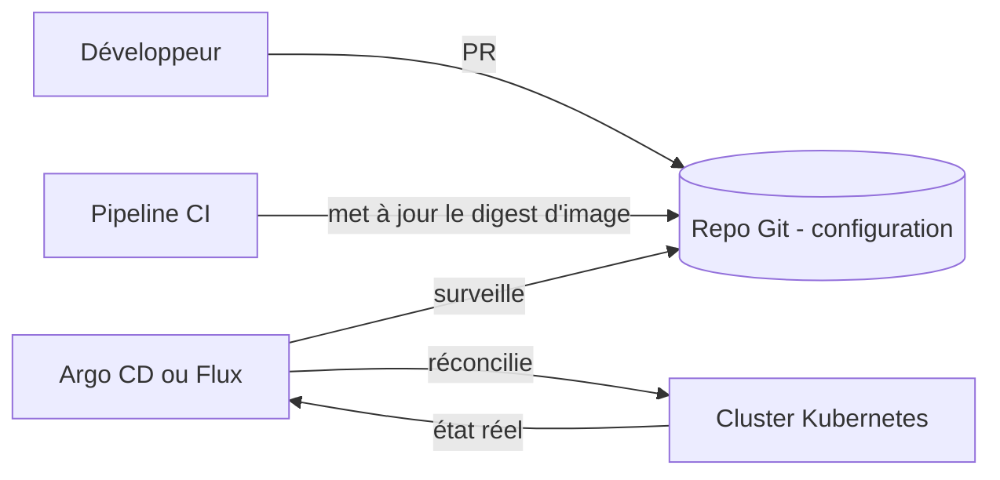

```yaml
apiVersion: argoproj.io/v1alpha1
kind: Application
metadata:
  name: mon-app
  namespace: argocd
spec:
  project: default
  source:
    repoURL: https://git.example.com/org/config.git
    targetRevision: main
    path: apps/mon-app/overlays/prod
  destination:
    server: https://kubernetes.default.svc
    namespace: mon-app
  syncPolicy:
    automated:
      prune: true
      selfHeal: true
```

Avantages : audit natif, rollback par `git revert`, pas d'accès direct de la CI au cluster, détection de dérive.

---

## 9. Observabilité

Objectif : comprendre un système à partir de ses signaux, y compris pour des pannes imprévues.

| Signal | Question | Outils courants | Statut OpenTelemetry (mi-2026) |
|---|---|---|---|
| Métriques | Que se passe-t-il globalement ? | Prometheus, Mimir, VictoriaMetrics | Stable |
| Logs | Que s'est-il passé exactement ? | Loki, OpenSearch | Stable |
| Traces | Où le temps est-il perdu ? | Tempo, Jaeger | Stable |
| Profils | Quel code consomme ? | Pyroscope, Parca | **Alpha publique** (mars 2026), déconseillé pour la production critique |

### OpenTelemetry en 2026

- **Configuration déclarative stable** (mars 2026) : un fichier YAML unique décrit les pipelines de traces, métriques et logs ; la variable `OTEL_CONFIG_FILE` pointe vers ce fichier. Elle remplace la multiplication de variables `OTEL_*`. Vérifiez le niveau de support de votre langage dans la matrice de compatibilité du projet.
- **Profiles** : quatrième signal, avec profileur eBPF système-wide, support côté Collector depuis la v0.148.0.
- Conventions sémantiques **Kubernetes** en *release candidate*.

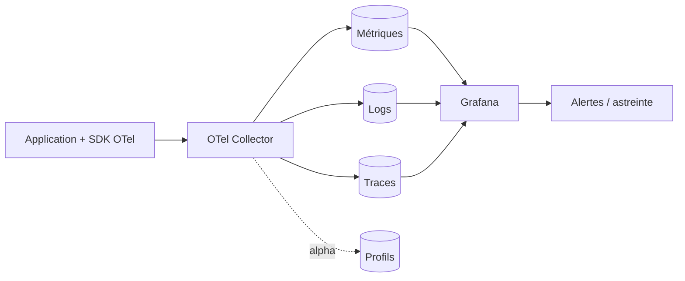

Bonnes pratiques : alerter sur les **symptômes** (SLO) plutôt que les causes, corréler par `trace_id`, maîtriser la cardinalité et les coûts, échantillonner intelligemment.

---

## 10. DevSecOps et sécurité de la supply chain

**Shift left** : la sécurité est intégrée dès la conception et dans chaque étape du pipeline.

| Étape | Contrôle | Exemples d'outils |
|---|---|---|
| Code | SAST, détection de secrets | Semgrep, CodeQL, Gitleaks |
| Dépendances | SCA | Dependabot, Renovate, Trivy |
| Build | Signature, provenance | Sigstore/Cosign, SLSA |
| Image | Scan, SBOM | Trivy, Grype, Syft |
| IaC | Policy as code | Checkov, OPA, Kyverno |
| Runtime | Détection de menaces | Falco, Tetragon |
| Secrets | Gestion centralisée | Vault, External Secrets, SOPS |

### Leçon majeure de 2026 : provenance ≠ sécurité

Selon l'analyse d'Unit 42 (Palo Alto Networks) et de Microsoft Threat Intelligence, 2026 a vu des **vers auto-propagés** (famille Shai-Hulud, campagne « Mini Shai-Hulud », puis « ChainDrop » le 4 août 2026, plus de 400 paquets npm touchés) qui volent des jetons de publication et republient des versions piégées **via les propres pipelines légitimes** des mainteneurs. Certains paquets malveillants portaient une **provenance SLSA de niveau 3 valide** : la provenance prouve *quel pipeline a construit l'artefact*, pas que ce pipeline n'ait pas été compromis.

Ce qu'il faut en retenir :

| Outil | Ce qu'il répond | Ce qu'il ne répond pas |
|---|---|---|
| **SBOM** | De quoi est composé l'artefact ? | Est-il sûr ? |
| **Provenance SLSA / Sigstore** | Comment et où a-t-il été construit ? | Le pipeline était-il sain ? |
| **Scan de vulnérabilités** | Contient-il des CVE connues ? | Contient-il du code malveillant inédit ? |

Défenses complémentaires :
- **Trusted publishing** restreint à un **workflow précis sur une branche protégée** (pas tout le dépôt) ;
- délai de **quarantaine** avant d'adopter une nouvelle version de dépendance (Renovate `minimumReleaseAge`, équivalents) ;
- désactiver les scripts d'installation (`preinstall`, `postinstall`) quand c'est possible ;
- pare-feu de sortie sur les runners CI, secrets à portée minimale, jetons de courte durée ;
- épinglage par digest/SHA et verrouillage des dépendances (y compris celles des workflows).

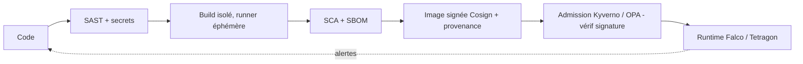

---

## 11. Réglementation européenne (CRA, NIS2)

> Information générale, pas un avis juridique : consultez votre juriste ou RSSI.

### Cyber Resilience Act (Règlement UE 2024/2847)

| Date | Événement |
|---|---|
| **11 septembre 2026** | Les obligations de signalement de l'article 14 s'appliquent (déjà en vigueur) |
| 11 décembre 2027 | Application de l'essentiel du règlement (exigences essentielles, marquage CE) |

Pour les fabricants de produits comportant des éléments numériques (matériel **et** logiciel), depuis le 11 septembre 2026 :
- signaler les **vulnérabilités activement exploitées** et les **incidents graves** ;
- **alerte précoce sous 24 h**, notification complète sous **72 h**, rapport final au plus tard **14 jours après la disponibilité d'un correctif** (vulnérabilités) ou **un mois après la notification de 72 h** (incidents graves) ;
- via la **plateforme unique de signalement (SRP)** opérée par l'ENISA ;
- valable aussi pour les produits **déjà présents** sur le marché de l'UE ;
- pour les *stewards* de logiciels open source, les obligations de signalement s'appliquent à partir du 11 décembre 2027.

Impact DevOps : capacité à **détecter, qualifier et notifier vite** implique SBOM à jour, inventaire des composants, processus de gestion des vulnérabilités et astreinte adaptée.

### NIS2 en France

- La transposition française (« loi Résilience ») **n'était pas promulguée** à la mi-septembre 2026.
- La Commission européenne a **renvoyé la France devant la CJUE le 8 juillet 2026** pour défaut de transposition complète.
- L'ANSSI a publié le **ReCyF** (Référentiel Cyber France, version de travail, 17 mars 2026) ; un examen à l'Assemblée nationale est attendu à l'automne 2026.
- Environ 15 000 entités seraient concernées selon l'étude d'impact ; un délai d'environ trois ans après promulgation est annoncé avant plein effet, l'ANSSI recommandant de ne pas attendre.

> Ne pas confondre : **DORA** (métriques de performance logicielle, section 16) et **DORA** (règlement européen de résilience opérationnelle du secteur financier).

---

## 12. SRE et fiabilité

**Site Reliability Engineering** : appliquer l'ingénierie logicielle aux opérations.

- **SLI** : indicateur mesuré (ex. taux de requêtes réussies).
- **SLO** : objectif (ex. 99,9 % sur 30 jours).
- **Error budget** : 100 % − SLO. Budget épuisé → priorité à la fiabilité.
- **Toil** : travail manuel répétitif à éliminer.
- **Incident management** : rôles clairs, runbooks, post-mortems sans blâme.
- **Chaos engineering** : injection de pannes contrôlées (Chaos Mesh, Litmus).

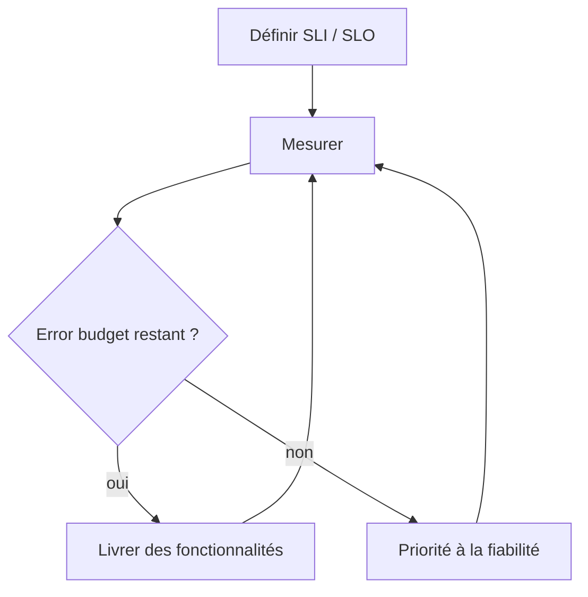

---

## 13. Platform Engineering

Une équipe plateforme construit une **Internal Developer Platform (IDP)** en libre-service (le *golden path*) pour réduire la **charge cognitive** des développeurs. La plateforme est traitée **comme un produit**.

Constats récents (CNCF / SlashData, Q1 2026, ~420 développeurs) :
- **28 %** des répondants ont une équipe plateforme dédiée, **41 %** une approche multi-équipes, **31 %** aucune approche formelle ;
- **35 %** des organisations utilisent une plateforme **hybride** : plateforme existante + outillage IA spécialisé ;
- l'IA est vue comme un facteur clé : plateformes **augmentées par l'IA** et plateformes **pour l'IA** (GPU, MLOps).

Tendances :
- **Backstage** (CNCF) reste la référence des portails, avec des serveurs MCP pour exposer le catalogue aux agents ; alternatives : Port, Cortex.
- Les **agents IA** deviennent des consommateurs de la plateforme avec leurs propres accès et règles de gouvernance ; on parle d'**Agent Experience (AX)**.
- *Shifting down* : la plateforme applique automatiquement sécurité, conformité et coûts plutôt que de les déléguer à chaque équipe.

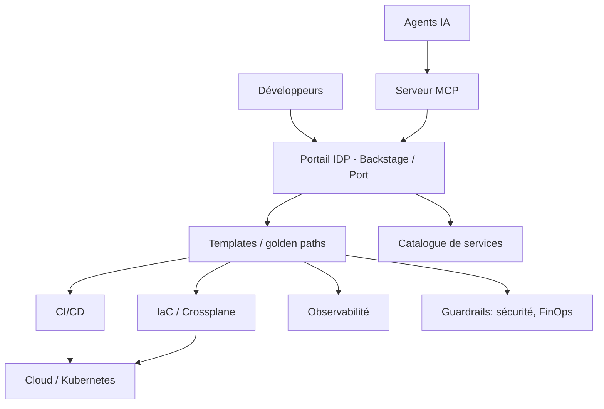

---

## 14. FinOps et GreenOps

- **FinOps** : gestion collaborative des coûts cloud (Finance, Ingénierie, Produit). Cycle : *Inform → Optimize → Operate*.
- Leviers : tags obligatoires, budgets et alertes, *rightsizing*, engagements (Savings Plans), Spot, autoscaling, extinction des environnements inactifs. Kubernetes 1.37 (HPA scale to zero) et Karpenter facilitent la réduction des ressources inactives.
- Outils : OpenCost, Kubecost, outils natifs cloud.
- **GreenOps** : mesurer l'empreinte (Kepler, Cloud Carbon Footprint), choisir des régions à faible intensité carbone, planifier les traitements batch.
- Tendance : les garde-fous de coût sont intégrés **au moment du provisionnement** (coût estimé visible dans la PR IaC).

---

## 15. IA, agents et DevOps

### L'IA pour le DevOps

- Assistants de code et de revue, génération de pipelines et d'IaC, analyse de logs, corrélation d'alertes, **agents d'incident** (ex. AWS DevOps Agent, outils SRE agentiques) qui diagnostiquent et proposent des remédiations.
- **MCP (Model Context Protocol)** : protocole ouvert pour connecter des agents à des outils et données. Anthropic l'a donné à l'**Agentic AI Foundation** (Linux Foundation) le 9 décembre 2025. Une révision majeure de la spécification finalisée le 28 juillet 2026 rend MCP sans session au niveau protocole (selon la synthèse Wikipédia citant la presse spécialisée).
- Vigilance : humain dans la boucle pour la production, **moindre privilège** pour les agents, jetons courts, journalisation complète, aucune exposition de secrets, protection contre l'**injection de prompt** (des incidents de supply chain 2026 ont exploité des agents ou du contenu non fiable dans la CI).

### DevOps pour l'IA (MLOps / LLMOps)

- Versionner données, modèles et prompts ; pipelines d'entraînement et d'évaluation continue ; déploiement de modèles (KServe, vLLM) ; observabilité des LLM (coût, latence, qualité) ; gestion des GPU via **DRA** sur Kubernetes.

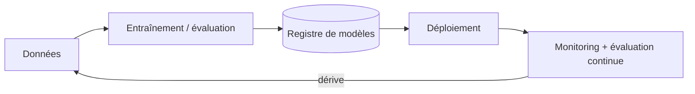

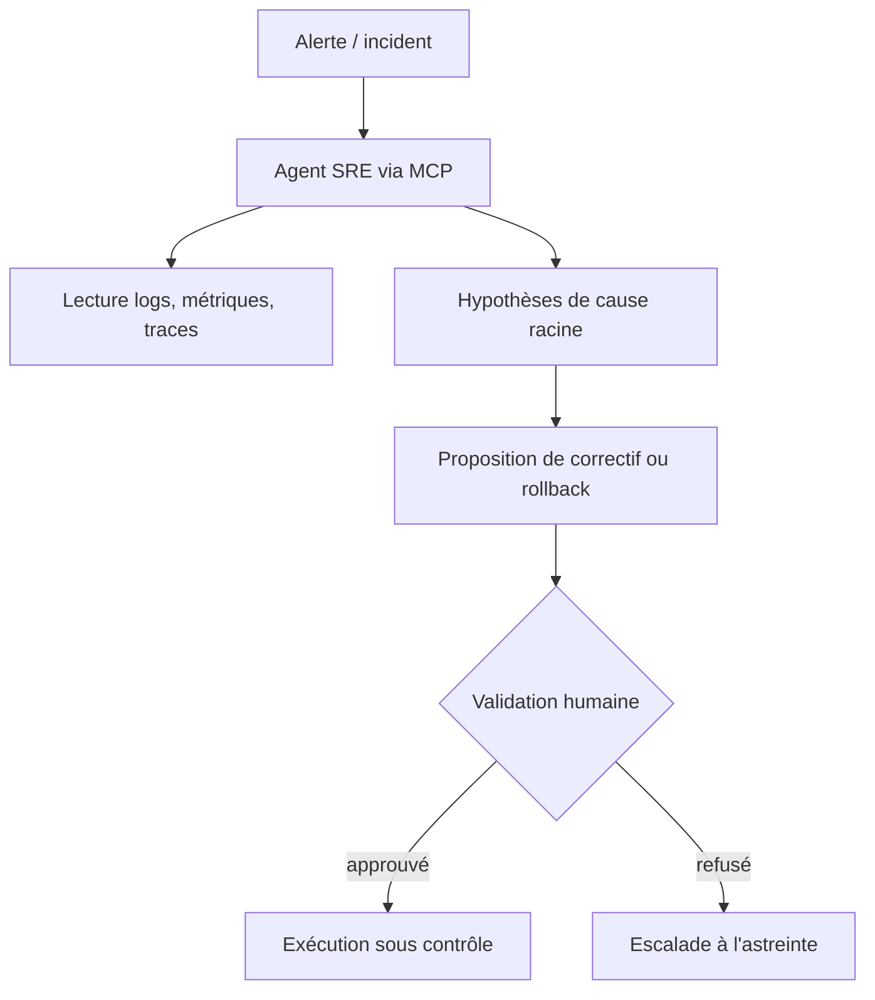

---

## 16. Mesurer la performance : DORA

Depuis 2024 (et confirmé en 2025), DORA utilise **cinq métriques** de performance de livraison, en deux groupes :

| Groupe | Métrique | Mesure |
|---|---|---|
| Débit | **Change lead time** | Du commit au déploiement réussi en production |
| Débit | **Deployment frequency** | Fréquence de déploiement |
| Débit | **Failed deployment recovery time** | Temps de rétablissement après un déploiement raté |
| Instabilité | **Change failure rate** | % de déploiements nécessitant correctif ou rollback |
| Instabilité | **Deployment rework rate** | Part de déploiements non planifiés causés par des défauts |

Points importants :
- Le **MTTR** n'est plus la métrique officielle : elle a été redéfinie en *failed deployment recovery time*.
- Le rapport 2025 a été renommé **« State of AI-assisted Software Development »** ; il décrit l'IA comme un **amplificateur** : elle accroît le débit individuel mais peut dégrader la stabilité si les petits lots, la revue et les tests ne suivent pas.
- Les cinq métriques ne suffisent pas : à compléter avec taille des PR, temps par étape du flux de valeur, expérience développeur (DevEx).
- N'utilisez jamais ces métriques pour comparer ou sanctionner des individus.

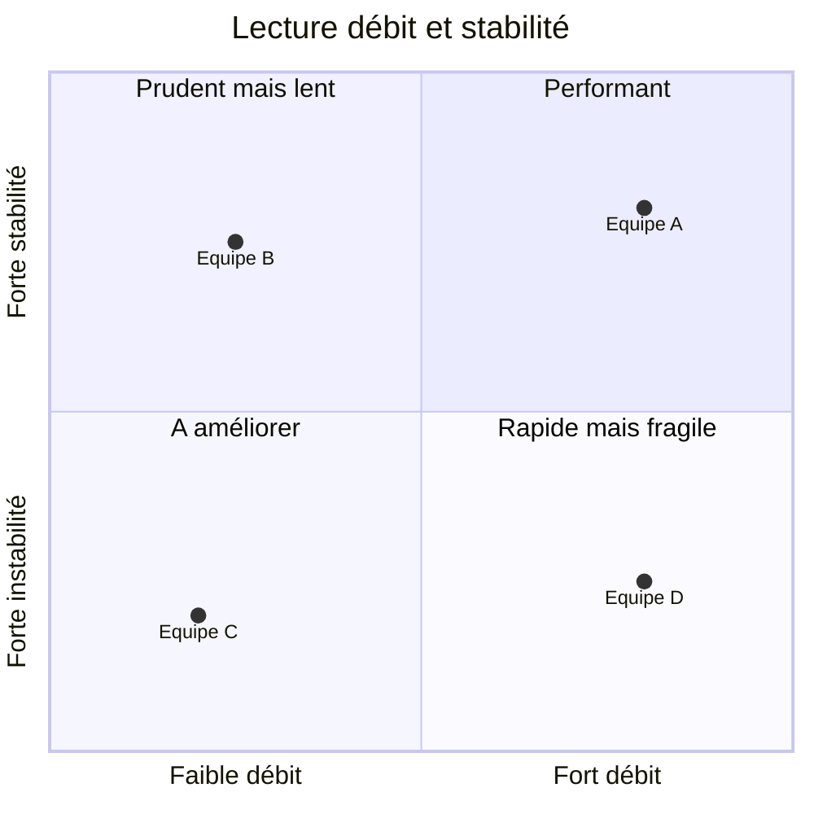

---

## 17. Feuille de route d'apprentissage

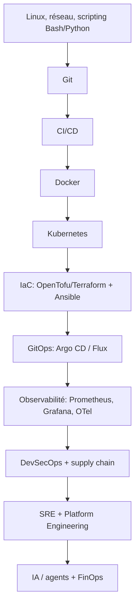

**Projet fil rouge** (une API + une base de données) :

1. Conteneuriser (image minimale, non-root).
2. CI avec GitHub Actions : tests, build, actions épinglées sur SHA, permissions minimales, OIDC.
3. Provisionner un cluster (kind en local, ou cloud) avec OpenTofu.
4. Exposer via **Gateway API** (et non Ingress-NGINX).
5. Livrer par GitOps (Argo CD ou Flux), stratégie canary.
6. Instrumenter avec OpenTelemetry + Grafana, définir un SLO et une alerte.
7. Sécuriser : scan, SBOM, signature Cosign, politique d'admission Kyverno.
8. Ajouter un budget de coûts et mesurer les métriques DORA.

**Certifications utiles** : CKA, CKAD, CKS (Kubernetes), Terraform Associate, certifications DevOps AWS/Azure/GCP, Prometheus Certified Associate. Vérifiez les programmes actuels sur les sites des organismes.

---

## Sources

Pages officielles ou primaires en priorité ; les analyses tierces sont signalées.

**Kubernetes et réseau**
- Versions et fin de vie : https://kubernetes.io/releases/
- Annonce de Kubernetes 1.37 : https://kubernetes.io/blog/2026/08/26/kubernetes-v1-37-release/
- 1.37, mises à jour DRA : https://kubernetes.io/blog/2026/09/03/kubernetes-v1-37-dra-updates/
- 1.37, ordonnancement par charge de travail : https://kubernetes.io/blog/2026/09/08/kubernetes-v1-37-advancing-workload-aware-scheduling/
- Cycle de vie EKS : https://docs.aws.amazon.com/eks/latest/userguide/kubernetes-versions.html
- Retrait d'Ingress-NGINX (analyse Google Open Source) : https://opensource.googleblog.com/2026/02/the-end-of-an-era-transitioning-away-from-ingress-nginx.html
- Guide de migration ingress2gateway (analyse tierce) : https://dev.to/x4nent/ingress-nginx-is-officially-retired-complete-gateway-api-migration-guide-with-ingress2gateway-10-lg9

**IaC et GitOps**
- OpenTofu 1.12 : https://opentofu.org/blog/opentofu-1-12-0/
- Nouveautés OpenTofu 1.11 : https://opentofu.org/docs/intro/whats-new
- Calendrier des versions Argo CD : https://endoflife.date/argo-cd et https://argo-cd.readthedocs.io/en/latest/developer-guide/release-process-and-cadence/
- Argo CD 3.5 (InfoQ) : https://www.infoq.com/news/2026/06/argocd-supply-chain-security/
- Flux 2.8 : https://fluxcd.io/blog/2026/02/flux-v2.8.0/

**Observabilité**
- Configuration déclarative stable : https://opentelemetry.io/blog/2026/stable-declarative-config/
- Signal Profiles en alpha (synthèse tierce) : https://clickhouse.com/resources/engineering/otel-news-profiles-signal
- Actualités OTel : https://opentelemetry.io/blog/

**CI/CD et supply chain**
- Feuille de route sécurité GitHub Actions 2026 : https://github.blog/news-insights/product-news/whats-coming-to-our-github-actions-2026-security-roadmap/
- Panorama des menaces npm (Unit 42) : https://unit42.paloaltonetworks.com/monitoring-npm-supply-chain-attacks/
- ChainDrop (Microsoft) : https://www.microsoft.com/en-us/security/blog/2026/08/04/chaindrop-supply-chain-compromise-anatomy-self-propagating-worm/
- Synthèse supply chain 2026 (analyse tierce) : https://www.softwareseni.com/software-supply-chain-security-in-2026/

**Réglementation**
- CRA, obligations de signalement (Commission européenne) : https://digital-strategy.ec.europa.eu/en/policies/cra-reporting
- CRA, guide (analyse tierce) : https://www.cyberresilienceact.eu/explained.html
- NIS2 en France, état de la transposition (analyses tierces, à recouper avec Legifrance et l'ANSSI) : https://www.nis-2-directive.com/Transposition/France.html et https://sildaro.com/cyber-attaque/nis2-france-transposition-etat-des-lieux-aout-2026/

**Platform Engineering, DORA, IA**
- Historique des métriques DORA : https://dora.dev/insights/dora-metrics-history/
- DORA, bilan 2025 : https://dora.dev/insights/dora-2025-year-in-review/
- CNCF / SlashData, plateformes (Q1 2026) : https://www.cncf.io/announcements/2026/03/24/cncf-and-slashdata-report-finds-platform-engineering-tools-maturing-as-organizations-prepare-for-ai-driven-infrastructure/
- CNCF, plateformes pour l'ère IA : https://www.cncf.io/blog/2026/07/06/evolving-platform-engineering-for-ai-native-workloads/
- MCP et Agentic AI Foundation : https://blog.modelcontextprotocol.io/posts/2025-12-09-mcp-joins-agentic-ai-foundation/

---

*Contributions bienvenues : ouvrez une PR pour corriger ou actualiser une section. Pensez à mettre à jour la date de vérification en tête de fichier.*
