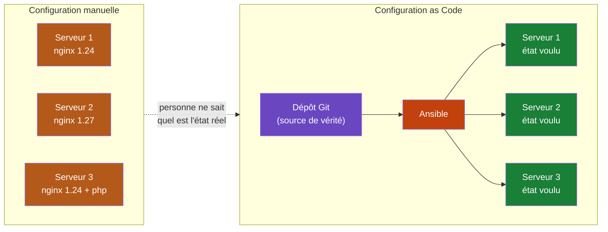
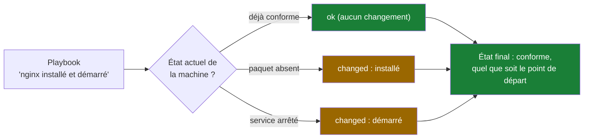
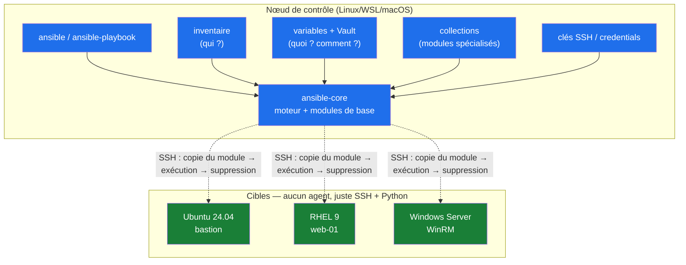
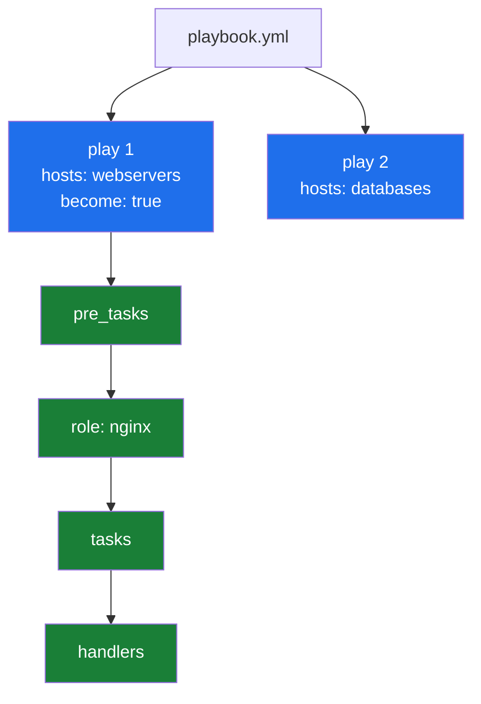
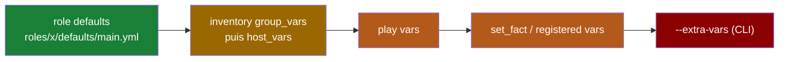
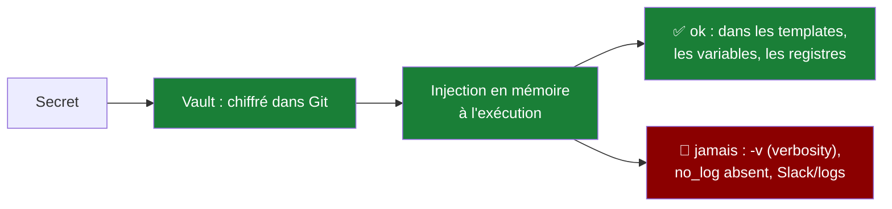
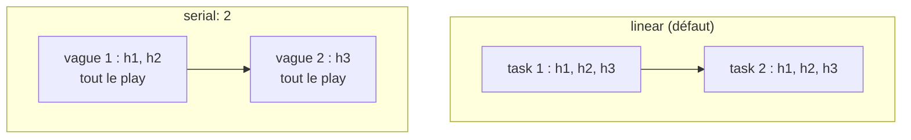
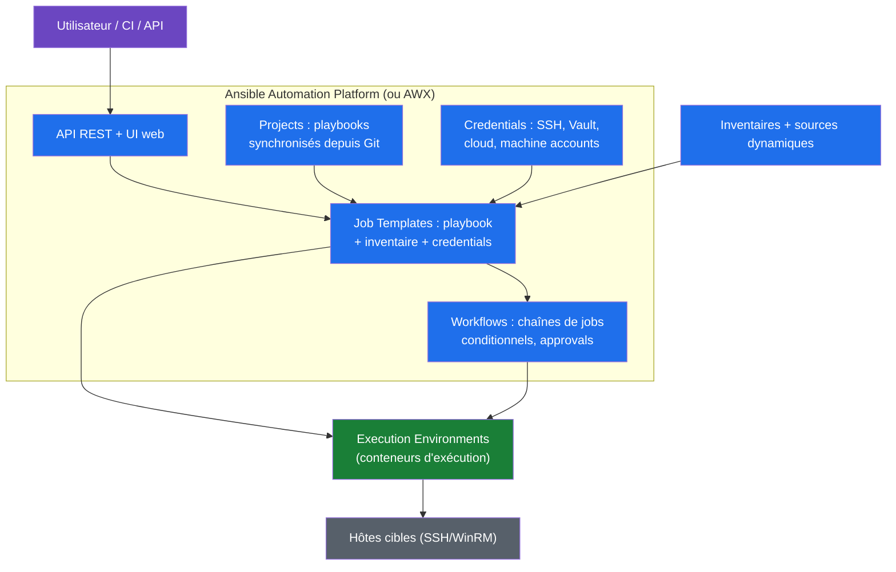

# Ansible — Le cours complet

   -purple)

> Cours à jour (ansible-core **2.19** série LTS « What Is and What Should Never Be », collections certifiées Galaxy, Ansible Automation Platform 2.5+). Ansible n'a pas d'agent : il pilote des machines distantes **par SSH**, en **Python**, avec du **YAML déclaratif**.
> Exercices pratiques : [dossier `exercices/`](../exercices/).

---

## 🧭 Parcours de lecture

| Vous êtes… | Parcours | Parties | Durée estimée |
|---|---|---|---|
| 🌱 **Débutant** | IaC + architecture + inventaire + premiers playbooks | 1 → 6 | ≈ 3 h |
| 🌿 **Praticien** | Variables, templates, contrôle de flux, rôles | 7 → 12 | ≈ 3 h 30 |
| 🚀 **Confirmé** | Secrets, stratégies, exécution à l'échelle, GitOps | 13 → 18 | ≈ 2 h 30 |
| 🔍 **Révision rapide** | Cheat sheet + quiz + exercices | 19 → 20 | ≈ 30 min |

💡 **Méthode** : chaque partie contient des commandes à jouer. Ansible s'apprend en écrivant des playbooks, pas en lisant. Les scénarios « 🏢 En entreprise » montrent comment chaque concept se manifeste dans un SI réel.

---

## Table des matières

- [x] [1. Pourquoi l'Infrastructure as Code](#1-pourquoi-linfrastructure-as-code)
- [x] [2. L'architecture Ansible : agentless, push, SSH](#2-larchitecture-ansible--agentless-push-ssh)
- [x] [3. Installation et premiers pas](#3-installation-et-premiers-pas)
- [x] [4. L'inventaire : décrire ses machines](#4-linventaire--décrire-ses-machines)
- [x] [5. Les commandes ad-hoc : piloter sans playbook](#5-les-commandes-ad-hoc--piloter-sans-playbook)
- [x] [6. Le playbook : plays, tasks, modules](#6-le-playbook--plays-tasks-modules)
- [x] [7. Variables et précédence](#7-variables-et-précédence)
- [x] [8. Les facts : la collecte d'informations](#8-les-facts--la-collecte-dinformations)
- [x] [9. Les templates Jinja2](#9-les-templates-jinja2)
- [x] [10. Contrôle de flux : when, loops, handlers, blocks](#10-contrôle-de-flux--when-loops-handlers-blocks)
- [x] [11. Erreurs et résilience : changed_when, failed_when, ignore_errors](#11-erreurs-et-résilience--changed_when-failed_when-ignore_errors)
- [x] [12. Rôles et collections : structurer son code](#12-rôles-et-collections--structurer-son-code)
- [x] [13. Ansible Vault : les secrets](#13-ansible-vault--les-secrets)
- [x] [14. Tags, check mode, diff : piloter finement l'exécution](#14-tags-check-mode-diff--piloter-finement-lexécution)
- [x] [15. Stratégies d'exécution, délégation et performances](#15-stratégies-dexécution-délégation-et-performances)
- [x] [16. L'exécution à l'échelle : AWX et Ansible Automation Platform](#16-lexécution-à-léchelle--awx-et-ansible-automation-platform)
- [x] [17. Ansible en entreprise : scénarios réels](#17-ansible-en-entreprise--scénarios-réels)
- [x] [18. Bonnes pratiques et durcissement](#18-bonnes-pratiques-et-durcissement)
- [x] [19. Pièges classiques et dépannage](#19-pièges-classiques-et-dépannage)
- [x] [20. Aide-mémoire, exercices corrigés et glossaire](#20-aide-mémoire-exercices-corrigés-et-glossaire)

---

## 1. Pourquoi l'Infrastructure as Code

### 1.1 Le problème : la configuration manuelle

Un parc de 50 serveurs, configurés à la main au fil des ans : des paquets installés « pour voir », des versions de `nginx` qui diffèrent d'une machine à l'autre, un `sysctl` modifié sur 3 hôtes en urgence puis jamais documenté. Ce chaos porte un nom : **configuration drift** (« dérive de configuration »).



> [!IMPORTANT]
> **L'IaC inverse la charge de la preuve** : ce n'est plus « ai-je le droit de modifier ce serveur ? » mais « ce changement est-il dans le dépôt ? ». Sans trace en Git, le changement n'existe pas.

### 1.2 La réponse : le code déclaratif

En **impératif**, on décrit les étapes : `apt update`, `apt install nginx`, `sed -i ...`, `systemctl enable nginx`. En **déclaratif**, on décrit l'**état final voulu** : « nginx est installé, activé, avec ce fichier de config ». Ansible calcule lui-même ce qu'il faut faire pour converger vers cet état.

| Comparaison | Script bash | Ansible |
|---|---|---|
| Idempotent (rejouable sans effet de bord) | ❌ à écrire à la main | ✅ par construction |
| Connaît ce qui a changé | ❌ | ✅ (`changed`, `ok`, `failed` par tâche) |
| Parallélisé sur N machines | ❌ | ✅ natif (forks) |
| Lisibilité par un humain | moyenne | ✅ YAML |
| Réutilisation | copier-coller | rôles, collections |

### 1.3 Idempotence : le concept central

Une tâche idempotente produit le **même résultat** quelle que soit sa position de départ :



> [!TIP]
> Rejouer un playbook **ne casse rien** : c'est le fondement du mode de fonctionnement en production (tâches planifiées de correction de dérive, §17.3).

### 🎯 Quiz — partie 1

1. Qu'est-ce que la configuration drift ?
2. Quelle différence entre un script impératif et un playbook déclaratif ?
3. Pourquoi l'idempotence est-elle indispensable en production ?

<details><summary>✅ Réponses</summary>

1. La divergence progressive des configurations réelles entre machines censées être identiques, faute de source de vérité unique.
2. L'impératif décrit les **étapes** (apt install, sed…), le déclaratif décrit l'**état final voulu** ; Ansible calcule les actions nécessaires et ne touche qu'à ce qui diffère.
3. Elle permet de rejouer les playbooks sans effet de bord : corrections de dérive planifiées, déploiements rejoués après échec partiel, tranquillité d'esprit.
</details>

---

## 2. L'architecture Ansible : agentless, push, SSH

### 2.1 Le modèle : un contrôleur, zéro agent

Ansible n'installe **rien** sur les machines cibles. Le **nœud de contrôle** (votre poste, ou un serveur d'exécution) se connecte en **SSH** (ou WinRM pour Windows), copie un mini-programme Python éphémère, l'exécute, récupère le résultat, puis efface tout.



> [!NOTE]
> **Nœud de contrôle : Linux, macOS ou WSL uniquement.** ansible-core ne s'installe pas nativement sur Windows ; il pilote des cibles Windows via WinRM. Sur un poste Windows, la voie standard est WSL2.

### 2.2 Les ingrédients du modèle

| Composant | Rôle | Analogie |
|---|---|---|
| **Nœud de contrôle** | Exécute les playbooks | Le chef d'orchestre |
| **Inventaire** | Liste les cibles, les groupe | La liste des musiciens |
| **Playbook** | Décrit l'état voulu en YAML | La partition |
| **Modules** | Faisceaux d'action idempotents (≈ 4000) | Les instruments |
| **Plugins** | Étendent le comportement (connexion, callbacks, lookup…) | Les accessoires |
| **Collections** | Packaging distribué des modules/rôles/plugins | Les pupitres pré-montés |

### 2.3 Ansible dans la famille IaC

Ansible (configuration) coexiste avec Terraform (provisionnement), Packer (images) et Kubernetes (orchestration de conteneurs). En entreprise, un scénario typique : **Terraform crée les VMs, Packer prépare l'image de base, Ansible configure l'intérieur, Kubernetes fait tourner les conteneurs**.

### 🎯 Quiz — partie 2

1. Que doit-il y avoir sur une machine cible Linux pour qu'Ansible puisse la piloter ?
2. Pourquoi dit-on que le modèle Ansible est « push » ?
3. Quel est le rôle des collections depuis ansible-core 2.10 ?

<details><summary>✅ Réponses</summary>

1. SSH actif (avec le compte autorisé) et **Python 3** présent (pour exécuter les modules) ; rien d'autre.
2. C'est le contrôleur qui initie la connexion vers les cibles ; pas de démon en écoute sur les cibles (contrairement à Puppet/Chef en mode « pull »).
3. Les modules, plugins et rôles sont sortis du cœur pour être distribués séparément via **Ansible Galaxy** ; ansible-core ne garde que le moteur et les modules essentiels (`ansible.builtin.*`).
</details>

---

## 3. Installation et premiers pas

### 3.1 Installation

Ansible se pilote depuis un nœud de contrôle POSIX. Les deux voies usuelles :

```bash
# Voie pip (recommandée pour maîtriser la version) — dans un venv
python3 -m venv ~/.venv-ansible
source ~/.venv-ansible/bin/activate
pip install ansible-core          # moteur seul + modules builtin
pip install ansible               # « la brique » : core + collections communautaires pré-installées

# Voie paquet système (Ubuntu)
sudo apt install ansible          # versions parfois en retard
```

> [!NOTE]
> **`pip install ansible-core` vs `ansible`** : `ansible-core` = le moteur (2.19 en 2026, série LTS). `ansible` = le paquet communautaire qui embarque ~110 collections. En entreprise, on installe `ansible-core` puis on déclare **exactement** les collections nécessaires dans `requirements.yml` — le « grand paquet » est pratique pour apprendre, la sélection fine est la pratique pro.

```bash
# Vérification — la commande de référence
ansible --version
```
```text
ansible [core 2.19.10]
  config file = /home/enzo/lab-ansible/ansible.cfg
  configured module search path = ['/home/enzo/.ansible/plugins/modules']
  ansible python module location = /home/enzo/.venv-ansible/lib/python3.11/site-packages/ansible
  python version = 3.11.13
  jinja version = 3.1.6
```

### 3.2 Le fichier `ansible.cfg`

Ansible cherche sa configuration **dans cet ordre** : variable `ANSIBLE_CONFIG` → `ansible.cfg` du répertoire courant → `~/.ansible.cfg` → `/etc/ansible/ansible.cfg`. La première trouvée gagne — posez-le **à la racine de votre projet** :

```ini
# ansible.cfg — à la racine du dépôt de playbooks
[defaults]
inventory = ./inventories/production.ini
roles_path = ./roles
collections_path = ./collections
host_key_checking = False      # lab uniquement ! (voir §18 en entreprise)
forks = 20                     # exécutions parallèles (défaut : 5)
interpreter_python = auto_silent
stdout_callback = yaml         # sortie lisible (plugin community.general)

[ssh_connection]
pipelining = True              # accélère nettement les connexions SSH
```

> [!WARNING]
> Un `ansible.cfg` oublié à la racine = Ansible remonte silencieusement jusqu'à `~/.ansible.cfg`. Diagnostic : `ansible --version | grep 'config file'` doit pointer **votre** fichier.

### 3.3 Premier contact : ping

```bash
# Inventaire minimal inline : une machine locale
echo "localhost ansible_connection=local" > inv-test.ini

# Le ping Ansible n'est pas ICMP : il exécute un module de test de bout en bout
ansible -i inv-test.ini localhost -c local -m ping
```
```text
localhost | SUCCESS => {
    "ansible_facts": {"discovered_interpreter_python": "/usr/bin/python3"},
    "changed": false,
    "ping": "pong"
}
```

### 🎯 Quiz — partie 3

1. Quelle différence entre installer `ansible-core` et `ansible` ?
2. Dans quel ordre Ansible cherche-t-il son fichier de configuration ?
3. `ansible -m ping` teste-t-il la couche réseau (ICMP) ?

<details><summary>✅ Réponses</summary>

1. `ansible-core` = moteur + modules builtin. `ansible` = core + ~110 collections communautaires. En pro : core + collections choisies via `requirements.yml`.
2. `ANSIBLE_CONFIG` → `./ansible.cfg` → `~/.ansible.cfg` → `/etc/ansible/ansible.cfg` ; la première trouvée gagne.
3. Non : le module `ping` exécute un aller-retour SSH + Python complet. Un simple ICMP est `ping` système ; pour tester SSH seul : `ansible ... -m raw "echo ok"`.
</details>

---

## 4. L'inventaire : décrire ses machines

### 4.1 Formats : INI ou YAML

L'inventaire liste les cibles et les organise en **groupes**. Deux formats équivalents — le YAML l'emporte en entreprise (imbriquable, lisible en diff) :

```ini
; inventories/production.ini
[webservers]
web-01 ansible_host=192.168.56.21
web-02 ansible_host=192.168.56.22

[databases]
db-01 ansible_host=192.168.56.31

[production:children]
webservers
databases
```

```yaml
# inventories/production.yml — même contenu, format YAML
all:
  children:
    webservers:
      hosts:
        web-01: { ansible_host: 192.168.56.21 }
        web-02: { ansible_host: 192.168.56.22 }
    databases:
      hosts:
        db-01: { ansible_host: 192.168.56.31 }
```

```bash
# Les commandes de contrôle de l'inventaire
ansible-inventory -i inventories/production.yml --list    # tout, résolu et aplati
ansible-inventory -i inventories/production.yml --graph   # l'arborescence des groupes
ansible all       -i inventories/production.yml -m ping   # tout le monde
ansible webservers -i inventories/production.yml -m ping  # un groupe
ansible 'web-*'   -i inventories/production.yml -m ping   # un pattern (glob)
ansible web-01:web-02 -i inventories/production.yml -m ping  # union de deux hôtes
ansible webservers:databases &! db-01 -m ping  # union sauf… (voir docs patterns)
```

> [!TIP]
> Les groupes sont automatiques : `all`, `ungrouped`, plus un groupe implicite par sous-groupe `:children`. On cible aussi par **pattern** : `web*`, `webservers:!db-01` (sauf), `webservers:&production` (intersection).

### 4.2 Inventaire dynamique

Dans un cloud ou un orchestrateur, les machines naissent et meurent : l'inventaire statique ment. Un plugin d'**inventaire dynamique** interroge la source de vérité (AWS EC2, Azure, VMware, Proxmox…) au moment de l'exécution :

```yaml
# inventories/aws_ec2.yml — plugin dynamique AWS
plugin: amazon.aws.aws_ec2
regions: [ eu-west-3 ]
filters:
  tag:Env: production
  instance-state-name: running
keyed_groups:                     # crée des groupes par tag
  - prefix: env
    key: tags.Env
  - prefix: role
    key: tags.Role
```

> [!IMPORTANT]
> La règle d'entreprise : **l'inventaire statique est une béquille**. Dès que les machines naissent automatiquement (cloud, autoscaling), la source de vérité est l'API du fournisseur, pas un fichier.

### 4.3 Les variables d'inventaire

`host_vars/` et `group_vars/` — dossiers **frères de l'inventaire**, chargés automatiquement par nom de machine/groupe :

```
inventories/
├── production.yml
├── host_vars/
│   └── web-01.yml        # spécifique à web-01
└── group_vars/
    ├── all.yml           # tout le monde
    ├── webservers.yml    # groupe webservers
    └── all/
        └── vault.yml     # secrets Vault chiffrés (§13)
```

```yaml
# group_vars/webservers.yml
nginx_worker_processes: auto
nginx_keepalive_timeout: 65
```

### 🎯 Quiz — partie 4

1. À quoi sert un groupe `:children` ?
2. Quand l'inventaire dynamique devient-il indispensable ?
3. Où placer la variable propre au groupe `webservers` ? Et celle propre à `web-01` ?

<details><summary>✅ Réponses</summary>

1. À créer un **sur-groupe** qui hérite de ses sous-groupes (ex. `production: children: [webservers, databases]`), pour cibler plusieurs groupes d'un coup.
2. Dès que le parc change automatiquement (cloud, autoscaling, VMs éphémères) : l'inventaire statique diverge immédiatement de la réalité.
3. Dans `group_vars/webservers.yml` ; dans `host_vars/web-01.yml` — dossiers frères de l'inventaire, chargés par convention de nom.
</details>

---

## 5. Les commandes ad-hoc : piloter sans playbook

### 5.1 Le principe

Une commande ad-hoc = **un module, joué à la main** sur les cibles. Parfait pour diagnostiquer, redémarrer, vérifier — pas pour configurer (non versionné, non idempotent par la preuve, non répété).

```bash
ansible webservers -i inventories/production.yml -m ansible.builtin.ping

# Notation abrégée : -a "=arguments du module"
ansible webservers -i inventories/production.yml -a "uptime"          # module command implicite
ansible webservers -i inventories/production.yml -m shell -a "df -h / | tail -1"

# Véritables exemples d'exploitation
ansible webservers -m ansible.builtin.apt -a "name=nginx state=present" --become
ansible all -m ansible.builtin.service -a "name=nginx state=restarted" --become
ansible webservers -m ansible.builtin.setup -a "filter=ansible_distribution*"
```

### 5.2 Options universelles du CLI

| Option | Effet |
|---|---|
| `-i INVENTAIRE` | Quelle(s) machine(s) |
| `-m MODULE` | Quel module (défaut : `command`) |
| `-a "ARGS"` | Arguments du module |
| `--become` / `-b` | Élévation sudo |
| `-u UTILISATEUR` | Utilisateur de connexion |
| `--limit web-01` | Restreindre à un sous-ensemble |
| `-f 20` | Parallélisme (forks) |
| `--check` / `--diff` | Simulation / afficher les deltas (§14) |
| `-v`, `-vvv` | Verbosité (le `-vvv` montre le SSH brut) |

> [!WARNING]
> Le module `command` (défaut de `-a`) **n'interprète pas** les pipes, `$VARIABLES` ni `&&`. Si vous en avez besoin, utilisez `shell` — mais en playbook, préférez toujours un module natif quand il existe.

### 🎯 Quiz — partie 5

1. Quel module est utilisé si on écrit `ansible all -a "uptime"` sans `-m` ?
2. À quoi sert `--limit` ?
3. Quelle différence entre `command` et `shell` ?

<details><summary>✅ Réponses</summary>

1. `ansible.builtin.command` — qui ne connaît ni pipes ni variables d'environnement.
2. Restreindre l'exécution à un sous-ensemble de l'inventaire sans modifier l'inventaire (`--limit web-01`, `--limit '!db-*'`).
3. `shell` passe par `/bin/sh` : pipes, globs et variables fonctionnent. `command` exécute directement l'exécutable (plus sûr, plus rapide). En playbook : module natif > `command` > `shell`.
</details>

---

## 6. Le playbook : plays, tasks, modules

### 6.1 Anatomie

Le playbook est la brique de référence. Structure : une liste de **plays** ; chaque play cible des hôtes et enchaîne des **tasks** ; chaque task appelle un **module** avec des arguments.



```yaml
---
# playbooks/nginx.yml
- name: Serveur web nginx prêt à servir            # le play
  hosts: webservers
  become: true                                      # sudo sur les cibles

  tasks:
    - name: Paquet nginx installé                   # la task — le name est OBLIGATOIRE en pratique
      ansible.builtin.apt:                          # le module (FQCN = forme canonique)
        name: nginx
        state: present
        update_cache: true

    - name: Page d'accueil déployée
      ansible.builtin.copy:
        content: "<h1>Servi par {{ inventory_hostname }}</h1>\n"
        dest: /var/www/html/index.html
        mode: "0644"
      notify: Recharger nginx                       # déclenche le handler SI changement

  handlers:
    - name: Recharger nginx
      ansible.builtin.service:
        name: nginx
        state: reloaded
```

```text
# Exécution
$ ansible-playbook -i inventories/production.yml playbooks/nginx.yml

PLAY [Serveur web nginx prêt à servir] *********

TASK [Gathering Facts] *************************
ok: [web-01]
ok: [web-02]

TASK [Paquet nginx installé] *******************
changed: [web-01]          # le paquet était absent → installé
ok: [web-02]               # déjà présent → aucun changement (idempotence !)

TASK [Page d'accueil déployée] *****************
changed: [web-01]
changed: [web-02]

RUNNING HANDLER [Recharger nginx] **************
changed: [web-01]          # le handler ne tourne QUE si une task l'a notifié
changed: [web-02]

PLAY RECAP *************************************
web-01 : ok=4  changed=3  unreachable=0  failed=0
web-02 : ok=4  changed=3  unreachable=0  failed=0
```

### 6.2 Le récapitulatif et les états de task

| Statut | Signification |
|---|---|
| `ok` | Conforme, rien à faire (idempotence en action) |
| `changed` | L'état a été modifié |
| `failed` | Échec — le play s'arrête pour cet hôte |
| `unreachable` | SSH/connexion impossible |
| `skipping` | Condition `when` non remplie |
| `ignored` | Échec volontairement ignoré (`ignore_errors`) |

Le **PLAY RECAP** est votre instrument de bord : `changed=3` sur un rejeu où tout devrait être `ok` = quelque chose converge en boucle (ou un module non idempotent — cf. §19.4).

### 6.3 Les conventions de nommage

- Chaque `task` porte un **name** descriptif (phrase au participe passé : « Paquet installé », « Service redémarré »).
- Les modules s'écrivent en **FQCN** (`ansible.builtin.copy`, `community.general.ufw`) — la forme courte marche, la longue est la norme pro.
- Un playbook = un rôle métier ; la granularité vient des rôles (§12).

### 🎯 Quiz — partie 6

1. À quoi sert `notify` ?
2. Que signifie `changed=1` sur le second passage d'un playbook censé être idempotent ?
3. Pourquoi écrire `ansible.builtin.apt` plutôt que `apt` ?

<details><summary>✅ Réponses</summary>

1. À notifier un **handler** (redémarrage, reload) qui ne s'exécute qu'une fois, en fin de play, et seulement si au moins une tâche a changé quelque chose.
2. Une tâche n'est pas idempotente (souvent `command`/`shell` sans `creates`/`changed_when`) ou un état qui dérive : à investiguer, pas à ignorer.
3. Forme pleinement qualifiée (FQCN) : sans ambiguïté entre collections, exigence de `ansible-lint`, lecture pro.
</details>

---

## 7. Variables et précédence

### 7.1 D'où viennent les variables

Ansible est un univers de variables : inventaire, play, rôles, facts, extra-vars, registres… Le point dur de l'examen **EX294** et le premier piège en entreprise : **qui gagne quand deux sources définissent la même variable ?**

```yaml
# Dans un play
vars:
  http_port: 80

# Dans une task (précédence locale la plus forte après extra-vars)
tasks:
  - name: Ouvre le port
    ansible.builtin.lineinfile:
      path: /etc/nginx/conf.d/app.conf
      line: "listen {{ http_port }};"
```

### 7.2 La hiérarchie (les 3 niveaux à retenir)

La précédence officielle compte ~22 niveaux. En pratique, trois suffisent, **du plus faible au plus fort** :



> [!IMPORTANT]
> **La règle à graver** : `role defaults` (le plus faible) = valeurs par défaut surchargables ; `extra-vars` (le plus fort) = décision finale de l'opérateur. Entre les deux, l'inventaire surcharge le rôle, le play surcharge l'inventaire.

### 7.3 Les pièges de manipulation

```yaml
# JINJA DANS YAML : quand les guillemets sont obligatoires
- name: Filtre avec argument — guillemets requis
  ansible.builtin.debug:
    msg: "{{ 'bonjour' | upper }}"        # ❌ {{ 'x' | f }} sans guillemets externes = erreur YAML

# LES VÉRITABLES PIÈGES
vars:
  liste: "{{ 'a,b,c'.split(',') }}"       # une string Jinja reste une string en YAML !
  # → "a,b,c" (chaine). Pour un vrai tableau :
  liste: "{{ ['a', 'b', 'c'] }}"          # ✅ littéral liste Jinja

# La précédence des dictionaries se fusionne (combine), ne s'écrase pas :
vars:
  conf: "{{ base_conf | combine(override_conf, recursive=True) }}"
```

### 🎯 Quiz — partie 7

1. Quel est le niveau de précédence **le plus faible** ? Le plus fort ?
2. Un `host_vars/web-01.yml` peut-il battre un `vars:` du play ? Pourquoi ?
3. Pourquoi `"{{ x | default(80) }}"` doit-elle être entre guillemets en YAML ?

<details><summary>✅ Réponses</summary>

1. Plus faible : `roles/*/defaults/main.yml`. Plus fort : `-e/--extra-vars` en ligne de commande.
2. Non : les vars de play ont une précédence supérieure à celles de l'inventaire. C'est voulu : le play décide localement.
3. Parce que `{` en début de valeur YAML est interprété comme un mapping ; les guillemets forcent la lecture littérale de la chaîne Jinja.
</details>

---

## 8. Les facts : la collecte d'informations

### 8.1 Le mécanisme

Chaque play commence par **Gathering Facts** : Ansible exécute le module `setup` et rapporte des centaines de variables `ansible_*` sur chaque hôte — IP, OS, mémoire, disques, interfaces…

```bash
# Inspection directe
ansible web-01 -m ansible.builtin.setup -a "filter=ansible_default_ipv4"
```
```json
web-01 | SUCCESS => {
    "ansible_facts": {
        "ansible_default_ipv4": {
            "address": "192.168.56.21",
            "interface": "enp0s3",
            ...
        }
    }
}
```

### 8.2 Les usages qui sauvent

```yaml
- name: Génération de config consciente de l'OS
  ansible.builtin.template:
    src: motd.j2
    dest: /etc/motd

- name: Utilise les facts dans une condition
  ansible.builtin.apt:
    name: nginx
  when: ansible_facts['os_family'] == "Debian"
```

| Fact usuel | Contenu |
|---|---|
| `ansible_hostname` | Nom court de la machine |
| `ansible_fqdn` | FQDN |
| `ansible_distribution` / `_version` | Ubuntu / 24.04 |
| `ansible_os_family` | Debian, RedHat, Suse… (base des conditions) |
| `ansible_default_ipv4.address` | IP principale |
| `ansible_memtotal_mb` | RAM en Mo |
| `ansible_processor_vcpus` | Nombre de vCPU |

### 8.3 Facts personnalisés et coûts

- Un fichier `/etc/ansible/facts.d/options.fact` (format INI ou JSON) sur la cible devient `ansible_local.options.*` — parfait pour exposer l'état de vos applications.
- La collecte coûte du temps sur de grands parcs : `gather_facts: false` dans le play quand vous n'en avez pas besoin ; `gather_subset: min` pour limiter.

### 🎯 Quiz — partie 8

1. Quel module produit les facts et quand s'exécute-t-il ?
2. Comment écrire une condition qui ne s'applique qu'aux familles RedHat ?
3. Comment créer un fact personnalisé et comment y accéder ?

<details><summary>✅ Réponses</summary>

1. `ansible.builtin.setup`, automatiquement en début de play (task « Gathering Facts »), sauf `gather_facts: false`.
2. `when: ansible_facts['os_family'] == "RedHat"` (couvre RHEL, Rocky, Alma, Fedora).
3. Un fichier `*.fact` (INI/JSON) dans `/etc/ansible/facts.d/` sur la cible → accessible via `ansible_local.<nom>.*`.
</details>

---

## 9. Les templates Jinja2

### 9.1 Le principe

Un **template** est un fichier de configuration à trous, rendu à l'exécution par **Jinja2** puis déposé par le module `template` :

```yaml
- name: Config nginx rendue par hôte
  ansible.builtin.template:
    src: nginx.conf.j2           # conventions : extensions .j2, dossier templates/
    dest: /etc/nginx/nginx.conf
    mode: "0644"
  notify: Recharger nginx
```

```
user {{ nginx_user | default('www-data') }};
worker_processes {{ nginx_worker_processes | default('auto') }};
events { worker_connections {{ nginx_connections | default(1024) }}; }
http {
    
    server {
        listen {{ server.port }};
        server_name {{ server.name }};
    
}
```

### 9.2 Les filtres essentiels

| Filtre | Exemple | Résultat |
|---|---|---|
| `default` | `{{ port | default(80) }}` | 80 si `port` non défini |
| `default(force)` | `{{ var | default(false, true) }}` | false même si var = false |
| `upper / lower` | `{{ name | upper }}` | MAJUSCULES |
| `join` | `{{ list | join(', ') }}` | "a, b, c" |
| `map` | `{{ servers | map(attribute='ip') | list }}` | liste des IP |
| `selectattr` | `{{ users | selectattr('admin') | list }}` | filtrage |
| `to_nice_json` | `{{ conf | to_nice_json }}` | JSON lisible |
| `to_yaml` / `from_yaml` | sérialisation | configs complexes |
| `regex_replace` | `{{ 'web-01' | regex_replace('-\d+$') }}` | web |
| `ternary` | `{{ prod | ternary('prod', 'dev') }}` | if ternaire |
| `password_hash` | `{{ 's3cret' | password_hash('sha512') }}` | hash /etc/shadow |

### 9.3 Tests et conditions en Jinja

```jinja

worker_rlimit_nofile 65535;



server {{ hostvars[ip].ansible_default_ipv4.address }}:5432 max_fails=3;


{{ 'OK' if nginx_enabled else 'DÉSACTIVÉ' }}
```

> [!TIP]
> `groups['databases']` et `hostvars[...]` dans un template = accès à **tout l'inventaire** depuis une seule machine. C'est la clé des configurations de type cluster (liste de pairs, backends nginx, members d'un pool).

### 🎯 Quiz — partie 9

1. Quelle différence entre les modules `copy` et `template` ?
2. Comment, depuis le template d'un hôte, afficher l'IP d'un autre hôte ?
3. Quel filtre donne une valeur par défaut **même si** la variable existe mais vaut `false`/vide ?

<details><summary>✅ Réponses</summary>

1. `copy` copie tel quel ; `template` rend le fichier Jinja2 avant dépôt (et n'utilise que `src/dest`).
2. `{{ hostvars['db-01'].ansible_default_ipv4.address }}` — ou en filtrant sur `groups['databases']`.
3. `default(valeur, true)` — le second argument booléen force le remplacement des valeurs falsy.
</details>

---

## 10. Contrôle de flux : when, loops, handlers, blocks

### 10.1 Conditions `when`

`when` accepte une expression Jinja2 **sans accolades** (Ansible enveloppe déjà le test) :

```yaml
- name: Paquet spécifique Debian/Ubuntu
  ansible.builtin.apt:
    name: nginx
  when: ansible_facts['os_family'] == "Debian"

- name: Condition composée
  ansible.builtin.debug:
    msg: "Web de prod avec assez de RAM"
  when:
    - "'webservers' in group_names"
    - ansible_memtotal_mb > 4096
    - env == "production"
  # when sous forme de liste = ET logique
```

### 10.2 Boucles

```yaml
# loop : la boucle standard
- name: Paquets de base installés
  ansible.builtin.apt:
    name: "{{ item }}"
    state: present
  loop:
    - nginx
    - git
    - curl

# loop sur des objets
- name: Utilisateurs créés
  ansible.builtin.user:
    name: "{{ u.name }}"
    groups: "{{ u.groups | join(',') }}"
  loop: "{{ users }}"
  loop_control:
    label: "{{ u.name }}"        # sortie lisible (au lieu du dict complet)
```

> [!NOTE]
> `with_items`, `with_fileglob`… sont les anciennes boucles « lookup » — encore supportées, remplacées officiellement par `loop` + filtres. À ne plus utiliser dans du neuf.

### 10.3 Handlers : réagir au changement

```yaml
tasks:
  - name: Config nginx déployée
    ansible.builtin.template:
      src: nginx.conf.j2
      dest: /etc/nginx/nginx.conf
    notify:
      - Valider la configuration
      - Recharger nginx

handlers:
  - name: Valider la configuration
    ansible.builtin.command: nginx -t
    changed_when: false
  - name: Recharger nginx
    ansible.builtin.service:
      name: nginx
      state: reloaded
```

Les handlers s'exécutent **une seule fois**, **en fin de play**, quel que soit le nombre de `notify`. Pour forcer en cours de route : `meta: flush_handlers`.

### 10.4 Blocks : try/catch Ansible

```yaml
- name: Mise à jour avec filet de sécurité
  block:
    - name: Mise à jour du système
      ansible.builtin.apt:
        upgrade: dist
  rescue:
    - name: Rollback de secours
      ansible.builtin.command: /usr/local/bin/rollback.sh
  always:
    - name: Rapport par mail/Slack
      ansible.builtin.debug:
        msg: "Mise à jour terminée (ou rollback)"
```

### 🎯 Quiz — partie 10

1. Pourquoi `when` n'accepte-t-il pas `{{ }}` autour de l'expression ?
2. Quelle différence entre `loop` et `with_*` ?
3. Quand un handler s'exécute-t-il exactement ? Comment le forcer plus tôt ?

<details><summary>✅ Réponses</summary>

1. `when` est déjà évalué comme expression Jinja2 par Ansible ; les accolades y créent une double interpolation (erreur de syntaxe).
2. `loop` est la forme moderne (itére une vraie liste, avec `loop_control` riche) ; `with_*` utilisent des plugins lookup historiques — à éviter en neuf.
3. À la fin du play, une seule fois si notifié. Pour le forcer plus tôt : une task avec `ansible.builtin.meta: flush_handlers`.
</details>

---

## 11. Erreurs et résilience : changed_when, failed_when, ignore_errors

### 11.1 Le problème des modules non idempotents

`command` et `shell` renvoient `changed` à **chaque** exécution. Les trois clauses ci-dessous rendent l'erreur contrôlable :

```yaml
- name: Inscription au registre (une seule fois)
  ansible.builtin.command: /opt/app/bin/register --token {{ token }}
  args:
    creates: /opt/app/.registered        # ne s'exécute que si le fichier est absent

- name: Check santé applicative
  ansible.builtin.command: /usr/local/bin/healthcheck.sh
  register: health
  changed_when: false                    # un simple « check » n'est pas un changement
  failed_when: "'CRITICAL' in health.stdout"
```

### 11.2 Ignorer, contrôler, retenir

```yaml
- name: Tente la désactivation du pare-feu (peut être absent)
  ansible.builtin.command: ufw disable
  ignore_errors: true                    # le play continue ; statut « ignored »

- name: Registre un résultat pour l'exploiter ensuite
  ansible.builtin.command: /opt/app/version.sh
  register: app_version
  failed_when: app_version.stderr | length > 0

- name: Décision basée sur le registre
  ansible.builtin.debug:
    msg: "Version déployée : {{ app_version.stdout }}"
  when: app_version is succeeded
```

> [!WARNING]
> `ignore_errors: true` est un outil de **diagnostic**, pas un cache-misère. Un `ignore_errors` oublié en prod = un échec réel masqué. Préférez des `failed_when` explicites, et documentez pourquoi l'erreur est tolérée.

### 11.3 changed_when : la clé des modules shell

```yaml
- name: Migration de base — changed seulement si vraiment migré
  ansible.builtin.command: /opt/app/manage.py migrate
  register: migration
  changed_when: "'No migrations to apply' not in migration.stdout"
```

### 🎯 Quiz — partie 11

1. `creates` dans `args` — quel effet ?
2. Quelle différence entre `ignore_errors: true` et `failed_when: false` ?
3. Pourquoi `changed_when: false` sur les tâches de vérification ?

<details><summary>✅ Réponses</summary>

1. La tâche ne s'exécute que si le fichier `creates` n'existe pas — rend `command` idempotent pour les opérations « une fois ».
2. `ignore_errors` masque un échec (statut failed mais ignoré, le play continue). `failed_when` **redéfinit** ce qu'est un échec : c'est le contrat du module qui est réécrit, pas l'erreur qui est ignorée.
3. Pour qu'une tâche de lecture/vérification ne soit jamais comptée `changed` — sinon le récapitulatif ment et les handlers se déclenchent à tort.
</details>

---

## 12. Rôles et collections : structurer son code

### 12.1 Le rôle : la brique réutilisable

Un **rôle** empaquette tout ce qui concerne une brique technique (nginx, postgres, durcissement SSH) dans une structure normalisée :

```
roles/
└── nginx/
    ├── defaults/main.yml      # variables par défaut (précédence minimale)
    ├── vars/main.yml          # variables internes (précédence forte, ne pas surcharger)
    ├── tasks/main.yml         # les tâches
    ├── handlers/main.yml      # les handlers
    ├── templates/             # *.j2
    ├── files/                 # fichiers copiés tels quels
    ├── meta/main.yml          # dépendances entre rôles, métadonnées Galaxy
    └── README.md              # comment utiliser le rôle
```

```yaml
# Utilisation dans un play — tout le contenu du rôle s'exécute ici
- hosts: webservers
  roles:
    - role: nginx
      vars:
        nginx_worker_processes: 4   # surcharge les defaults du rôle
```

> [!TIP]
> Le réflexe pro : dès qu'un playbook dépasse ~150 lignes ou qu'une brique est utilisée dans 2 plays différents → **rôle**. Le rôle est l'unité de test (Molecule), de révision (PR) et de partage (Galaxy).

### 12.2 Les collections

Une **collection** = distribution d'un ensemble de modules, plugins et rôles (namespace : `community.postgresql`, `ansible.posix`, `kubernetes.core`…).

```yaml
# requirements.yml — les dépendances du projet, versionnées
collections:
  - name: ansible.posix
    version: ">=2.0.0"
  - name: community.general
    version: "==12.1.0"
  - name: kubernetes.core
    version: ">=6.0.0"
roles:
  - name: geerlingguy.nginx        # rôle communautaire de référence
    version: "1.31.0"
```

```bash
ansible-galaxy collection install -r requirements.yml -p ./collections
ansible-galaxy collection list                                # inventaire local
ansible-galaxy role init roles/mon_role                       # squelette de rôle vierge
```

> [!IMPORTANT]
> **Sans `requirements.yml` versionné, votre projet n'est pas reproductible** : une collection mise à jour peut changer le comportement d'un module. On épingle les versions comme on épingle des dépendances applicatives.

### 🎯 Quiz — partie 12

1. Quelle différence entre `defaults/main.yml` et `vars/main.yml` d'un rôle ?
2. Que permet `role: nginx` + `vars:` dans la section `roles:` ?
3. Pourquoi versionner `requirements.yml` ?

<details><summary>✅ Réponses</summary>

1. `defaults/` = valeurs surchargables (précédence quasi minimale). `vars/` = internes au rôle (précédence forte, surcharge difficile) — pour les constantes techniques.
2. Passer des variables de play au rôle qui surchargent ses defaults sans toucher au rôle ni utiliser `vars:` global.
3. Pour figer les versions des collections/rôles : sinon une mise à jour amont change silencieusement le comportement des modules — reproductibilité cassée.
</details>

---

## 13. Ansible Vault : les secrets

### 13.1 Le mécanisme

**Vault** chiffre des fichiers (ou des chaînes) avec AES256 ; Ansible déchiffre **en mémoire** à l'exécution. Le secret de chiffrement vit dans un fichier ignoré par Git ou dans un coffre externe :

```bash
# Créer / éditer un fichier chiffré
ansible-vault create group_vars/all/vault.yml
ansible-vault edit group_vars/all/vault.yml

# Chiffrer un fichier existant
ansible-vault encrypt inventories/production/host_vars/web-01.yml
ansible-vault decrypt <fichier>            # à éviter en pratique

# Changer la clé de chiffrement (rotation)
ansible-vault rekey group_vars/all/vault.yml

# Chiffrer une SEULE chaîne (inline) — idéal pour coller dans du YAML clair
ansible-vault encrypt_string 'S3cr3tP@ss' --name 'db_password'
```
```yaml
# Résultat d'encrypt_string, utilisable partout
db_password: !vault |
  $ANSIBLE_VAULT;1.1;AES256
  6232353464...
```

```bash
# Exécution avec le secret Vault
ansible-playbook site.yml --ask-vault-pass                    # saisie interactive
ansible-playbook site.yml --vault-password-file ~/.vault_pass  # fichier (chmod 600, hors Git)
```

### 13.2 Les règles d'or



```yaml
- name: Crée l'utilisateur applicatif
  community.mysql.mysql_user:
    name: appuser
    password: "{{ db_password }}"
    priv: 'appdb.*:ALL'
  no_log: true          # masque TOUTE la sortie de la tâche (même en -vvv)
```

> [!IMPORTANT]
> En entreprise, Vault est la **béquille locale**. La cible industrielle est un coffre externe : HashiCorp Vault, CyberArk… via des lookup plugins (`lookup('community.hashi_vault.vault_read', ...)`). Les deux s'articulent : Vault chiffre le bootstrap, le coffre fournit les secrets au runtime.

> [!WARNING]
> **Un secret fuité n'est jamais « dé-fuité »** : rotation obligatoire. Et `git grep` sur l'historique trouve tout ce qui a été commité en clair, même supprimé depuis (cf. scénario §17.2).

### 🎯 Quiz — partie 13

1. Quelle différence entre `ansible-vault encrypt` et `encrypt_string` ?
2. À quoi sert `no_log: true` et où le placer ?
3. Pourquoi `--vault-password-file` plutôt que `--ask-vault-pass` en CI/CD ?

<details><summary>✅ Réponses</summary>

1. `encrypt` chiffre un fichier entier ; `encrypt_string` chiffre une seule valeur inline, collable dans un YAML par ailleurs lisible.
2. Il supprime la sortie (stdout/stderr/arguments) d'une tâche dans les logs, y compris en mode verbeux. Sur toute tâche qui manipule un secret.
3. Parce que l'automatisation n'a pas de clavier : le fichier de mot de passe (chmod 600, hors dépôt ou injecté par le secret manager du CI) est la voie industrielle.
</details>

---

## 14. Tags, check mode, diff : piloter finement l'exécution

### 14.1 Tags

```yaml
tasks:
  - name: Paquet nginx
    ansible.builtin.apt:
      name: nginx
      state: present
    tags: [ install ]

  - name: Config nginx
    ansible.builtin.template:
      src: nginx.conf.j2
      dest: /etc/nginx/nginx.conf
    tags: [ config, nginx ]
```

```bash
ansible-playbook site.yml --tags config          # seulement la config
ansible-playbook site.yml --skip-tags install    # tout sauf l'installation
ansible-playbook site.yml --list-tags            # inventorier
```

> [!TIP]
> Convention solide : `install` / `config` / `restart` sur chaque play. Et gardez en tête : les tags **ne remplacent pas** un inventaire ou des rôles bien découpés — c'est un filtre ponctuel d'exploitation.

### 14.2 Check mode et diff : le filet de sécurité

```bash
# Simulation : montre ce qui serait changé, ne change rien
ansible-playbook site.yml --check

# + afficher les deltas (diff unifié des fichiers, lignes modifiées)
ansible-playbook site.yml --check --diff

# Restreindre la simulation à une machine
ansible-playbook site.yml --check --limit web-01
```

> [!IMPORTANT]
> Le réflexe en production : **`--check --diff` d'abord, toujours**. C'est la revue d'exécution : vous voyez exactement ce qui va bouger avant de le faire.

```yaml
# Certaines tâches doivent s'exécuter même en check (une lecture, un diagnostic)
- name: Diagnostic
  ansible.builtin.command: /opt/app/status.sh
  check_mode: false
  changed_when: false
```

### 🎯 Quiz — partie 14

1. Quelle commande simule un playbook sans rien changer ET montre les deltas ?
2. Que fait `check_mode: false` sur une tâche ?
3. Quelle est la limite des tags ?

<details><summary>✅ Réponses</summary>

1. `ansible-playbook site.yml --check --diff`.
2. Elle force l'exécution réelle de cette tâche même en check mode — nécessaire pour les lectures/diagnostics dont dépendent les conditions suivantes.
3. Ce sont des filtres d'exécution, pas de la structure : un playbook uniquement piloté par tags devient incompréhensible ; la structuration reste l'affaire des rôles/inventaires.
</details>

---

## 15. Stratégies d'exécution, délégation et performances

### 15.1 Linear, free, serial : la façon de dérouler

Par défaut (stratégie **linear**), Ansible exécute chaque task sur **tous les hôtes du lot** avant de passer à la suivante. Deux leviers changent la donne :

```yaml
# serial : par vagues — indispensable pour un déploiement sans interruption
- hosts: webservers
  serial: 2                     # 2 hôtes à la fois (ou "30%", ou [1, 5, "100%"])

# strategy: free : chaque hôte avance à son rythme, sans attendre les autres
- hosts: all
  strategy: free
```



### 15.2 Délégation et exécution locale

```yaml
- name: Enregistre le serveur dans le LB (exécuté sur le LB, pas sur la cible)
  ansible.builtin.uri:
    url: "https://lb.internal/api/members"
    method: POST
  delegate_to: lb-01

- name: Notification (exécutée sur le contrôleur)
  ansible.builtin.uri:
    url: "https://hooks.slack.com/..."
  run_once: true          # une seule fois, même sur 200 hôtes
  delegate_to: localhost
```

> [!NOTE]
> `delegate_to` exécute une tâche **sur une autre machine** (le load balancer, l'API) ; `run_once` l'exécute **une seule fois** pour tout le lot ; `local_action` est le raccourci de `delegate_to: localhost`. Attention : dans une tâche déléguée, les facts disponibles restent ceux de l'hôte d'origine.

### 15.3 Performances sur les grands parcs

| Levier | Gain | Risque |
|---|---|---|
| `forks = 20+` (ansible.cfg) | ×4 sur 100 hôtes | charge du contrôleur |
| `pipelining = True` | ×2-3 sur SSH | incompat rare (requiretty) |
| `gather_facts: false` / `gather_subset: min` | économise 1-3 s/hôte | facts manquants pour `when` |
| `strategy: free` | masque les latences | ordre d'exécution non garanti |
| `async` + `poll: 0` | tâches longues en parallèle | à surveiller (`async_status`) |

### 🎯 Quiz — partie 15

1. Quelle différence entre `serial: 2` et `strategy: free` ?
2. `delegate_to` vs `local_action` ?
3. Pourquoi `gather_facts: false` accélère-t-il et quel est le risque ?

<details><summary>✅ Réponses</summary>

1. `serial` borne la taille des **vagues** (progression par tâches, par groupe d'hôtes) ; `free` laisse chaque hôte avancer à son propre rythme sur toutes les tâches.
2. `delegate_to` est générique (n'importe quel hôte de l'inventaire) ; `local_action` force l'exécution sur le contrôleur. Ce dernier est un cas particulier du premier.
3. La collecte de facts (module `setup`) coûte du temps par hôte. Risque : toute task/condition qui lit un fact `ansible_*` échoue ou dévie — ne désactiver que quand on n'en dépend pas.
</details>

---

## 16. L'exécution à l'échelle : AWX et Ansible Automation Platform

### 16.1 Pourquoi le CLI ne suffit plus

`ansible-playbook` sur le portable d'un admin : OK jusqu'à quelques serveurs. À l'échelle d'un SI, il manque : gestion des **droits** (qui peut exécuter quoi), **planification**, **historique** des exécutions, gestion des **credentials**, déclenchement **self-service** pour les autres équipes, **audit**. C'est le rôle d'**AWX** (open source) et de sa version supportée **Ansible Automation Platform** (Red Hat).



| Concept AWX/AAP | Rôle | Équivalent CLI |
|---|---|---|
| **Project** | Playbooks synchronisés depuis Git (par branche/tag) | `git clone` |
| **Credential** | Clés SSH, mots de passe Vault, tokens cloud — chiffrés en base | `--vault-password-file` |
| **Inventory** | Inventaires statiques ou sources dynamiques synchronisées | `-i` |
| **Job Template** | La recette exécutable : playbook + inv + cred + paramètres | la commande `ansible-playbook` |
| **Workflow** | Orchestration : jobs en série/parallèle, conditions, approbations | (n'existe pas en CLI) |
| **Execution Environment** | Image conteneur (ansible-core + collections + deps) exécutant les jobs | votre venv local |
| **RBAC** | Qui peut exécuter, voir, modifier quoi | les droits sudo du contrôleur |

### 16.2 Ce qui change concrètement

- Un job = une **trace** : qui, quand, sur quels hôtes, quel résultat, avec la sortie complète conservée.
- **Self-service** : l'équipe app lance un redémarrage via un Job Template sans jamais toucher au SSH.
- **Scheduler** : exécutions planifiées (ex. correction de dérive chaque nuit, cf. §17.1).
- **Workflow approval** : un nœud « approbation » bloque le déploiement en prod jusqu'au clic d'un validateur.

> [!TIP]
> La migration vers AWX se prépare dès le CLI : dépôt Git propre (playbooks + rôles + collections versionnées), inventaires séparés par environnement, secrets sous Vault. AWX n'est que l'exécution — **la qualité reste dans le dépôt**.

### 🎯 Quiz — partie 16

1. Qu'apporte AWX/AAP par rapport à `ansible-playbook` en ligne de commande ?
2. Qu'est-ce qu'un Execution Environment ?
3. Quel objet de la plateforme n'a aucun équivalent CLI direct ?

<details><summary>✅ Réponses</summary>

1. RBAC, traçabilité (qui a exécuté quoi, quand, sortie conservée), credentials centralisés, planification, self-service, workflows avec approbations, API.
2. L'image conteneur qui embarque ansible-core, les collections et leurs dépendances Python, garantissant que tous les jobs tournent dans le même environnement d'exécution.
3. Le workflow (chaîne de jobs avec conditions et nœuds d'approbation).
</details>

---

## 17. Ansible en entreprise : scénarios réels

### 17.1 Scénario 1 — Déploiement multi-environnements (dev → recette → prod)

**Contexte** : 3 environnements, mêmes rôles, valeurs différentes (tailles VM, versions, secrets). **Solution** : un inventaire par environnement + `group_vars` hiérarchiques, un seul code.

```
inventories/
├── dev/
│   ├── hosts.yml
│   └── group_vars/
│       └── all.yml          # nginx_version: 1.24, taille standard
├── staging/
│   └── group_vars/all.yml   # nginx_version: 1.26, monitoring renforcé
└── prod/
    ├── hosts.yml
    └── group_vars/
        ├── all.yml
        └── vault.yml        # secrets prod, chiffrés Vault
```

```yaml
# Le même playbook, exécuté par environnement
# ansible-playbook -i inventories/dev   site.yml
# ansible-playbook -i inventories/prod  site.yml --check --diff
```

> [!IMPORTANT]
> Un environnement = un **inventaire**, jamais un fork du code. La différence entre dev et prod doit tenir dans des variables, pas dans des copies divergentes des playbooks.

### 17.2 Scénario 2 — Un secret fuité dans Git

**Contexte** : un mot de passe de base a été commité en clair il y a deux semaines. Un stagiaire le découvre. **Procédure** :

1. **Rotation immédiate** du secret compromis (base de données, API, certificat) — l'ancien est mort, quoi qu'il arrive.
2. Nettoyage : `git filter-repo --replace-text` (ou BFG Repo-Cleaner) pour réécrire l'historique, force-push, prévenir les clones existants.
3. Prévention : `ansible-vault encrypt_string` pour le nouveau secret, `no_log: true` sur les tâches concernées, hook `pre-commit` (gitleaks / truffleHog) dans le dépôt.
4. Post-mortem sans blâme : pourquoi la revue de code n'a pas vu le secret ? (absence de scan automatique → à ajouter dans la CI).

> [!WARNING]
> Le nettoyage d'historique ne « retire » rien : des clones existent peut-être déjà. La rotation est la **seule** vraie réponse. Le nettoyage sert à éviter les futurs echoes.

### 17.3 Scénario 3 — La dérive de configuration

**Contexte** : depuis 6 mois, personne ne rejoue les playbooks ; un ticket remonte « le port 8080 n'est pas ouvert sur web-03 ».

```bash
# 1. Mesurer la dérive : simulation sur tout le parc
ansible-playbook site.yml -i inventories/prod.yml --check --diff | tee /tmp/drift.txt

# 2. La sortie montre les tâches « changed » = les dérives détectées
# 3. Décision : converge (rejeu du playbook) ou exception documentée ?
ansible-playbook site.yml -i inventories/prod.yml --limit web-03 --diff
```

**La parade structurelle** : exécution planifiée nocturne via AWX/AAP (cf. §16) — toute dérive est corrigée avant que quelqu'un ne la remarque, et l'historique des jobs fait foi.

### 17.4 Scénario 4 — Le patch Tuesday de 300 serveurs

**Contexte** : appliquer les correctifs de sécurité, sans interruption de service, avec rollback possible.

```yaml
---
# playbooks/patching.yml — vagues, sauvegarde, rollback
- name: Vague de patching — 10 % à la fois
  hosts: webservers
  become: true
  serial: "10%"
  any_errors_fatal: true          # stoppe la vague si un hôte échoue

  pre_tasks:
    - name: Sortie du pool LB
      ansible.builtin.uri:
        url: "https://lb.internal/api/members/{{ inventory_hostname }}"
        method: DELETE
      delegate_to: localhost

  tasks:
    - name: Mise à jour des paquets de sécurité
      ansible.builtin.apt:
        upgrade: dist
        default_release: "{{ ansible_distribution_release }}-security"
      register: patch

    - name: Redémarrage si noyau mis à jour
      ansible.builtin.reboot:
      when: patch.changed

  post_tasks:
    - name: Vérification applicative avant retour dans le pool
      ansible.builtin.uri:
        url: "http://{{ ansible_default_ipv4.address }}:8080/health"
        status_code: 200
      register: health
      until: health.status == 200
      retries: 12
      delay: 10

    - name: Retour dans le pool LB
      ansible.builtin.uri:
        url: "https://lb.internal/api/members/{{ inventory_hostname }}"
        method: POST
      delegate_to: localhost
```

**Ce que ce scénario illustre** : `serial` + `any_errors_fatal` (vagues maîtrisées), `pre_tasks`/`post_tasks` (orchestration), `until/retries` (attente active), délégation vers le LB, redémarrage conditionnel. C'est le genre de playbook qui fait la différence en interview.

### 🎯 Quiz — partie 17

1. Pourquoi « un environnement = un inventaire » plutôt qu'un fork du code ?
2. Un secret commité en clair : quelle est la première action ? Laquelle ne sert à rien seule ?
3. Dans le patching, pourquoi `serial` + `pre_tasks` LB + `until/retries` ?

<details><summary>✅ Réponses</summary>

1. Un fork diverge (corrections non reportées, secrets mélangés) ; l'inventaire isole les **valeurs** par environnement pendant que le **code** reste unique et testé.
2. La rotation du secret — c'est elle qui neutralise la fuite. Le nettoyage d'historique seul ne sert à rien (les clones, forks et caches existent toujours).
3. `serial` borne le nombre de serveurs indisponibles simultanément ; la sortie LB + healthcheck `until` garantit qu'on ne remet dans le pool qu'un serveur sain ; la vague suivante ne démarre pas si la précédente a échoué (`any_errors_fatal`).
</details>

---

## 18. Bonnes pratiques et durcissement

### 18.1 La structure de projet recommandée

```
lab-ansible/
├── ansible.cfg
├── inventories/
│   ├── dev/
│   ├── recette/
│   └── prod/
├── roles/                     # vos rôles
├── collections/               # installées par requirements.yml
├── requirements.yml
├── playbooks/
│   ├── site.yml               # le playbook maître
│   └── patching.yml
├── group_vars/
│   └── all/
│       ├── vars.yml
│   └── vault.yml              # chiffré
└── .gitignore                 # *.retry, collections/, .vault_pass
```

### 18.2 Les règles non négociables

1. **Un rôle = une brique**, des `name` de tâches en français/participe, des FQCN partout.
2. **`--check --diff` avant tout run réel** sur un nouvel inventaire ou après une grosse évolution.
3. **Secrets** : Vault + `no_log`, jamais de secret en clair, gitleaks en CI.
4. **`requirements.yml` épinglé** ; collections installées depuis ce fichier, jamais « à la main ».
5. **ansible-lint en CI** : `ansible-lint` doit passer à chaque commit (pipeline, pre-commit).
6. **Inventaire = source de vérité** : aucune machine configurée à la main « en attendant ».
7. **Rôles testés** : Molecule pour les rôles critiques, ou au minimum un playbook de vérification post-run.

### 18.3 ansible-lint : le linter qui rend meilleur

```bash
ansible-lint                    # sur tout le projet
ansible-lint playbooks/nginx.yml
```

```text
# Exemple de sortie
WARNING  Listing 2 violation(s) that are fatal
name[template]: Jinja2 spacing should be consistent.
nginx.yml:12  Task/Handler 'deploy config' (line 12)
risky-shell-pipe: Shells that use pipes should set the pipefail option.
nginx.yml:24  Task/Handler 'check disk' (line 24)

Read documentation for instructions on how to fix specific issues.
Summary: 0 failures, 2 warnings, 0 errors
```

> [!TIP]
> Les règles `[!WARNING]` d'ansible-lint ne sont pas du perfectionnisme : chaque règle (`risky-shell-pipe`, `no-changed-when`, `name[template]`…) correspond à un incident réel. Les corriger au moment de l'écriture, pas en prod.

### 🎯 Quiz — partie 18

1. Citez 4 règles de la liste « non négociables ».
2. Quel outil automatise la qualité des playbooks et comment l'intégrer ?
3. Pourquoi séparer `inventories/dev` et `inventories/prod` dans des dossiers distincts ?

<details><summary>✅ Réponses</summary>

1. FQCN + name sur chaque tâche ; `--check --diff` avant run réel ; Vault + `no_log` pour les secrets ; requirements.yml épinglé ; ansible-lint en CI ; inventaire comme source de vérité (4 au choix).
2. `ansible-lint`, en CI à chaque commit (ou pre-commit hook) — c'est la barrière qualité avant la revue humaine.
3. Pour isoler les variables (et secrets) par environnement : un playbook unique, des inventaires distincts = même code, valeurs cloisonnées.
</details>

---

## 19. Pièges classiques et dépannage

### 19.1 La table de diagnostic

| Symptôme | Cause probable | Remède |
|---|---|---|
| `UNREACHABLE` | SSH down, clé absente, `known_hosts` | `ssh user@host` à la main d'abord ; `-vvv` pour le SSH brut |
| `Timeout (12s) during GATHERING FACTS` | Python absent/lent sur la cible | vérifier `python3` ; `ansible_python_interpreter` explicite |
| `sudo: a password is required` | `become` sans mot de passe sudo | `--ask-become-pass` ou NOPASSWD en visudo |
| `"msg": "Unsupported parameters"` | Signature de module changée (version) | `ansible-doc <module>` de la version installée |
| Le play « réussit » mais rien n'a changé | `--check` oublié, `when` faux, mauvais groupe | `-v` + relire le récapitulatif |
| Variable `undefined` en template | précédence/faute d'orthographe | `debug: var=...` ; `default(omit)` pour les optionnels |
| Boucle infinie de `changed` | module non idempotent (`shell`…) | `creates`/`changed_when` ou module natif |
| Vault `ERROR! Decryption failed` | mauvais mot de passe / plusieurs clés | `--vault-password-file` unique ; `vault_identity_list` si multi-clés |

### 19.2 La méthode de dépannage (toujours dans cet ordre)

1. **Reproduire en ad-hoc** : le même module à la main sur la même cible — isoler playbook vs cible.
2. **`-vvv`** : lire la commande SSH réelle et le payload ; 90 % des problèmes sont visibles là.
3. **`--syntax-check`** : valider le YAML sans exécuter (attrape 80 % des fautes de frappe).
4. **`--check --diff`** : voir ce qui serait changé, sans changer.
5. **Lire le PLAY RECAP** : `ok/changed/failed/unreachable` par hôte — c'est un EKG, pas une décoration.

### 19.3 Les pièges qui coûtent des heures

- **`ansible.cfg` non lu** (mauvais répertoire) : `ansible --version` doit afficher VOTRE fichier.
- **GUILLEMETS YAML vs Jinja** : `msg: {{ x }}` sans guillemets = erreur de parsing YAML.
- **`when` avec accolades** `{{ }}` : erreur garantie.
- **`shell` + pipe** sans `set -o pipefail` : le code retour est celui du dernier commande du pipe.
- **Les handlers ne tournent pas** suite à un échec antérieur : ajouter `meta: flush_handlers`, ou `force_handlers: true`.
- **`serial` + `run_once`** : `run_once` s'exécute sur le premier hôte de CHAQUE vague, pas une fois pour toutes.

### 🎯 Quiz — partie 19

1. Premier réflexe sur un `UNREACHABLE` ?
2. Un playbook rejoué montre `changed=1` en permanence : méthode d'investigation ?
3. Pourquoi `serial` + `run_once` est-il un piège ?

<details><summary>✅ Réponses</summary>

1. Tester `ssh user@host` à la main : si SSH échoue, Ansible échouera pareil ; sinon `-vvv` pour voir ce que fait Ansible différemment.
2. Identifier la tâche `changed` dans la sortie, vérifier si le module est idempotent (`command`/`shell` sans `creates`/`changed_when`), corriger avec module natif ou `changed_when`.
3. `run_once` s'exécute une fois **par vague** `serial`, pas une fois au total — une notification ou un enregistrement unique sera dupliqué.
</details>

---

## 20. Aide-mémoire, exercices corrigés et glossaire

### 20.1 Cheat sheet

```bash
# ─── DAILY ────────────────────────────────────────────────
ansible-playbook -i inventories/prod site.yml              # exécuter
ansible-playbook site.yml --check --diff                   # simuler (+ deltas)
ansible-playbook site.yml --limit web-01 --check --diff    # simuler sur 1 hôte
ansible all -i inv.ini -m ping                             # test de bout en bout
ansible webservers -i inv.ini -a "uptime"                  # ad-hoc (module command)
ansible-doc -l | grep -i nginx                             # chercher un module
ansible-doc ansible.builtin.template                       # doc d'un module

# ─── INVENTAIRE ───────────────────────────────────────────
ansible-inventory -i inv.yml --list                        # tout, résolu
ansible-inventory -i inv.yml --graph                       # arborescence
ansible-galaxy collection install -r requirements.yml      # collections
ansible-galaxy role init roles/mon_role                    # squelette de rôle

# ─── VAULT ────────────────────────────────────────────────
ansible-vault create secret.yml                            # créer chiffré
ansible-vault edit secret.yml                              # éditer chiffré
ansible-vault rekey secret.yml                             # rotation de la clé
ansible-vault encrypt_string 'S3cr3t' --name db_pass       # chaîne inline
ansible-playbook site.yml --vault-password-file ~/.vp      # exécuter

# ─── TROUBLESHOOTING ──────────────────────────────────────
ansible-playbook site.yml --syntax-check                   # YAML/structure
ansible-playbook site.yml -vvv                             # SSH + payload brut
ansible --version                                          # version + config file lu
ansible-config dump --only-changed                         # config effective
ansible-lint                                               # qualité des playbooks
```

### 20.2 Exercices et scénarios corrigés

> Chaque exercice a un script de setup dans [`exercices/`](../exercices/) : il construit l'état initial, vous jouez le scénario, la correction est dépliable. Idempotents — relancez-les autant de fois que besoin.

#### Exercice 1 — L'inventaire et les groupes (setup : `setup-ansible-1-inventaire.sh`)

**Objectif** : construire un inventaire multi-groupes et vérifier votre maîtrise des patterns.

```bash
bash exercices/setup-ansible-1-inventaire.sh   # crée ~/ansible-exos/exo-1/
cd ~/ansible-exos/exo-1
```

**Travail demandé** :
1. Compléter `inventory.ini` : groupe `web` (web-01, web-02), groupe `db` (db-01), groupe `prod` regroupant les deux.
2. Vérifier avec `ansible-inventory --graph` que les 3 groupes sont corrects.
3. Pinguer `prod` entier avec `ansible prod -m ping`.
4. Trouver le pattern qui cible web-02 **sans** db-01.

<details><summary>✅ Correction</summary>

```ini
[web]
web-01 ansible_host=192.168.56.21
web-02 ansible_host=192.168.56.22

[db]
db-01 ansible_host=192.168.56.31

[prod:children]
web
db
```
```bash
ansible-inventory -i hosts.ini --graph
ansible prod -i hosts.ini -m ping
ansible 'web-02' -i hosts.ini -m ping      # pattern exact d'un hôte
```
</details>

#### Exercice 2 — 🚨 Incident : le playbook qui échoue à moitié (setup : `setup-ansible-2-playbook-echec.sh`)

**Objectif** : diagnostiquer un playbook dont une tâche échoue sur un hôte, comprendre le comportement d'Ansible face à l'erreur, réparer proprement.

```bash
bash exercices/setup-ansible-2-playbook-echec.sh   # crée ~/ansible-exos/exo-2/
cd ~/ansible-exos/exo-2 && ./run.sh                # le playbook échoue
```

**Travail demandé** : le playbook `site.yml` installe 3 paquets dont un inexistant. Question : que se passe-t-il sur les **autres hôtes** ? Sur les **tâches suivantes** du même hôte ? Réparez avec `ignore_errors` — puis réfléchissez : est-ce la bonne solution ?

<details><summary>✅ Correction</summary>

Un hôte en échec est **retiré du play** : les tâches suivantes passent en `skipping` pour lui, les autres hôtes continuent. Trois réparations possibles, de la pire à la meilleure :

```yaml
# 1. (pire) Masquer : le play « réussit », le problème reste
- name: Paquet tiers
  ansible.builtin.apt:
    name: paquet-fantome
  ignore_errors: true

# 2. (mieux) Conditionner : ne pas tenter si l'OS ne le propose pas
- name: Paquet spécifique
  ansible.builtin.apt:
    name: paquet-fantome
  when: "'web' in group_names"     # seulement les hôtes qui en ont besoin

# 3. (mieux) Block/rescue : gérer l'erreur, garder la trace
- block:
    - name: Paquet fragile
      ansible.builtin.apt:
        name: paquet-fantome
  rescue:
    - name: Notifier et continuer
      ansible.builtin.debug:
        msg: "Paquet optionnel absent sur {{ inventory_hostname }} — continué"
```
</details>

#### Exercice 3 — Les secrets sous Vault (setup : `setup-ansible-3-vault.sh`)

**Objectif** : chiffrer une variable sensible, l'utiliser dans un playbook, et comprendre ce qui apparaît (ou pas) dans les logs.

```bash
bash exercices/setup-ansible-3-vault.sh   # crée ~/ansible-exos/exo-3/
cd ~/ansible-exos/exo-3
```

**Travail demandé** : chiffrer `db_password` avec `ansible-vault encrypt_string`, écrire le playbook qui crée l'utilisateur avec `no_log: true`, puis exécuter avec `--ask-vault-pass`. Bonus : lancer avec `-v` et vérifier que le secret n'apparaît PAS dans la sortie grâce à `no_log`.

<details><summary>✅ Correction</summary>

```bash
ansible-vault encrypt_string 'S3cr3tP@ssw0rd' --name 'db_password'
# coller la sortie (bloc !vault) dans group_vars/all/vault.yml
```
```yaml
# playbook.yml
- hosts: localhost
  connection: local
  gather_facts: false
  tasks:
    - name: Utilisateur applicatif créé
      ansible.builtin.user:
        name: appuser
        password: "{{ db_password | password_hash('sha512') }}"
      no_log: true
```
```bash
ansible-playbook site.yml --ask-vault-pass
ansible-playbook site.yml -v --ask-vault-pass   # vérifiez : pas de secret en clair
```
</details>

#### Exercice 4 — 🚨 La dérive de configuration (setup : `setup-ansible-4-drift.sh`)

**Objectif** : détecter une dérive (un fichier modifié à la main), mesurer, converger, puis industrialiser.

```bash
bash exercices/setup-ansible-4-drift.sh   # crée ~/ansible-exos/exo-4/ avec une « dérive »
cd ~/ansible-exos/exo-4
```

**Travail demandé** : quelqu'un a modifié `/etc/motd` à la main (le simulateur joue localhost). Avec `--check --diff`, montrez la dérive, puis convergez avec le playbook, puis rejouez : tout doit être `ok`. Bonus : proposer une parade structurelle.

<details><summary>✅ Correction</summary>

```bash
ansible-playbook site.yml -i hosts.ini --check --diff   # révèle la dérive (diff visible)
ansible-playbook site.yml -i hosts.ini                  # converge
ansible-playbook site.yml -i hosts.ini --check --diff   # 0 changed = conforme
```
**Parade** : exécution planifiée (cron/AWX) du playbook + alerte si `changed > 0` — la dérive est corrigée automatiquement au lieu d'être découverte par un incident.
</details>

#### Exercice 5 — 🎯 Le diagnostic d'incident (sans script)

**Objectif** : se mettre en situation d'astreinte. Un collègue vous dit : « web-03 ne répond plus sur le 8080 depuis ma PR d'hier. »

**Marche à suivre** (à faire de mémoire, puis à comparer) :

1. `ansible web-03 -m ping` → la machine répond-elle ?
2. `ansible web-03 -m shell -a "ss -tlnp | grep 8080" --become` → le service écoute-t-il ?
3. `ansible web-03 -a "curl -s -o /dev/null -w '%{http_code}' http://localhost:8080/health"` → répond-il localement ?
4. Selon les résultats : service arrêté (`service`), port fermé (pare-feu), app plantée (logs via `command: journalctl -u app -n 50`).
5. Une fois réparé : **`--check --diff` sur le playbook** pour comprendre pourquoi la config voulue n'était plus en place → c'est le point d'entrée de la correction de fond.

### 20.3 Glossaire

| Terme | Définition |
|---|---|
| **Agentless** | Architecture sans agent installé sur les cibles ; le contrôleur pousse via SSH/WinRM |
| **Ansible** | Outil d'automatisation déclaratif, idempotent, agentless (Red Hat) |
| **ansible-core** | Le moteur : exécution des playbooks, modules `ansible.builtin` |
| **Collection** | Paquet distribué de modules, plugins et rôles (Galaxy) |
| **Contrôleur** | Machine d'où Ansible exécute (Linux/macOS/WSL uniquement) |
| **Fact** | Variable auto-collectée sur une cible (`ansible_*`) par le module `setup` |
| **FQCN** | Fully Qualified Collection Name : `ansible.builtin.copy` |
| **Handler** | Tâche déclenchée par `notify`, exécutée une fois en fin de play si notifiée |
| **Idempotence** | Propriété d'une action qui produit le même état rejouée N fois |
| **Inventaire** | Liste/groupes des cibles (statique ou dynamique) |
| **Jinja2** | Moteur de template utilisé dans playbooks et templates |
| **Jinja2 pattern** | `{{ expression }}` (affichage), `` (contrôle) |
| **Play** | Bloc d'un playbook : cibles + vars + tasks |
| **Playbook** | Fichier YAML de plays décrivant l'état voulu |
| **Rôle** | Packaging normalisé (tasks/templates/vars…) d'une brique technique |
| **Register** | Capture du résultat d'une tâche dans une variable |
| **Serial** | Exécution par vagues d'hôtes (déploiement progressif) |
| **Tag** | Étiquette de tâche filtrable avec `--tags`/`--skip-tags` |
| **Vault** | Chiffrement AES256 des secrets Ansible |
| **YAML** | Format de sérialisation lisible, base des playbooks |

### 20.4 Pour aller plus loin

- 📖 [Docs officielles](https://docs.ansible.com/ansible/latest/) — la référence, toujours à jour
- 📦 [Ansible Galaxy](https://galaxy.ansible.com/) — collections et rôles communautaires
- 🧪 [ansible-lint](https://ansible.readthedocs.io/projects/lint/) — règles de qualité
- 🧰 [Molecule](https://ansible.readthedocs.io/projects/molecule/) — tests de rôles
- 🎓 [Red Hat EX294](https://www.redhat.com/fr/services/training/ex294-red-hat-certified-specialist-ansible-automation-exam) — l'examen de référence (rhcsa-level)
- 🏢 [AWX](https://github.com/ansible/awx) — la plateforme open source d'exécution
- 💡 [Référence YAML lint](https://yamllint.readthedocs.io/) — la qualité YAML

---

> 📚 **Dans la même série** : [Git](../git/cours-git.md) · [Réseaux](../reseaux/cours-reseaux.md) · [Docker](../docker/cours-docker.md) · *Prochains : Prometheus, Kubernetes*
