# Cours complet Linux 

---

## Sommaire

1. [Panorama et état des lieux (octobre 2026)](#1-panorama-et-état-des-lieux-octobre-2026)
2. [Architecture d'un système Linux](#2-architecture-dun-système-linux)
3. [Du démarrage au login : le boot](#3-du-démarrage-au-login--le-boot)
4. [Choisir et installer une distribution](#4-choisir-et-installer-une-distribution)
5. [La ligne de commande](#5-la-ligne-de-commande)
6. [Arborescence et fichiers](#6-arborescence-et-fichiers)
7. [Permissions, ACL et propriété](#7-permissions-acl-et-propriété)
8. [Traitement de texte et redirections](#8-traitement-de-texte-et-redirections)
9. [Utilisateurs, groupes et élévation de privilèges](#9-utilisateurs-groupes-et-élévation-de-privilèges)
10. [Processus, signaux et ressources](#10-processus-signaux-et-ressources)
11. [systemd en profondeur](#11-systemd-en-profondeur)
12. [Gestion des paquets](#12-gestion-des-paquets)
13. [Stockage : disques, LVM, RAID, systèmes de fichiers](#13-stockage--disques-lvm-raid-systèmes-de-fichiers)
14. [Réseau](#14-réseau)
15. [Scripting Bash](#15-scripting-bash)
16. [Sécurité et durcissement](#16-sécurité-et-durcissement)
17. [Performances et dépannage](#17-performances-et-dépannage)
18. [Conteneurs et virtualisation](#18-conteneurs-et-virtualisation)
19. [Le noyau Linux](#19-le-noyau-linux)
20. [Le bureau Linux : Wayland, GNOME, KDE](#20-le-bureau-linux--wayland-gnome-kde)
21. [Automatisation et infrastructure](#21-automatisation-et-infrastructure)
22. [Sauvegardes et reprise après sinistre](#22-sauvegardes-et-reprise-après-sinistre)
23. [Parcours d'apprentissage et certifications](#23-parcours-dapprentissage-et-certifications)
24. [Travaux pratiques](#24-travaux-pratiques)
25. [Aide-mémoire](#25-aide-mémoire)
26. [Questions de révision](#26-questions-de-révision)
27. [Sources](#sources)

---

## 1. Panorama et état des lieux (octobre 2026)

**Linux** désigne strictement le **noyau** (kernel) créé par Linus Torvalds en 1991. Une **distribution** assemble ce noyau avec des outils GNU, un init (systemd dans la plupart des cas), un gestionnaire de paquets et des logiciels. On parle de **GNU/Linux** pour l'ensemble.

### 1.1 Versions de référence

| Composant | État constaté |
|---|---|
| **Noyau stable** | **7.2** (sorti le 16 août 2026), patch **7.2.9** le 3 octobre 2026 |
| **Noyau en développement** | 7.3 (candidat *rc5* le 27 septembre), sortie attendue dans la seconde moitié d'octobre |
| **Noyaux LTS** | 6.18, 6.12, 6.6, 6.1, 5.15, 5.10 |
| **Ubuntu** | **26.04 LTS** « Resolute Raccoon » (23 avril 2026, point release 26.04.1 le 27 août) ; **26.10** prévue le **15 octobre 2026** |
| **Debian** | **13 « trixie »** (9 août 2025), point release **13.7** (12 septembre 2026), noyau 6.12 ; Debian 14 « forky » attendue en 2027 |
| **Fedora** | **44** (28 avril 2026) ; Fedora 45 prévue le 20 octobre 2026 |
| **RHEL** | **10.2** et **9.8** (20 mai 2026) |
| **openSUSE** | **Leap 16.0** (1er octobre 2025, noyau 6.12) ; Leap 16.1 en phase RC |
| **systemd** | **260** (mars 2026) puis **261** (≈ juin 2026) |
| **Plasma** | 6.7 (dernière version avec session X11) ; **6.8 attendue le 14 octobre 2026**, Wayland seul |

### 1.2 Ce qui a marqué 2025-2026

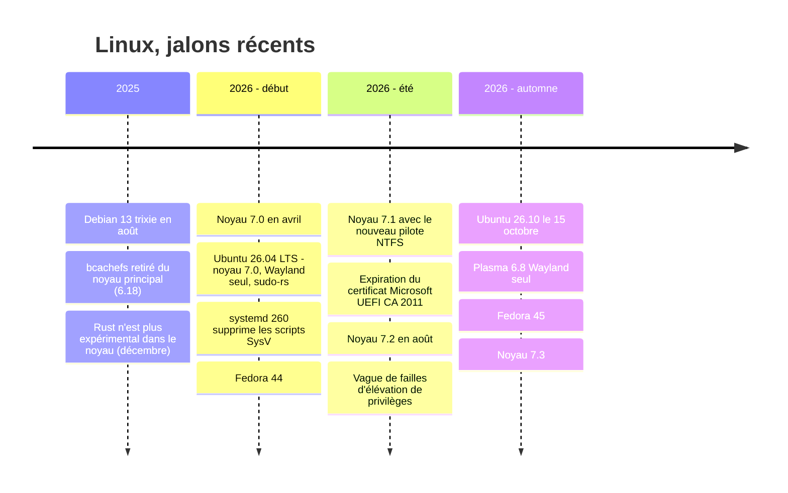

Points clés :
- **Rust** a perdu son étiquette « expérimental » dans le noyau (décembre 2025) et fait désormais partie du socle.
- **Wayland** remplace X11 sur les bureaux : session X11 GNOME retirée, Ubuntu 26.04 Wayland seul, Plasma 6.8 Wayland seul.
- **Réécritures en Rust** dans l'espace utilisateur : `sudo-rs`, coreutils `uutils` côté Ubuntu.
- **systemd 260** retire le support des scripts d'init **System V**.
- **Sécurité** : série de failles locales d'élévation de privilèges en 2026 (voir [section 16](#16-sécurité-et-durcissement)).

---

## 2. Architecture d'un système Linux

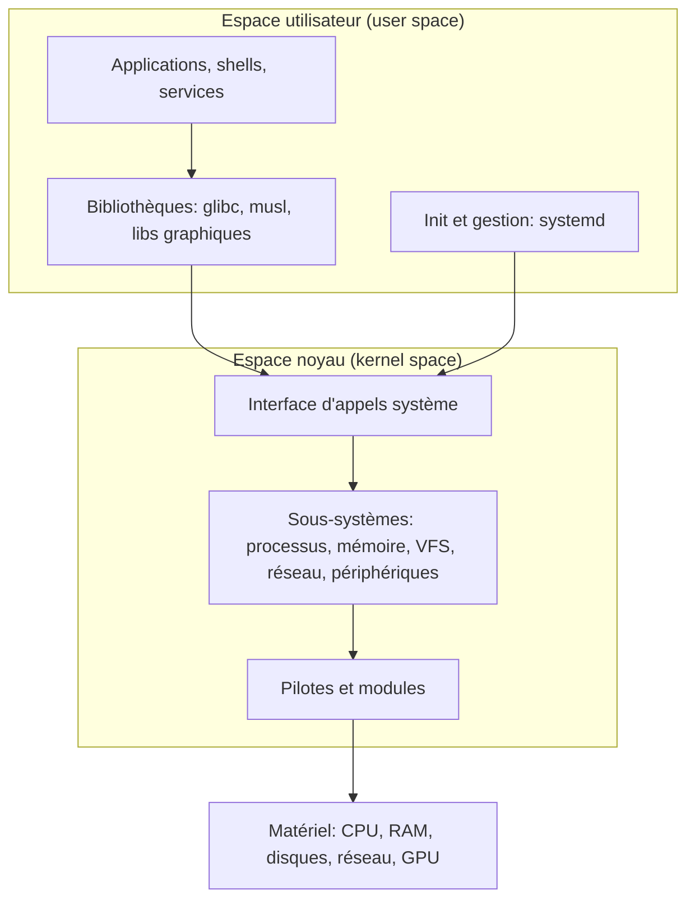

| Notion | Définition |
|---|---|
| **Noyau** | Gère CPU, mémoire, processus, systèmes de fichiers, réseau, pilotes |
| **Appel système (syscall)** | Porte d'entrée contrôlée de l'espace utilisateur vers le noyau (`open`, `read`, `fork`…) |
| **Module** | Code chargeable dans le noyau à chaud (`lsmod`, `modprobe`) |
| **Pilote** | Code qui parle à un matériel (de plus en plus écrit en Rust pour les nouveaux) |
| **Shell** | Interpréteur de commandes (Bash, Zsh, Fish…) |
| **Init (PID 1)** | Premier processus, démarre et supervise les services |
| **Principe fondamental** | « Tout est fichier » : périphériques, processus et sockets sont exposés par des chemins (`/dev`, `/proc`, `/sys`) |

Philosophie Unix : des outils petits, qui font une chose bien, combinables par tubes (pipes), configurés en **texte**.

---

## 3. Du démarrage au login : le boot

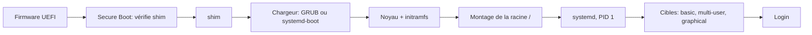

1. **UEFI** (ou BIOS hérité) initialise le matériel et lit la partition **ESP** (EFI System Partition).
2. **Secure Boot** (si actif) vérifie la signature de `shim`, puis du chargeur et du noyau.
3. **GRUB** ou **systemd-boot** charge le noyau et l'**initramfs** (mini-système en RAM qui prépare le montage de la racine : LVM, chiffrement LUKS, RAID…).
4. Le noyau monte `/` et lance **systemd** (PID 1) qui atteint la *target* par défaut.

Commandes utiles : `systemd-analyze` (durée du boot), `systemd-analyze blame`, `journalctl -b` (journal du boot courant), `dmesg` (messages du noyau), `bootctl status`.

### 3.1 Secure Boot : le certificat de 2011 a expiré (juin 2026)

- Le certificat **Microsoft UEFI CA 2011**, qui signe `shim` pour Linux, a expiré fin juin 2026 (26/27 juin selon les sources). Il est remplacé par **Microsoft UEFI CA 2023** (valide jusqu'en 2038).
- **Un système qui démarre déjà ne cesse pas de fonctionner** : l'expiration n'invalide pas les binaires déjà signés.
- Risque réel : un **nouveau `shim`** signé uniquement avec le certificat 2023 peut **ne pas démarrer** sur un firmware qui ne connaît pas encore ce certificat (supports d'installation récents, machines anciennes, double démarrage).
- Le certificat qui signe le chargeur **Windows** (Windows Production PCA 2011) expire le **19 octobre 2026** : à surveiller en double boot.
- Vérifier ce que reconnaît votre firmware : `sudo mokutil --db` (chercher « Microsoft UEFI CA 2023 »). Mettez à jour le firmware et la base Secure Boot via `fwupd` (`fwupdmgr get-updates`).

---

## 4. Choisir et installer une distribution

### 4.1 Familles

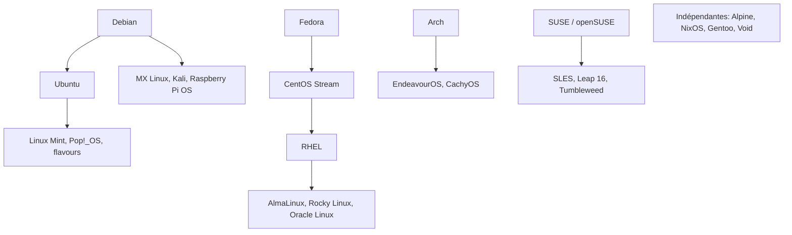

| Besoin | Piste |
|---|---|
| Débuter, large documentation | **Ubuntu LTS**, Linux Mint, Fedora Workstation |
| Serveur stable | **Debian stable**, Ubuntu Server LTS, RHEL ou ses dérivés (Alma, Rocky) |
| Entreprise avec support commercial | RHEL, SLES, Ubuntu Pro |
| Logiciels récents / rolling | Fedora, Arch, openSUSE Tumbleweed |
| Conteneurs, images minimales | Alpine, distroless, Fedora CoreOS / bootc |
| Reproductibilité | NixOS |
| Sécurité offensive | Kali |

### 4.2 Repères sur les versions actuelles

- **Ubuntu 26.04 LTS** : noyau 7.0, GNOME 50 **Wayland seul**, `systemd 259`, APT 3.2, OpenSSH 10.2, glibc 2.43, GCC 15.2, Python 3.14, **sudo-rs** par défaut, support jusqu'en avril 2031 (extensible avec Ubuntu Pro). La première version corrective (26.04.1) est sortie le 27 août 2026 : c'est le moment habituel pour planifier les mises à niveau depuis 24.04 LTS.
- **Ubuntu 26.10** (15 octobre 2026, 9 mois de support, version intermédiaire) : GNOME 51, noyau 7.2 ou 7.3 selon le gel, annoncée avec un passage à `dbus-broker` et un début de support RISC-V RVA23.
- **Debian 13** : noyau 6.12 LTS, support de sécurité de l'équipe Debian jusqu'en août 2028, puis LTS jusqu'au 30 juin 2030.
- **Fedora 44/45** : cycle de ~6 mois, environ 13 mois de support par version ; sert d'amont à RHEL.
- **RHEL 10** : le **serveur Xorg a été retiré** (XWayland seul).
- **openSUSE Leap 16** : installateur **Agama**, **SELinux** par défaut (AppArmor optionnel), YaST retiré, CPU x86-64-v2 minimum, SSH par clé uniquement par défaut.

### 4.3 Installation : points de vigilance

- Créer une clé USB avec `dd`, **Fedora Media Writer**, Ventoy ou `balenaEtcher`. Vérifier le **hash SHA-256** de l'ISO.
- Partitionnement UEFI/GPT classique : ESP (512 Mo–1 Go, FAT32) + `/` (ext4/XFS/Btrfs) + éventuellement `/home` et swap.
- **Chiffrement du disque (LUKS)** à activer à l'installation pour les portables.
- Double boot : désactiver le démarrage rapide de Windows, installer Windows avant Linux, tenir compte du Secure Boot (section 3.1).
- **Distributions immuables / atomiques** (Fedora Silverblue/Kinoite/CoreOS, openSUSE Aeon/Leap Micro, Ubuntu Core, `bootc`) : système en lecture seule, mises à jour transactionnelles avec retour arrière, applications en **Flatpak** et conteneurs.

---

## 5. La ligne de commande

### 5.1 Anatomie

```bash
commande [options] [arguments]
ls -l /etc          # commande: ls, option: -l, argument: /etc
```

Aide : `man commande`, `commande --help`, `info`, `tldr` (outil tiers), `apropos mot`, `type commande`, `which commande`.

### 5.2 Navigation et fichiers

| Commande | Rôle |
|---|---|
| `pwd` | Répertoire courant |
| `cd rep`, `cd -`, `cd ~` | Se déplacer (précédent, maison) |
| `ls -lah` | Lister (long, caché, tailles lisibles) |
| `tree -L 2` | Arbre (si installé) |
| `cp -a src dst` | Copier en préservant les attributs |
| `mv src dst` | Déplacer / renommer |
| `rm -r rep` | Supprimer (**irréversible**, pas de corbeille) |
| `mkdir -p a/b/c` | Créer une arborescence |
| `touch f` | Créer un fichier vide / mettre à jour l'horodatage |
| `ln -s cible lien` | Lien symbolique |
| `file f`, `stat f` | Type et métadonnées |
| `cat`, `less`, `head`, `tail -f` | Lire, paginer, suivre un fichier |
| `du -sh *`, `df -h` | Utilisation disque |
| `find / -name "*.log" -mtime -1` | Rechercher |
| `locate nom` | Recherche indexée (`updatedb`) |

### 5.3 Confort d'usage

- **Complétion** (`Tab`), **historique** (`↑`, `Ctrl+R`, `history`), `!!` (dernière commande), `Ctrl+C` (interrompre), `Ctrl+D` (fin d'entrée), `Ctrl+Z` (suspendre), `Ctrl+L` (effacer l'écran).
- **Alias** : `alias ll='ls -lah'` (à placer dans `~/.bashrc`).
- **Variables d'environnement** : `export EDITOR=vim`, `echo $PATH`, `env`.
- Éditeurs : **nano** (simple), **vim/neovim** (puissant), `micro`, `emacs`. Dans vim : `i` (insérer), `Esc`, `:wq` (sauver+quitter), `:q!` (quitter sans sauver).
- Multiplexeurs : `tmux`, `screen` (sessions persistantes, indispensables sur un serveur distant).

### 5.4 Shells

**Bash** (défaut quasi universel), **Zsh** (macOS, Oh My Zsh), **Fish** (convivial), **dash** (`/bin/sh` sur Debian/Ubuntu, rapide, POSIX strict). Nushell/PowerShell : approche « données structurées ».

---

## 6. Arborescence et fichiers

Le **FHS** (Filesystem Hierarchy Standard) organise un arbre unique partant de `/`.

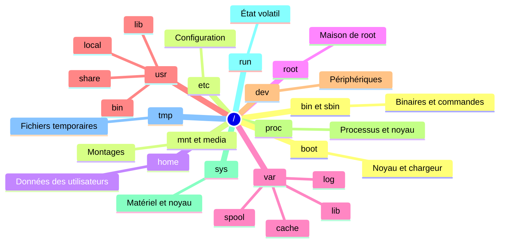

| Répertoire | Contenu |
|---|---|
| `/etc` | Configuration système (texte) |
| `/usr` | Programmes et bibliothèques ; sur les distributions modernes `/bin`, `/sbin`, `/lib` sont des liens vers `/usr/...` (**usr-merge**) |
| `/var` | Données variables : journaux (`/var/log`), bases (`/var/lib`), caches |
| `/home` | Dossiers personnels |
| `/proc`, `/sys` | Pseudo-systèmes de fichiers exposant l'état du noyau |
| `/dev` | Fichiers de périphériques (`/dev/sda`, `/dev/null`, `/dev/urandom`) |
| `/run` | État d'exécution (tmpfs), PID, sockets |
| `/tmp` | Temporaire (souvent tmpfs, vidé au redémarrage) |
| `/opt` | Logiciels tiers autonomes |
| `/srv` | Données servies (web, ftp) |
| `/boot` | Noyaux, initramfs, chargeur (+ ESP dans `/boot/efi`) |

**Liens** : lien **physique** (`ln a b`, même inode, même système de fichiers) ; lien **symbolique** (`ln -s cible lien`, chemin vers la cible, peut casser).

**Inodes** : structure qui stocke les métadonnées (propriétaire, droits, dates, blocs). Le nom du fichier est une entrée de répertoire qui pointe vers l'inode. `df -i` montre l'utilisation des inodes (un disque peut être « plein » d'inodes).

---

## 7. Permissions, ACL et propriété

```
-rwxr-xr-- 1 alice dev 4096 oct  4 10:00 script.sh
│└┬┘└┬┘└┬┘
│ │  │  └ autres (o): r--
│ │  └──── groupe (g): r-x
│ └─────── propriétaire (u): rwx
└───────── type (- fichier, d dossier, l lien)
```

| Droit | Fichier | Dossier |
|---|---|---|
| `r` (4) | lire | lister le contenu |
| `w` (2) | modifier | créer/supprimer des entrées |
| `x` (1) | exécuter | traverser (`cd`) |

```bash
chmod 750 script.sh          # rwx r-x ---
chmod u+x,g-w fichier        # forme symbolique
chown alice:dev fichier      # propriétaire et groupe
chown -R www-data: /srv/web
umask 022                    # masque par défaut des nouveaux fichiers
```

**Bits spéciaux**

| Bit | Effet | Exemple |
|---|---|---|
| **setuid** (`4xxx`) | s'exécute avec les droits du propriétaire | `/usr/bin/passwd` |
| **setgid** (`2xxx`) | héritage du groupe sur un dossier | dossier partagé |
| **sticky** (`1xxx`) | seul le propriétaire peut supprimer | `/tmp` |

**ACL** (droits fins) : `setfacl -m u:bob:rw fichier`, `getfacl fichier`. **Attributs étendus** : `chattr +i fichier` (immuable), `lsattr`.

Les binaires **setuid root** sont des cibles privilégiées des attaquants : `find / -perm -4000 -type f 2>/dev/null` pour les lister (cf. failles 2026, section 16).

---

## 8. Traitement de texte et redirections

### 8.1 Flux et redirections

| Syntaxe | Effet |
|---|---|
| `cmd > f` | stdout vers `f` (écrase) |
| `cmd >> f` | stdout ajouté à `f` |
| `cmd 2> err` | stderr vers `err` |
| `cmd > f 2>&1` ou `cmd &> f` | stdout et stderr |
| `cmd < f` | stdin depuis `f` |
| `cmd1 \| cmd2` | tube : stdout de `cmd1` vers stdin de `cmd2` |
| `cmd <<< "texte"` | here-string |
| `cmd > /dev/null` | jeter la sortie |

### 8.2 Outils essentiels

```bash
grep -rn "ERROR" /var/log/app/        # recherche récursive avec numéros de ligne
grep -E "^(a|b)" f                    # expressions régulières étendues
sed 's/ancien/nouveau/g' f            # substitution (ajouter -i pour modifier en place)
awk -F: '{print $1, $3}' /etc/passwd  # colonnes
cut -d, -f1,3 data.csv
sort | uniq -c | sort -nr             # compter et classer
wc -l f                               # lignes
tr 'a-z' 'A-Z'
xargs -n1 -P4 commande                # exécution parallèle
tee fichier                           # afficher et écrire
jq '.items[].name' data.json          # JSON (outil tiers très utile)
```

Exemple : les 10 adresses IP les plus fréquentes d'un journal web.

```bash
awk '{print $1}' access.log | sort | uniq -c | sort -nr | head -10
```

**Expressions régulières** : `.` (un caractère), `*` (0+), `+` (1+), `?` (0 ou 1), `^` `$` (début/fin), `[abc]`, `(a|b)`, `\d` (avec `-P`).

---

## 9. Utilisateurs, groupes et élévation de privilèges

### 9.1 Fichiers clés

| Fichier | Contenu |
|---|---|
| `/etc/passwd` | comptes (nom, UID, GID, home, shell) |
| `/etc/shadow` | empreintes de mots de passe (lisible par root seulement) |
| `/etc/group` | groupes |
| `/etc/sudoers`, `/etc/sudoers.d/` | règles sudo (à éditer avec `visudo`) |

UID 0 = **root**. Les UID système sont bas (< 1000, selon la distribution) ; les utilisateurs commencent à 1000.

```bash
useradd -m -s /bin/bash -G sudo alice     # créer (Debian/Ubuntu: groupe sudo; RHEL: wheel)
passwd alice
usermod -aG docker alice                  # ajouter à un groupe (-a obligatoire!)
userdel -r alice
id alice ; groups ; whoami
chage -l alice                            # politique d'expiration
loginctl list-sessions
```

### 9.2 sudo, su, polkit

- `sudo commande` : exécute avec les droits d'un autre utilisateur selon les règles de `sudoers`. Préférer **sudo** à une session root permanente (traçabilité, moindre privilège).
- **sudo-rs** : réécriture en Rust de sudo, **par défaut sur Ubuntu** (depuis 25.10, conservé en 26.04). Usage quotidien inchangé.
- `su - alice` : changer d'utilisateur. `pkexec` / **polkit** : autorisations fines pour les actions graphiques/systemd.
- Authentification : **PAM** (`/etc/pam.d/`), clés SSH, MFA (TOTP, FIDO2), SSSD/LDAP/Active Directory en entreprise.

Bon réflexe : ne jamais coller dans `/etc/sudoers` des règles `NOPASSWD: ALL` sans besoin précis.

---

## 10. Processus, signaux et ressources

### 10.1 Notions

Un **processus** est un programme en cours d'exécution (PID, PPID, UID, état, mémoire). `fork`/`exec` créent de nouveaux processus ; PID 1 est l'init.

```bash
ps aux ; ps -ef --forest
top ; htop ; btop
pstree -p
pgrep -a nginx
kill -TERM 1234 ; kill -9 1234 ; killall nginx ; pkill -f motif
nice -n 10 cmd ; renice 5 -p 1234
cmd & ; jobs ; fg %1 ; bg ; nohup cmd &
```

| Signal | Numéro | Usage |
|---|---|---|
| `SIGTERM` | 15 | arrêt propre (défaut de `kill`) |
| `SIGKILL` | 9 | arrêt forcé, non interceptable |
| `SIGHUP` | 1 | rechargement de configuration (par convention) |
| `SIGINT` | 2 | `Ctrl+C` |
| `SIGSTOP` / `SIGCONT` | 19 / 18 | suspendre / reprendre |

États : `R` (running), `S` (sleeping), `D` (attente I/O ininterruptible), `Z` (zombie), `T` (arrêté).

### 10.2 Mémoire

- `free -h`, `vmstat 1`, `/proc/meminfo`. Le **cache de pages** utilise la RAM libre : « libre » basse n'est pas un problème, regardez **`available`**.
- **Swap**, **zswap/zram** (compression en RAM), **OOM killer** (tue un processus quand la mémoire manque), `journalctl -k | grep -i oom`.
- **PSI** (Pressure Stall Information) : `/proc/pressure/{cpu,memory,io}`, indicateur fiable de saturation.

### 10.3 cgroups v2 et namespaces

Les **cgroups v2** limitent et comptabilisent les ressources (CPU, mémoire, I/O, PID) ; les **namespaces** isolent la vue du système (PID, réseau, montages, utilisateurs…). Ce sont les briques des conteneurs (section 18). systemd s'appuie sur cgroup v2 ; le support de cgroup v1 a été retiré des versions récentes de systemd.

```bash
systemd-cgls ; systemd-cgtop
systemd-run --scope -p MemoryMax=500M -p CPUQuota=50% commande
```

---

## 11. systemd en profondeur

**systemd** est le gestionnaire de système et de services de la grande majorité des distributions (hors Alpine, Void, Devuan, Gentoo avec OpenRC…).

### 11.1 Concepts

| Type d'unité | Rôle |
|---|---|
| `.service` | démon ou tâche |
| `.socket` | activation à la demande par socket |
| `.timer` | planification (alternative à cron) |
| `.mount` / `.automount` | points de montage |
| `.target` | groupe d'unités / état (`multi-user`, `graphical`) |
| `.path` | déclenchement sur changement de fichier |
| `.slice` / `.scope` | regroupement de ressources (cgroups) |

```mermaid
flowchart LR
    sysinit["sysinit.target"] --> basic["basic.target"] --> multi["multi-user.target"] --> graph["graphical.target"]
    basic --> sockets["sockets.target"]
    basic --> timers["timers.target"]
```

### 11.2 Commandes de base

```bash
systemctl status nginx
systemctl start|stop|restart|reload nginx
systemctl enable --now nginx          # démarrer maintenant et au boot
systemctl disable nginx ; systemctl mask nginx
systemctl list-units --failed
systemctl list-timers
systemctl daemon-reload               # après modification d'unités
systemctl edit nginx                  # drop-in (recommandé plutôt que modifier l'unité)
systemctl cat nginx
systemctl get-default ; systemctl set-default multi-user.target
journalctl -u nginx -f                # suivre les logs d'un service
journalctl -b -p err                  # erreurs du boot courant
journalctl --since "1 hour ago"
```

### 11.3 Écrire un service

`/etc/systemd/system/monapp.service` :

```ini
[Unit]
Description=Mon application
After=network-online.target
Wants=network-online.target

[Service]
User=monapp
Group=monapp
ExecStart=/usr/local/bin/monapp --config /etc/monapp.toml
Restart=on-failure
RestartSec=5

# Durcissement (sandbox)
NoNewPrivileges=yes
ProtectSystem=strict
ProtectHome=yes
PrivateTmp=yes
PrivateDevices=yes
ProtectKernelTunables=yes
ReadWritePaths=/var/lib/monapp
CapabilityBoundingSet=
MemoryMax=500M

[Install]
WantedBy=multi-user.target
```

Évaluer l'exposition d'un service : `systemd-analyze security monapp.service`.

### 11.4 Timer (remplace cron)

`/etc/systemd/system/sauvegarde.timer` :

```ini
[Unit]
Description=Sauvegarde quotidienne

[Timer]
OnCalendar=*-*-* 02:30:00
Persistent=true
RandomizedDelaySec=10m

[Install]
WantedBy=timers.target
```

Associer un `sauvegarde.service`, puis `systemctl enable --now sauvegarde.timer`. `Persistent=true` rattrape une exécution manquée (machine éteinte).

### 11.5 Nouveautés récentes

- **systemd 260** (mars 2026) : **suppression du support des scripts System V** (`systemd-sysv-generator`, `systemd-sysv-install`, `rc-local.service` retirés). Tout logiciel doit fournir une **unité systemd native**. Ajout de `mstack` (définir un OverlayFS via un dossier `.mstack/`) et de documentation sur l'usage de l'IA dans les contributions.
- **systemd 261** (≈ juin 2026) : sous-système **IMDS** (service de métadonnées d'instance), installateur `systemd-sysinstall`, `storagectl`, support de Live Update Orchestrator (LUO) et Kernel Handover (KHO), réglages `CPUSetPartition=` et `RestrictFileSystemAccess=` (basé sur BPF LSM).
- Ubuntu 26.04 embarque systemd 259 ; vérifier `systemctl --version` sur votre système.

Autres outils de la famille : `systemd-networkd`, `systemd-resolved`, `systemd-boot`, `systemd-homed`, `systemd-nspawn`, `systemd-cryptenroll` (clés TPM2/FIDO2 pour LUKS), `bootctl`, `loginctl`, `timedatectl`, `hostnamectl`.

---

## 12. Gestion des paquets

Un **paquet** contient des fichiers, des métadonnées et des dépendances. Les **dépôts** sont signés (GPG/clés de dépôt).

| Famille | Format | Outil bas niveau | Outil haut niveau |
|---|---|---|---|
| Debian, Ubuntu | `.deb` | `dpkg` | **`apt`** (3.x) |
| Fedora, RHEL, Alma, Rocky | `.rpm` | `rpm` | **`dnf`** (DNF 5 sur Fedora) |
| openSUSE, SLES | `.rpm` | `rpm` | **`zypper`** |
| Arch, Manjaro | `.pkg.tar.zst` | — | **`pacman`** (+ AUR) |
| Alpine | `.apk` | — | `apk` |
| Nix | dérivations | — | `nix` |

```bash
# Debian / Ubuntu
sudo apt update && sudo apt upgrade
sudo apt install nginx
apt search motif ; apt show nginx ; apt policy nginx
sudo apt remove nginx ; sudo apt purge nginx ; sudo apt autoremove
dpkg -l | grep nginx ; dpkg -L nginx ; dpkg -S /usr/sbin/nginx

# Fedora / RHEL
sudo dnf install nginx
sudo dnf upgrade --refresh
dnf search motif ; dnf info nginx ; dnf provides /usr/sbin/nginx
rpm -qa ; rpm -ql nginx ; rpm -qf /usr/sbin/nginx

# openSUSE
sudo zypper refresh && sudo zypper update
sudo zypper install nginx

# Arch
sudo pacman -Syu
sudo pacman -S nginx
```

### 12.1 Formats universels

| Format | Principe | Remarque |
|---|---|---|
| **Flatpak** (Flathub) | applications sandboxées, indépendantes de la distribution | très répandu sur le bureau |
| **Snap** | paquets sandboxés de Canonical | intégré à Ubuntu |
| **AppImage** | fichier exécutable unique | sans installation |
| **Conteneurs OCI** | Podman, Docker | pour services et outils de développement |

### 12.2 Bonnes pratiques

- N'ajouter que des **dépôts de confiance** ; vérifier les signatures ; éviter `curl | sudo bash` sans relecture.
- Mises à jour de sécurité automatiques sur serveur : `unattended-upgrades` (Debian/Ubuntu), `dnf-automatic` (RHEL/Fedora), à compléter par un plan de redémarrage ou **livepatch** pour le noyau.
- **Épingler** les versions en production et utiliser des miroirs/dépôts internes si nécessaire.
- Compiler depuis les sources : `./configure && make && sudo make install` installe hors gestionnaire ; préférer `checkinstall`, un paquet maison ou `/usr/local`.

---

## 13. Stockage : disques, LVM, RAID, systèmes de fichiers

### 13.1 Pile de stockage

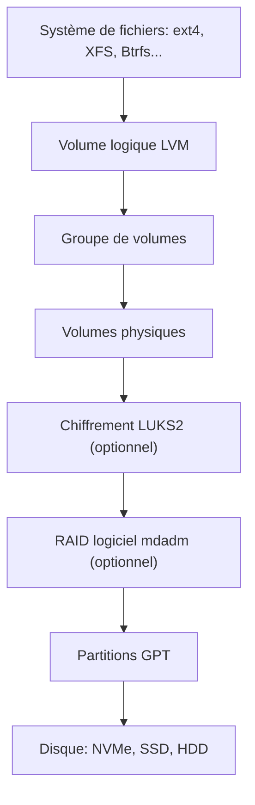

### 13.2 Identifier et partitionner

```bash
lsblk -f                        # vue d'ensemble (FS, UUID, points de montage)
blkid
sudo fdisk -l
sudo parted /dev/sdb print
sudo fdisk /dev/sdb             # ou gdisk, cfdisk, parted
sudo mkfs.ext4 /dev/sdb1
sudo mkfs.xfs /dev/sdb2
sudo mkfs.btrfs /dev/sdb3
sudo mount /dev/sdb1 /mnt ; sudo umount /mnt
```

Partitionnement : **GPT** (moderne, UEFI, > 2 To) plutôt que MBR. **Toujours** référencer par **UUID** (`blkid`) dans `/etc/fstab` :

```
UUID=1234-ABCD                              /boot/efi  vfat  umask=0077           0  2
UUID=aaaaaaaa-bbbb-cccc-dddd-eeeeeeeeeeee   /          ext4  defaults,noatime      0  1
UUID=11111111-2222-3333-4444-555555555555   /data      xfs   defaults              0  2
```

Valider avant de redémarrer : `sudo mount -a` et `findmnt --verify`.

### 13.3 Systèmes de fichiers

| FS | Points forts | Points d'attention |
|---|---|---|
| **ext4** | stable, universel, défaut Debian/Ubuntu | pas de snapshots natifs |
| **XFS** | très performant sur gros volumes, défaut RHEL | non réductible |
| **Btrfs** | snapshots, compression, sous-volumes, checksums | usage RAID5/6 déconseillé ; **grandes folios activées par défaut dans le noyau 7.2** |
| **ZFS** | intégrité, snapshots, RAID intégré | hors noyau (licence), via DKMS ou paquets de la distribution |
| **tmpfs** | en RAM | volatile |
| **vfat/exFAT** | échange avec Windows/USB | pas de permissions Unix |
| **NTFS** | disques Windows | **noyau 7.1 : nouveau pilote NTFS en lecture/écriture**, optionnel ; `ntfs3` reste le défaut |
| **NFS / SMB-CIFS** | partages réseau | prévoir authentification et chiffrement |

À noter : **bcachefs** a été **retiré du noyau principal** (version 6.18) et se distribue désormais hors arbre (module DKMS).

### 13.4 LVM

```bash
sudo pvcreate /dev/sdb /dev/sdc
sudo vgcreate vg_data /dev/sdb /dev/sdc
sudo lvcreate -n lv_app -L 50G vg_data
sudo mkfs.xfs /dev/vg_data/lv_app
sudo lvextend -r -L +10G /dev/vg_data/lv_app     # -r agrandit aussi le système de fichiers
sudo lvcreate -s -n snap1 -L 5G /dev/vg_data/lv_app   # instantané
```

### 13.5 RAID logiciel et surveillance

```bash
sudo mdadm --create /dev/md0 --level=1 --raid-devices=2 /dev/sdb1 /dev/sdc1
cat /proc/mdstat
sudo mdadm --detail /dev/md0
sudo smartctl -a /dev/nvme0n1      # santé SMART (paquet smartmontools)
```

**RAID n'est pas une sauvegarde** : il protège d'une panne de disque, pas d'une suppression, d'un rançongiciel ou d'une corruption logique.

### 13.6 Chiffrement : LUKS2

```bash
sudo cryptsetup luksFormat /dev/sdb1
sudo cryptsetup open /dev/sdb1 secret
sudo mkfs.ext4 /dev/mapper/secret
sudo mount /dev/mapper/secret /mnt/secret
sudo systemd-cryptenroll --tpm2-device=auto /dev/sdb1   # déverrouillage via TPM2 (selon la configuration)
```

Sauvegardez l'en-tête LUKS (`cryptsetup luksHeaderBackup`) et conservez une phrase de récupération hors ligne.

### 13.7 Autres notions utiles

`fsck` / `xfs_repair` (démonter avant), `tune2fs`, quotas (`quota`, `xfs_quota`), `fstrim.timer` (TRIM SSD hebdomadaire), `iostat`, `ionice`, `findmnt`, `losetup` (fichier image monté en bloc).

---

## 14. Réseau

### 14.1 Couches et outils


| Outil | Usage |
|---|---|
| `ip a`, `ip r`, `ip link` | adresses, routes, interfaces (remplace `ifconfig`/`route`) |
| `ss -tulpn` | sockets et ports en écoute (remplace `netstat`) |
| `ping`, `traceroute`/`tracepath`, `mtr` | connectivité et chemin |
| `dig`, `host`, `resolvectl` | DNS |
| `curl -v`, `wget` | HTTP |
| `nc` (netcat), `nmap` | tests de ports (à utiliser avec autorisation) |
| `tcpdump`, `wireshark` | capture de paquets |
| `nmcli`, `nmtui` | NetworkManager |
| `networkctl` | systemd-networkd |
| `ethtool`, `iw` | cartes réseau et Wi-Fi |

```bash
ip -br a
ip route show
sudo ip addr add 192.168.1.50/24 dev eth0     # temporaire (perdu au redémarrage)
ss -tulpn
resolvectl status
sudo tcpdump -i eth0 -nn port 53
```

### 14.2 Configuration persistante

| Gestionnaire | Où | Usage typique |
|---|---|---|
| **NetworkManager** | `nmcli`, `/etc/NetworkManager/` | bureau, RHEL, Fedora |
| **systemd-networkd** | `/etc/systemd/network/*.network` | serveurs, conteneurs |
| **Netplan** (YAML, Ubuntu) | `/etc/netplan/*.yaml` | génère networkd ou NetworkManager |
| **ifupdown** | `/etc/network/interfaces` | Debian classique |

Exemple Netplan :

```yaml
network:
  version: 2
  ethernets:
    eth0:
      dhcp4: false
      addresses: [192.168.1.50/24]
      routes:
        - to: default
          via: 192.168.1.1
      nameservers:
        addresses: [1.1.1.1, 9.9.9.9]
```

`sudo netplan try` applique avec retour automatique en cas de perte d'accès.

### 14.3 DNS

Fichier `/etc/resolv.conf` souvent géré par **systemd-resolved** (stub 127.0.0.53) ; `resolvectl query exemple.com`, DNS over TLS possible. Résolution locale : `/etc/hosts`, `/etc/nsswitch.conf`.

### 14.4 Pare-feu

- **netfilter** est le sous-système du noyau ; **nftables** est le framework moderne (`nft`). `iptables` n'est plus qu'une couche de compatibilité sur les distributions récentes.
- Frontaux : **firewalld** (`firewall-cmd`, RHEL/Fedora/SUSE), **ufw** (Ubuntu), règles `nft` directes.

```bash
sudo ufw default deny incoming
sudo ufw allow 22/tcp
sudo ufw enable

sudo firewall-cmd --permanent --add-service=https
sudo firewall-cmd --reload

sudo nft list ruleset
```

Règle d'or : **tout refuser par défaut**, n'ouvrir que le nécessaire, et tester l'accès SSH avant d'activer.

### 14.5 SSH (OpenSSH 10.x)

```bash
ssh-keygen -t ed25519 -C "alice@poste"
ssh-copy-id alice@serveur
ssh -J bastion alice@interne          # rebond (ProxyJump)
scp fichier alice@serveur:/tmp/ ; rsync -avz src/ alice@serveur:/dest/
ssh -L 8080:localhost:80 alice@serveur   # tunnel local
```

Durcissement de `/etc/ssh/sshd_config` : `PasswordAuthentication no`, `PermitRootLogin no`, `PubkeyAuthentication yes`, `AllowUsers alice`, `MaxAuthTries 3`. Recharger avec `systemctl reload ssh` (ou `sshd`) et **garder une session ouverte** pour tester. Authentification par certificats SSH, clés FIDO2 (`ed25519-sk`), `fail2ban` ou `sshguard` pour freiner les attaques par force brute.

### 14.6 VPN, VLAN, ponts

**WireGuard** (intégré au noyau, simple, rapide), **IPsec/strongSwan**, **OpenVPN**. Ponts (`bridge`), **VLAN** (`ip link add link eth0 name eth0.10 type vlan id 10`), bonding/teaming, `macvlan` pour les conteneurs. **IPv6** est activé par défaut sur la plupart des distributions : le gérer explicitement dans le pare-feu.

---

## 15. Scripting Bash

### 15.1 Bases

```bash
#!/usr/bin/env bash
set -euo pipefail          # arrêt sur erreur, variable non définie, erreur dans un tube
IFS=$'\n\t'

nom="${1:-monde}"          # valeur par défaut
echo "Bonjour, ${nom} !"

if [[ -f /etc/os-release ]]; then
  . /etc/os-release
  echo "Distribution: ${PRETTY_NAME}"
fi

for f in *.log; do
  [[ -e "$f" ]] || continue
  gzip -9 -- "$f"
done

compter() {
  local n="$1"
  for ((i=1; i<=n; i++)); do echo "$i"; done
}
compter 3
```

| Notion | Syntaxe |
|---|---|
| Variables | `x=5`, `"$x"`, `${x:-défaut}`, `${#x}` (longueur) |
| Tableaux | `t=(a b c)`, `"${t[@]}"`, `declare -A map` (associatif) |
| Tests | `[[ -f f ]]`, `-d`, `-z`, `-n`, `==`, `=~`, `-eq`, `-gt` |
| Conditions | `if ... ; then ... elif ... else ... fi`, `case ... esac` |
| Boucles | `for`, `while read -r`, `until` |
| Sorties | `exit 1`, `return`, `$?` |
| Substitution de commande | `$(commande)` |
| Arithmétique | `$((a + b))` |

### 15.2 Bonnes pratiques

- **Toujours citer** les variables : `"$var"`.
- `set -euo pipefail`, `trap 'nettoyage' EXIT`, `mktemp` pour les fichiers temporaires.
- Analyse statique avec **ShellCheck** (`shellcheck script.sh`), formatage avec `shfmt`.
- Pour la portabilité stricte : `#!/bin/sh` (POSIX), sinon Bash explicite.
- Au-delà de ~100 lignes ou de structures de données complexes : **Python** (ou Go) devient plus maintenable.
- Ne jamais utiliser `eval` avec des données non fiables ; attention à l'injection dans les noms de fichiers (`--` pour terminer les options).

### 15.3 Exemple complet : sauvegarde avec rotation

```bash
#!/usr/bin/env bash
set -euo pipefail

SRC="${1:?Usage: $0 SOURCE DEST}"
DEST="${2:?Usage: $0 SOURCE DEST}"
DATE="$(date +%F_%H%M)"
ARCHIVE="${DEST}/backup_${DATE}.tar.zst"

mkdir -p -- "$DEST"
tar --zstd -cf "$ARCHIVE" -C "$SRC" .
sha256sum "$ARCHIVE" > "${ARCHIVE}.sha256"

# Conserver les 7 dernières sauvegardes
ls -1t "${DEST}"/backup_*.tar.zst | tail -n +8 | xargs -r rm --
echo "OK: $ARCHIVE"
```

---

## 16. Sécurité et durcissement

### 16.1 Modèle de sécurité en couches

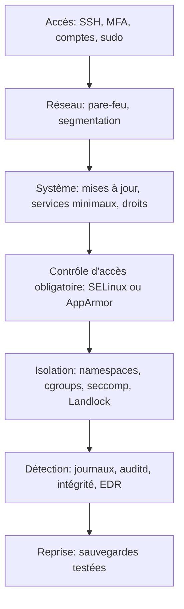

### 16.2 Principes

- **Moindre privilège** : comptes non-root, services sous utilisateur dédié, capabilities réduites, sandbox systemd.
- **Surface d'attaque minimale** : désinstaller et désactiver ce qui ne sert pas (`systemctl list-unit-files --state=enabled`, `ss -tulpn`).
- **Mises à jour rapides**, surtout noyau, OpenSSH, bibliothèques exposées.
- **Défense en profondeur**, journalisation centralisée, sauvegardes hors ligne.

### 16.3 Contrôle d'accès obligatoire (MAC)

| | SELinux | AppArmor |
|---|---|---|
| Approche | étiquettes sur tous les objets (types) | profils par chemin de programme |
| Distributions | RHEL, Fedora, **openSUSE Leap 16 (défaut)**, Alma, Rocky | Ubuntu, Debian, openSUSE (optionnel) |
| Commandes | `getenforce`, `setenforce`, `ausearch -m avc`, `restorecon`, `semanage`, `audit2allow` | `aa-status`, `aa-enforce`, `aa-complain` |

Ne jamais « résoudre » un blocage en passant SELinux en `permissive` définitivement : lisez le journal d'audit et corrigez le contexte ou la politique.

### 16.4 Autres mécanismes du noyau

**Capabilities** (`getcap`, `setcap`), **seccomp** (filtrage d'appels système), **Landlock** (sandbox d'accès fichiers pour programmes non privilégiés), **user namespaces**, **IMA/EVM**, **Lockdown**, **SELinux/AppArmor**, **eBPF LSM**, **chiffrement mémoire** (AMD SEV-SNP, Intel TDX) pour la virtualisation confidentielle.

### 16.5 Hygiène SSH, comptes et fichiers

- Clés SSH uniquement, root distant désactivé, MFA pour sudo/SSH sensibles.
- `passwd -l compte` pour verrouiller ; `chage` pour la politique ; PAM `pam_faillock`/`pam_pwquality`.
- Audit : `auditd` + `ausearch`, `aureport`, règles `auditctl -w /etc/passwd -p wa`.
- Intégrité : **AIDE**, **Tripwire** ; analyse : **Lynis**, **OpenSCAP**, benchmarks **CIS**.
- `fail2ban`, `crowdsec` pour bloquer les IP abusives.

### 16.6 L'année 2026 : une série de failles d'élévation de privilèges locales

Plusieurs failles du noyau permettant à un utilisateur local de devenir **root** ont été divulguées en 2026, dont certaines découvertes avec l'aide d'outils d'IA :

| Nom (CVE) | Résumé | Remarque |
|---|---|---|
| **Copy Fail** (CVE-2026-31431) | Divulguée le **29 avril 2026**. Faille dans l'interface crypto `algif_aead` (AF_ALG) combinée à `splice()` : écriture contrôlée dans le cache de pages, par exemple sur un binaire setuid. Touche les noyaux depuis 2017. | Exploit public ; évasion possible de conteneur selon les analyses |
| **Dirty Frag** (CVE-2026-43284, CVE-2026-43500) | Famille proche exploitant des chemins réseau (ESP/xfrm) | Plusieurs variantes publiées dans la foulée |
| **DirtyClone** (CVE-2026-43503) | Gestion des fragments `skbuff` dans la pile réseau | Corrigée dans 7.1-rc5 et rétroportée |
| **GhostLock** (CVE-2026-43499) | Use-after-free présent depuis 2011, corrigé dans 7.1 | Découverte par un système d'IA |
| **RefluXFS** (CVE-2026-64600) | Condition de course dans le chemin copy-on-write de **XFS** (reflink) | Annoncée par Qualys |
| Septembre 2026 | **CISA** a ajouté trois failles du noyau Linux à son catalogue des vulnérabilités **exploitées activement** (dont CVE-2025-39682 et CVE-2026-53266) | Suivre les avis Red Hat, Ubuntu, Debian |

Leçons opérationnelles :
1. **Appliquer rapidement les mises à jour du noyau** et planifier les redémarrages ; envisager le **livepatch** (Canonical Livepatch, kpatch, kGraft) pour réduire la fenêtre d'exposition.
2. Les failles locales sont **critiques sur les systèmes partagés** : CI/CD, hébergement, stations multi-utilisateurs, nœuds Kubernetes (évasion de conteneur).
3. En attendant un correctif, des **contournements** existent parfois (blacklister un module, restreindre les user namespaces non privilégiés) : suivre l'avis officiel de la distribution plutôt que des recettes tierces.
4. Réduire les modules chargeables inutiles (`lsmod`), limiter les binaires setuid, utiliser seccomp/Landlock/sandbox, maintenir l'inventaire des noyaux déployés.
5. Surveiller le catalogue **CISA KEV** et les listes de sécurité de votre distribution.

### 16.7 Mémoire sûre : Rust dans l'écosystème

La part de code en Rust augmente : pilotes noyau, **sudo-rs**, coreutils `uutils`, **Sequoia PGP** (annoncé en 26.10), plugins GStreamer. L'objectif est de réduire les classes de bugs mémoire ; cela ne supprime pas les erreurs logiques.

---

## 17. Performances et dépannage

### 17.1 Méthode

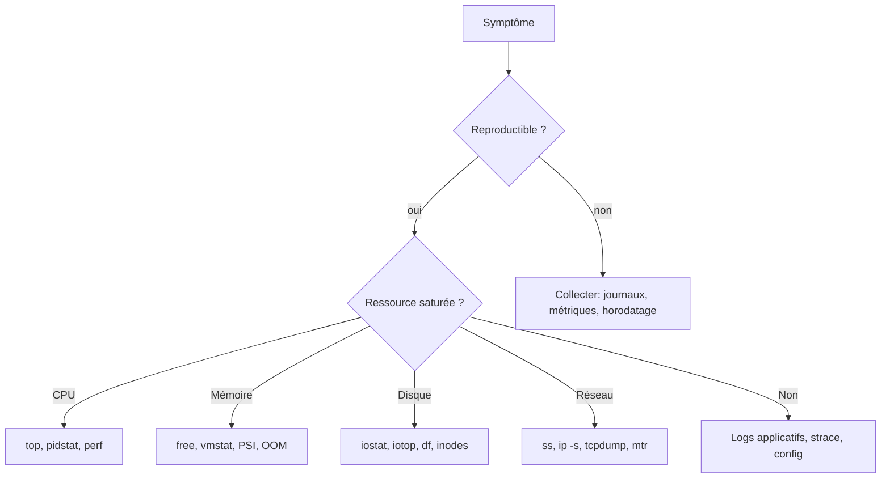

**Méthode USE** (Brendan Gregg) : pour chaque ressource, relever **Utilisation, Saturation, Erreurs**.

### 17.2 Boîte à outils

| Question | Outil |
|---|---|
| Qui consomme CPU/RAM ? | `top`, `htop`, `btop`, `ps aux --sort=-%mem` |
| Charge système | `uptime` (load average), `vmstat 1`, `mpstat -P ALL 1` |
| Disque lent ? | `iostat -xz 1`, `iotop`, `dstat` |
| Quel fichier est ouvert ? | `lsof -p PID`, `lsof -i :80`, `fuser -v /chemin` |
| Que fait ce processus ? | `strace -p PID`, `strace -c cmd`, `ltrace` |
| Profilage | `perf top`, `perf record -g`, flamegraphs |
| Traçage dynamique (eBPF) | `bpftrace`, `bcc-tools`, `bpftool` |
| Historique de métriques | `sar` (sysstat), Prometheus + node_exporter |
| Erreurs matériel | `dmesg -T`, `journalctl -k`, `smartctl`, `mcelog`/`rasdaemon` |
| Boot lent | `systemd-analyze blame` / `critical-chain` |

```bash
uptime                                  # charge sur 1/5/15 min, comparer au nombre de cœurs (nproc)
free -h
iostat -xz 1 3
ss -s
journalctl -p warning -b
dmesg -T | tail -50
```

### 17.3 Dépannage courant

| Problème | Pistes |
|---|---|
| « No space left on device » | `df -h` **et** `df -i` (inodes), `du -xh / --max-depth=1 \| sort -h`, fichiers supprimés mais ouverts (`lsof +L1`) |
| Service qui ne démarre pas | `systemctl status`, `journalctl -xeu service`, `systemd-analyze verify`, droits/SELinux |
| Système lent | charge vs CPU, swap, I/O wait, `ps` états `D`, PSI |
| Processus tué | `journalctl -k \| grep -i "killed process"` (OOM) |
| Réseau muet | `ip a`, `ip r`, `resolvectl`, pare-feu, `tcpdump` |
| Échec de boot | menu GRUB (édition `e`), mode rescue (`systemd.unit=rescue.target`), chroot depuis un live USB, `fsck` |
| Mot de passe root perdu | démarrage avec `init=/bin/bash` ou rescue, remonter `/` en lecture-écriture, `passwd` (sur disque chiffré, nécessite la phrase LUKS) |

### 17.4 Ajustements du noyau (sysctl)

```bash
sysctl vm.swappiness
sudo sysctl -w net.ipv4.ip_forward=1
# Persistant: /etc/sysctl.d/90-custom.conf
echo "vm.swappiness = 10" | sudo tee /etc/sysctl.d/90-custom.conf
sudo sysctl --system
```

Mesurer avant et après ; ne copiez pas des « tunings » trouvés en ligne sans comprendre.

---

## 18. Conteneurs et virtualisation

### 18.1 Ce qu'est un conteneur

Un **conteneur** n'est pas une machine virtuelle : c'est un **processus Linux isolé** par des **namespaces** (PID, net, mnt, uts, ipc, user, cgroup, time), limité par des **cgroups**, restreint par **capabilities**, **seccomp** et **SELinux/AppArmor**, avec un système de fichiers en couches (OverlayFS). Il partage le **noyau de l'hôte** : une faille noyau locale peut donc affecter l'isolation (voir section 16.6).

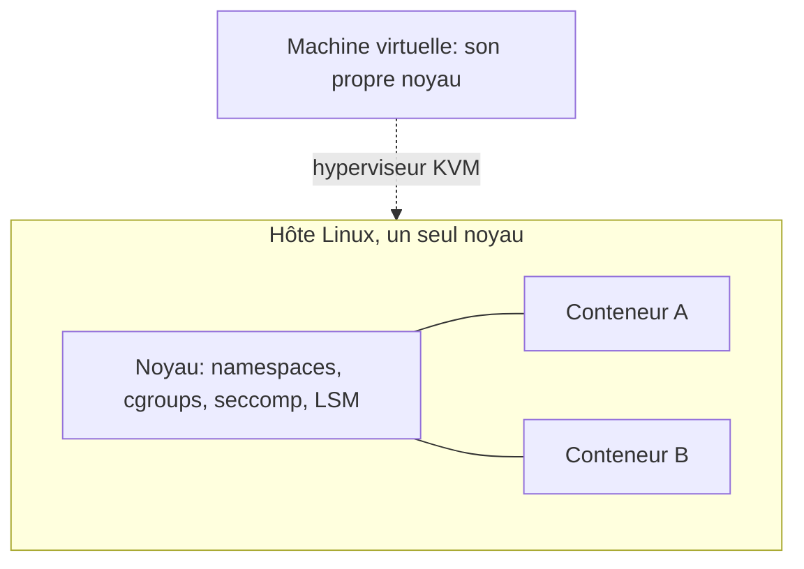

### 18.2 Outils

| Outil | Remarque |
|---|---|
| **Podman** | sans démon, *rootless*, compatible Docker (`alias docker=podman`) ; Podman 6.0 annoncé avec Fedora 45 |
| **Docker / Moby** | référence historique ; Docker 29 dans Ubuntu 26.04 |
| **containerd, CRI-O** | runtimes de Kubernetes |
| **systemd-nspawn, LXC/LXD (Incus)** | conteneurs « système » |
| **Buildah, Kaniko, BuildKit** | construction d'images |
| **KVM + QEMU + libvirt** | virtualisation complète (`virsh`, `virt-manager`, Cockpit) |
| **Firecracker, Cloud Hypervisor, Kata** | micro-VM, isolation renforcée |

```bash
podman run --rm -it docker.io/library/alpine:latest sh
podman ps ; podman images
podman run -d --name web -p 8080:80 nginx
podman generate systemd --new --name web      # ou Quadlet: fichiers .container gérés par systemd
```

**Quadlet** : fichiers `.container` placés dans `/etc/containers/systemd/` qui permettent à systemd de gérer un conteneur Podman comme un service.

### 18.3 Bonnes pratiques

Images minimales, utilisateur non-root, système de fichiers en lecture seule, `--cap-drop=ALL`, pas de `--privileged`, **mises à jour du noyau hôte** rapides, **scan et signature d'images** (voir le cours DevOps), et **Kubernetes** pour l'orchestration à grande échelle.

---

## 19. Le noyau Linux

### 19.1 Cycle de développement

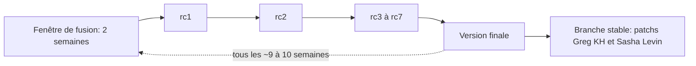

- Un cycle dure environ **9 à 10 semaines** : fenêtre de fusion (2 semaines), puis des *release candidates* hebdomadaires. La numérotation 7.x est arbitraire (Torvalds a annoncé 7.0 après 6.19, sans signification technique).
- Branche **stable** : maintenue jusqu'à environ 3 mois après la version suivante. Branches **longterm (LTS)** : plusieurs années.
- **Politique de CVE** : le noyau est lui-même autorité de numérotation (CNA) et assigne de très nombreux CVE aux corrections de bogues : l'important est de rester à jour dans votre branche, pas de suivre chaque identifiant.

### 19.2 Versions et fins de vie

| Branche | Statut | Fin de vie prévue (selon kernel.org / annonces, à vérifier) |
|---|---|---|
| **7.2** | stable, sortie le 16 août 2026 | ≈ 3 mois après 7.3 |
| 7.3 | en développement (rc) | — |
| **6.18** | LTS | **décembre 2028** |
| **6.12** | LTS (noyau de Debian 13 et de Leap/SLE 16) | **décembre 2028** |
| **6.6** | LTS | **décembre 2027** |
| **6.1** | LTS | **décembre 2027** |
| **5.15** | LTS | **décembre 2026** |
| **5.10** | LTS | **décembre 2026** |

(Les dates LTS ont été prolongées en mars 2026 ; des distributions entreprise assurent un support plus long de leurs propres noyaux.)

### 19.3 Nouveautés notables de la série 7.x

| Version | Faits marquants |
|---|---|
| **7.0** (12 avril 2026) | Noyau de **Ubuntu 26.04 LTS** ; consolidation de Rust, durcissement d'`io_uring` selon les analyses de la distribution |
| **7.1** (14 juin 2026) | **Nouveau pilote NTFS** (lecture/écriture, basé sur iomap et folios), **Intel FRED** activé par défaut, début du retrait du support **i486**, support batterie sur Apple Silicon, nettoyages massifs de code ancien |
| **7.2** (16 août 2026) | **Équilibrage de charge sensible au cache**, ordonnanceur GPU « plus équitable », **sched_ext avec sous-ordonnanceurs** (infrastructure), swap plus léger, **grandes folios par défaut sur Btrfs**, cible `dm-inlinecrypt`, `USB4STREAM`, support Rust pour s390, `O_EMPTYPATH` pour `openat2()`, début de HDMI 2.1 FRL côté AMDGPU |

### 19.4 Concepts à connaître

| Sujet | Résumé |
|---|---|
| **Rust dans le noyau** | Plus « expérimental » depuis le Maintainers Summit de décembre 2025 ; nouveaux pilotes (graphiques, par exemple) l'utilisent ; le noyau doit rester compilable avec la version de Rust de Debian stable |
| **eBPF** | Programmes sûrs chargés dans le noyau : observabilité, réseau (Cilium), sécurité (Tetragon, Falco) |
| **sched_ext** | Ordonnanceurs écrits en BPF et chargés dynamiquement (upstream depuis 6.12) ; sous-ordonnanceurs par cgroup en cours de développement |
| **io_uring** | Interface d'E/S asynchrone haute performance (puissante mais surface d'attaque notable) |
| **Modules** | `lsmod`, `modinfo`, `modprobe`, `/etc/modprobe.d/` (blacklist), DKMS pour les modules hors arbre |
| **Livepatch** | Correction à chaud de failles sans redémarrage (Ubuntu 26.04 l'étend à Arm64) |
| **initramfs** | `dracut` (RHEL/Fedora/SUSE), `initramfs-tools` (Debian/Ubuntu), `mkinitcpio` (Arch) |

### 19.5 Commandes noyau

```bash
uname -r ; uname -a
cat /proc/version ; cat /proc/cmdline
lsmod ; modinfo ext4 ; sudo modprobe wireguard
sudo dmesg -T | less
ls /sys/class/net
zcat /proc/config.gz | grep CONFIG_RUST       # si disponible
```

### 19.6 Compiler son noyau (aperçu)

```bash
# Dépendances (Debian/Ubuntu): build-essential libncurses-dev flex bison libssl-dev libelf-dev bc
tar xf linux-7.2.x.tar.xz && cd linux-7.2.x
cp /boot/config-$(uname -r) .config
make olddefconfig
make menuconfig                                  # option
make -j"$(nproc)"
sudo make modules_install install
```

À réserver à l'apprentissage, aux systèmes embarqués ou aux besoins spécifiques ; en production, privilégier les noyaux de la distribution.

---

## 20. Le bureau Linux : Wayland, GNOME, KDE

### 20.1 Wayland remplace X11

| Fait | Détail |
|---|---|
| **GNOME** | Session GNOME sur X11 désactivée dans GNOME 49, backend X11 retiré dans GNOME 50 ; applications X11 via **XWayland** |
| **Ubuntu 26.04 LTS** | **Wayland seul** (GNOME 50) |
| **KDE Plasma 6.8** | Attendue le **14 octobre 2026** (30 ans de KDE) : **plus de session X11** au login ; Plasma 6.7 est la dernière version avec session X11 |
| **RHEL 10** | Serveur Xorg retiré, XWayland conservé |
| **Fedora 45** | Prévue le 20 octobre 2026 avec GNOME 51 |

Conséquences : captures d'écran et partage d'écran passent par les **portails** (xdg-desktop-portal) et **PipeWire** ; l'automatisation de type `xdotool` ne fonctionne plus telle quelle ; certaines applications anciennes dépendent d'XWayland.

### 20.2 Composants du bureau moderne

| Couche | Exemples |
|---|---|
| Serveur d'affichage / compositeur | Mutter (GNOME), KWin (KDE), Sway, Hyprland |
| Audio / vidéo | **PipeWire** (+ WirePlumber) remplace PulseAudio/JACK |
| Graphique | Mesa 26.x (pilotes ouverts), pilote NVIDIA propriétaire ou *open kernel modules* |
| Environnements | GNOME 50/51, KDE Plasma 6.x, Xfce, Cinnamon, COSMIC |
| Applications | Flatpak/Flathub, Snap ; Papers, Loupe, Ptyxis (valeurs par défaut GNOME récentes) |
| Jeux | Steam + **Proton**, Vulkan 1.4 ; l'ordonnanceur sched_ext (ex. scx) cible la réactivité |
| Matériel | `fwupd` (mises à jour firmware), `power-profiles-daemon`, `tuned` |

---

## 21. Automatisation et infrastructure

| Besoin | Outils |
|---|---|
| Configuration de parc | **Ansible** (sans agent, SSH), Puppet, Chef, Salt |
| Provisionnement de machines | **cloud-init**, Kickstart (RHEL), Preseed/autoinstall (Debian/Ubuntu), Agama (SUSE), Ignition/Butane (CoreOS) |
| Images de système | **bootc / image mode** (OCI), Packer, ostree, NixOS |
| Infrastructure | OpenTofu/Terraform (voir cours dédié), Crossplane |
| Planification | systemd timers, cron (`crontab -e`) |
| Supervision | Prometheus + node_exporter, Grafana, Zabbix, Netdata, OpenTelemetry (voir cours DevOps) |
| Journaux | journald, rsyslog, Loki, OpenSearch |

Exemple Ansible minimal :

```yaml
- hosts: web
  become: true
  tasks:
    - name: Installer nginx
      ansible.builtin.package:
        name: nginx
        state: present
    - name: Activer nginx
      ansible.builtin.service:
        name: nginx
        state: started
        enabled: true
```

Cron : `m h dom mon dow commande`, par exemple `30 2 * * * /usr/local/bin/sauvegarde.sh`. Préférer les **timers systemd** pour la journalisation et la reprise.

---

## 22. Sauvegardes et reprise après sinistre

**Règle 3-2-1** : 3 copies, sur 2 supports différents, dont 1 hors site (et idéalement 1 **immuable/hors ligne**, contre les rançongiciels). Une sauvegarde **non testée** n'est pas une sauvegarde.

| Outil | Usage |
|---|---|
| `rsync -aHAX --delete` | synchronisation de fichiers |
| **restic**, **BorgBackup**, **Kopia** | sauvegarde dédupliquée, chiffrée, incrémentale |
| **Btrfs/ZFS snapshots** (`btrfs subvolume snapshot`, `zfs snapshot`) | instantanés rapides, base de réplication |
| **LVM snapshots**, **Timeshift**, **Snapper** | retour arrière système |
| `dd`, `ddrescue`, `partclone`, **Clonezilla** | images de disque |
| `pg_dump`, `mysqldump`, WAL archiving | cohérence des bases de données |

```bash
restic -r /mnt/backup init
restic -r /mnt/backup backup /home /etc
restic -r /mnt/backup snapshots
restic -r /mnt/backup restore latest --target /tmp/restore
restic -r /mnt/backup forget --keep-daily 7 --keep-weekly 4 --keep-monthly 6 --prune
```

Définir **RPO** (perte de données acceptable) et **RTO** (délai de reprise), documenter la procédure de restauration, **tester régulièrement** la restauration.

---

## 23. Parcours d'apprentissage et certifications

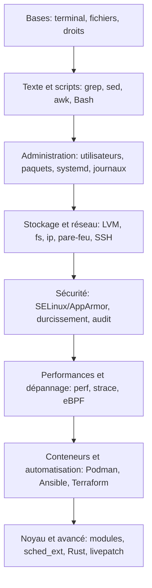

**Certifications courantes** (vérifier les programmes et prix sur les sites officiels) : **LPIC-1/2** (LPI), **CompTIA Linux+**, **RHCSA / RHCE** (Red Hat, sur RHEL 10), **LFCS** et **LFCE** (Linux Foundation), **Ubuntu** et **SUSE** (SCA/SCE). Côté cloud-native : **CKA/CKAD/CKS** (Kubernetes).

---

## 24. Travaux pratiques

Faites-les dans une **VM jetable** (VirtualBox, KVM/virt-manager, Multipass, WSL2) ou un conteneur.

**TP1 : prise en main.** Explorer `/etc`, `/var/log`, `/proc/cpuinfo` ; créer une arborescence, copier, déplacer, supprimer ; lire `man ls`.

**TP2 : droits.** Créer deux utilisateurs et un groupe `projet`, un dossier partagé avec bit `setgid`, tester les droits de lecture/écriture ; ajouter une ACL.

**TP3 : texte.** À partir d'un journal d'accès web (fichier d'exemple), extraire les 10 IP les plus actives, le nombre de codes 404, la moyenne de taille des réponses (`awk`).

**TP4 : service systemd.** Écrire un petit service (script Bash ou Python) avec `Restart=on-failure`, durcissement `ProtectSystem=strict`, puis un **timer** quotidien ; lire son journal avec `journalctl -u`.

**TP5 : stockage.** Ajouter 2 disques virtuels, créer un **LVM**, le formater en XFS, l'agrandir à chaud, prendre un snapshot ; configurer `/etc/fstab` par UUID.

**TP6 : chiffrement.** Créer un volume **LUKS2**, le monter, sauvegarder son en-tête.

**TP7 : réseau et pare-feu.** Configurer une IP statique (Netplan ou NetworkManager), un pare-feu `ufw`/`firewalld` ne laissant que SSH et HTTP, vérifier avec `ss` et `nmap` depuis une autre machine.

**TP8 : SSH durci.** Authentification par clé Ed25519 uniquement, root et mots de passe désactivés, `fail2ban`, tunnel local `-L`.

**TP9 : SELinux ou AppArmor.** Provoquer un refus (service qui écrit hors de son contexte), lire le journal d'audit et corriger proprement.

**TP10 : dépannage.** Simuler un disque plein (`fallocate`), une saturation mémoire (`stress-ng`), un service en échec ; poser le diagnostic avec les outils de la section 17.

**TP11 : conteneur.** Lancer nginx avec **Podman** en *rootless*, l'exposer, le gérer via **Quadlet** ; limiter sa mémoire.

**TP12 : sauvegarde.** Mettre en place **restic**, simuler une perte et **restaurer** ; mesurer le RTO.

**TP13 : mise à jour sécurisée.** Documenter la procédure : état du noyau, mise à jour, redémarrage planifié, vérification, retour arrière ; évaluer le livepatch.

**TP14 (avancé) : automatisation.** Un playbook **Ansible** qui durcit SSH, installe un pare-feu et déploie un service systemd sur 2 VM.

---

## 25. Aide-mémoire

```bash
# Système
uname -a ; hostnamectl ; cat /etc/os-release ; uptime ; lscpu ; free -h ; df -h
lsblk -f ; lspci ; lsusb ; lsmod ; dmesg -T | tail
# Fichiers
ls -lah ; find / -name "*.conf" 2>/dev/null ; du -sh * ; tar -czf a.tgz dir/ ; tar -xf a.tgz
chmod 640 f ; chown u:g f ; ln -s cible lien
# Texte
grep -rn motif . ; sed -i 's/a/b/g' f ; awk '{print $1}' f ; sort | uniq -c
# Processus et services
ps aux ; top ; kill -TERM PID ; systemctl status|restart|enable --now svc ; journalctl -u svc -f
# Paquets
apt update && apt upgrade ; dnf upgrade ; zypper up ; pacman -Syu
# Réseau
ip -br a ; ip r ; ss -tulpn ; dig exemple.com ; curl -I https://exemple.com
# Sécurité
sudo ss -tulpn ; last ; lastb ; getenforce ; aa-status ; fail2ban-client status
# Raccourcis
Ctrl+R (historique) ; Ctrl+C ; Ctrl+D ; Ctrl+Z ; !! ; Tab
```

**Chemins à retenir** : `/etc/os-release`, `/etc/fstab`, `/etc/ssh/sshd_config`, `/var/log/`, `/etc/systemd/system/`, `/proc/cmdline`, `/etc/sysctl.d/`, `/etc/sudoers.d/`.

---

## 26. Questions de révision

1. Quelle différence entre le noyau Linux et une distribution ?
2. Décrivez les étapes du démarrage jusqu'au login sur un système UEFI avec Secure Boot.
3. Que signifie `drwxr-sr-x` et que fait le bit setgid sur un dossier ?
4. Comment lister les 5 processus les plus gourmands en mémoire ?
5. Différence entre `systemctl disable` et `systemctl mask` ?
6. Pourquoi référencer les partitions par UUID dans `/etc/fstab` ?
7. Quelle est la différence entre `SIGTERM` et `SIGKILL` ?
8. Quelle différence entre un conteneur et une machine virtuelle, et pourquoi une faille du noyau menace-t-elle l'isolation des conteneurs ?
9. Qu'a changé systemd 260 pour les scripts d'init System V ?
10. Que doit faire un administrateur face à une faille locale d'élévation de privilèges du noyau (comme Copy Fail) ?
11. Pourquoi RAID n'est-il pas une sauvegarde ?
12. Quel est l'impact de l'expiration du certificat Microsoft UEFI CA 2011 sur un serveur Linux déjà en production ?

<details>
<summary>Éléments de réponse</summary>

1. Le noyau gère matériel, processus, mémoire ; la distribution ajoute outils, init, gestionnaire de paquets, logiciels.
2. UEFI → shim (vérifié par Secure Boot) → GRUB/systemd-boot → noyau + initramfs → montage de `/` → systemd (PID 1) → targets → login.
3. Dossier, propriétaire rwx, groupe r-x avec setgid (les nouveaux fichiers héritent du groupe du dossier), autres r-x.
4. `ps aux --sort=-%mem | head -6` (ou `top`/`htop` trié par mémoire).
5. `disable` retire le démarrage automatique ; `mask` lie l'unité à `/dev/null` et l'empêche d'être démarrée, même manuellement ou par dépendance.
6. Les noms `/dev/sdX` peuvent changer ; l'UUID est stable.
7. `SIGTERM` demande un arrêt propre, interceptable ; `SIGKILL` force l'arrêt, non interceptable.
8. Le conteneur partage le noyau de l'hôte ; la VM possède son propre noyau. Une faille noyau exploitable localement peut permettre de sortir du conteneur.
9. Le support a été supprimé : il faut fournir une unité systemd native.
10. Appliquer le correctif du noyau (ou livepatch), redémarrer, suivre l'avis de la distribution, restreindre l'accès local en attendant, surveiller les journaux.
11. Il protège d'une panne matérielle, pas d'une suppression, d'une corruption logique ou d'un rançongiciel.
12. Aucun impact immédiat : les systèmes qui démarrent déjà continuent de démarrer ; seul un nouveau shim signé uniquement avec le certificat 2023 peut poser problème si le firmware ne le connaît pas.

</details>

---

## Sources

Pages officielles ou primaires en priorité ; les analyses tierces sont signalées.

**Noyau**
- Page d'accueil kernel.org (versions stable, mainline, LTS) : https://kernel.org/
- Histoire des versions du noyau (Wikipedia, à recouper avec kernel.org) : https://en.wikipedia.org/wiki/Linux_kernel_version_history
- Linux 7.2, nouveautés (Kernel Newbies) : https://kernelnewbies.org/Linux_7.2
- Linux 7.2, synthèse (9to5Linux) : https://9to5linux.com/linux-kernel-7-2-officially-released-this-is-whats-new
- Linux 7.2, début de la fenêtre de fusion (LWN) : https://lwn.net/Articles/1078068/
- Linux 7.1, nouveautés (Phoronix) : https://www.phoronix.com/review/linux-71-features-changes
- Nouveau pilote NTFS 7.1 : https://linuxiac.com/linux-kernel-7-1-merges-new-ntfs-driver-with-full-write-support/
- Rust n'est plus expérimental (LWN) : https://lwn.net/Articles/1049831/
- Prolongation des noyaux LTS (Phoronix) : https://www.phoronix.com/news/Linux-6.18-LTS-6.12-6.6-Extend
- bcachefs et le noyau (analyse tierce) : https://botmonster.com/self-hosting/bcachefs-mainline-kernel-vs-btrfs-zfs/

**Distributions**
- Ubuntu 26.04 LTS (Canonical) : https://canonical.com/blog/canonical-releases-ubuntu-26-04-lts-resolute-raccoon
- Ubuntu 26.04, détails (Linuxiac) : https://linuxiac.com/ubuntu-26-04-lts-resolute-raccoon-released/
- Ubuntu 26.10, notes de version et calendrier : https://documentation.ubuntu.com/release-notes/26.10/
- Ubuntu 26.10, feuille de route bureau : https://discourse.ubuntu.com/t/ubuntu-desktop-26-10-stonking-stingray-roadmap-building-toward-ubuntu-28-04-lts/83751
- Debian, historique des versions : https://en.wikipedia.org/wiki/Debian_release_version_history
- Debian 13 « trixie » (LWN) : https://lwn.net/Articles/1033474/
- Fedora, historique des versions : https://en.wikipedia.org/wiki/Fedora_Linux_release_history
- Red Hat Enterprise Linux (versions) : https://en.wikipedia.org/wiki/Red_Hat_Enterprise_Linux
- openSUSE Leap 16 : https://www.phoronix.com/news/openSUSE-Leap-16 et https://get.opensuse.org/leap/16.0/

**systemd, bureau, Secure Boot**
- systemd 260 : https://www.phoronix.com/news/systemd-260-Released et https://www.theregister.com/2026/03/18/systemd_260/
- systemd 261 : https://www.phoronix.com/news/systemd-261
- KDE Plasma 6.8 Wayland seul : https://9to5linux.com/kde-plasma-6-8-desktop-environment-is-coming-on-october-14th-heres-what-to-expect
- Expiration du certificat Secure Boot (LWN) : https://lwn.net/Articles/1079808/
- Guide Red Hat sur Secure Boot en 2026 : https://access.redhat.com/articles/7128933
- Guide Microsoft pour les équipes IT : https://techcommunity.microsoft.com/blog/linuxandopensourceblog/what-it-teams-need-to-know-about-linux-secure-boot-certificates-expiring-in-2026/4530725

**Sécurité**
- Copy Fail, avis du CERT-EU : https://cert.europa.eu/publications/security-advisories/2026-005/
- Copy Fail et ses descendants (VulnCheck) : https://www.vulncheck.com/blog/copy-fails-descendants-recent-linux-lpes
- RefluXFS (Qualys) : https://blog.qualys.com/vulnerabilities-threat-research/2026/07/22/refluxfs-a-linux-kernel-local-privilege-escalation-to-root-in-xfs-cve-2026-64600
- CISA, failles du noyau activement exploitées (The Hacker News) : https://thehackernews.com/2026/09/cisa-flags-three-linux-kernel.html

---

*Contributions bienvenues : ouvrez une PR pour corriger ou actualiser une section, et mettez à jour la date de vérification en tête de fichier. Rappel : ce cours est une base d'apprentissage ; en production, suivez toujours la documentation officielle de votre distribution.*
