# Cours complet Terraform

> **Dernière vérification des sources : 30 septembre 2026.**
> Cours de référence sur Terraform (HashiCorp, groupe IBM) : du premier `terraform init` aux fonctionnalités récentes (ephemeral, actions, list resources, Stacks), avec les différences clés avec OpenTofu. Les schémas sont en **Mermaid** (rendu natif GitHub/GitLab).
>
> ⚠️ Les numéros de version évoluent vite. Vérifiez toujours les pages officielles listées en [Sources](#sources). Les exemples marqués « indicatif » doivent être validés avec la documentation du provider que vous utilisez.

---

## Sommaire

1. [Introduction](#1-introduction)
2. [État des versions (2026)](#2-état-des-versions-2026)
3. [Installation et gestion des versions](#3-installation-et-gestion-des-versions)
4. [Le workflow Terraform](#4-le-workflow-terraform)
5. [Le langage HCL](#5-le-langage-hcl)
6. [Providers et lock file](#6-providers-et-lock-file)
7. [Le state](#7-le-state)
8. [Secrets : ephemeral et write-only](#8-secrets--ephemeral-et-write-only)
9. [Modules](#9-modules)
10. [Refactoring : moved, removed, import](#10-refactoring--moved-removed-import)
11. [Actions et List Resources (1.14+)](#11-actions-et-list-resources-114)
12. [Tests et qualité](#12-tests-et-qualité)
13. [Terraform en CI/CD](#13-terraform-en-cicd)
14. [Organisation des environnements](#14-organisation-des-environnements)
15. [HCP Terraform, Terraform Enterprise et Stacks](#15-hcp-terraform-terraform-enterprise-et-stacks)
16. [Terraform ou OpenTofu ?](#16-terraform-ou-opentofu-)
17. [Sécurité et bonnes pratiques](#17-sécurité-et-bonnes-pratiques)
18. [Mettre à jour Terraform](#18-mettre-à-jour-terraform)
19. [Travaux pratiques](#19-travaux-pratiques)
20. [Aide-mémoire](#20-aide-mémoire)
21. [Questions de révision](#21-questions-de-révision)
22. [Sources](#sources)

---

## 1. Introduction

**Terraform** est un outil d'*Infrastructure as Code* **déclaratif** : on décrit l'état souhaité de l'infrastructure (réseaux, machines, bases de données, DNS, SaaS…) dans des fichiers HCL, et Terraform calcule puis applique les changements nécessaires via des **providers** (plugins qui parlent aux API).

Concepts clés :

| Concept | Rôle |
|---|---|
| **Configuration** | Fichiers `.tf` décrivant l'infrastructure désirée |
| **Provider** | Plugin d'accès à une API (AWS, Azure, GCP, Kubernetes, GitHub, Datadog…) |
| **Resource** | Objet géré (cycle de vie complet : créer, lire, modifier, détruire) |
| **Data source** | Lecture d'un objet existant, sans le gérer |
| **State** | Fichier qui associe la configuration aux objets réels |
| **Plan** | Différences calculées entre configuration, state et réalité |
| **Module** | Ensemble réutilisable de ressources |

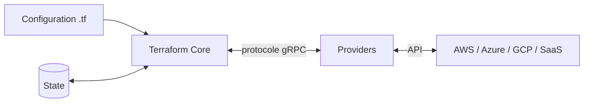

**Contexte** : HashiCorp a été rachetée par IBM (acquisition finalisée le 27 février 2025). Terraform est distribué sous licence **Business Source License** (source-available). Le fork open source **OpenTofu** (Linux Foundation, MPL 2.0) est détaillé en [section 16](#16-terraform-ou-opentofu-).

---

## 2. État des versions (2026)

| Branche | Date de sortie | Dernière version constatée | Faits marquants |
|---|---|---|---|
| **1.16** | 26 août 2026 | 1.16.x (1.16.4 le 23 sept. 2026 selon versio.io) | Bloc `store`, `import` dans les modules, `on_failure` des actions |
| **1.15** | 29 avril 2026 | 1.15.9 (19 août 2026) | Variables dans les sources de modules, `deprecated`, Windows ARM64 |
| **1.14** | 19 novembre 2025 | 1.14.9 (20 avril 2026) | **Actions**, **List Resources**, `terraform query` |
| 1.11 | 2025 | — | **Attributs write-only** |
| 1.10 | 2024 | — | **Ressources éphémères**, verrouillage S3 natif |

Une branche 1.17 est en préversion (alpha/bêta). Consultez la politique de support officielle de HashiCorp ; en pratique, restez sur les deux branches les plus récentes.

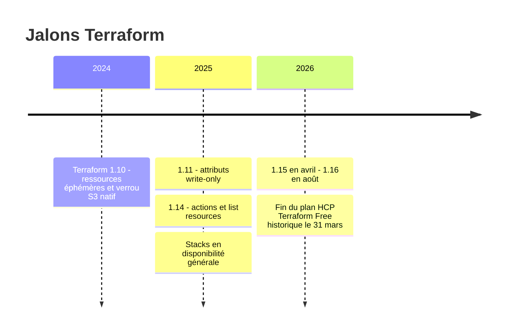

---

## 3. Installation et gestion des versions

Installation : gestionnaire de paquets (Homebrew, apt, choco), ou binaire depuis `releases.hashicorp.com`. Vérifier : `terraform version`.

Gérer plusieurs versions : **tfenv**, **mise** ou **asdf**, avec un fichier de version (`.terraform-version` ou `.tool-versions`) versionné dans Git.

Toujours **contraindre** la version du CLI et des providers :

```hcl
terraform {
  required_version = "~> 1.15"

  required_providers {
    aws = {
      source  = "hashicorp/aws"
      version = "~> 6.0"
    }
  }
}
```

Opérateurs : `=`, `!=`, `>`, `>=`, `<`, `<=`, `~>` (« pessimiste » : `~> 1.15` autorise 1.15.x et 1.16+ jusqu'à `< 2.0`, tandis que `~> 1.15.0` n'autorise que 1.15.x).

---

## 4. Le workflow Terraform

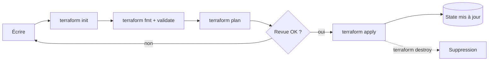

| Commande | Rôle |
|---|---|
| `terraform init` | Télécharge providers et modules, configure le backend |
| `terraform fmt -recursive` | Formate le code |
| `terraform validate` | Vérifie la syntaxe et la cohérence interne |
| `terraform plan -out=tfplan` | Calcule les changements et sauvegarde le plan |
| `terraform apply tfplan` | Applique **exactement** le plan sauvegardé |
| `terraform destroy` | Détruit toutes les ressources gérées |
| `terraform output` | Affiche les sorties |
| `terraform show` / `state list` | Inspecte le state |
| `terraform console` | Évalue des expressions |
| `terraform graph` | Génère le graphe de dépendances |

Bon réflexe en automatisation : `plan -out` puis `apply` du fichier de plan, pour garantir que ce qui a été relu est ce qui est appliqué.

---

## 5. Le langage HCL

### 5.1 Structure d'un projet

```
.
├── main.tf          # ressources principales
├── variables.tf     # entrées
├── outputs.tf       # sorties
├── providers.tf     # providers et backend
├── versions.tf      # contraintes de versions
├── locals.tf
└── terraform.tfvars # valeurs (sans secrets)
```

Terraform lit **tous** les `.tf` du dossier : l'organisation en fichiers est une convention.

### 5.2 Variables, locals, outputs

```hcl
variable "env" {
  type        = string
  description = "Environnement cible"

  validation {
    condition     = contains(["dev", "staging", "prod"], var.env)
    error_message = "env doit valoir dev, staging ou prod."
  }
}

variable "db_password" {
  type      = string
  sensitive = true          # masqué dans les sorties CLI (mais présent dans le state)
}

locals {
  name_prefix = "app-${var.env}"
  common_tags = {
    Env       = var.env
    ManagedBy = "terraform"
  }
}

output "bucket_name" {
  value       = aws_s3_bucket.logs.bucket
  description = "Nom du bucket de logs"
}
```

Types : `string`, `number`, `bool`, `list(...)`, `set(...)`, `map(...)`, `object({...})`, `tuple([...])`, `any`.

Nouveautés récentes de la 1.15 :
- l'attribut **`deprecated`** sur `variable` et `output` pour signaler aux utilisateurs d'un module qu'une entrée ou sortie va disparaître ;
- selon les analyses de la communauté, des **contraintes de type sur les `output`** et une fonction **`convert()`** pour la conversion de type en ligne (à valider dans la note de version officielle de votre version).

```hcl
variable "old_region" {
  type       = string
  default    = null
  deprecated = "Utiliser la variable region."
}
```

### 5.3 Ressources et data sources

```hcl
data "aws_availability_zones" "available" {
  state = "available"
}

resource "aws_s3_bucket" "logs" {
  bucket = "${local.name_prefix}-logs"
  tags   = local.common_tags
}

resource "aws_s3_bucket_versioning" "logs" {
  bucket = aws_s3_bucket.logs.id           # référence = dépendance implicite
  versioning_configuration {
    status = "Enabled"
  }
}
```

Terraform construit un **graphe de dépendances** à partir des références ; `depends_on` ne sert que pour les dépendances non visibles dans le code.

### 5.4 Répétition : `count`, `for_each`, `dynamic`, expressions `for`

```hcl
variable "buckets" {
  type    = set(string)
  default = ["raw", "curated", "archive"]
}

resource "aws_s3_bucket" "data" {
  for_each = var.buckets
  bucket   = "${local.name_prefix}-${each.key}"
}

# Expression for
output "bucket_arns" {
  value = { for k, b in aws_s3_bucket.data : k => b.arn }
}

# Bloc dynamique
resource "aws_security_group" "web" {
  name = "web"
  dynamic "ingress" {
    for_each = [80, 443]
    content {
      from_port   = ingress.value
      to_port     = ingress.value
      protocol    = "tcp"
      cidr_blocks = ["0.0.0.0/0"]
    }
  }
}
```

Règle pratique : préférez **`for_each`** à `count` pour des éléments identifiables (une clé stable évite que la suppression d'un élément décale tous les suivants). Utilisez `count` pour un booléen (0 ou 1).

### 5.5 Fonctions et expressions utiles

`merge`, `lookup`, `try`, `coalesce`, `concat`, `flatten`, `toset`, `tomap`, `jsonencode`, `yamldecode`, `file`, `templatefile`, `cidrsubnet`, `format`, `regex`, `contains`, `length`, `one`.

```hcl
locals {
  subnets = [for i in range(3) : cidrsubnet("10.0.0.0/16", 8, i)]
  region  = try(var.region, "eu-west-3")
}
```

### 5.6 Cycle de vie, préconditions et vérifications

```hcl
resource "aws_instance" "app" {
  ami           = var.ami_id
  instance_type = "t3.small"

  lifecycle {
    create_before_destroy = true
    prevent_destroy       = false
    ignore_changes        = [tags["LastDeploy"]]
    replace_triggered_by  = [aws_launch_template.app]

    precondition {
      condition     = var.ami_id != ""
      error_message = "ami_id est obligatoire."
    }
    postcondition {
      condition     = self.instance_state == "running"
      error_message = "L'instance doit être démarrée."
    }
  }
}

# Vérification continue, non bloquante
check "app_health" {
  data "http" "app" {
    url = "https://app.example.com/health"
  }
  assert {
    condition     = data.http.app.status_code == 200
    error_message = "L'application ne répond pas 200."
  }
}
```

### 5.7 `terraform_data`

Ressource intégrée (remplace `null_resource`) : stocke une valeur, déclenche un remplacement, ou porte un provisioner. Depuis la 1.16, elle propose un bloc **`store`** (voir [section 8](#8-secrets--ephemeral-et-write-only)).

```hcl
resource "terraform_data" "release" {
  triggers_replace = [var.app_version]
}
```

Les **provisioners** (`local-exec`, `remote-exec`) sont un dernier recours : préférez cloud-init, Ansible, ou les **actions** (section 11).

---

## 6. Providers et lock file

- Un provider se déclare dans `required_providers` et se configure dans un bloc `provider`.
- Les **alias** permettent plusieurs configurations d'un même provider (multi-région, multi-compte).
- `terraform init` écrit le fichier **`.terraform.lock.hcl`** (versions et checksums). **Versionnez-le dans Git.** Pour une CI multi-plateforme : `terraform providers lock -platform=linux_amd64 -platform=darwin_arm64`.

```hcl
provider "aws" {
  region = "eu-west-3"
}

provider "aws" {
  alias  = "us"
  region = "us-east-1"
}

resource "aws_s3_bucket" "replica" {
  provider = aws.us
  bucket   = "${local.name_prefix}-replica"
}
```

Attention aux **changements de version majeure** de providers (ex. AzureRM 5.0 publié le 27 juillet 2026, famille AWS 6.x) : lisez le guide d'upgrade, et mettez à jour Terraform Core vers une version récente avant d'adopter un nouveau provider majeur.

---

## 7. Le state

Le **state** relie chaque ressource de la configuration à l'objet réel. Il contient des **données sensibles** : traitez-le comme un secret.

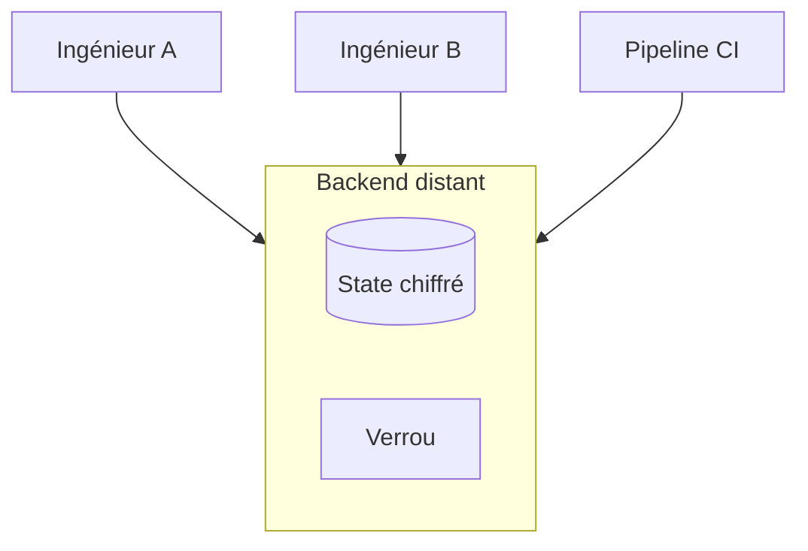

### Backend distant S3 avec verrouillage natif

Depuis Terraform 1.10, le backend S3 peut verrouiller via un fichier `.tflock` dans le bucket (`use_lockfile`). **Le verrouillage via DynamoDB est déprécié** et sera retiré dans une future version mineure : migrez.

```hcl
terraform {
  backend "s3" {
    bucket       = "acme-tfstate"
    key          = "prod/network/terraform.tfstate"
    region       = "eu-west-3"
    encrypt      = true
    use_lockfile = true      # remplace dynamodb_table (déprécié)
  }
}
```

Permissions IAM nécessaires pour le verrou : `s3:GetObject`, `s3:PutObject`, `s3:DeleteObject` sur l'objet `.tflock`. Activez aussi le **versioning** du bucket pour pouvoir restaurer un state.

### Commandes d'inspection et de chirurgie

| Commande | Usage |
|---|---|
| `terraform state list` | Liste les ressources |
| `terraform state show ADDR` | Détaille une ressource (accepte `-json` depuis la 1.16) |
| `terraform state mv` | Renomme / déplace (préférer les blocs `moved`) |
| `terraform state rm` | Retire du state sans détruire (préférer `removed`) |
| `terraform force-unlock ID` | Libère un verrou bloqué (dernier recours) |
| `terraform refresh` / `plan -refresh-only` | Resynchronise le state avec la réalité |

### Workspaces

Les **workspaces CLI** permettent plusieurs states pour une même configuration. Ils conviennent pour des environnements *quasi identiques* et éphémères ; pour dev/staging/prod, privilégiez des dossiers ou stacks séparés (section 14).

### Partage de données entre configurations

`terraform_remote_state` crée un couplage fort sur la structure des sorties et expose potentiellement tout le state. Préférez publier des valeurs explicites (SSM Parameter Store, Key Vault, data sources par tags/noms) ou les composants/déploiements des **Stacks**.

---

## 8. Secrets : ephemeral et write-only

Problème historique : tout secret passé à une ressource finit **en clair dans le state et le plan**.

Trois mécanismes complémentaires :

| Mécanisme | Disponible depuis | Principe |
|---|---|---|
| **Ressources éphémères** (`ephemeral`) | 1.10 | Valeurs existant uniquement en mémoire pendant une phase, jamais persistées |
| **Attributs write-only** (`*_wo`) | 1.11 | Une ressource gérée reçoit une valeur éphémère sans la stocker |
| **Bloc `store` dans `terraform_data`** | 1.16 | Conserve des valeurs éphémères/sensibles entre `plan` et `apply` |

```hcl
variable "master_password" {
  type      = string
  ephemeral = true         # variable éphémère
  sensitive = true
}

# Mot de passe généré : jamais écrit dans le state
ephemeral "random_password" "db" {
  length  = 24
  special = true
}

resource "aws_db_instance" "main" {
  identifier          = "app-db"
  engine              = "postgres"
  instance_class      = "db.t4g.micro"
  allocated_storage   = 20
  username            = "app"

  password_wo         = ephemeral.random_password.db.result   # attribut write-only
  password_wo_version = 1                                      # incrémenter pour changer le mot de passe
}
```

Règles :
- une valeur éphémère **ne peut pas** alimenter un `output` classique ni un attribut persistant ;
- elle se consomme dans un attribut `*_wo`, un provisioner ou un bloc `check` ;
- le support dépend du **provider** : vérifiez que la ressource expose un attribut write-only.

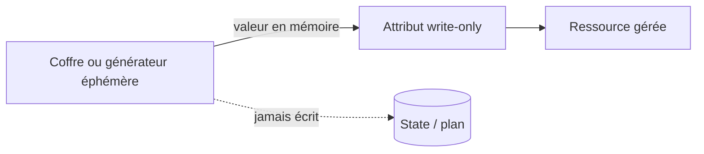

---

## 9. Modules

Un **module** est un dossier de fichiers `.tf`. Le dossier racine est le *root module* ; les modules appelés sont des *child modules*.

```hcl
module "network" {
  source  = "terraform-aws-modules/vpc/aws"
  version = "~> 6.0"            # toujours versionner

  name = "app-${var.env}"
  cidr = "10.0.0.0/16"
  azs  = data.aws_availability_zones.available.names
}

output "vpc_id" {
  value = module.network.vpc_id
}
```

Nouveauté **1.15** : les attributs `source` et `version` d'un module acceptent des **variables et des locals** (valeurs connues dès l'`init`) ; la plupart des commandes acceptent alors des valeurs de variables.

### Principes de conception

| Faire | Éviter |
|---|---|
| Modules petits, à responsabilité unique | Modules « fourre-tout » |
| Variables typées, validées, documentées | `any` partout |
| Sorties explicites et stables | Exposer des objets entiers non nécessaires |
| Versionnement sémantique et registre privé | Sources Git sans version |
| Composition (modules assemblés par le root) | Imbrication profonde |
| Providers configurés dans le root | Blocs `provider` dans les modules |

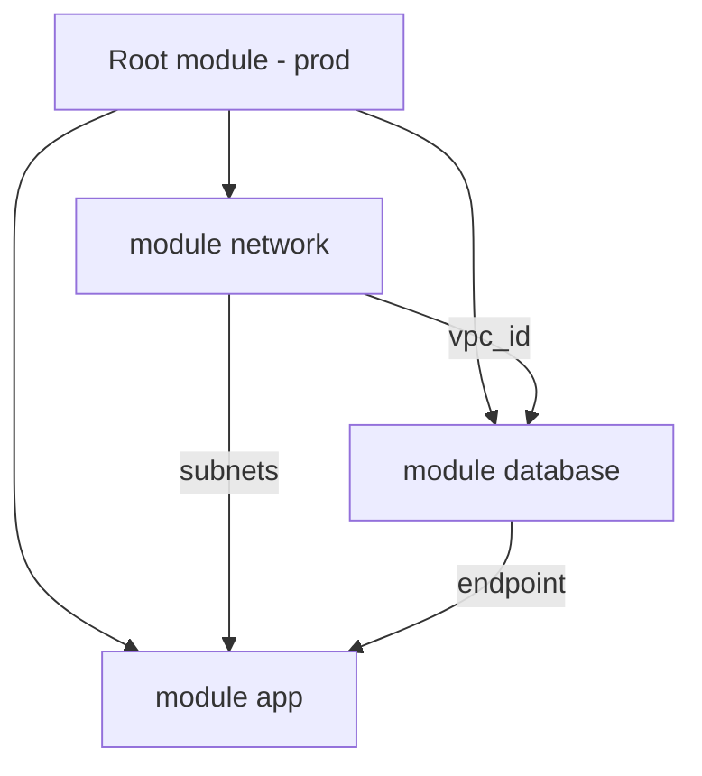

---

## 10. Refactoring : `moved`, `removed`, `import`

Ces blocs rendent les changements d'adresses **déclaratifs, relus en PR et rejouables**.

```hcl
# Renommer sans recréer
moved {
  from = aws_s3_bucket.old_logs
  to   = aws_s3_bucket.logs
}

# Cesser de gérer sans détruire l'objet réel
removed {
  from = aws_instance.legacy
  lifecycle {
    destroy = false
  }
}

# Importer un objet existant
import {
  to = aws_s3_bucket.imported
  id = "bucket-existant"
}
```

- `terraform plan -generate-config-out=generated.tf` génère le HCL des ressources importées (à relire et nettoyer).
- Les providers modernes supportent l'import par **identité de ressource** (`identity`) dans certains cas.
- Depuis la **1.16**, les blocs `import` sont **supportés à l'intérieur des modules**.

---

## 11. Actions et List Resources (1.14+)

### Actions

Les **actions** codifient des opérations *impératives* hors du modèle CRUD (invoquer une fonction, invalider un cache CDN, redémarrer un service). Elles sont fournies par les providers et déclenchées soit par le cycle de vie d'une ressource, soit manuellement avec `-invoke`.

```hcl
# Exemple indicatif : valider les noms d'actions et d'événements avec la doc du provider
action "aws_cloudfront_create_invalidation" "site" {
  config {
    distribution_id = aws_cloudfront_distribution.site.id
    paths           = ["/*"]
  }
}

resource "aws_s3_object" "index" {
  bucket = aws_s3_bucket.site.id
  key    = "index.html"
  source = "index.html"

  lifecycle {
    action_trigger {
      events  = [after_update]
      actions = [action.aws_cloudfront_create_invalidation.site]
    }
  }
}
```

```bash
# Déclenchement manuel
terraform apply -invoke=action.aws_cloudfront_create_invalidation.site
```

Évolutions de la **1.16** : les déclencheurs d'actions acceptent des modes **`on_failure`** (`halt`, `taint`, `continue`), et des événements `before_destroy` / `after_destroy` sont mentionnés par des analyses de la version (à confirmer dans la note de version officielle).

### List Resources et `terraform query`

Découvrir et importer en masse des ressources existantes. Les requêtes se déclarent dans des fichiers **`*.tfquery.hcl`** ; `terraform query` les exécute et peut **générer la configuration d'import**.

```hcl
# discovery.tfquery.hcl - exemple indicatif (dépend du provider)
list "aws_instance" "all" {
  provider = aws
  config {
    region = "eu-west-3"
  }
}
```

```bash
terraform query
terraform query -generate-config-out=imported.tf
terraform validate -query      # validation hors ligne des fichiers de requête
```

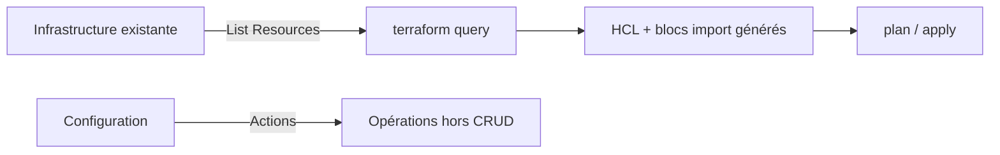

---

## 12. Tests et qualité

### 12.1 Pyramide de contrôles

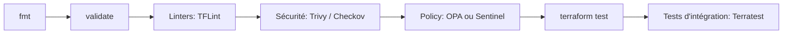

### 12.2 `terraform test` (natif)

Fichiers `*.tftest.hcl` : blocs `run` avec `command = plan` (rapide, sans créer) ou `apply` (crée vraiment, puis détruit). Les **providers simulés** (`mock_provider`) évitent d'appeler les API. Depuis la 1.15, les fonctions sont autorisées dans les blocs `mock`.

```hcl
# tests/bucket.tftest.hcl
mock_provider "aws" {}

variables {
  env = "dev"
}

run "nom_du_bucket" {
  command = plan

  assert {
    condition     = aws_s3_bucket.logs.bucket == "app-dev-logs"
    error_message = "Le nom du bucket est incorrect."
  }
}

run "env_invalide" {
  command = plan
  variables {
    env = "inconnu"
  }
  expect_failures = [var.env]
}
```

Des commandes expérimentales de nettoyage des tests (`terraform test cleanup`, `skip_cleanup`, `backend` dans `run`) sont réservées aux versions alpha à la date de la 1.15 : ne les utilisez pas en production.

### 12.3 Outils complémentaires

| Besoin | Outils |
|---|---|
| Lint | TFLint |
| Sécurité IaC | Trivy, Checkov, Terrascan |
| Policy as code | OPA/Conftest, Sentinel (HCP Terraform) |
| Tests d'intégration | Terratest (Go) |
| Documentation | terraform-docs |
| Coût | Infracost |
| Graphe | `terraform graph` (la 1.16 ajoute selon des analyses un format Mermaid, à vérifier) |

---

## 13. Terraform en CI/CD

Principe : **`plan` sur chaque PR, `apply` après fusion**, avec un état distant verrouillé et une authentification **sans secret statique** (OIDC).

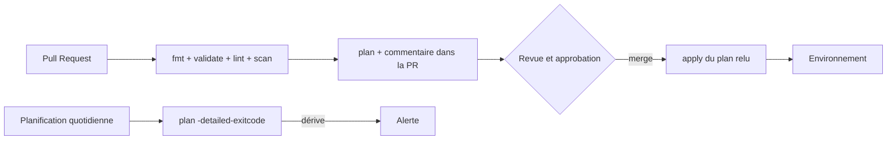

Exemple GitHub Actions (OIDC, permissions minimales, actions épinglées) :

```yaml
name: terraform
on:
  pull_request:
    paths: ["infra/**"]
  push:
    branches: [main]
    paths: ["infra/**"]

permissions:
  contents: read

jobs:
  plan:
    runs-on: ubuntu-latest
    permissions:
      contents: read
      id-token: write          # OIDC vers le cloud
      pull-requests: write     # commentaire de plan
    defaults:
      run:
        working-directory: infra
    steps:
      - uses: actions/checkout@<SHA-complet>                       # vX.Y.Z
      - uses: hashicorp/setup-terraform@<SHA-complet>              # vX.Y.Z
        with:
          terraform_version: "~> 1.16"
      - uses: aws-actions/configure-aws-credentials@<SHA-complet>  # vX.Y.Z
        with:
          role-to-assume: arn:aws:iam::123456789012:role/terraform-plan
          aws-region: eu-west-3
      - run: terraform init -input=false
      - run: terraform fmt -check -recursive
      - run: terraform validate
      - run: terraform plan -input=false -out=tfplan
```

Recommandations :
- **Rôles séparés** : lecture seule pour `plan` sur PR, droits d'écriture uniquement pour `apply` sur `main` avec environnement protégé et approbation ;
- épinglez les actions sur des **SHA complets** (voir le cours DevOps, section supply chain) ;
- un seul `apply` à la fois par state (verrou), sinon file d'attente ;
- détection de **dérive** par `terraform plan -detailed-exitcode` planifié (code 2 = changements) ;
- plateformes d'orchestration : **HCP Terraform**, **Atlantis**, **Spacelift**, **env0**, **Scalr**, GitHub Actions/GitLab CI maison.

---

## 14. Organisation des environnements

| Approche | Avantages | Inconvénients |
|---|---|---|
| **Dossiers par environnement** (`envs/dev`, `envs/prod`) appelant les mêmes modules | Explicite, isolation du state, revue facile | Duplication légère |
| **Workspaces CLI** | Peu de code dupliqué | Risque de cibler le mauvais workspace, isolation faible |
| **Terragrunt** (surcouche) | DRY, orchestration des dépendances | Outil supplémentaire à maîtriser |
| **Stacks (HCP Terraform)** | Multi-composants, multi-déploiements natifs | Dépend de HCP Terraform (section 15) |

Découpez aussi **par fréquence de changement et par risque** : réseau/identité (rare, sensible) séparés de l'applicatif (fréquent). Un state trop gros ralentit les `plan` et augmente le rayon d'impact.

```
infra/
├── modules/
│   ├── network/
│   └── app/
└── envs/
    ├── dev/
    │   └── main.tf
    └── prod/
        └── main.tf
```

---

## 15. HCP Terraform, Terraform Enterprise et Stacks

**HCP Terraform** (SaaS) et **Terraform Enterprise** (auto-hébergé) ajoutent : state managé, exécutions distantes, RBAC, politiques (Sentinel/OPA), registre privé, détection de dérive, SSO, journaux d'audit.

Faits datés :
- le **plan Free historique de HCP Terraform a pris fin le 31 mars 2026** ; les organisations ont été basculées vers un palier gratuit à l'usage (jusqu'à 500 ressources gérées) ;
- HashiCorp a publié le 19 février 2026 une tarification par ressource et par mois selon les paliers (Essentials, Standard, Premium) — chiffres rapportés par la presse spécialisée, **à vérifier sur la page tarifaire officielle** ;
- **HCP Terraform powered by Infragraph** (graphe de connaissance de l'infrastructure) : préversion publique annoncée à IBM Think en mai 2026 ;
- un **serveur MCP Terraform** permet de relier un assistant IA à HCP Terraform/Enterprise.

### Terraform Stacks

Présenté en 2024 (« Terraform 2.0 »), **Stacks** est en disponibilité générale depuis 2025 pour HCP Terraform. Une *stack* orchestre **plusieurs composants (modules) et plusieurs déploiements (environnements, régions)** en gérant les dépendances entre eux.

Évolutions annoncées en juillet 2026 pour HCP Terraform Standard/Premium : **restauration** des workspaces et Stacks, **support monorepo** (plusieurs stacks dans un seul dépôt) et **migration guidée par CLI des workspaces vers les Stacks**.

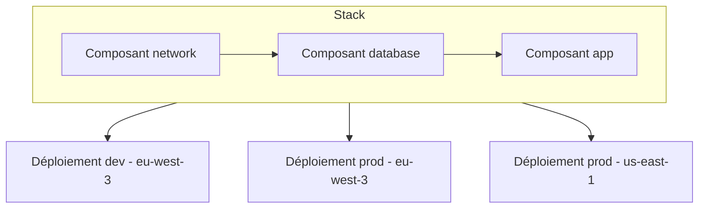

---

## 16. Terraform ou OpenTofu ?

| Dimension | Terraform | OpenTofu |
|---|---|---|
| Éditeur / gouvernance | HashiCorp (IBM) | Linux Foundation (comité communautaire) |
| Licence | BSL 1.1 (source-available) | MPL 2.0 (open source) |
| Dernière version constatée | 1.16.x (août 2026) | 1.12.x (mai 2026), 1.13 en bêta |
| Chiffrement du state côté client | Pas d'équivalent dans le CLI | Natif depuis 1.7 |
| `for_each` sur les providers | Non | Oui (1.9) |
| Option `-exclude` | Non | Oui (1.9) |
| Évaluation précoce de variables (backend) | Partielle | Oui (1.8) |
| Ressources éphémères / write-only | Oui (1.10 / 1.11) | Oui (1.11) |
| Actions, List Resources (`terraform query`) | Oui (1.14) | À vérifier selon la version |
| Stacks / HCP Terraform | Oui | Non (utiliser Spacelift, env0, Scalr, etc.) |
| Verrou S3 natif | Oui (1.10) | Oui |
| Compatibilité des state | Format compatible, **sauf usage de fonctionnalités propres à l'un des deux** | idem |

Repères de décision :

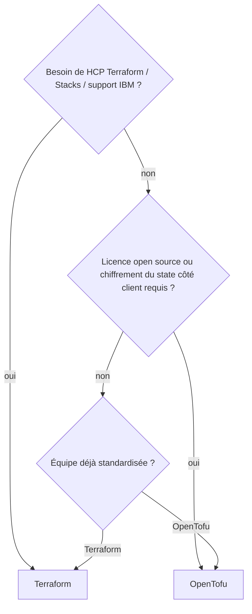

Les deux outils partagent l'essentiel du langage et de l'écosystème de providers. Ne **mélangez pas** les deux sur un même state sans test préalable, et sauvegardez le state avant toute migration.

---

## 17. Sécurité et bonnes pratiques

**State et secrets**
- state distant, **chiffré**, versionné, à accès restreint ; jamais dans Git ;
- secrets via ressources éphémères et attributs write-only quand le provider le permet ; sinon coffre (Vault, Secrets Manager, Key Vault) ;
- `sensitive = true` masque l'affichage, **ne protège pas** le state.

**Identités et accès**
- OIDC et rôles à durée courte, jamais de clés statiques en CI ;
- moindre privilège, un rôle par pipeline et par environnement ;
- séparer `plan` (lecture) et `apply` (écriture).

**Qualité du code**
- versions contraintes (CLI, providers, modules) et `.terraform.lock.hcl` versionné ;
- modules versionnés, revue de PR obligatoire, scan Trivy/Checkov, policies OPA/Sentinel ;
- `prevent_destroy` sur les ressources critiques (bases, stockage) ; tags standardisés.

**Exploitation**
- `plan` relu avant `apply`, `apply` d'un plan sauvegardé ;
- détection de dérive planifiée ;
- petits states, découpage par risque ;
- documentation générée (terraform-docs) et conventions de nommage.

**Anti-patterns courants**
- un state monolithique pour toute l'entreprise ;
- `terraform apply` en local sur la production ;
- `count` sur des listes dont l'ordre change ;
- provisioners comme logique principale ;
- `terraform_remote_state` partout ;
- modules sans version.

---

## 18. Mettre à jour Terraform

Checklist avant de passer à la **1.16** (ou à toute nouvelle mineure) :

1. lire le **changelog** de chaque mineure traversée et les *upgrade notes* ;
2. mettre à jour **providers** d'abord en environnement de test (attention aux versions majeures) ;
3. exécuter `terraform init -upgrade`, puis un `plan` sur chaque racine : **aucun changement inattendu** ;
4. vérifier les backends (S3 : migrer de `dynamodb_table` vers `use_lockfile`) ;
5. mettre à jour l'image/outil CI (`setup-terraform`, tfenv, mise) et les linters ;
6. déployer progressivement : dev, staging, puis prod ;
7. noter que **revenir en arrière** sur une version plus ancienne n'est pas toujours possible une fois le state écrit par une version plus récente : sauvegardez le state.

Points d'attention récents :
- **1.15** : provisioner de l'installation de providers refactoré (ordre des opérations et messages d'`init` différents), variables acceptées dans les sources de modules ;
- **1.16** : application correcte de `bastion_host_key` dans les provisioners (comportement corrigé), blocs `import` dans les modules, bloc `store`, binaire Linux s390x.

---

## 19. Travaux pratiques

**TP1 — Premier déploiement.** Provisionner un bucket de stockage avec variables, locals et sorties ; observer `plan`, `apply`, `destroy`.

**TP2 — State distant.** Configurer le backend S3 (ou équivalent) avec `use_lockfile`, versioning et chiffrement ; simuler un verrou concurrent.

**TP3 — Modules.** Extraire un module `network` versionné, l'appeler depuis `envs/dev` et `envs/prod`, publier une version `v1.0.0`.

**TP4 — Refactoring.** Renommer une ressource avec `moved`, retirer une ressource avec `removed`, importer un objet existant avec `import` et `-generate-config-out`.

**TP5 — Secrets.** Créer une base avec mot de passe **éphémère + write-only** ; vérifier avec `terraform show` que le secret n'apparaît pas dans le state.

**TP6 — Tests.** Écrire un fichier `.tftest.hcl` avec `mock_provider`, une assertion et un `expect_failures`.

**TP7 — CI/CD.** Pipeline `plan` sur PR et `apply` sur `main` avec OIDC, environnement protégé, plan sauvegardé, tâche planifiée de détection de dérive.

**TP8 — Découverte.** Utiliser `terraform query` pour lister des ressources non gérées et générer leur configuration d'import.

**TP9 (avancé) — Comparaison.** Exécuter la même configuration avec Terraform puis OpenTofu sur un state copié ; lister les différences constatées.

---

## 20. Aide-mémoire

```bash
terraform init -upgrade               # met à jour providers/modules dans les contraintes
terraform fmt -recursive
terraform validate
terraform plan -out=tfplan
terraform apply tfplan
terraform plan -refresh-only          # détecter la dérive
terraform plan -detailed-exitcode     # 0 rien, 1 erreur, 2 changements
terraform plan -target=ADDR           # exceptionnel : ciblage
terraform plan -replace=ADDR          # forcer le remplacement (remplace taint)
terraform state list
terraform state show ADDR
terraform output -json
terraform providers lock -platform=linux_amd64 -platform=darwin_arm64
terraform test
terraform query
terraform apply -invoke=action.TYPE.NAME
terraform force-unlock LOCK_ID        # dernier recours
```

Variables d'environnement utiles : `TF_LOG=DEBUG`, `TF_VAR_nom`, `TF_PLUGIN_CACHE_DIR`, `TF_IN_AUTOMATION=1`, `TF_CLI_ARGS_plan="-parallelism=20"`.

---

## 21. Questions de révision

1. Quelle est la différence entre une *resource* et une *data source* ?
2. Pourquoi `for_each` est-il généralement préférable à `count` pour une collection ?
3. Que contient le state et pourquoi doit-il être protégé ?
4. Comment verrouiller un state S3 sans DynamoDB ?
5. Quelle différence entre `sensitive`, `ephemeral` et un attribut write-only ?
6. Quand utiliser `moved`, `removed` et `import` ?
7. Que fait `terraform plan -detailed-exitcode` et comment l'exploiter en CI ?
8. À quoi servent les **actions** et en quoi diffèrent-elles d'un provisioner ?
9. Quelles différences pratiques entre Terraform et OpenTofu en 2026 ?
10. Quelle est la valeur ajoutée des **Stacks** par rapport aux workspaces ?

<details>
<summary>Éléments de réponse</summary>

1. La resource est gérée (créée/modifiée/détruite) ; la data source ne fait que lire.
2. Clés stables : supprimer un élément ne décale pas les autres (avec `count`, les indices changent).
3. Les identifiants des objets et leurs attributs, y compris des secrets ; accès restreint, chiffrement, versioning.
4. `use_lockfile = true` dans le backend S3 (Terraform 1.10+).
5. `sensitive` masque l'affichage mais persiste en state ; `ephemeral` n'est jamais persisté ; write-only permet à une ressource de recevoir une valeur éphémère sans la stocker.
6. `moved` : renommer/déplacer ; `removed` : cesser de gérer ; `import` : adopter un objet existant.
7. Code de sortie 2 si changements : base d'une alerte de dérive.
8. Opérations impératives hors CRUD, fournies par les providers et déclenchées par événement ou `-invoke` ; plus structurées et observables que les provisioners.
9. Licence, chiffrement du state côté client, `for_each` de providers, `-exclude` côté OpenTofu ; Stacks/HCP, actions et `terraform query` côté Terraform.
10. Orchestration multi-composants et multi-déploiements avec dépendances gérées.

</details>

---

## Sources

**Terraform (HashiCorp)**
- Notes de version 1.16.0 : https://github.com/hashicorp/terraform/releases/tag/v1.16.0
- Annonce 1.16.0 : https://discuss.hashicorp.com/t/terraform-v1-16-0-released/77683
- Notes de version 1.15.0 : https://github.com/hashicorp/terraform/releases/tag/v1.15.0
- Changelog 1.15 : https://github.com/hashicorp/terraform/blob/v1.15/CHANGELOG.md
- Changelog 1.14.0 (actions, List Resources, `terraform query`) : https://github.com/hashicorp/terraform/blob/v1.14.0/CHANGELOG.md
- Terraform 1.11, write-only arguments : https://www.hashicorp.com/en/blog/terraform-1-11-ephemeral-values-managed-resources-write-only-arguments
- Backend S3 et verrouillage : https://developer.hashicorp.com/terraform/language/backend/s3
- Versions et cycle de vie (tiers) : https://www.versio.io/en/product-release-end-of-life-eol-hashicorp-terraform.html

**HCP Terraform, Stacks, IBM**
- Stacks, restauration et monorepo (juillet 2026) : https://www.hashicorp.com/en/blog/terraform-introduces-workspaces-and-stacks-restore-and-more
- HashiConf 2025, Stacks en GA : https://www.hashicorp.com/en/blog/scale-infrastructure-with-new-terraform-and-packer-features-at-hashiconf-2025
- Bilan HashiCorp 2025 : https://www.hashicorp.com/en/blog/hashicorp-year-in-review-2025-lessons-in-simplifying-the-cloud
- HCP Terraform powered by Infragraph (IBM) : https://www.ibm.com/new/announcements/introducing-hcp-terraform-powered-by-infragraph-in-public-preview
- Fin du plan Free historique et tarification (analyse tierce, à recouper avec la page officielle) : https://scalr.com/learning-center/hcp-terraform-free-tier-is-being-discontinued-what-you-need-to-know

**Analyses tierces (à valider avec les notes officielles)**
- Terraform 1.16, points d'attention avant mise à jour : https://aicybr.com/blog/terraform-1-16-upgrade-guide
- Terraform 1.15, détails de fonctions : https://davletd.medium.com/terraform-1-15-the-small-print-is-where-it-gets-interesting-ae118e7088aa
- Terraform 1.14, List Resources et Actions : https://dev.to/x4nent/terraform-114-the-complete-guide-to-list-resources-tfqueryhcl-actions-block-and-terraform-350j

**OpenTofu**
- OpenTofu 1.12 : https://opentofu.org/blog/opentofu-1-12-0/
- Comparaison OpenTofu / Terraform (analyse tierce) : https://scalr.com/learning-center/opentofu-vs-terraform

---

*Contributions bienvenues : ouvrez une PR pour corriger ou actualiser une section, et mettez à jour la date de vérification en tête de fichier.*
