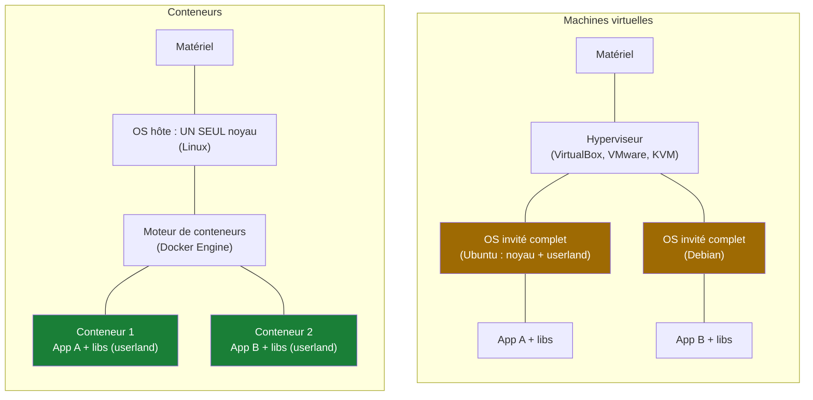
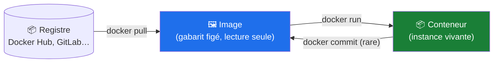
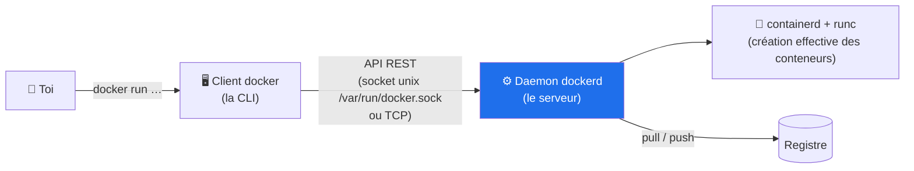
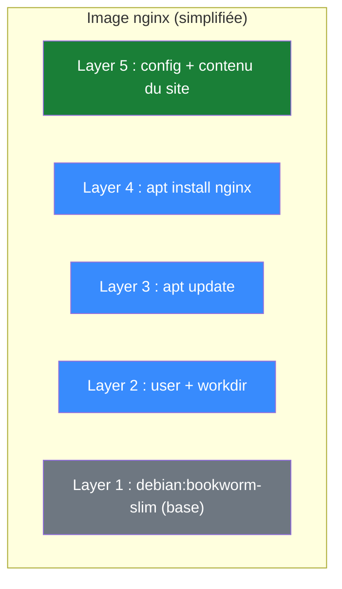
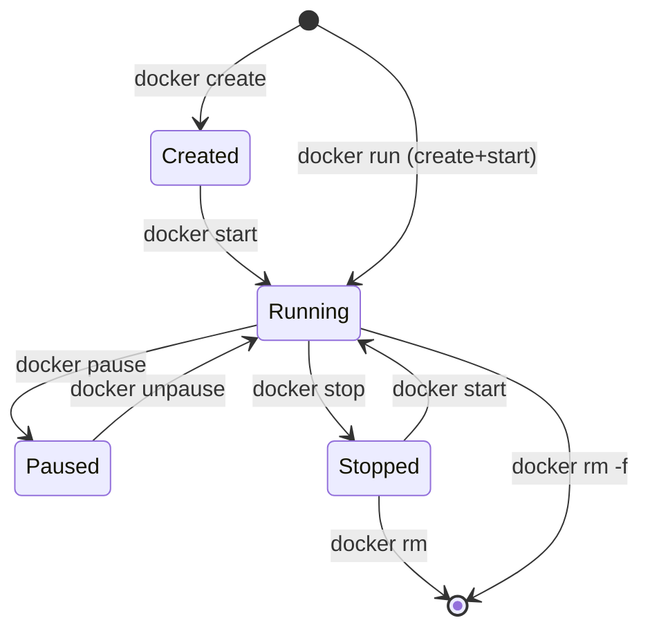
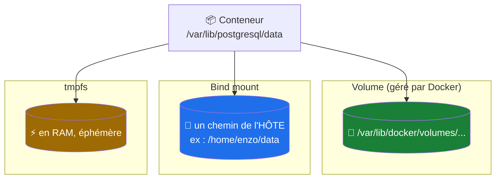
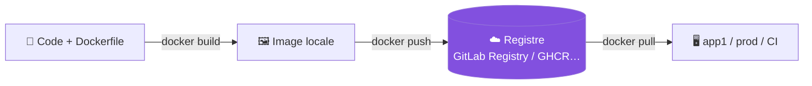
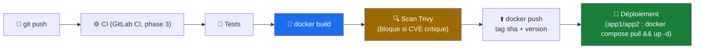

# Docker — Le cours complet

   

> Cours à jour (Docker Engine 27+, Compose v2 plugin, BuildKit, images distroless, rootless en mention). Fil rouge : le lab VirtualBox (192.168.56.0/24) — Docker s'installe sur app1/app2 dès la phase 1.
> Exercices pratiques : [dossier `exercices/`](../exercices/).

---

## 🧭 Parcours de lecture

| Vous êtes… | Parcours | Parties | Durée estimée |
|---|---|---|---|
| 🌱 **Débutant** | Conteneurs + images + volumes + réseau de base | 1 → 7 | ≈ 3 h 30 |
| 🌿 **Praticien** | Dockerfile avancé, Compose, registres, sécurité | 8 → 13 | ≈ 3 h |
| 🚀 **Confirmé** | Supervision, orchestration, écosystème, dépannage | 14 → 19 | ≈ 2 h 30 |
| 🔍 **Révision rapide** | Cheat sheet + quiz | 20 + quiz | ≈ 25 min |

💡 **Méthode** : chaque partie contient « 💻 Sur ton lab » — installe Docker sur app1 (Ubuntu Server) et joue les commandes. Docker s'apprend en tapant, pas en lisant.

---

## Table des matières

- [x] [1. Conteneurs vs machines virtuelles : le pourquoi](#1-conteneurs-vs-machines-virtuelles--le-pourquoi)
- [x] [2. L'architecture Docker](#2-larchitecture-docker)
- [x] [3. Installation et premiers pas](#3-installation-et-premiers-pas)
- [x] [4. Les images : layers, registres et tags](#4-les-images--layers-registres-et-tags)
- [x] [5. Les conteneurs : cycle de vie complet](#5-les-conteneurs--cycle-de-vie-complet)
- [x] [6. Le Dockerfile : construire ses images](#6-le-dockerfile--construire-ses-images)
- [x] [7. Les volumes : la persistance des données](#7-les-volumes--la-persistance-des-données)
- [x] [8. Le réseau Docker](#8-le-réseau-docker)
- [x] [9. Docker Compose : orchestrer localement](#9-docker-compose--orchestrer-localement)
- [x] [10. Dockerfile avancé : multi-stage, BuildKit, bonnes pratiques](#10-dockerfile-avancé--multi-stage-buildkit-bonnes-pratiques)
- [x] [11. Registres : pousser ses images](#11-registres--pousser-ses-images)
- [x] [12. Sécurité des conteneurs](#12-sécurité-des-conteneurs)
- [x] [13. Docker dans le CI/CD](#13-docker-dans-le-cicd)
- [x] [14. Supervision et logs](#14-supervision-et-logs)
- [x] [15. Au-delà d'un hôte : Swarm, Kubernetes et l'écosystème](#15-au-delà-dun-hôte--swarm-kubernetes-et-lécosystème)
- [x] [16. Docker dans mon lab DevOps](#16-docker-dans-mon-lab-devops)
- [x] [17. Pièges classiques et dépannage](#17-pièges-classiques-et-dépannage)
- [x] [18. Aide-mémoire (cheat sheet)](#18-aide-mémoire-cheat-sheet)
- [x] [19. Exercices et scénarios corrigés](#19-exercices-et-scénarios-corrigés)
- [x] [20. Glossaire](#20-glossaire)

---

## 1. Conteneurs vs machines virtuelles : le pourquoi

### 1.1 Le problème à résoudre

« Ça marche sur ma machine » — le serpent à sept têtes du développement : versions de dépendances qui s'entrechoquent, config d'environnement perdue, environnement de prod différent du dev. Le conteneur répond à une promesse simple :

> **Une application + ses dépendances empaquetées dans un environnement reproductible, qui tourne pareil partout.**

### 1.2 VM vs conteneur : la comparaison fondamentale



La différence décisive : **une VM embarque un système d'exploitation complet** (son propre noyau, gigaoctets, démarrage en minutes) ; **un conteneur partage le noyau de l'hôte** et n'embarque que l'espace utilisateur (méga-octets, démarrage en secondes).

| Critère | Machine virtuelle | Conteneur |
|---|---|---|
| Noyau | Un par VM (isolé complet) | Partagé avec l'hôte |
| Taille | Go (image disque) | Mo (image) |
| Démarrage | 30 s → minutes | < 1 seconde |
| Densité | 5-20 VMs par hôte | centaines de conteneurs |
| Isolation | Forte (frontière matérielle) | Bonne mais **plus faible** (même noyau) |
| Cas d'usage | OS différents, isolation forte | Applications, microservices, CI |

> [!IMPORTANT]
> Conteneur ≠ VM légère : un conteneur est **un processus Linux isolé** par trois mécanismes du noyau — **namespaces** (isoler ce que le processus voit : PID, réseau, filesystem…), **cgroups** (limiter ce qu'il consomme : CPU, RAM) et **unions de systèmes de fichiers** (les layers, §4). Docker est l'outillage ergonomique par-dessus. C'est aussi pour ça que « Docker tourne sous Windows/Mac » = Docker **dans une VM Linux cachée**.

### 1.3 Conteneur, image, registre : le trio à poser



- **Image** : gabarit figé (lecture seule), composé de layers — c'est le « .exe » portable de l'app ;
- **Conteneur** : une **instance en exécution** d'une image, avec une fine couche inscriptible par-dessus ;
- **Registre** : l'entrepôt d'images (Docker Hub public, GitLab Registry privé — ta phase 3).

L'analogie POO : l'image est la **classe**, le conteneur l'**instance**.

### 🎯 Quiz — Conteneurs

1. Quels trois mécanismes du noyau Linux rendent les conteneurs possibles ?
2. Pourquoi le démarrage d'un conteneur est-il instantané ?
3. Docker Desktop sur Windows : où tourne réellement le noyau Linux ?

<details>
<summary>✅ Réponses</summary>

1. **Namespaces** (isolement des vues), **cgroups** (limites de ressources), **unions de filesystems** (layers).
2. Il ne démarre pas un OS : il **fork un processus** déjà isolé — le noyau tourne déjà.
3. Dans une **VM Linux invisible** (WSL2) — Docker ne conteneurise que du Linux sur ce noyau partagé.
</details>

---

## 2. L'architecture Docker

### 2.1 Client-serveur, même en local



- **CLI `docker`** : le client — traduit tes commandes en appels à l'API ;
- **Daemon `dockerd`** : le serveur — détient images, conteneurs, volumes, réseaux ; tourne en **root** par défaut (implication sécurité, §12) ;
- **containerd/runc** : l'exécuteur de bas niveau (standard OCI) ;
- **Socket `/var/run/docker.sock`** : la porte du daemon — **qui y accède contrôle l'hôte** (§12).

### 2.2 Les standards OCI

Docker n'est pas seul : **OCI** (Open Container Initiative) standardise formats d'image et runtime. Conséquences pratiques : `podman`, `containerd`, `nerdctl` exécutent les **mêmes images** ; dans GitLab CI, le runner peut utiliser le driver `docker`… ou `kubernetes`. Comprendre l'architecture te rend **portable d'outil**.

### 💻 Sur ton lab

```bash
# Sur app1 : l'architecture en un coup d'œil
docker version            # client vs server (versions séparées !)
docker info               # + stockage driver, nb de conteneurs, cgroup…
ps aux | grep dockerd     # le daemon est un processus comme un autre
```

---

## 3. Installation et premiers pas

### 3.1 Installer sur Ubuntu (ta VM app1)

```bash
# Dépôt officiel Docker (à jour) plutôt que docker.io (packagé Ubuntu)
sudo apt-get update
sudo apt-get install -y ca-certificates curl
sudo install -m 0755 -d /etc/apt/keyrings
sudo curl -fsSL https://download.docker.com/linux/ubuntu/gpg -o /etc/apt/keyrings/docker.asc
echo "deb [arch=$(dpkg --print-architecture) signed-by=/etc/apt/keyrings/docker.asc] \
https://download.docker.com/linux/ubuntu $(. /etc/os-release && echo $VERSION_CODENAME) stable" | \
  sudo tee /etc/apt/sources.list.d/docker.list > /dev/null
sudo apt-get update
sudo apt-get install -y docker-ce docker-ce-cli containerd.io \
  docker-buildx-plugin docker-compose-plugin
```

```bash
# Autoriser ton utilisateur sans sudo (reconnexion nécessaire)
sudo usermod -aG docker $USER
# Vérifier
docker run hello-world
```

> [!WARNING]
> `usermod -aG docker` donne à l'utilisateur l'équivalent du **root** (via le socket du daemon). Normal dans un lab perso ; en entreprise, on mitige le risque (rootless mode, §12).

### 3.2 Les trois premières commandes

```bash
docker run hello-world       # le "hello" : pull + create + start + attache
docker ps -a                 # que tourne / a tourné ?
docker images                # mes images locales
```

`docker run hello-world` a enchaîné : chercher l'image **localement** → absente → **pull** depuis Docker Hub → créer le conteneur → le démarrer → afficher son message → le conteneur s'arrête (son processus principal s'est terminé).

### 💻 Sur ton lab

```bash
docker run -d --name web -p 8080:80 nginx    # serveur web en tâche de fond
curl http://localhost:8080                   # ← il VIT ! (page nginx)
docker ps                                    # il tourne
docker stop web && docker rm web             # nettoyage
```

### 🎯 Quiz — Installation

1. Pourquoi ajouter son user au groupe `docker` ? Quel risque cela porte-t-il ?
2. Que fait `docker run` en une commande ?

<details>
<summary>✅ Réponses</summary>

1. Accès au **socket du daemon** sans sudo — donc contrôle total de l'hôte (conteneurs malveillants, montage de `/`, etc.). Le risque = root déguisé.
2. `pull` (si besoin) + `create` + `start` + attach — les 4 actions d'un coup.
</details>

---

## 4. Les images : layers, registres et tags

### 4.1 L'image est une pile de layers

Une image Docker = **une pile de layers lecture seule**, chaque layer étant la différence (diff) par rapport au précédent :



- Chaque layer est **content-addressable** (hashé) : partagée entre images si identique → le `ubuntu:24.04` et le `nginx` basés sur la même distro **partagent** leurs couches communes sur le disque ;
- Le téléchargement est incrémental : seuls les layers absents sont pullés ;
- En écriture, le conteneur empile une **couche inscriptible** (copy-on-write) au-dessus : tes modifications d'exécution ne touchent jamais les layers de l'image (et **disparaissent** avec le conteneur — d'où les volumes, §7).

Inspecter :

```bash
docker history nginx          # les layers, de la base vers le haut
docker inspect nginx          # JSON complet : config, layers, entrée...
```

### 4.2 Tags : ne pas se faire piéger

`image:tag` pointe vers une version. Pièges et bonnes pratiques :

| Tag | Signification | Avis |
|---|---|---|
| `nginx:latest` | « la dernière publiée » — **mutable**, change sous tes pieds | ❌ en prod |
| `nginx:1.27` | version mineure précise (toujours mutable au patch) | acceptable |
| `nginx:1.27.4` | patch exact | ✅ reproductible |
| `@sha256:abc123…` | **digest** : l'image exacte, immuable | ✅✅ en CI/prod |

> [!IMPORTANT]
> `latest` ne veut pas dire « stable » ni « testée » : c'est juste **le tag par défaut, mutable**. Tout pipeline sérieux épingle par version (au minimum) ou par digest. Le jour où ta build casse « sans raison », vérifie si ton `latest` a bougé.

### 4.3 Les registres

- **Docker Hub** : le registre public par défaut (images officielles : `nginx`, `postgres`, `redis`…) ;
- **GitLab Registry** (`registry.gitlab.com` ou auto-hébergé — ta phase 3) : tes images privées, collées au CI ;
- **GHCR** (GitHub), **ECR** (AWS), harbor (self-hosted)…

```bash
docker search postgres       # chercher (hub)
docker pull redis:7.4        # télécharger
docker image ls              # lister (alias : docker images)
docker image rm redis:7.4    # supprimer (alias : docker rmi)
docker system df             # disque utilisé par Docker
```

### 🎯 Quiz — Images

1. Deux images partagent une layer : où est-elle stockée ? Deux fois ?
2. Un conteneur modifie un fichier présent dans une layer de l'image : que se passe-t-il sur le disque ?
3. Pourquoi épingler par digest plutôt que par `latest` ?

<details>
<summary>✅ Réponses</summary>

1. **Une seule fois** : les layers sont content-addressable et partagées (économe, téléchargements incrémentaux).
2. **Copy-on-write** : le fichier est copié dans la couche inscriptible du conteneur, qui le masque ; l'image reste intacte.
3. `latest` est **mutable** : deux builds différents peuvent tirer des contenus différents. Le digest identifie une image **immuable** bit à bit — reproductibilité garantie.
</details>

---

## 5. Les conteneurs : cycle de vie complet

### 5.1 Créer, démarrer, arrêter, supprimer



```bash
docker run -d --name web1 nginx       # -d : en tâche de fond (détaché)
docker ps                             # les conteneurs qui tournent
docker ps -a                          # y compris arrêtés
docker stop web1                      # SIGTERM, puis SIGKILL après grace (10 s)
docker start web1                     # redémarrer le même conteneur
docker restart web1
docker rm web1                        # supprimer (doit être arrêté)
docker rm -f web1                     # forcer (stop + rm)
```

### 5.2 Le conteneur vit tant que son PID 1 vit

**Règle d'or** : un conteneur tourne tant que son **processus principal (PID 1)** tourne. Le processus meurt → le conteneur s'arrête. C'est pour ça que :

```bash
docker run ubuntu                     # s'arrête immédiatement : bash lancé sans TTY s'achève
docker run -it ubuntu bash            # -it : interactif + TTY → il vit tant que tu tapes
docker run -d nginx                   # vit : nginx tourne en avant-plan du conteneur
```

> [!WARNING]
> Piège classique : lancer un daemon qui **se fork en arrière-plan** (`service nginx start` en PID 1) → le conteneur s'arrête aussitôt. En conteneur, les services tournent **au premier plan** (`nginx -g "daemon off;"`, `php-fpm -F`…).

### 5.3 Observer, entrer, inspecter

```bash
docker logs -f web1                   # suivre les logs (stdout/stderr)
docker logs --tail 50 web1
docker top web1                       # les processus du conteneur
docker stats                          # consommation CPU/RAM en direct
docker inspect web1                   # tout le JSON : IP, mounts, config...
docker exec -it web1 bash             # entrer DANS le conteneur qui tourne ⭐
```

`docker exec` est ton outil de diagnostic quotidien : un shell dans le conteneur, sans le reconstruire. (`-it` : interactif + tty ; avec des images distroless, il n'y a **pas** de shell — prévoir `debug` en sidecar, §10.)

### 5.4 Limites de ressources

```bash
docker run -d --name app --memory=512m --cpus=1.5 nginx
docker stats app                      # constater la limite
```

Sans limite, un conteneur peut **famer l'hôte entier** (le noyau est partagé !). Les limites (`--memory`, `--cpus`, `--pids-limit`) sont l'usage des cgroups (§1.2) — réflexe obligatoire dès que plusieurs services cohabitent.

### 5.5 Redémarrage et politique de reprise

```bash
docker run -d --restart unless-stopped nginx
# no (défaut) | on-failure[:n] | always | unless-stopped
```

`unless-stopped` : redémarre après crash **et** au boot de l'hôte (sauf si tu l'avais arrêté volontairement). Dans le lab, c'est ce que tu veux pour tes services persistants.

### 💻 Sur ton lab

```bash
docker run -d --name lab-app --restart unless-stopped \
  --memory=256m --cpus=1 -p 8081:80 nginx
docker stats --no-stream lab-app
docker exec -it lab-app sh -c 'hostname; ls /usr/share/nginx/html'
docker rm -f lab-app
```

### 🎯 Quiz — Conteneurs

1. Ton conteneur s'arrête juste après le start : premier réflexe de diagnostic ?
2. Différence entre `docker stop` et `docker kill` ? Et entre `stop` et `pause` ?
3. `-d`, `-it`, `--rm`, `-p 8080:80`, `-e VAR=valeur` : à quoi servent ces options ?

<details>
<summary>✅ Réponses</summary>

1. `docker logs <nom>` — le PID 1 est mort ; les logs disent pourquoi (crash, config manquante, commande fourground absente).
2. `stop` : SIGTERM puis SIGKILL après délai (arrêt propre). `kill` : SIGKILL direct. `pause` : gèle les processus (cgroups freezer) **sans** les arrêter — reprise exacte.
3. `-d` détaché ; `-it` interactif ; `--rm` supprimé à l'arrêt ; `-p hôte:conteneur` publie un port ; `-e` une variable d'environnement.
</details>

---

---

## 6. Le Dockerfile : construire ses images

### 6.1 Anatomie d'un Dockerfile

Le **Dockerfile** est la recette déterministe de ton image — chaque instruction crée une layer :

```dockerfile
# syntax=docker/dockerfile:1          ← directive BuildKit (toujours)
FROM debian:bookworm-slim             # l'image de base (le layer 1)

LABEL maintainer="enzo@exemple.com"   # métadonnées

ENV APP_HOME=/app \
    PORT=8080                         # variables persistées dans l'image

WORKDIR $APP_HOME                     # le "cd" pour les instructions suivantes

COPY app/ ./                          # copier les fichiers (crée une layer)
RUN apt-get update \
 && apt-get install -y --no-install-recommends python3 \
 && rm -rf /var/lib/apt/lists/*       # exécuter à la BUILD (dans l'image)

USER appuser                          # ne PAS tourner en root (§12)

EXPOSE 8080                           # documentation du port (pas de publication !)

HEALTHCHECK --interval=30s CMD curl -f http://localhost:8080/health || exit 1

ENTRYPOINT ["python3", "server.py"]   # le processus principal
CMD ["--port", "8080"]                # arguments par défaut (écrasables)
```

### 6.2 COPY vs ADD, RUN vs CMD vs ENTRYPOINT : les confusions classiques

| Instruction | Fait quoi | Règle |
|---|---|---|
| **COPY** | copie des fichiers locaux | le réflexe par défaut |
| ADD | COPY + décompression URL/tar | ⚠️ ne l'utiliser que pour le tar local ; les URL → plutôt `RUN curl` |
| **RUN** | exécute **à la build** (dans l'image) | apt install, compilation… |
| **CMD** | commande **par défaut au run** | écrasée si tu passes une commande au `docker run` |
| **ENTRYPOINT** | le **binaire fixe** du conteneur | CMD devient ses arguments |

```bash
# ENTRYPOINT ["ping"], CMD ["8.8.8.8"]  →  docker run img        = ping 8.8.8.8
#                                          docker run img 1.1.1.1 = ping 1.1.1.1
```

> [!TIP]
> Pattern recommandé pour les images d'outils : `ENTRYPOINT` fixe + `CMD` réglable. Pour les services : les deux, ou `ENTRYPOINT` seul avec le script de démarrage.

### 6.3 Le cache de build : ton accélérateur

BuildKit **réutilise** les layers dont l'instruction + les fichiers n'ont pas changé. L'ordre des instructions est donc stratégique : **du plus stable au plus changeant**.

```dockerfile
# ❌ MAUVAIS : tout le code change → apt réinstallé à CHAQUE build
COPY . /app
RUN apt-get update && apt-get install -y python3

# ✅ BON : les dépendances (stables) AVANT le code (instable)
COPY requirements.txt .
RUN pip install -r requirements.txt
COPY . /app
```

```bash
docker build -t monapp:1.0 .           # construire
docker build --no-cache -t monapp:1.0 .  # invalider le cache (parfois nécessaire)
```

> [!IMPORTANT]
> L'ordre optimal des layers est LA compétence Dockerfile : changer une ligne de code ne doit re-exécuter **que** la fin du Dockerfile. Si ton build refait `apt-get` à chaque commit de code, ton Dockerfile est mal ordonné.

### 6.4 .dockerignore : le .gitignore du build

Le contexte de build (tout ce que `docker build .` envoie au daemon) doit être minimal :

```gitignore
# .dockerignore
.git
node_modules
__pycache__/
*.log
.env            # JAMAIS dans le contexte (risque de COPY accidentel, §12)
docs/
tests/
```

Bénéfices : builds plus rapides (contexte plus petit), moins de layers inutiles, moins de fuites de secrets.

### 💻 Sur ton lab

```bash
mkdir -p ~/docker-essai && cd ~/docker-essai
printf 'from http.server import HTTPServer, BaseHTTPRequestHandler\nprint("Serveur lab OK")\n' > app.py
cat > Dockerfile <<'EOF'
FROM python:3.12-slim
WORKDIR /app
COPY app.py .
USER nobody
CMD ["python3", "app.py"]
EOF
docker build -t essai:1.0 .
docker run --rm essai:1.0
```

### 🎯 Quiz — Dockerfile

1. Pourquoi `apt-get update && apt-get install` doivent-ils être dans le **même** `RUN` ?
2. `COPY . /app` en première ligne : conséquence sur les builds suivants ?
3. `EXPOSE 8080` publie-t-il le port ? À quoi sert-il alors ?

<details>
<summary>✅ Réponses</summary>

1. Chaque `RUN` = une layer figée. Séparés : le cache d'apt (`/var/lib/apt/lists`) serait **dans la layer 1** puis l'install dans la layer 2 **sans update frais** → paquets introuvables. Ensemble + nettoyage dans le même RUN = une layer propre et cohérente.
2. Toute modification de n'importe quel fichier invalide le cache dès la **première** instruction : tout se rebuilde à chaque fois, même les installs inchangées.
3. Non — `EXPOSE` est de la **documentation** (+ mappage auto en mode réseau d'alias). La publication réelle, c'est `-p`/`--publish` au run (ou `ports:` en Compose).
</details>

---

## 7. Les volumes : la persistance des données

### 7.1 Le problème : la couche inscriptible est éphémère

Le filesystem d'un conteneur est **jetable** : `docker rm` l'efface, un re-déploiement le recrée vide. Toute donnée à conserver (BDD, uploads, logs importants) doit vivre **hors** du conteneur.

### 7.2 Les trois mécanismes



| Mécanisme | Stocké où | Usage |
|---|---|---|
| **Volume** | zone gérée par Docker | **le défaut recommandé** (BDD, données d'app) |
| **Bind mount** | n'importe quel chemin hôte | dev (éditer le code dans le conteneur), configs |
| **tmpfs** | RAM du conteneur | secrets temporaires, caches |

```bash
# Volume nommé (le réflexe)
docker volume create pgdata
docker run -d --name db -v pgdata:/var/lib/postgresql/data postgres:16

# Bind mount (dev : le code vit sur l'hôte)
docker run -d --name dev -v ~/projet:/app -w /app python:3.12 python app.py

# tmpfs
docker run --tmpfs /run/secrets nginx

docker volume ls / docker volume inspect pgdata / docker volume rm pgdata
```

> [!NOTE]
> **Volume anonymous vs nommé** : `-v /data` (sans nom) crée un volume anonyme qui survit au conteneur mais se perd dans la masse ; préfère toujours les **volumes nommés**. Et `-v hôte:conteneur` avec un chemin **absolu hôte** = bind mount ; sans `/`, Docker interprète comme un nom de volume — source classique de confusion.

### 7.3 Volume vs bind : le cas du dev

En dev, le bind mount du code source est le pattern standard : tu édites sur ta machine, le conteneur voit tout de suite (combiné au hot-reload de ton framework). En prod : volumes nommés (ou stockage managé), jamais de bind vers des chemins d'hôte aléatoires — portabilité et sécurité.

### 💻 Sur ton lab

```bash
# La preuve par l'exemple : la donnée survit au conteneur
docker volume create lab-vol
docker run --rm -v lab-vol:/data alpine sh -c 'echo "je survis" > /data/fichier.txt'
docker run --rm -v lab-vol:/data alpine cat /data/fichier.txt   # → je survis
docker volume rm lab-vol
```

### 🎯 Quiz — Volumes

1. `docker rm -v` sur un conteneur avec volume nommé : la donnée disparaît-elle ?
2. Dev vs prod : quel mécanisme préférer, et pourquoi ?
3. Le conteneur écrit dans `/tmp` sans volume : où va la donnée à l'arrêt ?

<details>
<summary>✅ Réponses</summary>

1. **Non** : le volume reste (le `-v` de `rm` ne supprime que les volumes **anonymes** attachés). `docker volume rm` est nécessaire — c'est voulu : la donnée est plus précieuse que le conteneur.
2. Dev : **bind mount** (itération rapide, édition côté hôte). Prod : **volumes nommés** (portabilité, gestion par Docker, pas de dépendance aux chemins de l'hôte).
3. Elle disparaît avec la couche inscriptible du conteneur — `/tmp` d'un conteneur n'est pas un stockage.
</details>

---

## 8. Le réseau Docker

### 8.1 Ce que Docker crée à l'installation

```bash
docker network ls
# bridge   → le réseau par défaut des conteneurs (docker0 : 172.17.0.1/16)
# host     → pas d'isolation réseau (conteneur = réseau de l'hôte)
# none     → pas de réseau du tout
```

Chaque conteneur branché sur un réseau reçoit une **IP privée** de ce réseau (ex. 172.17.0.2) — ton cours Réseaux se rejoue ici : le daemon fait du **NAT** vers l'hôte (masquerade), comme VirtualBox pour tes VMs.

### 8.2 Bridge par défaut vs réseau défini par l'utilisateur : LA différence

| | bridge par défaut (docker0) | réseau user-defined ⭐ |
|---|---|---|
| Résolution **DNS entre conteneurs par nom** | ❌ non | ✅ oui (`db`, `api` se joignent par nom) |
| Isolation entre conteneurs | faible (tous dessus) | par réseau (segmentation) |
| Attach/detach à chaud | non | oui |

```bash
# ❌ sur le bridge par défaut : les conteneurs ne se voient PAS par nom
docker run -d --name db postgres:16
docker run -d --name api monapp          # ne peut pas joindre "db" par nom

# ✅ réseau dédié : DNS interne automatique
docker network create lab-net
docker run -d --name db --network lab-net postgres:16
docker run -d --name api --network lab-net monapp
# dans api : ping db → résout par le DNS embarqué de Docker (127.0.0.11)
```

> [!IMPORTANT]
> C'est LA règle réseau de Docker : **tout conteneur « sérieux » va sur un réseau défini par l'utilisateur**. Le bridge par défaut est pour le bricolage. (En Compose, §9, c'est automatique.)

### 8.3 Les ports : publier vers l'extérieur

Les IP de conteneurs ne sont pas joignables depuis l'extérieur de l'hôte — on **publie** les ports (DNAT, toujours ton cours Réseaux) :

```bash
docker run -d -p 8080:80 nginx        # hôte:8080 → conteneur:80
docker run -d -p 127.0.0.1:8080:80 nginx  # ⭐ loopback seulement (sécurité)
docker run -d -P nginx                # -P : publier tous les EXPOSE sur des ports aléatoires
docker port web1                      # voir les mappages
```

> [!WARNING]
> `-p 8080:80` **sans préfixe IP** écoute sur **toutes** les interfaces de l'hôte (0.0.0.0). Sur une machine exposée, ton conteneur devient joignable du réseau — préfixe `127.0.0.1:` pour du local uniquement, et firewallocal (§12).

### 8.4 Autres drivers (culture)

- **host** : conteneur sans isolation réseau (perf max, port direct) — Linux seulement ;
- **macvlan** : le conteneur obtient une IP **de ton LAN physique** (comme une machine réelle) ;
- **overlay** : réseau multi-hôtes (Swarm/K8s) — encapsulation VXLAN (ton cours Réseaux §19.3 !).

### 💻 Sur ton lab

```bash
docker network create essai
docker run -d --name a --network essai nginx
docker run --rm --network essai busybox ping -c2 a     # DNS + ICMP entre conteneurs
docker exec a sh -c 'hostname -i'                      # son IP privée
docker network rm essai 2>/dev/null || docker rm -f a && docker network rm essai
```

### 🎯 Quiz — Réseau

1. Deux conteneurs sur le bridge par défaut peuvent-ils se joindre par nom ? Pourquoi ?
2. `-p 8080:80` vs `-p 127.0.0.1:8080:80` : différence de surface d'exposition ?
3. Quel mécanisme réseau de Docker rejoue ton cours Réseaux (§12) ?

<details>
<summary>✅ Réponses</summary>

1. **Non** : le DNS par nom n'existe que sur les réseaux user-defined. Sur docker0, il faut des IP (et elles changent) — d'où la règle « réseau dédié ».
2. Le premier écoute sur **0.0.0.0** (joignable de tout le LAN de l'hôte) ; le second n'est joignable que **depuis l'hôte lui-même** — deux surfaces d'exposition très différentes.
3. Le **NAT/masquerade** : les conteneurs sortent via l'IP de l'hôte, et `-p` fait du DNAT vers eux — exactement le NAT de §12 du cours Réseaux.
</details>

---

---

## 9. Docker Compose : orchestrer localement

### 9.1 Le problème : les commandes deviennent ingérables

Une app moderne = app + BDD + cache + reverse-proxy. En `docker run`, ça donne 4 commandes avec leurs réseaux, volumes, variables… **Compose** déclare tout ça dans **un seul fichier YAML versionné** et gère le cycle de vie :

```yaml
# compose.yaml (nom standard Compose v2 — plus de .yml requis ni "version:" à la racine)
services:
  web:
    build: .                          # ou image: monrepo/web:1.2.3
    ports:
      - "8000:8000"
    environment:
      - DATABASE_URL=postgres://app:secret@db:5432/app
    depends_on:
      db:
        condition: service_healthy   # attendre que db soit VRAIMENT prêt
    restart: unless-stopped

  db:
    image: postgres:16
    environment:
      POSTGRES_PASSWORD: secret
      POSTGRES_DB: app
    volumes:
      - pgdata:/var/lib/postgresql/data
    healthcheck:
      test: ["CMD-SHELL", "pg_isready -U app"]
      interval: 5s
      retries: 5

volumes:
  pgdata:
```

```bash
docker compose up -d        # tout créer + démarrer (réseau + volumes inclus)
docker compose logs -f web  # suivre un service
docker compose ps
docker compose exec web sh
docker compose down         # arrêter + supprimer (réseaux) — volumes préservés ⭐
docker compose down -v      # …y compris les volumes (⚠️ destructif)
docker compose up -d --build  # rebuilde l'image avant de démarrer
```

### 9.2 Ce que Compose te donne automatiquement

- Un **réseau dédié** au projet (les services se joignent **par nom de service** : `db`, `web`…) ;
- Un **préfixe de projet** (nom du dossier) pour tout regrouper (`docker compose -p autre` pour isoler) ;
- `depends_on` + **healthchecks** pour l'ordre de démarrage fiable (le vrai problème n'est pas « démarrer la BDD avant », mais « attendre qu'elle soit PRÊTE ») ;
- Variables d'environnement : fichier **`.env`** à côté du compose (⚠️ à gitignorer), ou interpolation `${VAR}`.

### 9.3 Compose dans la vraie vie

- **Dev** : l'usage roi — l'environnement complet de l'équipe en `docker compose up` ;
- **Petites prod / lab** : tout à fait viable avec `restart: unless-stopped` (ton monitor/Grafana du lab, par exemple) ;
- **Prod d'échelle** : on bascule vers Kubernetes (§15), en gardant Compose comme socle de dev.

> [!TIP]
> Compose v2 est un **plugin du CLI** (`docker compose` avec espace, plus le tiret de v1) — installé avec `docker-compose-plugin`. Un seul binaire, tout Docker.

### 🎯 Quiz — Compose

1. Pourquoi `depends_on` seul ne suffit-il pas pour une app qui a besoin de la BDD ?
2. `docker compose down` efface-t-il les données de `pgdata` ?
3. Comment les services se joignent-ils entre eux ?

<details>
<summary>✅ Réponses</summary>

1. `depends_on` gère l'**ordre de démarrage** (conteneur lancé), pas la **disponibilité** : PostgreSQL lancé ≠ prêt à accepter des connexions. D'où `condition: service_healthy` + healthcheck.
2. **Non** : `down` supprime conteneurs + réseaux, **pas les volumes nommés** (sauf `-v` explicite). La donnée survit — et revient au prochain `up`.
3. Par **nom de service** sur le réseau Compose (DNS interne) : `postgres://db:5432`, pas d'IP.
</details>

---

## 10. Dockerfile avancé : multi-stage, BuildKit, bonnes pratiques

### 10.1 Le multi-stage : images finales légères

Le pattern qui divise la taille des images par 5-10 : **builder dans une étape, copier le résultat dans une étape propre**.

```dockerfile
# syntax=docker/dockerfile:1

# Étape 1 : l'environnement de BUILD (gros, avec toolchain)
FROM golang:1.23 AS build
WORKDIR /src
COPY go.mod go.sum ./
RUN go mod download              # cache des dépendances
COPY . .
RUN CGO_ENABLED=0 go build -o /bin/app .

# Étape 2 : l'image FINALE (minimale)
FROM gcr.io/distroless/static-debian12
COPY --from=build /bin/app /app
USER nonroot:nonroot
ENTRYPOINT ["/app"]
```

Résultat : le compilateur, les sources et le cache **ne partent pas** en prod — l'image finale ne contient que le binaire. Moins de surface d'attaque, moins de CVE, déploiements plus rapides.

```bash
docker build -t monapp:1.0 .
docker image ls monapp           # comparer avec une build single-stage : ~100 Mo → ~10 Mo
```

**Le Graal : images distroless** (pas de shell, pas de gestionnaire de paquets — juste l'app et ses libs). Impossible d'y faire `docker exec sh` — c'est une **feature** de sécurité ; Docker fournit `docker debug` (BuildKit) pour diagnostiquer.

### 10.2 BuildKit : ce qui change

BuildKit est le builder par défaut depuis longtemps (le `# syntax=` en tête active les dernières features) :

- **Parallélisation** des étapes indépendantes ;
- **Cache de build montable** : `RUN --mount=type=cache,target=/root/.cache/pip pip install …` → les dépendances ne re-téléchargent pas, **sans** polluer l'image ;
- **Secrets de build** : `RUN --mount=type=secret,id=tok …` → un secret utilisé à la build **sans** rester dans une layer (le bon usage des tokens à la build, §12) ;
- **SSH forwarding** : `RUN --mount=type=ssh` pour cloner des repos privés sans copier la clé.

### 10.3 Check-list du Dockerfile professionnel

1. Base **slim/alpine/distroless**, épinglée par version (jamais `latest`) ;
2. `USER` non-root (§12) ;
3. Ordre du stable au changeant (§6.3) + `.dockerignore` (§6.4) ;
4. `RUN` combinés + nettoyage (`rm -rf /var/lib/apt/lists/*`) dans le **même** RUN ;
5. Multi-stage quand il y a de la toolchain ;
6. `HEALTHCHECK` (ou dans le Compose/K8s) ;
7. Labels OCI (`org.opencontainers.image.source`…) ;
8. Tag sémantique + digest à la publication (§11).

### 🎯 Quiz — Avancé

1. Où se trouvent les sources et le compilateur dans l'image multi-stage ci-dessus ?
2. Pourquoi un secret avec `--mount=type=secret` n'apparaît-il pas dans l'image finale ?
3. Une image distroless sans shell : comment déboguer ?

<details>
<summary>✅ Réponses</summary>

1. **Nulle part** : ils vivent dans l'étape `build`, jamais copiés dans l'étape finale (seul `/bin/app` est copié).
2. Le secret est monté **au vol** pendant le RUN, jamais écrit sur le filesystem de la layer — il n'existe ni dans les couches, ni dans l'historique.
3. `docker debug <conteneur>` (toolkit BuildKit, conteneur de debug attaché), ou capture du filesystem (`docker export`), ou un sidecar de debug dans le même réseau/namespace.
</details>

---

## 11. Registres : pousser ses images

### 11.1 Le cycle complet



```bash
# Login (le token va dans ~/.docker/config.json — jamais commité)
echo "$TOKEN" | docker login registry.gitlab.com -u enzo --password-stdin

# Convention : <registre>/<projet>/<image>:<tag>
docker build -t registry.gitlab.com/enzo/labo-devops/webapp:1.0.0 .
docker push registry.gitlab.com/enzo/labo-devops/webapp:1.0.0

# Retagging (même image, plusieurs étiquettes)
docker tag webapp:1.0.0 registry.gitlab.com/enzo/labo-devops/webapp:latest
docker push registry.gitlab.com/enzo/labo-devops/webapp:latest
```

### 11.2 Stratégie de tags (une image, plusieurs usages)

| Tag | Rôle |
|---|---|
| `1.0.0` | la version déployable, immuable |
| `latest` | « la dernière stable » — pointer qui avance (utile en dev, épinglé en prod) |
| `sha-<gitsha>` | traçabilité build ↔ commit (le tag CI par excellence) |

> [!IMPORTANT]
> Règle CI/CD : **une image ne se reconstruit pas, elle se re-tagge**. L'artefact qui a passé les tests est exactement celui qui part en prod — c'est le sens de « build once, deploy many ».

### 11.3 Le registry du lab (ta phase 3)

GitLab CE embarque son **Container Registry** : une fois activé, chaque pipeline peut `docker build && docker push` vers `gitlab.labo.local:5050/...` — et le CI du lab déploie ces images sur app1/app2. C'est la boucle complète : code → pipeline → image → déploiement.

### 🎯 Quiz — Registres

1. Pourquoi `--password-stdin` plutôt que `--password` ?
2. Pourquoi tagger `sha-<gitsha>` en plus de la version ?
3. « Build once, deploy many » : que garantit ce principe ?

<details>
<summary>✅ Réponses</summary>

1. Le mot de passe ne passe **ni** dans l'historique du shell, **ni** dans les logs de process — `--password` en ligne de commande est visible dans `ps` et l'historique.
2. La traçabilité : de n'importe quelle image en prod, on remonte au **commit exact** qui l'a produite (et réciproquement).
3. Que l'artefact testé par la CI **est** celui déployé : pas de rebuild « au passage » qui pourrait introduire une différence (layers différentes, dépendances mouvues).
</details>

---

## 12. Sécurité des conteneurs

### 12.1 Le modèle de menace en une phrase

Le conteneur partage le noyau de l'hôte : **une évasion (escape) = l'hôte entier**. La sécurité Docker = empiler les barrières pour rendre l'évasion improbable et l'impact minime.

### 12.2 Les couches, de la plus importante

**1. Faire tourner autre chose que root.** Par défaut, le conteneur tourne en **root** (UID 0 de l'hôte !). Toujours :

```dockerfile
USER 10001            # ou un user dédié créé dans le Dockerfile
```

```bash
docker run --user 10001 --cap-drop=ALL --read-only --tmpfs /tmp nginx
# --cap-drop=ALL    : jeter les capabilities Linux (root "technique")
# --read-only       : filesystem immuable (écrire seulement dans les volumes)
```

**2. Des images dignes de confiance.** Image officielle ou construite par toi ; scan systématique ; versions épinglées (§4.2). Un `docker pull random-tool` de Docker Hub en prod est une faute.

**3. Scanner les images.**

```bash
# Trivy — LE scanner standard (ta phase 5 du lab !)
trivy image monapp:1.0
# grave, high → à corriger avant déploiement ; la CI doit bloquer (§13)
```

**4. Le socket : le trésor à protéger.** `/var/run/docker.sock` = contrôle total du daemon = contrôle de l'hôte. **Ne jamais** monter le socket dans un conteneur « juste pour tester » (le pattern `-v /var/run/docker.sock:/var/run/docker.sock` des tutoriels CI est une porte ouverte ; alternatives : runner sans socket, ou daemons dédiés type sysbox/rootless).

**5. Secrets hors de l'image.**

```bash
# ❌ ENV SECRET=xxx dans le Dockerfile : figé dans une layer, visible par quiconque tire l'image
# ❌ COPY .env /app : idem (et .dockerignore, §6.4)
# ✅ à l'exécution :
docker run -e DATABASE_URL="$DB_URL" monapp       # variables injectées au run
docker run --secret id=tok,env=TOK --build-arg …  # à la build : mount secret (§10.2)
```

**6. Isolation réseau** (§8.2) : réseaux par rôle, pas de port publié inutile, `-p 127.0.0.1:` pour l'admin.

**7. Limites de ressources** (§5.4) : empêcher le conteneur affamé de tuer l'hôte (DoS involontaire ou non).

### 12.3 Rootless et la reality check

Docker **rootless** fait tourner le daemon en utilisateur non-privilégié — plus dur à casser, mais des contraintes (ports < 1024, certains drivers de stockage). Dans le lab : le daemon root classique est acceptable ; en entreprise : rootless ou alternatives (Podman) selon le contexte. Le réflexe universel qui reste : **USER non-root dans l'image + caps droppées + scan**.

### 💻 Sur ton lab

```bash
docker run --rm -u 10001 alpine id          # uid=10001 — pas root
docker run --rm --cap-drop=ALL alpine sh -c 'whoami; id'
trivy image nginx:1.27                      # s'il est installé (sinon : apt install trivy)
```

### 🎯 Quiz — Sécurité

1. Pourquoi `-v /var/run/docker.sock` dans un conteneur est-il équivalent à lui donner le root de l'hôte ?
2. Où se cache un secret s'il est passé par `ENV` dans un Dockerfile ? Quelle commande le révèle ?
3. Cite 4 des couches de défense applicables à tes images du lab.

<details>
<summary>✅ Réponses</summary>

1. Le socket permet de **créer des conteneurs arbitraires** : un conteneur qui a le socket peut en monter un avec `/` de l'hôte dedans → root hôte. C'est l'évasion par conception, pas par bug.
2. Dans une **layer de l'image** (figée pour toujours). `docker history ` (et `docker inspect`) la montre, même après des étapes ultérieures.
3. USER non-root ; image de base épinglée + scan Trivy en CI ; secrets injectés au run (jamais dans les layers) ; caps dropped / read-only ; réseau dédié + ports loopback ; limites de ressources (4 minimum, plus si possible).
</details>

---

---

## 13. Docker dans le CI/CD

### 13.1 Le pipeline type



```yaml
# .gitlab-ci.yml minimal (pour ta phase 3)
build:
  stage: build
  image: docker:27
  services: [docker:27-dind]           # Docker-in-Docker, OU le socket du runner
  script:
    - docker build -t "$CI_REGISTRY_IMAGE:$CI_COMMIT_SHA" .
    - docker push "$CI_REGISTRY_IMAGE:$CI_COMMIT_SHA"

scan:
  stage: test
  image: aquasec/trivy:latest
  script:
    - trivy image --exit-code 1 --severity CRITICAL,HIGH "$CI_REGISTRY_IMAGE:$CI_COMMIT_SHA"
```

### 13.2 Docker-in-Docker vs socket : le choix du runner

| Approche | Principe | Note |
|---|---|---|
| **dind** (service `docker:dind`) | un daemon Docker dans le job | propre, isolé ; config TLS interne gérée par l'image officielle |
| **socket binding** | monter `/var/run/docker.sock` du runner | plus rapide, mais le job contrôle le daemon de l'hôte (§12 — à restreindre) |
| **kaniko / buildah** | build **sans** daemon, sans privilèges | le plus sûr ; standard K8s |

Dans le lab : dind suffit et évite toute manipulation de socket. En entreprise K8s : kaniko/buildah.

### 13.3 Le déploiement côté cible

```bash
# Sur app1 : tirer la nouvelle version sans coupure longue
docker compose pull && docker compose up -d
# (les conteneurs changés sont recréés ; les volumes persistent, §9)
docker image prune -f      # nettoyer les anciennes images
```

### 🎯 Quiz — CI/CD

1. Pourquoi scanner **dans** la pipeline plutôt que « de temps en temps » ?
2. Que fait `--exit-code 1` dans la commande Trivy ?
3. Dind ou socket : quel risque couvre le dind ?

<details>
<summary>✅ Réponses</summary>

1. Un scan périodique laisse des images vulnérables **déployées** entre deux passages ; dans la pipeline, une image critique **ne sort jamais** du build — le garde-fou est systématique.
2. Il fait échouer le job si des CVE du niveau demandé sont trouvées : le scan devient une **barrière** et pas un affichage.
3. L'isolation : le job ne touche **pas** au daemon du runner-hôte (pas de contrôle de l'hôte via le socket) — chaque job a son daemon jetable.
</details>

---

## 14. Supervision et logs

### 14.1 Les logs : le driver json-file et ses limites

Par défaut, Docker capture stdout/stderr de chaque conteneur (driver `json-file`) :

```bash
docker logs -f --tail 100 web1        # suivre
docker logs --since 1h web1           # fenêtre temporelle
```

⚠️ Sans rotation, le fichier grossit **sans limite** — la faute classique qui remplit le disque de l'hôte :

```json
// /etc/docker/daemon.json — rotation globale
{
  "log-driver": "json-file",
  "log-opts": { "max-size": "10m", "max-file": "3" }
}
```

En échelle (Collectd/Prometheus + **Loki** — ta phase ELK/Loki future) : driver `json-file` local + collecte, ou driver direct (`loki`, `gelf`).

### 14.2 Healthchecks et metrics

- `HEALTHCHECK` (Dockerfile) ou `healthcheck:` (Compose) → `docker ps` affiche `(healthy)` et les orchestrateurs peuvent réagir ;
- `docker stats` (live) / cAdvisor (métriques par conteneur → Prometheus) — ta phase 2 branchera Grafana là-dessus ;
- `docker events` : le flux d'événements du daemon (start, kill, oom…).

```bash
docker events --since 5m --filter event=oom    # qui a été tué par manque de RAM ?
docker inspect --format='{{.State.Health.Status}}' web1
```

### 💻 Sur ton lab

```bash
docker run -d --name mon -p 9090:9090 -v prom-data:/prometheus prom/prometheus
# → premiers pas de ta phase 2 : Prometheus conteneurisé, volume nommé, port publié
```

### 🎯 Quiz — Supervision

1. Un disque d'hôte se remplit de logs Docker : cause probable, remède ?
2. `docker ps` montre `(unhealthy)` : où regardes-tu ?

<details>
<summary>✅ Réponses</summary>

1. Absence de **rotation** (`log-opts` dans daemon.json) sur le driver json-file. Remède : max-size/max-file + nettoyage (`docker system prune`), et collecte centralisée à terme.
2. `docker inspect --format '{{json .State.Health}}' <nom>` — le détail des derniers checks (output + fails) dit **pourquoi** le healthcheck échoue.
</details>

---

## 15. Au-delà d'un hôte : Swarm, Kubernetes et l'écosystème

### 15.1 Le problème de l'échelle

Un hôte Docker = un point de défaillance. Dès que tu veux : plusieurs hôtes, réplication (3 copies de l'app), self-healing (relancer ce qui meurt), rolling updates sans coupure → il faut un **orchestrateur**.

| Outil | Profil |
|---|---|
| **Docker Swarm** | orchestrateur intégré à Docker ; simple (5 commandes pour un cluster) ; en déclin mais parfait pour comprendre les concepts |
| **Kubernetes** | LE standard de fait ; lourd d'apprentissage ; ton phase 6 (k3s = K8s allégé) |
| Nomad / autres | alternatives (HashiCorp) |

### 15.2 Le vocabulaire qui se transforme

| Un hôte (Compose) | Orchestrateur (K8s) |
|---|---|
| conteneur | **Pod** (1+ conteneurs partagés) |
| docker-compose.yaml | **Deployment** + **Service** (YAML, mais plus riches) |
| réseau user-defined | CNI, Services, Ingress (§ Traefik, ta phase 4) |
| volume | PersistentVolume / PVC |
| docker run | `kubectl apply` (état déclaré, reconcilié en continu) |

Le déplacement conceptuel clé : de **« je lance des commandes »** (impératif) à **« je déclare l'état souhaité, le système le maintient »** (déclaratif) — c'est le même saut que Git (état versionné) → IaC.

### 15.3 L'écosystème à connaître (sans tout maîtriser)

- **Podman** : alternative daemon-less, compatible OCI, rootless par défaut (RHEL/Fedora) — mêmes images, mêmes commandes (`alias docker=podman`) ;
- **containerd** : le runtime sous Docker — celui que K8s utilise directement ;
- **Docker Scout / Trivy / Grype** : scans d'images ;
- **Harbor** : registre auto-hébergé avancé (scan, signature) ;
- **Docker Buildx** : builds multi-arch (amd64 + arm64) — utile si un jour ton mini PC Ubuntu ARM héberge des images.

### 🎯 Quiz — Échelle

1. Quel passage conceptuel marque le passage à un orchestrateur ?
2. Podman vs Docker : différence d'architecture principale ?

<details>
<summary>✅ Réponses</summary>

1. De l'**impératif** (docker run…) au **déclaratif** : on décrit l'état voulu (replicas, ressources, règles) et l'orchestrateur **reconcilie en continu** (relance, reschedule, scaling).
2. Docker : client → **daemon root** central. Podman : pas de daemon, conteneurs dans la session utilisateur (fork-exec), rootless natif — surface d'attaque réduite.
</details>

---

## 16. Docker dans mon lab DevOps

### 16.1 Où Docker prend place dans la roadmap

| Phase | Usage Docker |
|---|---|
| 1 (Ansible) | rôle `docker` : installation identique sur app1/app2 (IaC, §20.3 du cours Réseaux) |
| 2 (monitoring) | Prometheus + Grafana **conteneurisés** sur monitor, volumes nommés, Compose |
| 3 (GitLab CE) | GitLab **conteneurisé** + son Container Registry = la forge complète |
| 4 (Traefik) | reverse-proxy conteneurisé qui **découvre** automatiquement les conteneurs (labels Docker) |
| 5 (Trivy/Checkov) | scan des images du registry, des Dockerfiles et des compose |
| 6 (k3s) | le socle conteneur passe à Kubernetes |

### 16.2 Un service type du lab : Grafana en Compose

```yaml
# docker/monitor/compose.yaml — volontairement conforme au standard du lab
services:
  grafana:
    image: grafana/grafana:11.2.0        # épinglé (jamais latest, §4.2)
    restart: unless-stopped
    ports:
      - "127.0.0.1:3000:3000"            # loopback : accessible via bastion/SSH (§8.3)
    volumes:
      - grafana-data:/var/lib/grafana     # persistance (§7)
    environment:
      GF_SECURITY_ADMIN_PASSWORD__FILE: /run/secrets/gf_admin   # secret via fichier (§12)
    secrets: [gf_admin]

volumes:
  grafana-data:

secrets:
  gf_admin:
    file: ./secrets/gf_admin.txt          # hors Git (.gitignore du lab)
```

Chaque ligne incarne une règle du cours : tag épinglé, restart policy, port loopback, volume nommé, secret hors image. **Un compose du lab se lit comme une check-list de bonnes pratiques.**

### 16.3 La règle du lab : tout en Git

Les Dockerfiles, compose.yaml, `.dockerignore` et secrets **templates** vivent dans `labo-devops/` — jamais de `docker run` improvisé à la main qui ne serait pas reproductible. (Git = source de vérité, règle n°1.)

---

## 17. Pièges classiques et dépannage

### 17.1 Le tableau des pièges

| Symptôme | Cause probable | Remède |
|---|---|---|
| Conteneur s'arrête immédiatement | PID 1 meurt (service forké, commande finie) | `docker logs` ; lancer au premier plan (`-F`, `-it`, `daemon off;`) |
| « port is already allocated » | le port hôte est pris (autre conteneur/service) | `docker ps`, `ss -tlnp` ; changer le port hôte |
| « no space left on device » | images/logs/volumes accumulés | `docker system df`, `docker system prune` (+ rotation logs §14) |
| Permission denied sur un volume bind | UID du conteneur ≠ UID du fichier hôte | `--user` aligné, ou chown côté hôte |
| Le conteneur ne joint pas Internet | DNS du conteneur / bridge | `docker exec … cat /etc/resolv.conf` ; réseau user-defined |
| Build qui re-tout-rebuild | ordre des layers (§6.3) ou `COPY .` trop tôt | réordonner + .dockerignore |
| Conteneur « OOMKilled » | limite mémoire atteinte | `docker inspect` (State.OOMKilled) ; augmenter `--memory` ou profiler |
| Données perdues après `down` | données dans la couche conteneur, pas de volume | volumes nommés (§7) — et relire le cours 😉 |
| `docker: permission denied` | user hors du groupe docker | `sudo usermod -aG docker $USER` + reconnexion |

### 17.2 La boîte à outils de diagnostic

```bash
docker ps -a --format 'table {{.Names}}\t{{.Status}}\t{{.Ports}}'   # l'état, lisible
docker logs --tail 50 <c>                # pourquoi il est mort
docker inspect <c> | jq '.[0].State'     # OOMKilled ? ExitCode ? RestartCount ?
docker exec -it <c> sh                   # entrer (si shell présent)
docker system df                          # qui mange le disque
docker events --since 10m                 # ce que le daemon a vécu
```

> [!IMPORTANT]
> L'ordre de dépannage Docker : **1)** `docker ps -a` (vit ? redémarre en boucle ?) → **2)** `docker logs` (le crash dit souvent tout) → **3)** `docker inspect` (état précis, OOM, restart count) → **4)** `exec`/`debug` (à l'intérieur). Toujours dans cet ordre — les logs d'abord, jamais le rebuild « pour voir ».

---

## 18. Aide-mémoire (cheat sheet)

### Le quotidien

```bash
docker ps -a                    # tout l'état
docker images                   # mes images
docker run -d --name x -p 8080:80 -v vol:/data img:tag   # le run complet
docker logs -f x                # les logs
docker exec -it x sh            # entrer
docker stop x && docker rm x    # arrêter + supprimer
```

### Images et build

```bash
docker build -t img:1.0 .       # construire
docker history img:1.0          # les layers
docker inspect img              # tout le détail
docker tag img:1.0 repo/img:1.0 # retagger
docker push repo/img:1.0        # publier
docker image prune -a           # nettoyer
```

### Volumes / réseau

```bash
docker volume create v / docker volume rm v
docker network create net / docker network connect net c
docker run --network net -v v:/data …
```

### Compose

```bash
docker compose up -d --build    # tout construire + démarrer
docker compose logs -f svc      # suivre un service
docker compose exec svc sh      # entrer
docker compose down             # arrêter (volumes conservés)
docker compose pull && docker compose up -d   # mettre à jour
```

### Nettoyage (les réflexes du disque sain)

```bash
docker container prune          # conteneurs arrêtés
docker image prune -a           # images sans conteneur
docker volume prune             # volumes orphelins (⚠️ data !)
docker system prune -a --volumes  # (⚠️⚠️ tout, réfléchir avant)
docker system df                # l'état du disque Docker
```

### Sécurité rapide

```bash
docker run --user 10001 --cap-drop=ALL --read-only …    # durcir au run
trivy image img:1.0             # scanner
docker scan-history             # (Docker Scout) historique
```

---

## 19. Exercices et scénarios corrigés

> 🛠️ Scripts dans [`exercices/`](../exercices/) — jouables sur app1 (Docker installé, §3).

### Exercice 1 — Premier conteneur et cycle de vie ⭐

Lance nginx publié sur 8080, vérifie qu'il répond, entre dedans, consulte les logs, puis supprime-le proprement.

<details>
<summary>✅ Correction</summary>

```bash
docker run -d --name web -p 8080:80 nginx:1.27
curl -sI http://localhost:8080 | head -1     # HTTP/1.1 200 OK
docker exec -it web sh                        # ls /usr/share/nginx/html ; exit
docker logs --tail 5 web                      # les requêtes du curl y sont !
docker rm -f web
```
Le log contient ta requête : première preuve que stdout du conteneur est capturé (§14).
</details>

### Exercice 2 — Écrire et optimiser un Dockerfile

Construis une image pour un mini serveur Python : base slim, user non-root, ordre des layers optimal. Vérifie la taille, puis ajoute une ligne de code et re-build : **seule la fin doit se reconstruire**.

<details>
<summary>✅ Correction</summary>

```dockerfile
# Dockerfile
FROM python:3.12-slim
WORKDIR /app
COPY requirements.txt .            # stable d'abord (→ requis : echo "flask" > requirements.txt)
RUN pip install --no-cache-dir -r requirements.txt
COPY app.py .
USER 10001
CMD ["python", "app.py"]
```

```bash
docker build -t exo2:1.0 . && docker image ls exo2
echo "# commentaire" >> app.py && docker build -t exo2:1.1 .
# Le build 2 réutilise les 2 premières layers (cache) : pip ne se ré-exécute pas ✅
```
</details>

### Exercice 3 — Compose : app + BDD 🏗️

Compose de 2 services : `db` (postgres:16, volume, healthcheck) + `web` (ton image, dépend healthy, port 8000). Vérifie que `web` joint `db` **par nom**, puis que la donnée survit à `down`.

<details>
<summary>✅ Correction</summary>

```yaml
services:
  db:
    image: postgres:16
    environment: { POSTGRES_PASSWORD: secret, POSTGRES_DB: app }
    volumes: [pgdata:/var/lib/postgresql/data]
    healthcheck:
      test: ["CMD-SHELL", "pg_isready -U postgres"]
      interval: 3s
      retries: 10
  web:
    image: exo2:1.1
    ports: ["8000:8000"]
    depends_on:
      db: { condition: service_healthy }
volumes: { pgdata: {} }
```

```bash
docker compose up -d
docker compose exec web python -c "import socket;s=socket.gethostbyname('db');print(s)"  # IP de db par nom ✅
docker compose down && docker compose up -d     # la donnée pgdata survit ✅
```
</details>

### Exercice 4 — L'incident : le disque de l'hôte se remplit 🚨

Symptôme : app1 en alerte disque. Diagnostic : `docker system df` révèle 20 Go d'images dangling et des logs de 8 Go. Nettoie **sans perdre les données**, puis rends le problème impossible à reproduire.

<details>
<summary>✅ Correction</summary>

```bash
docker system df -v                    # le détail par type
docker container prune                 # conteneurs arrêtés
docker image prune -a                  # images sans conteneur (les dangling d'abord)
# volumes : vérifier avant (docker volume ls) — prune UNIQUEMENT les orphelins confirmés
# logs : pas de rotation → /etc/docker/daemon.json (max-size 10m, max-file 3) + systemctl restart docker
```

Prévention : rotation des logs (§14) + `docker system prune` planifié (cron/Ansible) + règle du lab « images épinglées et nettoyées au déploiement » (§13.3).
</details>

### Exercice 5 — Durcir un conteneur 🔒

Partant de `docker run -d nginx`, produis un lancement durci : non-root, caps droppées, FS read-only, tmpfs pour /var/cache et /run, port loopback, limite mémoire. Vérifie que nginx tourne et qu'aucun write ne casse.

<details>
<summary>✅ Correction</summary>

```bash
docker run -d --name nginx-hard \
  --user 101 \
  --cap-drop=ALL \
  --read-only \
  --tmpfs /var/cache/nginx --tmpfs /run \
  --memory=256m --cpus=1 \
  -p 127.0.0.1:8080:80 \
  nginx:1.27
docker ps --filter name=nginx-hard            # Up (healthy si healthcheck)
docker exec nginx-hard touch /tmp/x 2>&1 | head -1   # read-only → refus ✅
curl -sI http://127.0.0.1:8080 | head -1      # 200 ✅
```
Les 6 couches de §12 en une commande : user, caps, read-only, tmpfs, limites, port loopback.
</details>

---

## 20. Glossaire

| Terme | Définition |
|---|---|
| **Bind mount** | Montage d'un chemin de l'hôte dans le conteneur (§7) |
| **BuildKit** | Builder moderne de Docker (cache, secrets, parallélisme) (§10.2) |
| **cgroups** | Mécanisme noyau limitant CPU/RAM d'un processus (§1.2) |
| **Compose** | Outil déclaratif multi-conteneurs (YAML) (§9) |
| **Conteneur** | Processus isolé (instance d'image) : namespaces + cgroups + layers |
| **Distroless** | Image minimale sans shell ni package manager (§10.1) |
| **Dockerfile** | Recette déclarative d'une image (§6) |
| **dind (Docker-in-Docker)** | Daemon Docker dans un job CI (§13.2) |
| **Entrypoint / CMD** | Processus principal du conteneur / ses arguments par défaut (§6.2) |
| **Healthcheck** | Sonde d'état de service (healthy/unhealthy) (§9, §14) |
| **Image** | Gabarit figé en layers lecture seule (§4) |
| **Layer** | Couche d'image content-addressable, partagée et cacheable (§4.1) |
| **Multi-stage** | Build en étapes : toolchain d'un côté, artefact final minimal (§10.1) |
| **Namespace** | Mécanisme noyau isolant la vue d'un processus (PID, net, fs…) (§1.2) |
| **OCI** | Standards ouverts des images/runtimes de conteneurs (§2.2) |
| **Pod** | Groupe de conteneurs partageant réseau/stockage (K8s) (§15.2) |
| **Registre** | Entrepôt d'images (Hub, GitLab Registry, GHCR) (§11) |
| **Rootless** | Daemon/conteneurs sans privilèges root (§12.3) |
| **Socket Docker** | `/var/run/docker.sock` : l'API du daemon = contrôle de l'hôte (§12.2) |
| **Tag / digest** | Étiquette mutable d'une image / son hash immuable (§4.2) |
| **tmpfs** | Montage en RAM, éphémère (§7.2) |
| **Trivy** | Scanner de vulnérabilités d'images (§12.2) |
| **Volume** | Stockage persistant géré par Docker (§7) |
| **Volume nommé** | Volume référencé par un nom (recommandé vs anonyme) (§7.2) |

---

> 📚 **Pour aller plus loin** :
> - [Docs Docker](https://docs.docker.com/) — la référence, très bonne qualité ;
> - [Play with Docker](https://labs.play-with-docker.com/) — un lab Docker gratuit dans le navigateur ;
> - [Trivy](https://trivy.dev/) — le scanner ;
> - [KodeKloud / Killercoda](https://killercoda.com/) — scénarios interactifs (dont Docker et K8s) ;
> - *[Container Security] Liz Rice* — pour creuser le modèle de menace (§12).

*Fin du cours — dans le lab, Docker devient concret dès la phase 2 : un Prometheus conteneurisé sur monitor, un Grafana branché dessus, et chaque phase suivante ajoute sa brique. Le conteneur s'apprend en le construisant.* 🐳

