# Git — Le cours complet

> Cours à jour (Git 2.50+, branche par défaut `main`, commandes modernes `git switch` / `git restore`).
> Dernière mise à jour : septembre 2026.

---

## Table des matières

1. [Comprendre Git](#1-comprendre-git)
2. [Installation et configuration](#2-installation-et-configuration)
3. [Le modèle mental : les trois zones](#3-le-modèle-mental-les-trois-zones)
4. [Démarrer un projet](#4-démarrer-un-projet)
5. [Le cycle de base](#5-le-cycle-de-base)
6. [Anatomie d'un commit](#6-anatomie-dun-commit)
7. [Les dépôts distants (remotes)](#7-les-dépôts-distants-remotes)
8. [Les branches](#8-les-branches)
9. [Fusionner : merge](#9-fusionner--merge)
10. [Rebase et cherry-pick](#10-rebase-et-cherry-pick)
11. [Annuler : l'art du retour arrière](#11-annuler-lart-du-retour-arrière)
12. [Stash et worktree](#12-stash-et-worktree)
13. [Les tags et releases](#13-les-tags-et-releases)
14. [Le fichier .gitignore](#14-le-fichier-gitignore)
15. [Les hooks Git](#15-les-hooks-git)
16. [Les submodules](#16-les-submodules)
17. [Signer ses commits (SSH / GPG)](#17-signer-ses-commits-ssh--gpg)
18. [Les workflows d'équipe](#18-les-workflows-déquipe)
19. [Outils d'investigation : bisect, blame, reflog](#19-outils-dinvestigation--bisect-blame-reflog)
20. [Bonnes pratiques et pièges classiques](#20-bonnes-pratiques-et-pièges-classiques)
21. [Aide-mémoire (cheat sheet)](#21-aide-mémoire-cheat-sheet)
22. [Exercices et scénarios corrigés](#22-exercices-et-scénarios-corrigés)
23. [Glossaire](#23-glossaire)

---

## 1. Comprendre Git

### 1.1 Qu'est-ce que Git ?

**Git** est un système de gestion de versions **décentralisé** (DVCS) créé par Linus Torvalds en 2005 pour développer le noyau Linux. Il enregistre l'évolution d'un ensemble de fichiers, permettant de :

- revenir à n'importe quel état du projet ;
- travailler à plusieurs sans s'écraser mutuellement ;
- expérimenter sans risque (branches) ;
- tracer *qui* a fait *quoi*, *quand* et *pourquoi*.

### 1.2 Centralisé vs décentralisé

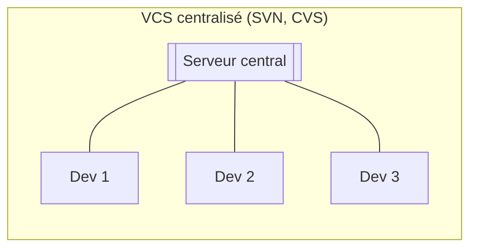

- **Centralisé** : un seul serveur détient l'historique. Si le serveur tombe, plus personne ne travaille. Si le disque meurt sans backup, tout est perdu.

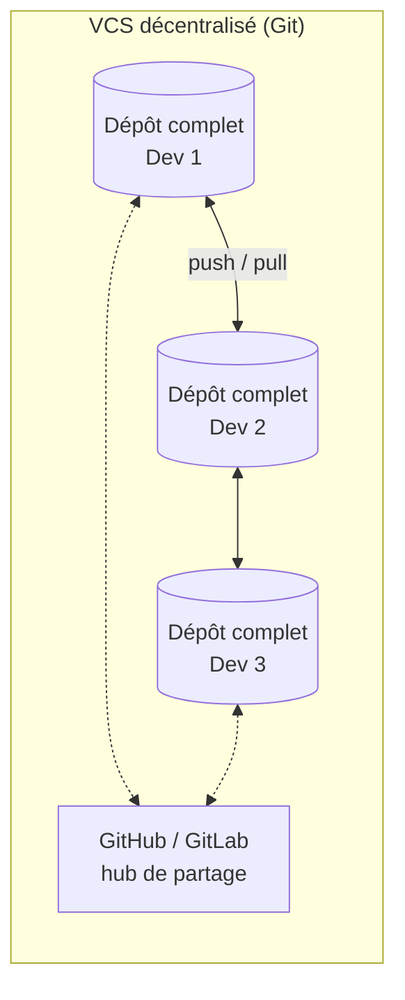

- **Décentralisé** : **chaque développeur possède l'intégralité de l'historique** en local. Le serveur (GitHub, GitLab…) n'est qu'un *hub de synchronisation*, pas une dépendance. On peut committer, brancher, consulter l'historique… hors ligne.

### 1.3 Git n'est pas GitHub

Confusion classique :

| | Git | GitHub / GitLab / Gitea |
|---|---|---|
| Nature | Outil en ligne de commande | Plateforme web qui héberge des dépôts Git |
| Dépendance | Fonctionne seul, en local | Nécessite Git |
| Exemple | `git commit` | Pull request, Issues, CI/CD |

### 1.4 La philosophie de Git : les snapshots

La grande idée de Git : **il ne stocke pas des différences, il stocke des instantanés (snapshots)**.

- Les autres VCS pensent « fichiers + patches cumulés ».
- Git pense « photo complète du projet à chaque commit », avec un mécanisme interne intelligent : si un fichier n'a pas changé entre deux commits, Git ne stocke pas une nouvelle copie, mais un **lien** vers le fichier déjà stocké.

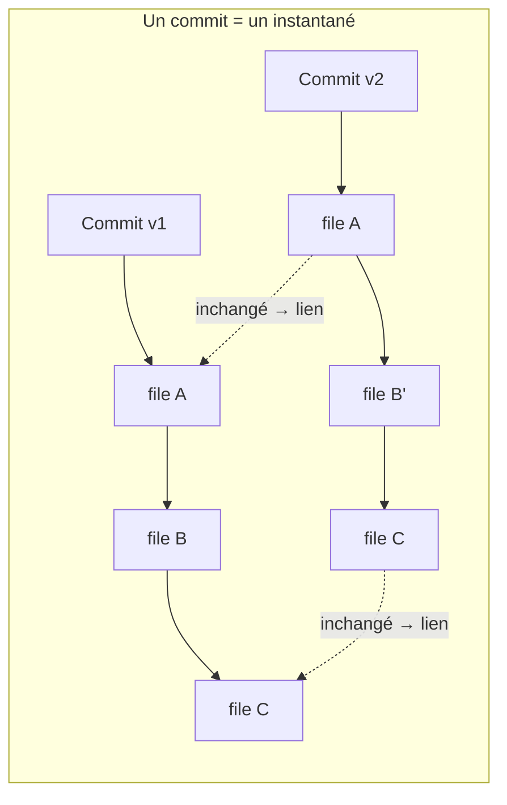

Conséquence pratique : tout dans Git est **quasi instantané** (brancher, committer, revenir en arrière), car rien ne recalcule des diffs.

### 1.5 Tout est checksummé

Git identifie chaque objet par une **empreinte SHA-1** (SHA-256 est en cours de déploiement) calculée sur son contenu. Rien ne peut être altéré sans que Git ne s'en aperçoive : **l'historique est intègre par construction**.

> 💡 C'est ce hash de 40 caractères qu'on abrège en `a1b2c3d` dans les commandes.

---

## 2. Installation et configuration

### 2.1 Installation

| OS | Méthode |
|---|---|
| Windows | [git-scm.com](https://git-scm.com) ou `winget install Git.Git` |
| Linux (Debian/Ubuntu) | `sudo apt install git` |
| macOS | `xcode-select --install` ou `brew install git` |

Vérifier :

```bash
git --version
```

### 2.2 Configuration minimale (obligatoire)

Git exige une identité pour attribuer les commits :

```bash
git config --global user.name "Prénom Nom"
git config --global user.email "vous@exemple.com"
git config --global init.defaultBranch main
```

> ⚠️ **Piège classique** : l'email doit **correspondre à un email vérifié de votre compte GitHub/GitLab**, sinon vos commits ne seront pas rattachés à votre profil (et la signature GPG n'affichera pas « Verified »).

### 2.3 Configuration recommandée

```bash
# Ne pas écraser silencieusement des modifications au pull
git config --global pull.rebase false

# Raccourcis utiles (alias)
git config --global alias.st "status -sb"
git config --global alias.lg "log --oneline --graph --decorate --all"
git config --global alias.last "log -1 --stat"

# Éditeur pour les messages de commit
git config --global core.editor "code --wait"   # VS Code
```

Consulter sa configuration :

```bash
git config --global --list
```

> 💡 **Niveaux de configuration** : `--system` (toute la machine) > `--global` (votre utilisateur) > local (un dépôt, fichier `.git/config`). Le plus spécifique gagne.

---

## 3. Le modèle mental : les trois zones

**C'est LE schéma à comprendre.** 90 % des erreurs de débutant viennent d'une confusion entre ces zones.

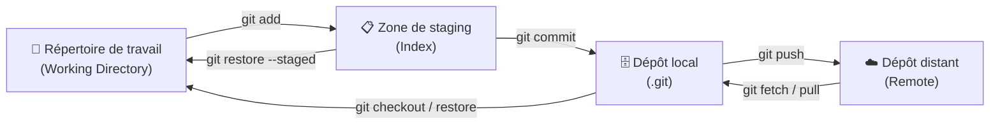

| Zone | Rôle | Question à se poser |
|---|---|---|
| **Répertoire de travail** | Vos fichiers réels, tels que vous les éditez | « Sur quoi je travaille ? » |
| **Zone de staging (index)** | Le contenu **précis** du prochain commit | « Qu'est-ce que j'inclus dans ce commit ? » |
| **Dépôt local** | L'historique immuable des commits | « Qu'est-ce qui est déjà enregistré ? » |
| **Dépôt distant** | La copie partagée (GitHub…) | « Qu'est-ce que les autres voient ? » |

### Pourquoi une zone de staging ?

C'est une **préparation du commit**, fichier par fichier, voire ligne par ligne (`git add -p`). Elle permet de construire des commits **propres et cohérents** : on ne commite pas « tout le bazar » d'un coup, mais des unités logiques.

> 🔑 **Règle d'or** : un commit = une intention. « Corriger le bug d'authentification », pas « plein de trucs ».

---

## 4. Démarrer un projet

### 4.1 Deux façons de commencer

```bash
# A) Créer un dépôt neuf à partir d'un dossier existant
cd mon-projet
git init

# B) Récupérer un projet existant (déjà connecté à son remote)
git clone git@github.com:utilisateur/depot.git
cd depot
```

### 4.2 Ce que crée `git init`

Un dossier caché **`.git/`** contenant toute la mécanique (objets, références, configuration) :

```
.git/
├── HEAD          → pointe vers la branche courante
├── config        → configuration locale du dépôt
├── objects/      → la base de données des snapshots
├── refs/         → les branches et tags
└── hooks/        → scripts automatisables
```

> ⚠️ **Piège** : supprimer le dossier `.git/` détruit tout l'historique. Le répertoire de travail, lui, reste intact.

### 4.3 HTTPS ou SSH ?

| Protocole | Avantage | Inconvénient |
|---|---|---|
| `https://github.com/...` | Simple, fonctionne partout | Demande un token / credential helper |
| `git@github.com:...` (SSH) | Aucun mot de passe après configuration | Demande une clé SSH configurée |

**Recommandation pro : SSH.** Générer une clé dédiée :

```bash
ssh-keygen -t ed25519 -C "vous@exemple.com" -f ~/.ssh/id_ed25519
```

Puis ajouter la clé publique (`~/.ssh/id_ed25519.pub`) dans *GitHub → Settings → SSH keys*, et tester :

```bash
ssh -T git@github.com
# → "Hi utilisateur! You've successfully authenticated."
```

---

## 5. Le cycle de base

### 5.1 Les quatre commandes du quotidien

```bash
git status     # Que se passe-t-il ? (LA commande réflexe)
git add        # Préparer le commit (zone de staging)
git commit     # Enregistrer un snapshot
git log        # Lire l'historique
```

### 5.2 Le cycle complet

```bash
git status                  # 1. Faire le point
git add index.html          # 2. Stager un fichier précis
git add .                   #    ou tout le dossier courant
git add -p                  #    ou hunk par hunk (mode interactif) ⭐
git commit -m "feat: ajout du formulaire de contact"   # 3. Committer
git log --oneline           # 4. Vérifier l'historique
```

### 5.3 Lire `git status`

```
On branch main
Changes to be committed:          # déjà stagé → ira dans le prochain commit
        modified:   index.html

Changes not staged for commit:    # modifié mais PAS stagé
        modified:   app.js

Untracked files:                  # nouveau fichier que Git ignore totalement
        notes.txt
```

> 💡 `git status -sb` donne une version compacte avec la branche et l'avance/retard sur le remote.

### 5.4 Comparer : `git diff`

```bash
git diff                  # répertoire de travail ↔ zone de staging
git diff --staged         # zone de staging ↔ dernier commit
git diff main..feature    # entre deux branches
git diff a1b2c3d~1 a1b2c3d  # ce qu'a changé un commit précis
```

> ⚠️ **Piège** : `git diff` seul ne montre **pas** ce qui est déjà stagé. Pensez à `git diff --staged` avant de committer.

### 5.5 Lire l'historique

```bash
git log                          # complet (q pour quitter)
git log --oneline --graph --all --decorate   # LE rendu lisible ⭐
git log -3                       # les 3 derniers
git log --author="Enzo"          # filtrer par auteur
git log --grep="bug"             # filtrer par message
git log -p fichier.txt           # avec les diffs
```

```
* f1c54a4 (HEAD -> main, origin/main) test: vérification badge Verified
* 76b50cc docs: correction identité de commit
* 96ca27f docs: signature GPG + auth SSH
* 596dd4a Initial commit: README
```

> 💡 Avec l'alias `git lg` (section 2.3), l'historique devient un outil de lecture quotidien.

---

## 6. Anatomie d'un commit

### 6.1 Qu'est-ce qu'un commit, exactement ?

Un commit est un **objet immuable** contenant :

| Champ | Contenu |
|---|---|
| **Tree** | L'instantané complet du projet (pointeur vers l'arborescence) |
| **Parent(s)** | Le(s) commit(s) précédent(s) — 0 pour le premier, 2 pour une fusion |
| **Auteur / Committeur** | Nom + email + date |
| **Message** | Le *pourquoi* du changement |
| **SHA-1** | L'empreinte calculée sur tout le reste |

**Conséquence fondamentale** : chaque commit dépend cryptographiquement de son parent. On ne peut donc **pas modifier un ancien commit sans changer tous ses descendants** — d'où les mécanismes `rebase`, `amend`, `reset` que l'on verra.

### 6.2 Écrire un bon message

Format conventionnel (Conventional Commits) :

```
<type>: <description courte au présent, < 50 caractères>

[corps optionnel : le pourquoi, les conséquences, ligne ≤ 72 caractères]

[footers : refs #123, BREAKING CHANGE: ...]
```

Types courants : `feat`, `fix`, `docs`, `refactor`, `test`, `chore`, `ci`.

**Exemple bon** :

```
fix: rejection de la connexion quand le token expire

Le middleware ne rafraîchissait pas le token JWT avant
l'appel API, provoquant une 401 toutes les 15 minutes.

Refs: #42
```

**Exemples mauvais** : `fix`, `modifs`, `wip`, `ça marche`.

> 🔑 **Règle** : le message décrit le **pourquoi**, le diff décrit déjà le **quoi**.

### 6.3 Modifier le dernier commit

```bash
# Oubli d'un fichier dans le dernier commit :
git add fichier-oublié
git commit --amend --no-edit

# Corriger le message :
git commit --amend -m "fix: nouveau message"
```

> ⚠️ **Piège majeur** : `--amend` **remplace** le commit par un nouveau (nouveau SHA). Si le commit a déjà été **poussé et partagé**, ne l'amendez pas — utilisez un nouveau commit correctif. (Voir §11 et §20.)

---

## 7. Les dépôts distants (remotes)

### 7.1 Vocabulaire

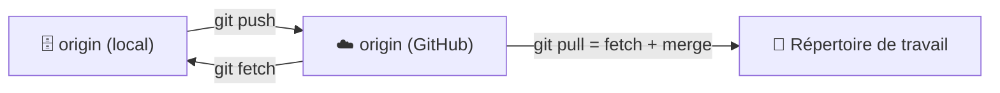

- **`origin`** : nom par défaut du remote principal (simple convention, pas magique).
- **`upstream`** : nom usuel du dépôt d'origine quand on travaille sur un fork.
- **`git fetch`** : *rapporter* les nouveautés du remote **sans toucher** à votre travail.
- **`git pull`** : `fetch` + intégration (merge ou rebase) dans votre branche.
- **`git push`** : *envoyer* vos commits locaux vers le remote.

### 7.2 Les commandes

```bash
git remote -v                       # lister les remotes
git remote add origin git@github.com:user/depot.git   # ajouter un remote
git fetch origin                    # rapatrier sans fusionner
git pull                            # rapatrier ET intégrer
git push -u origin main             # premier push (+ lien de suivi)
git push                            # ensuite, tout court
git branch -vv                      # voir les liens de suivi (tracking)
```

### 7.3 Scénario : divergence

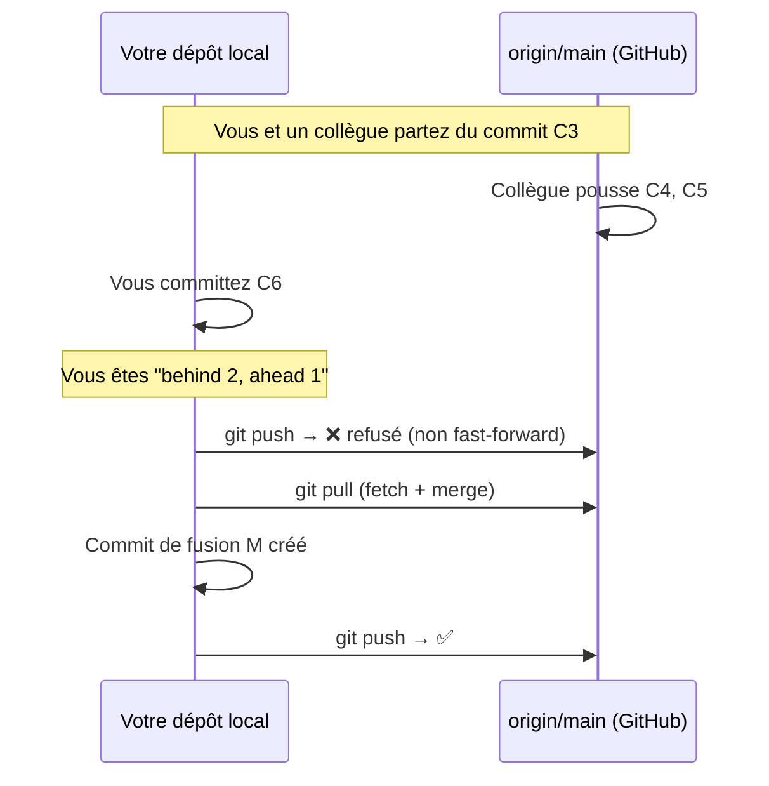

> 💡 **Bonne habitude** : `git pull --rebase` garde un historique linéaire (pas de commits de fusion « Merge branch 'main' of… » en pagaille). Pour l'activer par défaut : `git config --global pull.rebase true`.

---

## 8. Les branches

### 8.1 Qu'est-ce qu'une branche dans Git ?

Révélation : **une branche Git n'est qu'un pointeur de 41 octets vers un commit.** Pas de copie de dossier, pas de duplication. Créer une branche est instantané et gratuit.

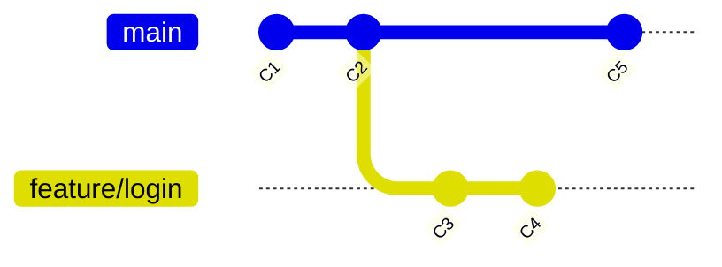

- `main` pointe vers `C5`, `feature/login` pointe vers `C4`.
- **`HEAD`** est le pointeur qui indique *où vous êtes* : il désigne la branche courante, qui désigne le dernier commit.

```bash
git branch              # lister (+ quelle branche est active)
git branch -a           # y compris les branches distantes
git switch -c feature/login    # créer ET basculer ⭐ (moderne)
git switch main                # revenir sur main
git branch -d feature/login    # supprimer (fusionnée uniquement)
git branch -D feature/login    # forcer la suppression
```

> 💡 Les commandes `git checkout -b` / `git checkout <branche>` sont l'ancienne syntaxe. `git switch` (branches) et `git restore` (fichiers) existent depuis Git 2.23 pour lever l'ambiguïté — préférez-les.

### 8.2 Pourquoi brancher systématiquement ?

- `main` doit rester **stable et déployable** ;
- chaque fonctionnalité, chaque correctif vit dans **sa branche** ;
- on fusionne via **pull request / merge request** → relecture, CI, discussion.

**Nommer ses branches** : `feature/login-sso`, `fix/jwt-expiry`, `hotfix/security-patch`. Préfixe + sujet court, sans espaces ni accents.

---

## 9. Fusionner : merge

### 9.1 Fast-forward vs fusion à trois voies

**Cas 1 — Fast-forward** : `main` n'a pas bougé depuis la création de la branche → Git **avance simplement le pointeur**.

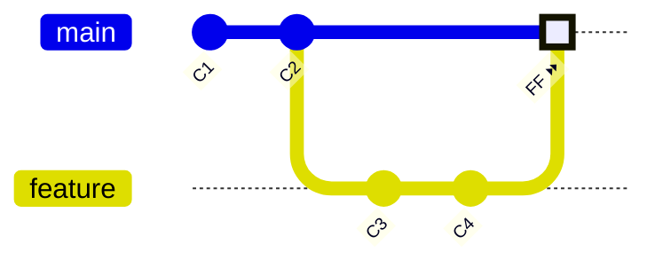

**Cas 2 — Fusion à trois voies (three-way)** : les deux branches ont divergé → Git crée un **commit de fusion** avec deux parents.

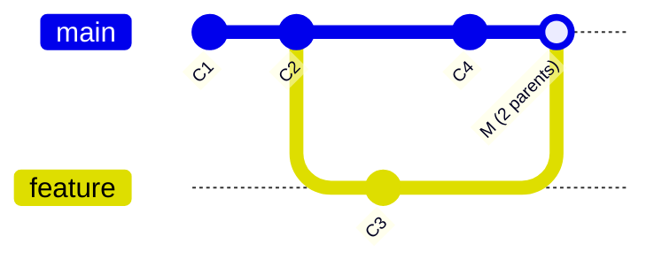

```bash
git switch main
git merge feature/login          # fusionner la branche dans main
git merge --no-ff feature/login  # forcer un commit de fusion (traçabilité)
git merge --abort                # tout annuler en cas de conflit
```

### 9.2 Les conflits : comprendre, pas paniquer

Un conflit survient quand **deux branches ont modifié les mêmes lignes**. Git ne peut pas choisir à votre place ; il marque le fichier :

```
<<<<<<< HEAD
prix = 100  # votre version (main)
=======
prix = 120  # l'autre version (feature)
>>>>>>> feature/promo
```

**Résolution, étape par étape :**

1. `git status` → liste des fichiers en conflit (*Both modified*).
2. Ouvrir chaque fichier : choisir / combiner entre les marqueurs `<<<<<<<`, `=======`, `>>>>>>>` (VS Code propose des boutons *Accept Current / Incoming / Both*).
3. `git add <fichier-résolu>` pour marquer comme résolu.
4. `git commit` → Git propose le message du commit de fusion.
5. (`git merge --abort` pour tout annuler proprement.)

> 💡 **Réflexe anti-stress** : un conflit n'est **jamais** une perte de données. Vos deux versions existent toujours, dans les deux commits parents.

---

## 10. Rebase et cherry-pick

### 10.1 Rebase : rejouer ses commits ailleurs

`git rebase` **rejoue** vos commits par-dessus une autre base. Objectif : un historique **linéaire**, sans commits de fusion.

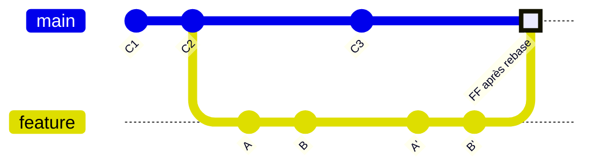

**A et B sont *réécrits*** en A' et B' (nouveaux SHA) sur la nouvelle base.

```bash
git switch feature/login
git rebase main        # rejouer mes commits sur le main à jour
# en cas de conflit : résoudre, puis git rebase --continue
git rebase --abort     # annuler, retour à l'état d'avant
```

### 10.2 La règle d'or du rebase

> 🔑 **Ne jamais rebaser une branche déjà poussée et partagée.**
> Rebasez **vos** branches locales / vos PR pas encore validées. `main` partagé, on ne le réécrit jamais.

*Gold rule (Git rebase) : ne rebase jamais une branche publique.*

### 10.3 Rebase interactif : sculpter son historique

```bash
git rebase -i HEAD~3        # retravailler mes 3 derniers commits
```

Éditeur avec les actions possibles :

| Commande | Effet |
|---|---|
| `pick` | garder le commit tel quel |
| `reword` | garder, mais modifier le message |
| `squash` | fusionner dans le commit précédent (messages combinés) |
| `fixup` | fusionner en jetant le message |
| `drop` | supprimer le commit |
| `edit` | s'arrêter sur ce commit pour le modifier |

**Cas d'usage typique** : 12 commits « wip » → 3 commits propres avant la pull request.

### 10.4 Cherry-pick : voler un commit précis

```bash
git switch release/1.4
git cherry-pick a1b2c3d     # copier CE commit sur la branche courante
```

Scénario classique : corriger un bug sur `main`, puis **porter le correctif** sur la branche de maintenance.

---

## 11. Annuler : l'art du retour arrière

### 11.1 Tableau de décision

| Situation | Commande | Danger |
|---|---|---|
| Jeter mes modifications **non committées** d'un fichier | `git restore fichier` | ⚠️ irrécupérable |
| Vider la zone de staging (dé-stager) | `git restore --staged fichier` | aucun |
| Corriger le **dernier commit** (message / oubli) | `git commit --amend` | si déjà poussé |
| Annuler le dernier commit **en gardant le travail** | `git reset --soft HEAD~1` | si déjà poussé |
| Annuler le dernier commit, jeter le code (local) | `git reset --hard HEAD~1` | ⚠️⚠️ |
| Annuler un commit **déjà poussé/partagé** | `git revert <sha>` | aucun ✅ |

### 11.2 Les trois modes de `reset`

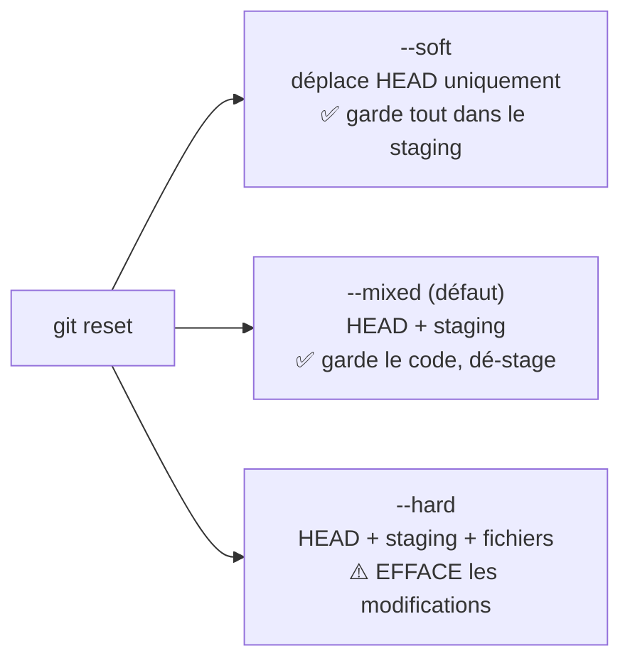

> 🔑 **Mémo** : soft = « je re-commiterai autrement », mixed = « je re-stagerai autrement », hard = « je brûle tout » — et `--hard` ne touche **pas** aux fichiers non suivis ni au stash.

### 11.3 `revert` : annuler sans réécrire l'histoire

```bash
git revert a1b2c3d     # crée un NOUVEAU commit qui fait l'inverse
git revert HEAD        # annuler le dernier
git revert a1b2c3d..c4d5e6f   # annuler une plage
```

C'est la **seule** méthode propre pour annuler sur une branche partagée : l'historique reste intact et véridique (on *voit* qu'il y a eu une annulation).

### 11.4 Scénario réel : « j'ai fait un `reset --hard` trop vite ! »

Tout n'est pas perdu — le **reflog** (§19) garde une trace de tous les déplacements de HEAD :

```bash
git reflog
# a1b2c3d HEAD@{0}: reset: moving to HEAD~1
# f9e8d7c HEAD@{1}: commit: mon travail perdu !

git reset --hard f9e8d7c    # ressusciter le commit
```

Tant que le commit n'a pas été collecté par le garbage collector (~30 jours par défaut pour les commits inaccessibles), il est récupérable.

---

## 12. Stash et worktree

### 12.1 Stash : la poché surprise

Besoin de basculer de branche **sans committer** un travail en cours ?

```bash
git stash push -m "wip: formulaire"   # ranger (le répertoire devient propre)
git stash list                        # voir les stashs
git stash pop                         # récupérer le dernier + le retirer de la pile
git stash apply stash@{2}             # récupérer un stash précis (sans le retirer)
git stash drop stash@{0}              # jeter un stash
git stash -u                          # inclure les fichiers non suivis
```

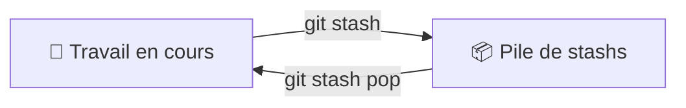

> ⚠️ **Piège** : un stash n'est pas un commit. Les stashs oubliés finissent perdus. Si le travail doit survivre à la journée → commettez sur une branche, même en `wip`.

### 12.2 Worktree : plusieurs dossiers, un seul dépôt

```bash
git worktree add ../hotfix-dir hotfix/urgent
cd ../hotfix-dir     # deuxième copie de travail, partageant le même historique
```

Utile pour corriger une urgence sans casser sa branche en cours (et sans `git stash`).

---

## 13. Les tags et releases

Un tag marque un point précis de l'historique (une version, une livraison).

```bash
git tag                          # lister
git tag v1.0.0                   # tag léger (simple marqueur)
git tag -a v1.0.0 -m "Version 1.0.0 — première mise en production"  # tag annoté ⭐
git show v1.0.0                  # détails du tag
git push origin v1.0.0           # pousser UN tag
git push --tags                  # pousser tous les tags
git tag -d v1.0.0                # supprimer localement
git push origin :refs/tags/v1.0.0   # supprimer sur le remote
```

| Tag léger | Tag annoté |
|---|---|
| Simple pointeur | Vrai objet : message, auteur, date, **signature GPG possible** |
| Pour le jetable | **Pour toute release** ⭐ |

> 💡 Sur GitHub, pousser un tag `v1.2.3` déclenche la proposition de créer une **Release** (notes de version + archive téléchargeable). Le versionnage suit [SemVer](https://semver.org/lang/fr/) : `MAJEUR.MINEUR.CORRECTIF`.

---

## 14. Le fichier .gitignore

### 14.1 Rôle et syntaxe

Le `.gitignore` (à la racine du dépôt) exclut du suivi des fichiers qui n'ont rien à y faire :

```gitignore
# Commentaire
node_modules/        # un dossier entier
*.log                # un motif d'extension
build/               # les artefacts de compilation
.env                 # les secrets ⚠️
.DS_Store            # déchets d'OS
/tmp/*               # tout dans /tmp…
!/tmp/keep-me.txt    # …sauf celui-ci (négation)
debug?.log           # ? = un caractère
**/temp              # ** = à n'importe quelle profondeur
```

### 14.2 Règles essentielles

- `.gitignore` n'agit que sur les fichiers **non suivis**. Un fichier déjà committé continue d'être suivi même s'il est ajouté au `.gitignore`. Pour l'oublier : `git rm --cached fichier` puis commit.
- On **commite toujours** le `.gitignore` lui-même.
- Modèles prêts à l'emploi : [github.com/github/gitignore](https://github.com/github/gitignore).
- Un `.gitignore` peut exister par sous-dossier (il s'applique à son arborescence).

> ⚠️ **Piège de sécurité** : jamais de `.env`, clés privées, tokens dans un dépôt — même privé, même « temporairement ». Une clé poussée est une clé compromise (rotation obligatoire).

### 14.3 Les niveaux d'exclusion

```bash
.git/info/exclude     # local à votre clone, non commité
~/.gitignore_global   # vos exclusions perso sur tous les dépôts
```

---

## 15. Les hooks Git

Les hooks sont des **scripts déclenchés automatiquement** à des moments clés (dans `.git/hooks/`, renommez `*.sample` pour activer).

| Hook | Moment | Usage typique |
|---|---|---|
| `pre-commit` | avant la création du commit | linter, formater le code, bloquer les secrets |
| `commit-msg` | validation du message | imposer les Conventional Commits |
| `pre-push` | avant le push | lancer les tests |
| `post-merge` | après un pull/merge | réinstaller les dépendances |

Exemple de `pre-commit` qui bloque les secrets :

```bash
#!/bin/sh
if git diff --cached | grep -E "(PASSWORD|API_KEY|SECRET)="; then
  echo "❌ Secret détecté dans le commit !"
  exit 1
fi
```

> ⚠️ Les hooks ne sont **pas** versionnés avec le dépôt (ils vivent dans `.git/`). Pour les partager : gestionnaire de hooks comme **pre-commit** (Python) ou **husky** (Node), qui les synchronise depuis un fichier commité.

---

## 16. Les submodules

Un submodule permet d'inclure **un autre dépôt Git à l'intérieur du vôtre**, à un commit précis.

```bash
git submodule add git@github.com:org/bibliotheque.git libs/bibliotheque
git clone --recurse-submodules git@github.com:org/projet.git   # cloner AVEC les submodules
git submodule update --init --recursive                        # ou, après un clone classique
git submodule update --remote                                  # mettre à jour
```

À savoir :

- Le dépôt parent référence le submodule par **SHA exact** (pas par branche) — reproductibilité garantie.
- Cloner un projet avec submodules sans `--recurse-submodules` laisse des dossiers **vides** — piège classique.
- Alternative moderne : gestionnaire de paquets (npm, pip…) ou, à terme, remplacer par des sous-dossiers simples quand la dépendance est étroitement couplée.

---

## 17. Signer ses commits (SSH / GPG)

### 17.1 Le problème

Le champ « auteur » d'un commit est **du texte libre** : n'importe qui peut écrire n'importe quel nom et email. Sans signature, GitHub ne peut pas prouver que c'est bien *vous*.

### 17.2 La solution

Signer le commit avec votre clé privée ; GitHub vérifie avec votre clé publique et affiche le badge **Verified** :

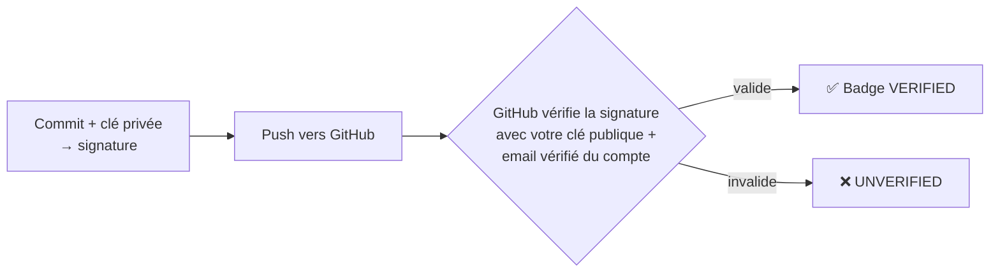

### 17.3 Deux méthodes reconnues par GitHub

**Avec GPG** (clé dédiée signature) :

```bash
gpg --batch --quick-gen-key "Prénom Nom <vous@exemple.com>" ed25519 sign never
gpg --list-secret-keys --keyid-format long     # récupérer le KEY ID
git config --global user.signingkey <KEY_ID>
git config --global commit.gpgsign true        # signature automatique ⭐
```

**Avec votre clé SSH** (Git 2.34+, plus simple si vous avez déjà une clé SSH) :

```bash
git config --global gpg.format ssh
git config --global user.signingkey ~/.ssh/id_ed25519.pub
git config --global commit.gpgsign true
```

Puis déclarer la clé publique comme *Signing key* dans *GitHub → Settings → SSH and GPG keys*.

### 17.4 Les trois conditions du badge « Verified »

1. L'**email du commit** correspond à un email **vérifié** de votre compte GitHub ;
2. La **clé publique** (avec le bon uid) est enregistrée sur votre compte ;
3. Le commit est **signé** avec la clé privée correspondante.

> 💡 **Retour d'expérience réel** : une lettre de différence dans l'email (`efoure1` vs `efoures1`) ou une clé mise à jour après ajout des uid suffisent à rétrograder en « Unverified ». En cas de doute, `git log --show-signature` vérifie localement que la signature est bonne.

---

## 18. Les workflows d'équipe

### 18.1 GitHub Flow (le plus simple ⭐ recommandé pour démarrer)

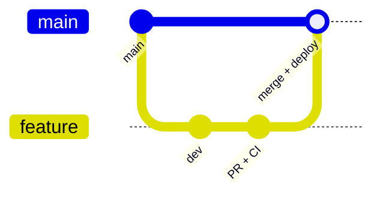

1. `main` est toujours **déployable** ;
2. toute modification part d'une **branche** ;
3. ouverture d'une **pull request** → revue + CI ;
4. fusion dans `main` → déploiement.

**Pour qui** : équipes petites/moyennes, déploiements continus. C'est le standard des projets web modernes.

### 18.2 GitFlow (structuré, pour versions packagées)

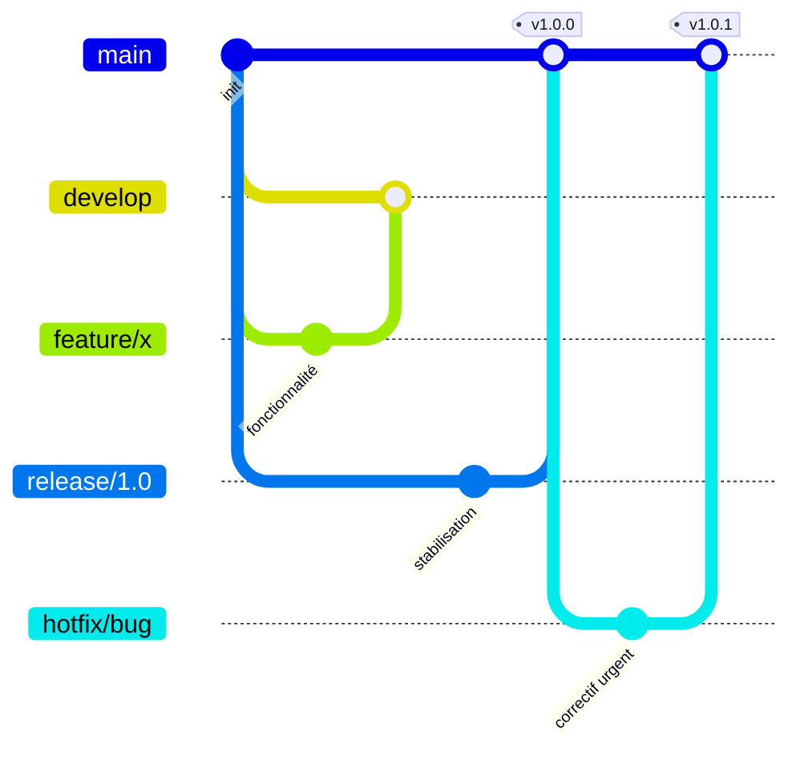

Branches permanentes : `main` (production) + `develop` (intégration). Branches temporaires : `feature/*`, `release/*`, `hotfix/*`.

**Pour qui** : logiciels versionnés avec maintenance de plusieurs versions (bibliothèques, embarqué, applications installées). Plus lourd — à éviter si vous pouvez faire du GitHub Flow.

### 18.3 Trunk-Based Development

Tout le monde commite sur `main` (ou des branches de vie **très courte**, < 1-2 jours), protégé par feature flags. Standard des équipes qui pratiquent l'intégration continue à haute fréquence.

### 18.4 Choisir

| Contexte | Workflow |
|---|---|
| Projet perso / SaaS web / CI-CD | **GitHub Flow** |
| Logiciel versionné, support multi-versions | GitFlow |
| Équipe mature, déploiements multiples/jour | Trunk-Based |

---

## 19. Outils d'investigation : bisect, blame, reflog

### 19.1 `git bisect` : la recherche dichotomique du bug

Un bug est apparu « quelque part » parmi 500 commits ? Git le retrouve en ~9 étapes :

```bash
git bisect start
git bisect bad                  # l'état actuel est cassé
git bisect good v1.2.0          # cette version marchait
# Git vous place sur un commit intermédiaire : testez, puis :
git bisect bad                  # ou git bisect good
# ... jusqu'à : "a1b2c3d is the first bad commit"
git bisect reset                # revenir à la réalité
```

> 💡 Automatisable : `git bisect run ./test.sh` rejoue le script sur chaque commit.

### 19.2 `git blame` : qui a écrit cette ligne ?

```bash
git blame fichier.txt
git blame -L 10,20 fichier.txt   # seulement les lignes 10 à 20
git blame -w fichier.txt         # en ignorant les changements d'espaces
```

> ⚠️ À utiliser pour **comprendre**, pas pour accuser. Un `blame` qui désigne quelqu'un révèle souvent un refactoring mécanique, pas une faute.

### 19.3 `git reflog` : la boîte noire

Tous les mouvements de HEAD sont enregistrés localement (90 jours par défaut) :

```bash
git reflog
# f1c54a4 HEAD@{0}: commit: test badge
# 76b50cc HEAD@{1}: commit: correction identité
# a1b2c3d HEAD@{2}: reset: moving to HEAD~1   ← l'accident d'hier

git reset --hard HEAD@{1}       # remonter le temps
```

**C'est votre assurance-vie** : reset --hard, rebase raté, branche supprimée… presque tout se récupère via le reflog.

### 19.4 Fouiller dans l'historique

```bash
git log -S "nomDeFonction"        # commits qui ajoutent/retirent cette chaîne
git log --follow fichier.txt      # historique même après renommage
git grep "TODO" $(git rev-list --all | head -50)  # chercher dans l'historique
```

---

## 20. Bonnes pratiques et pièges classiques

### 20.1 Les 10 commandements

1. **Committez petit, commitez souvent** — un commit par intention.
2. **Message au présent, descriptif** — « fix: corriger X », pas « fix ».
3. **Ne committez jamais de secrets** (`.env`, clés, mots de passe).
4. **Pull avant de push** (et avant de commencer la journée).
5. **Ne réécrivez jamais l'histoire partagée** (amend/rebase sur du déjà-poussé = interdit).
6. **Branchez pour chaque fonctionnalité** — `main` reste stable.
7. **Lisez `git status` et `git diff --staged` avant chaque commit.**
8. **Les branches ne sont pas gratuites en charge mentale** : supprimez-les une fois fusionnées.
9. **Taggez vos livraisons** (tags annotés).
10. **Le reflog existe** — pas de panique, presque tout se récupère.

### 20.2 Les pièges du tableau

| Piège | Symptôme | Remède |
|---|---|---|
| « Rejected non-fast-forward » au push | Le remote a des commits que vous n'avez pas | `git pull --rebase` puis re-push. **Jamais de `--force` sans accord d'équipe.** |
| Modifications d'un collègue invisibles | Vous n'avez pas fetch/pull | `git pull`, vérifier `git branch -vv` |
| Un fichier reste modifié malgré le .gitignore | Il était déjà suivi | `git rm --cached fichier` + commit |
| Conflits en cascade à chaque merge | Branches qui divergent trop longtemps | Fusionner/rebaser souvent, petites branches |
| `fatal: not a git repository` | Vous êtes hors du dossier projet (ou `.git/` absent) | `cd` au bon endroit / `git init` |
| Commits en double après un rebase mal négocié | Rebase sur branche déjà poussée puis push | `git push --force-with-lease` (et revoir la règle d'or §10.2) |
| « detached HEAD » | Vous êtes sur un commit, pas une branche | `git switch -c nouvelle-branche` pour garder le travail, ou `git switch main` |

### 20.3 `--force` vs `--force-with-lease`

```bash
git push --force-with-lease   # ⭐ écrase SAUF si quelqu'un a poussé entre-temps
git push --force              # ☢️ écrase tout, sans condition
```

`--force-with-lease` est le seul `--force` acceptable en équipe.

---

## 21. Aide-mémoire (cheat sheet)

### Le quotidien

```bash
git status -sb                    # où en suis-je ?
git add -p                        # stager finement
git commit -m "feat: ..."         # committer
git lg                            # historique graphique (alias)
git pull --rebase                 # se mettre à jour
git push                          # publier
```

### Branches

```bash
git switch -c feature/x           # créer + basculer
git switch main                   # retour sur main
git merge feature/x               # fusionner
git branch -d feature/x           # supprimer
git branch -a                     # lister tout
```

### Se sortir de tous les troubles

```bash
git restore fichier               # jeter mes modifs locales
git restore --staged fichier      # dé-stager
git commit --amend                # corriger le dernier commit
git reset --soft HEAD~1           # dé-commitrer en gardant le staging
git revert <sha>                  # annuler un commit (historique intact)
git reflog                        # retrouver un état perdu
git stash / git stash pop         # mettre de côté / récupérer
git merge --abort                 # abandonner une fusion
git rebase --abort                # abandonner un rebase
```

### Investiguer

```bash
git log --oneline --graph --all   # la carte
git show <sha>                    # le détail d'un commit
git diff main..feature            # comparer des branches
git blame -L 10,20 fichier        # qui a écrit quoi
git bisect start                  # traquer un bug par dichotomie
```

---

## 22. Exercices et scénarios corrigés

### Exercice 1 — Le premier cycle ⭐

1. Créez un dossier `exo-git`, initialisez un dépôt, branche par défaut `main`.
2. Créez `README.md`, commitez-le.
3. Modifiez le fichier, observez `git status` et `git diff`.
4. Stagez les modifications, commitez avec un message conventionnel.
5. Affichez l'historique en graphique.

<details>
<summary>✅ Correction</summary>

```bash
mkdir exo-git && cd exo-git
git init
echo "# Exo Git" > README.md
git add README.md && git commit -m "docs: initialisation du projet"
echo "Nouvelle ligne" >> README.md
git status && git diff
git add README.md && git commit -m "docs: ajout d'une ligne de démonstration"
git log --oneline --graph --all
```
</details>

### Exercice 2 — Branche et conflit

1. Depuis `main`, créez `feature/tva`.
2. Dans `feature/tva` : modifiez la ligne `prix = 100` en `prix = 120` dans `config.txt`, committez.
3. Revenez sur `main`, modifiez la **même** ligne en `prix = 110`, committez.
4. Fusionnez `feature/tva` dans `main` → conflit !
5. Résolvez en gardant `prix = 125` (les deux intentions), commitez.

<details>
<summary>✅ Correction</summary>

```bash
git switch -c feature/tva
echo "prix = 120" > config.txt
git commit -am "feat: applique la TVA"

git switch main
echo "prix = 110" > config.txt
git commit -am "fix: remise à jour du prix"

git merge feature/tva          # CONFLICT (content): Merge conflict in config.txt

# Éditer config.txt → ne garder qu'une ligne : prix = 125
echo "prix = 125" > config.txt
git add config.txt
git commit                     # commit de fusion
git branch -d feature/tva
```
</details>

### Exercice 3 — L'incident de prod 🚨

Scénario : vous venez de pousser sur `main` un commit qui **supprime par erreur** le fichier `config/production.yml`. Le dépôt est partagé, 3 collègues ont déjà pullé.

1. Retrouvez le SHA du commit incriminé.
2. Annulez-le **sans réécrire l'historique**.
3. Poussez, vérifiez que le fichier est revenu.

<details>
<summary>✅ Correction</summary>

```bash
git log --oneline -- config/production.yml   # identifier le commit fautif
git revert <sha-du-commit-fautif>            # commit d'annulation
git push
git show HEAD:config/production.yml          # vérifier le retour du fichier
```

Pourquoi pas `reset --hard` + `push --force` ? Parce que l'historique est **partagé** : réécrire casserait les clones des collègues. `revert` ajoute la vérité (une erreur a eu lieu, elle est annulée) sans mentir sur le passé.
</details>

### Exercice 4 — Le sauvetage au reflog 🚑

1. Committez un fichier `tresor.txt` (« mon travail de 3 heures »).
2. `git reset --hard HEAD~1` — le travail a « disparu ».
3. Retrouvez-le et restaurez-le.

<details>
<summary>✅ Correction</summary>

```bash
git reflog                            # repérer le SHA du commit "tresor"
git reset --hard <sha-retrouvé>       # ou : git checkout -b sauvetage <sha>
cat tresor.txt                        # il est revenu
```
</details>

### Exercice 5 — Nettoyage avant pull request

Votre branche `feature/api` contient : `A` (bon), `B` (« fix typo »), `C` (« wip »), `D` (« vraiment fini »). Objectif : A propre, B+D fusionnés en un commit « feat: API clients », C jeté.

<details>
<summary>✅ Correction</summary>

```bash
git rebase -i main        # ou git rebase -i HEAD~4

# Dans l'éditeur :
# pick   A
# fixup  B        ← fusionné dans A ? Non : B est "fix typo" de A → squash/fixup
# drop   C        ← le wip est jeté
# squash D        ← fusionné avec le précédent, on rédige le message
# (adapter : pick A, fixup B, drop C, squash D)

git push --force-with-lease origin feature/api   # branche déjà poussée → avec lease
```
</details>

---

## 23. Glossaire

| Terme | Définition |
|---|---|
| **Branche** | Pointeur mobile vers un commit ; ligne de développement indépendante |
| **Clone** | Copie complète d'un dépôt (historique + fichiers + remotes) |
| **Commit** | Instantané signé (haché) de l'état du projet, lié à son parent |
| **Dépôt (repository)** | La base de données `.git/` + le répertoire de travail |
| **Detached HEAD** | État où HEAD pointe sur un commit au lieu d'une branche |
| **Fast-forward** | Fusion sans divergence : simple avancée du pointeur |
| **HEAD** | Pointeur vers la branche/le commit où vous vous trouvez |
| **Index / staging** | Zone de préparation du prochain commit |
| **Merge** | Combinaison de deux historiques (commit à 2 parents en cas de divergence) |
| **Origin** | Nom conventionnel du remote principal |
| **Pull request (PR) / Merge request (MR)** | Demande de fusion revue sur la plateforme (GitHub/GitLab) |
| **Rebase** | Rejoue des commits sur une nouvelle base (réécrit leur SHA) |
| **Reflog** | Journal local de tous les mouvements de HEAD |
| **Remote** | Copie du dépôt sur un autre serveur (GitHub, GitLab…) |
| **Résolution de conflit** | Choix manuel du contenu final quand deux versions s'affrontent |
| **Révision / SHA** | Identifiant unique d'un commit (hash de 40 caractères, abrégé) |
| **Snapshot** | Photo complète de l'arborescence enregistrée par un commit |
| **Stash** | Rangement temporaire de modifications non committées |
| **Tag** | Marqueur nommé sur un commit (version, livraison) |
| **Three-way merge** | Fusion à 3 sources : les 2 branches + leur ancêtre commun |
| **Tracking (upstream)** | Lien entre une branche locale et sa contrepartie distante |
| **Working directory** | Vos fichiers, tels que vous les éditez |

---

> 📚 **Pour aller plus loin** :
> - [Pro Git](https://git-scm.com/book/fr/v2) — le livre officiel, gratuit, en français ;
> - [Learn Git Branching](https://learngitbranching.js.org/?locale=fr_FR) — exercices visuels interactifs (excellent) ;
> - [Conventional Commits](https://www.conventionalcommits.org/fr/) ;
> - [Oh Shit, Git!?!](https://dangitgit.com/fr) — les accidents courants et leurs remèdes.
