# Kubernetes — Le cours complet

   -purple)

> Cours à jour (Kubernetes **1.36** — branches supportées 1.34/1.35/1.36, kubectl 2026, Gateway API en montée, k3s 1.36 pour le lab). Kubernetes orchestre des **conteneurs** : il décide où ils tournent, les répare quand ils meurent, et expose leur état voulu en **YAML déclaratif**.
> Exercices pratiques : [dossier `exercices/`](../exercices/).

---

## 🧭 Parcours de lecture

| Vous êtes… | Parcours | Parties | Durée estimée |
|---|---|---|---|
| 🌱 **Débutant** | Pourquoi K8s + architecture + kubectl + Pods | 1 → 4 | ≈ 3 h |
| 🌿 **Praticien** | Deployments, Services, config, réseau, stockage | 5 → 11 | ≈ 4 h |
| 🚀 **Confirmé** | Probes, scheduling, autoscaling, RBAC, écosystème | 12 → 17 | ≈ 3 h |
| 🔍 **Révision rapide** | Scénarios + dépannage + cheat sheet | 18 → 20 | ≈ 40 min |

💡 **Méthode** : le YAML est la langue de Kubernetes — chaque partie montre des manifests à jouer sur un cluster (k3s, minikube ou kind). Kubernetes s'apprend en regardant ses Pods mourir, pas en lisant.

---

## Table des matières

- [x] [1. Pourquoi Kubernetes : du conteneur à l'orchestration](#1-pourquoi-kubernetes--du-conteneur-à-lorchestration)
- [x] [2. L'architecture : control plane et workers](#2-larchitecture--control-plane-et-workers)
- [x] [3. kubectl et le modèle déclaratif](#3-kubectl-et-le-modèle-déclaratif)
- [x] [4. Les Pods : l'unité de base](#4-les-pods--lunité-de-base)
- [x] [5. Deployments et ReplicaSets : les applications sans état](#5-deployments-et-replicasets--les-applications-sans-état)
- [x] [6. Les Services : un réseau stable pour des Pods éphémères](#6-les-services--un-réseau-stable-pour-des-pods-éphémères)
- [x] [7. ConfigMaps et Secrets : la configuration](#7-configmaps-et-secrets--la-configuration)
- [x] [8. Namespaces et quotas : découper le cluster](#8-namespaces-et-quotas--découper-le-cluster)
- [x] [9. Le réseau : CNI, DNS, communication](#9-le-réseau--cni-dns-communication)
- [x] [10. Ingress et Gateway API : exposer au monde](#10-ingress-et-gateway-api--exposer-au-monde)
- [x] [11. Le stockage : volumes, PV, PVC, StorageClass](#11-le-stockage--volumes-pv-pvc-storageclass)
- [x] [12. La santé des Pods : probes, ressources, QoS](#12-la-santé-des-pods--probes-ressources-qos)
- [x] [13. Le scheduling : où tournent mes Pods ?](#13-le-scheduling--où-tournent-mes-pods-)
- [x] [14. L'autoscaling : HPA, VPA, Cluster Autoscaler](#14-lautoscaling--hpa-vpa-cluster-autoscaler)
- [x] [15. Workloads spécialisés : StatefulSet, DaemonSet, Jobs](#15-workloads-spécialisés--statefulset-daemonset-jobs)
- [x] [16. Sécurité : RBAC, service accounts, contextes](#16-sécurité--rbac-service-accounts-contextes)
- [x] [17. Distributions et écosystème : k3s, Helm, GitOps](#17-distributions-et-écosystème--k3s-helm-gitops)
- [x] [18. Kubernetes en entreprise : scénarios réels](#18-kubernetes-en-entreprise--scénarios-réels)
- [x] [19. Pièges classiques et dépannage](#19-pièges-classiques-et-dépannage)
- [x] [20. Aide-mémoire, exercices corrigés et glossaire](#20-aide-mémoire-exercices-corrigés-et-glossaire)

---

## 1. Pourquoi Kubernetes : du conteneur à l'orchestration

### 1.1 Le problème que Docker ne résout pas

Le cours [Docker](../docker/cours-docker.md) s'arrête là où commence le vrai monde : un conteneur vit sur **un hôte**. Dès que vous avez 30 conteneurs sur 5 machines, il faut décider : lequel tourne où ? Qui redémarre celui qui crashe ? Comment les utilisateurs atteignent-ils le bon conteneur quand son IP change à chaque recréation ?

| Besoin | Docker Engine seul | Kubernetes |
|---|---|---|
| Redémarrer un conteneur mort | `--restart` sur l'hôte | ✅ auto, sur n'importe quel nœud sain |
| Répartir N instances sur M machines | ❌ à la main | ✅ le scheduler décide |
| IP stable + répartition de charge | ❌ | ✅ Services |
| Scaling sans interruption | recréation manuelle | ✅ rolling update natif |
| Déclaratif : « voici l'état voulu » | ❌ impératif (`docker run`) | ✅ manifests YAML versionnés |

> [!IMPORTANT]
> **Kubernetes est au conteneur ce que le playbook Ansible est à la commande manuelle** : une description déclarative de l'état voulu, reconciliée en permanence par un contrôleur. Vous ne lancez pas des conteneurs ; vous déclarez « je veux 3 répliques de cette image » et le cluster fait le reste — indéfiniment.

### 1.2 La boucle de reconciliation : le concept central

Tout Kubernetes repose sur une boucle unique, répétée par chaque composant :

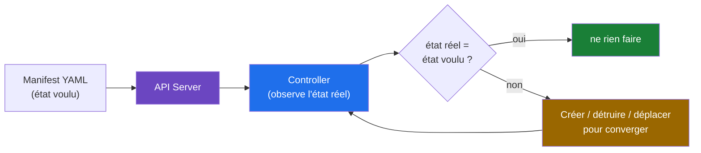

> [!TIP]
> Comprenez cette boucle et vous comprendrez tout : pourquoi un Pod supprimé « revient » (le Deployment le recrée), pourquoi modifier un Pod à la main est vain (le contrôleur le réaligne), pourquoi les manifests versionnés dans Git sont la vraie source de vérité.

### 1.3 Ce que ce cours couvre (et pas)

Ce cours couvre l'usage d'un cluster Kubernetes : workloads, réseau, stockage, sécurité, dépannage. La **création** de conteneurs (Dockerfile, images) est traitée dans le cours Docker ; le provisionnement des machines (Terraform) et l'installation des OS (Ansible) restent en amont.

### 🎯 Quiz — partie 1

1. Quel problème central Kubernetes résout par rapport à Docker Engine seul ?
2. Que fait un contrôleur quand l'état réel diverge de l'état voulu ?
3. Pourquoi modifier un Pod à la main (`kubectl edit pod`) est-il une fausse bonne idée ?

<details><summary>✅ Réponses</summary>

1. L'orchestration multi-hôtes : placement, auto-réparation, découverte, load balancing, rolling updates — tout ce que Docker sur un hôte unique ne sait pas faire.
2. Il agit pour converger : il crée/détruit/déplace les objets nécessaires jusqu'à l'égalité, puis continue d'observer.
3. Parce que le contrôleur propriétaire (Deployment…) va écraser votre modification pour réaligner le Pod sur son état voulu — la vraie correction passe par le manifest.
</details>

---

## 2. L'architecture : control plane et workers

### 2.1 Les deux populations de machines

Un cluster = des nœuds **maîtres** (control plane : le cerveau) et des nœuds **workers** (les muscles, où tournent les conteneurs).

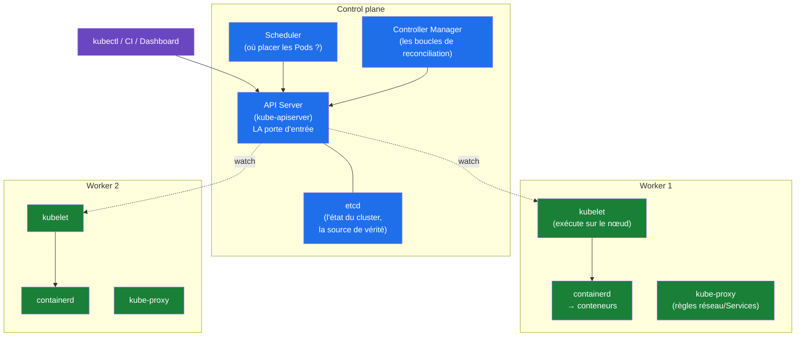

| Composant | Nœud | Rôle en une phrase |
|---|---|---|
| **API Server** | control plane | La seule porte : tout (kubectl, CI, kubelets) passe par lui |
| **etcd** | control plane | La base de données clé-valeur qui stocke l'état du cluster |
| **Scheduler** | control plane | Pour chaque Pod sans nœud : choisit le nœud (ressources, affinités) |
| **Controller Manager** | control plane | Fait tourner les contrôleurs (Deployments, Nodes, Jobs…) |
| **kubelet** | worker | L'agent qui crée réellement les conteneurs et rend compte à l'API |
| **containerd** | worker | Le runtime qui lance les conteneurs (images, namespaces) |
| **kube-proxy** | worker | Programme les règles réseau qui réalisent les Services |

> [!NOTE]
> **Tout passe par l'API Server** : `kubectl`, votre CI, le scheduler lui-même. C'est un design d'API REST : « lire/écrire des objets » — le reste n'est que des contrôleurs qui regardent ces objets et agissent. C'est aussi pourquoi on peut tout faire par l'API (CI/CD, GitOps).

### 2.2 Production : combien de control planes ?

- **1 nœud control plane** : lab, dev. L'indisponibilité du control plane ne tue pas les applications (elles continuent de tourner), mais interdit tout changement.
- **3 nœuds** (haute dispo) : la norme production — etcd en quorum, perte d'un nœud tolérée.
- **Managed control plane** (EKS/AKS/GKE) : l'opérateur du cloud gère le control plane ; vous ne payez/administrez que les workers.

### 2.3 Les distributions : comment on « obtient » Kubernetes

| Distribution | Usage | Pourquoi la choisir |
|---|---|---|
| **k3s** | lab, edge, IoT | Un binaire, RAM minimale, Traefik + flannel + local-path-provisioner embarqués |
| **kubeadm** | clusters « à la main » | La voie officielle, pédagogique, bare-metal |
| **minikube / kind** | poste de dev | Cluster jetable local pour apprendre et tester |
| **EKS / AKS / GKE** | production cloud | Control plane managé, intégrations cloud natives |

### 🎯 Quiz — partie 2

1. Quel composant est la seule porte d'entrée du cluster, et qui l'emprunte ?
2. Que se passe-t-il pour les applications si le control plane tombe ?
3. Pourquoi 3 nœuds control plane en production plutôt que 1 ?

<details><summary>✅ Réponses</summary>

1. L'**API Server** : kubectl, la CI, le dashboard, et même les kubelets des nœuds — tout le monde parle à l'API, jamais directement à etcd ou aux kubelets.
2. Rien de plus : les conteneurs tournent toujours. Mais plus de scheduling, plus de changements, plus d'auto-réparation — et si un nœud meurt pendant ce temps, ses Pods ne sont pas replacés.
3. Pour la haute disponibilité d'**etcd** : le quorum exige une majorité (2/3), donc 3 nœuds tolèrent la panne d'1. Un seul nœud = SPOF de tout le cerveau.
</details>

---

## 3. kubectl et le modèle déclaratif

### 3.1 L'objet API : la brique universelle

Tout dans Kubernetes est un **objet API** avec la même tête : `apiVersion`, `kind`, `metadata`, `spec` (l'état voulu), `status` (l'état réel, rempli par le système).

```yaml
apiVersion: v1                # groupe+version de l'API
kind: Pod                     # le type d'objet
metadata:                     # identité : nom, labels, namespace
  name: mon-pod
  labels:
    app: web
spec:                         # ← VOUS écrivez ici l'état voulu
  containers:
    - name: nginx
      image: nginx:1.27
status:                       # ← le SYSTÈME remplit (ne jamais écrire)
  phase: Running
```

### 3.2 kubectl : les 3 verbes qui couvrent 90 % du travail

```bash
# LIRE (get / describe)
kubectl get pods -A                       # tout le cluster
kubectl get deploy,svc -n prod            # plusieurs types, un namespace
kubectl describe pod mon-pod -n prod      # l'état détaillé + les événements
kubectl get pod mon-pod -o yaml           # l'objet complet en YAML

# ÉCRIRE — déclaratif (apply) : LA commande, toujours idempotente
kubectl apply -f manifest.yaml            # créer OU mettre à jour
kubectl apply -f k8s/                     # tout un dossier
kubectl delete -f manifest.yaml           # supprimer ce que le fichier décrit

# DÉBOGUER (les 4 commandes de survie, §19)
kubectl logs -f mon-pod
kubectl exec -it mon-pod -- sh
kubectl port-forward svc/mon-svc 8080:80
kubectl get events -A --sort-by=.lastTimestamp
```

> [!WARNING]
> `kubectl apply` est le flux de travail par défaut ; `kubectl run`, `kubectl create deployment` (impératifs) servent à tester en une ligne — mais **rien de ce qui tourne en prod ne doit exister sans manifest dans Git**. Et `kubectl edit` sur un objet géré : votre modification sera écrasée au prochain `apply`.

### 3.3 Impératif vs déclaratif : la règle

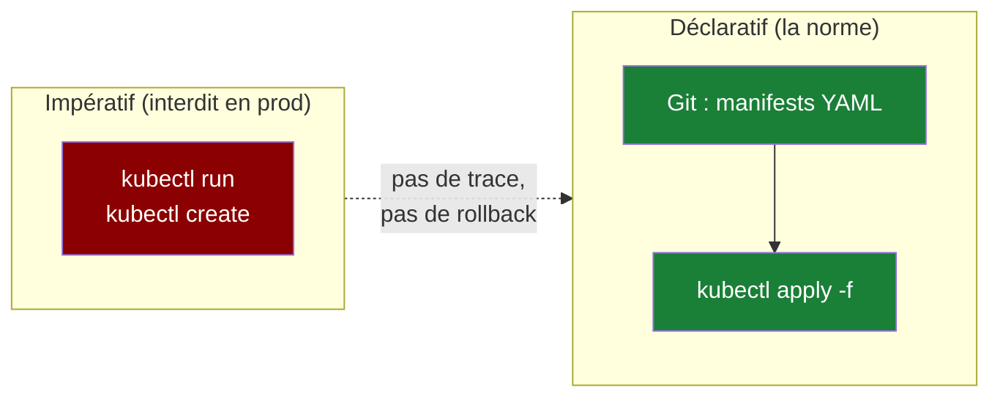

### 3.4 Labels et selectors : le fil invisible

Les **labels** (clé=valeur sur les objets) alimentent les **selectors** (comment les autres objets les trouvent). Le Service trouve ses Pods par selector, le Deployment ses répliques, le scheduling ses cibles. C'est LE mécanisme de liaison de Kubernetes.

```bash
kubectl get pods -l app=web              # filtrer par label
kubectl get pods --show-labels           # voir les labels
kubectl label pod mon-pod version=v2 --overwrite
```

### 🎯 Quiz — partie 3

1. Quelles sont les 4 sections d'un objet API et qui écrit chacune ?
2. Pourquoi `apply` plutôt que `create` ?
3. Comment un Service sait-il quels Pods il doit exposer ?

<details><summary>✅ Réponses</summary>

1. `apiVersion`+`kind` (imposés par l'API), `metadata` (vous), `spec` = état voulu (vous), `status` = état réel (le système).
2. `create` échoue si l'objet existe déjà ; `apply` compare et met à jour — idempotent, rejouable, compatible CI/CD.
3. Par **label selector** : le Service définit `spec.selector` (ex. `app: web`) et l'API lui fournit en continu les Pods dont les labels correspondent.
</details>

---

## 4. Les Pods : l'unité de base

### 4.1 Un Pod = des conteneurs qui partagent un destin

Le Pod est la plus petite unité déployable : **un ou plusieurs conteneurs** qui partagent la même IP, le même espace réseau et (au choix) le même cycle de vie. En pratique : un Pod = une application ; les conteneurs additionnels sont des **sidecars** (proxy de logs, collecteur de métriques, agents).

```yaml
apiVersion: v1
kind: Pod
metadata:
  name: web-pod
  labels:
    app: web
spec:
  containers:
    - name: nginx                          # le conteneur principal
      image: nginx:1.27
      ports:
        - containerPort: 80
    - name: log-shipper                    # un sidecar : même Pod, même IP
      image: busybox:1.36
      command: ["sh", "-c", "tail -F /var/log/nginx/access.log"]
      volumeMounts:
        - name: logs
          mountPath: /var/log/nginx
  volumes:
    - name: logs
      emptyDir: {}
```

```text
$ kubectl get pods
NAME      READY   STATUS    RESTARTS   AGE
web-pod   2/2     Running   0          30s     # 2 conteneurs, tous deux prêts
```

### 4.2 Le cycle de vie d'un Pod

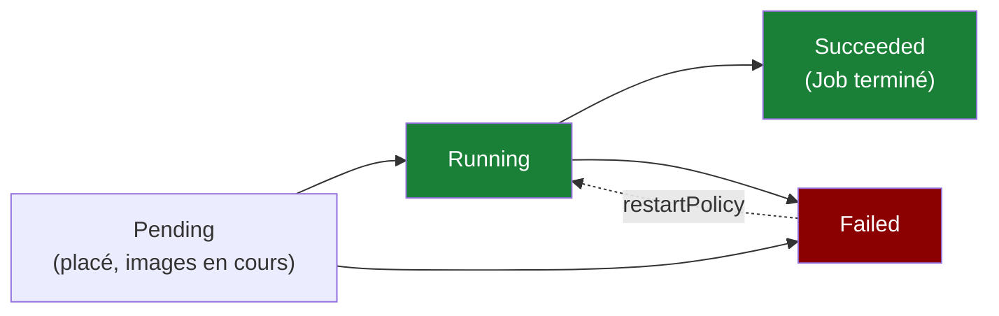

Les états qui jalonnent la vie d'un Pod : **Pending** (pas encore de nœud ou images non tirées), **ContainerCreating**, **Running**, **CrashLoopBackOff** (le conteneur plante en boucle — §19), **Evicted**, **Completed**. Les Pods sont **éphémères** et **jetables** : on ne les répare jamais, on les recrée (par le Deployment).

> [!IMPORTANT]
> **Un Pod seul est un animal de laboratoire.** En production, un Pod vit rarement seul : le Deployment (§5) en crée des répliques, le Service (§6) les expose. Le YAML `kind: Pod` ci-dessus sert à comprendre — ensuite vous écrirez `kind: Deployment`.

### 4.3 Les variables et commandes dans un Pod

```yaml
spec:
  containers:
    - name: app
      image: monapp:2.1
      env:
        - name: ENV_MODE                # valeur simple
          value: "production"
        - name: DB_HOST                 # depuis un ConfigMap (§7)
          valueFrom:
            configMapKeyRef: { name: app-config, key: db_host }
        - name: DB_PASSWORD             # depuis un Secret (§7)
          valueFrom:
            secretKeyRef: { name: db-secret, key: password }
      command: ["/app/bin/server"]      # écrase ENTRYPOINT
      args: ["--port", "8080"]          # écrase CMD
```

### 🎯 Quiz — partie 4

1. Que partagent les conteneurs d'un même Pod ? Qu'est-ce qu'un sidecar ?
2. Que signifie `READY 1/2` sur un Pod ?
3. Pourquoi ne gère-t-on jamais des `kind: Pod` en production ?

<details><summary>✅ Réponses</summary>

1. L'IP, l'espace réseau (localhost commun) et éventuellement des volumes. Un sidecar = conteneur auxiliaire qui complète l'application principale (shipper de logs, proxy, agent).
2. 1 conteneur sur 2 est prêt au sens des readiness probes — l'autre ne sert pas encore de trafic (ou est malade).
3. Un Pod nu n'a ni réplication, ni rolling update, ni auto-réparation : un Deployment apporte tout cela en encapsulant le Pod.
</details>

---

## 5. Deployments et ReplicaSets : les applications sans état

### 5.1 La hiérarchie qui fait tout

Le **Deployment** est l'objet le plus utilisé : il gère des **ReplicaSets**, qui gèrent des **Pods**. Chaque changement de la spec des Pods crée un **nouveau ReplicaSet** — c'est le mécanisme qui permet l'historique de déploiement et le rollback.

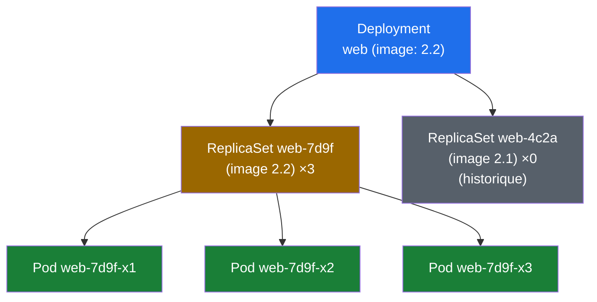

### 5.2 Le manifest de référence

```yaml
apiVersion: apps/v1
kind: Deployment
metadata:
  name: web
  labels: { app: web }
spec:
  replicas: 3                              # l'état voulu : 3 Pods
  revisionHistoryLimit: 5                  # les anciens ReplicaSets à garder
  strategy:
    type: RollingUpdate                    # ou Recreate (tout tuer avant recréer)
    rollingUpdate:
      maxSurge: 1                          # peut dépasser de 1 Pod pendant l'update
      maxUnavailable: 0                    # ne jamais descendre sous 3 disponibles
  selector:
    matchLabels:
      app: web                             # DOIT correspondre à template.metadata.labels
  template:                                # le « moule » des Pods
    metadata:
      labels: { app: web }
    spec:
      containers:
        - name: web
          image: monregistry/monapp:2.2    # JAMAIS :latest (§19.3)
          ports:
            - containerPort: 8080
          resources:                       # cf. §12
            requests: { cpu: 100m, memory: 128Mi }
            limits:   { cpu: 500m, memory: 256Mi }
```

### 5.3 Le rollout : mettre à jour sans coupure

```bash
kubectl set image deploy/web web=monregistry/monapp:2.3    # déclencher
kubectl rollout status deploy/web                          # suivre
kubectl rollout history deploy/web                         # les révisions
kubectl rollout undo deploy/web                            # ⬅️ ROLLBACK en une commande
kubectl rollout undo deploy/web --to-revision=2            # rollback ciblé
```

```text
$ kubectl rollout status deploy/web
Waiting for deployment "web" rollout to finish: 1 old replicas are pending termination...
deployment "web" successfully rolled out
```

Pendant le rollout, le Deployment crée les nouveaux Pods avec `maxSurge`, attend qu'ils soient prêts (readiness, §12), puis tue les anciens — progressivement, sans jamais dépasser `maxUnavailable`.

> [!TIP]
> **`kubectl rollout undo` est le bouton de panique le plus fiable de Kubernetes** : il réactive le ReplicaSet précédent. Mais il ne rollback que le `template` des Pods — si votre erreur est dans un ConfigMap ou Service référencé, il faut les rollbacker aussi (d'où l'intérêt du GitOps, §17.3).

### 🎯 Quiz — partie 5

1. Pourquoi chaque mise à jour crée-t-elle un nouveau ReplicaSet ?
2. À quoi servent `maxSurge` et `maxUnavailable` ?
3. Qu'est-ce que `kubectl rollout undo` ne rollback PAS ?

<details><summary>✅ Réponses</summary>

1. Pour garder un historique versionné : chaque ReplicaSet fige une version du template, ce qui permet `rollout history` et le retour en arrière instantané.
2. Ils bornent le confort de l'update : `maxSurge` = combien de Pods en PLUS pendant la transition (vitesse), `maxUnavailable` = combien de Pods en MOINS tolérés (disponibilité). `maxSurge: 1, maxUnavailable: 0` = jamais moins que le nombre voulu de Pods prêts.
3. Les objets externes au template : ConfigMaps, Secrets, Services, Ingress — tout ce qui n'est pas dans `spec.template` du Deployment.
</details>

---

## 6. Les Services : un réseau stable pour des Pods éphémères

### 6.1 Le problème : les IP des Pods sont éphémères

Chaque Pod naît avec une IP qui meurt avec lui. Comment l'application frontale peut-elle appeler « le backend » si son IP change à chaque redéploiement ? Réponse : le **Service** — une IP+DNS stable et virtuelle qui route vers les Pods courants (trouvés par label selector).

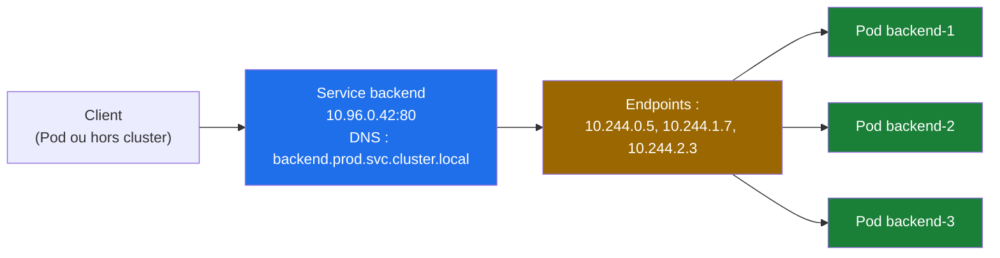

### 6.2 Les 4 types de Service

| Type | Visibilité | Usage typique |
|---|---|---|
| **ClusterIP** (défaut) | interne au cluster | communication entre microservices |
| **NodePort** | externe : `IPnœud:30000-32767` | démos, lab ; jamais en prod propre |
| **LoadBalancer** | externe : une IP publique | exposition simple dans le cloud (provisionne un LB chez le cloud) |
| **ExternalName** | alias DNS externe | masquer une dépendance externe (DB managée) |

```yaml
apiVersion: v1
kind: Service
metadata:
  name: backend
spec:
  type: ClusterIP
  selector:
    app: backend          # ← les Pods ciblés (par label !)
  ports:
    - port: 80            # le port du Service (ce que les clients appellent)
      targetPort: 8080    # le port du conteneur
```

```bash
kubectl get svc backend
# NAME      TYPE        CLUSTER-IP    PORT(S)   AGE
# backend   ClusterIP   10.96.0.42    80/TCP    5m

# Le DNS interne : <service>.<namespace>.svc.cluster.local
kubectl run tmp --rm -it --image=curlimages/curl -- curl http://backend.prod.svc.cluster.local
```

### 6.3 Le piège du selector

> [!WARNING]
> **Le Service ne trouve PAS ses Pods → 90 % du temps : le selector ne matche pas les labels du template.** Diagnostic en une commande : `kubectl get endpoints backend` — s'il est vide (`<none>`), le selector ne matche aucun Pod. Comparez alors labels du Service et labels du Pod, octet par octer (casse, valeur manquante).

```bash
kubectl get endpoints backend
# NAME      ENDPOINTS                     AGE   ← sain : les IP des Pods
# backend   10.244.0.5:8080,10.244.1.7    5m
kubectl get endpoints backend -o wide 2>/dev/null || kubectl get endpointslices -l kubernetes.io/service-name=backend
```

### 🎯 Quiz — partie 6

1. Quel mécanisme relie un Service à ses Pods, et pourquoi est-il stable malgré le churn des Pods ?
2. Différence entre `port` et `targetPort` ?
3. Un Service avec selector ne voit aucun Pod : première commande de diagnostic ?

<details><summary>✅ Réponses</summary>

1. Le **label selector** : le Service ne référence pas des IP mais un ensemble de labels ; l'API met à jour en continu la liste des Endpoints à mesure que les Pods naissent/meurent.
2. `port` = le port d'écoute du Service (ce que le client appelle) ; `targetPort` = le port du conteneur vers lequel le trafic est routé. Ils n'ont aucune obligation d'être égaux.
3. `kubectl get endpoints <svc>` (ou endpointslices) : si `<none>`, le selector ne matche aucun Pod → comparer les labels.
</details>

---

## 7. ConfigMaps et Secrets : la configuration

### 7.1 Le principe : séparer la config de l'image

Une image est immuable et passe par tous les environnements ; la configuration, elle, change par environnement. Kubernetes la porte dans deux objets : **ConfigMap** (valeurs neutres) et **Secret** (données sensibles, encodées base64 — chiffrées uniquement si vous activez le chiffrement etcd ou utilisez un opérateur de coffre externe, §7.4).

```yaml
apiVersion: v1
kind: ConfigMap
metadata:
  name: app-config
data:
  LOG_LEVEL: "info"
  db_host: "postgres.prod.svc.cluster.local"
  nginx.conf: |                    # un fichier de config entier comme clé
    server { listen 80; }
---
apiVersion: v1
kind: Secret
metadata:
  name: db-secret
type: Opaque
stringData:                        # stringData : valeurs en clair dans le manifest,
  password: "S3cr3tP@ss"           # kubectl les encode en base64 à l'apply
```

### 7.2 Injecter dans les Pods : 3 façons

```yaml
spec:
  containers:
    - name: app
      image: monapp:2.2
      envFrom:
        - configMapRef: { name: app-config }      # 1. toutes les clés → variables
      env:
        - name: DB_PASSWORD
          valueFrom:
            secretKeyRef: { name: db-secret, key: password }   # 2. une clé → variable
      volumeMounts:
        - name: conf
          mountPath: /etc/nginx                  # 3. monté en fichiers
  volumes:
    - name: conf
      configMap:
        name: app-config
        items:
          - key: nginx.conf
            path: nginx.conf
```

> [!TIP]
> ConfigMap/Secret **montés en volume** sont mis à jour dans le Pod (~1 min de latence) ; en **variables d'environnement**, ils ne sont **jamais** mis à jour (le Pod doit être recréé). Choisissez selon le besoin de rechargement.

### 7.3 Secrets : les limites à connaître

- Le `base64` n'est **pas du chiffrement** : quiconque lit le Secret (RBAC !) lit la valeur. `kubectl get secret db-secret -o jsonpath='{.data.password}' | base64 -d`.
- Les manifests qui contiennent des `stringData` en clair ne doivent **pas** être commités tels quels : chiffrés (SOPS, Sealed Secrets), injectés par la CI, ou gérés par un opérateur (External Secrets Operator → HashiCorp Vault).
- Par défaut, les Secrets sont stockés **non chiffrés dans etcd** : sur un cluster auto-géré, activez EncryptionConfiguration.

### 7.4 En entreprise

La pratique de référence : **External Secrets Operator** ou **Sealed Secrets** — les secrets réels vivent dans un coffre (Vault, AWS/GCP secrets manager), le cluster ne contient que des références. Git peut alors tout contenir sans fuite (principe du GitOps, §17.3).

### 🎯 Quiz — partie 7

1. Quelle différence entre ConfigMap et Secret ? Le base64 protège-t-il ?
2. Une config montée en volume change : quand le Pod la voit-il ? Et en variable d'env ?
3. Comment empêcher un secret en clair d'arriver dans Git ?

<details><summary>✅ Réponses</summary>

1. ConfigMap = données neutres ; Secret = données sensibles (type dédié, permissions RBAC plus fines, éventuellement chiffrés au repos). Le base64 est un encodage, pas du chiffrement — il se décode en une commande.
2. En volume : ~1 minute (sync kubelet). En variable d'env : jamais — les variables sont fixées au démarrage du conteneur.
3. SOPS/Sealed Secrets (chiffré dans Git), External Secrets Operator (référence vers un coffre), ou injection par la CI — jamais de `stringData` en clair commité.
</details>

---

## 8. Namespaces et quotas : découper le cluster

### 8.1 Namespaces : le cloisonnement logique

Un namespace est un espace de noms pour les objets (et un périmètre pour RBAC et quotas). Les objets « cluster-scoped » (Nodes, PV, ClusterRoles) y échappent.

```bash
kubectl create namespace staging
kubectl get pods -n kube-system        # le namespace des composants internes
kubectl config set-context --current --namespace=staging   # définir le défaut
```

> [!NOTE]
> Les conventions : `default` (à ne pas utiliser en prod), `kube-system` (composants internes — n'y touchez pas), les namespaces par **équipe** ou par **environnement** (`prod`, `staging`, `equipe-facturation`). La ressource DNS d'un Service encode son namespace : `backend.prod.svc.cluster.local`.

### 8.2 ResourceQuota et LimitRange

```yaml
apiVersion: v1
kind: ResourceQuota
metadata:
  name: prod-quota
  namespace: prod
spec:
  hard:
    requests.cpu: "10"
    requests.memory: 20Gi
    limits.cpu: "20"
    limits.memory: 40Gi
    pods: "100"
---
apiVersion: v1
kind: LimitRange
metadata:
  name: default-limits
  namespace: prod
spec:
  limits:
    - type: Container
      default:                         # limits par défaut si absent du manifest
        cpu: 500m
        memory: 256Mi
      defaultRequest:
        cpu: 100m
        memory: 128Mi
```

> [!IMPORTANT]
> Un **namespace sans ResourceQuota** = n'importe quel Deployment peut avaler toutes les ressources du cluster. Un **LimitRange** évite aussi le piège inverse : un Pod sans `resources` reçoit des defaults — sinon il est « BestEffort » et premier évincé (§12).

### 🎯 Quiz — partie 8

1. Quels objets ne vivent PAS dans un namespace ?
2. À quoi servent ResourceQuota et LimitRange, respectivement ?
3. Que risque-t-on en déployant en prod dans `default` ?

<details><summary>✅ Réponses</summary>

1. Les objets cluster-scoped : Nodes, PersistentVolumes, ClusterRoles/ClusterRoleBindings, StorageClasses, namespaces eux-mêmes.
2. Quota : plafond global de consommation du namespace (CPU/RAM/pods). LimitRange : valeurs par défaut et bornes par conteneur.
3. Mélanges avec tout ce qui n'a pas de place définie, pas de cloisonnement RBAC, pas de quotas, et des noms de Services qui polluent le namespace par défaut — ingérable en équipe.
</details>

---

## 9. Le réseau : CNI, DNS, communication

### 9.1 Les 4 règles du modèle réseau Kubernetes

1. Chaque Pod a une **IP unique routable** dans le cluster (pas de NAT entre Pods).
2. Tous les Pods communiquent avec tous les autres sans NAT.
3. Les nœuds communiquent avec les Pods sans NAT.
4. L'IP vue par un Pod est celle que les autres voient.

C'est le contrat ; le **CNI plugin** (Container Network Interface) est celui qui le réalise : **flannel** (simple, overlay VXLAN), **Calico** (routing L3 + NetworkPolicies), **Cilium** (eBPF, performance + observabilité), **weave**… k3s embarque flannel par défaut.

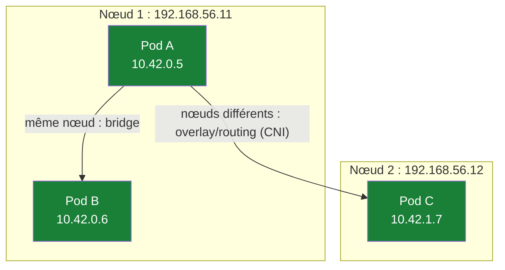

### 9.2 CoreDNS : l'annuaire interne

Chaque Service obtient un enregistrement DNS : `<service>.<namespace>.svc.cluster.local`. Un Pod du même namespace peut donc appeler juste `http://backend` ; depuis un autre namespace, `http://backend.prod`. Les headless Services (`clusterIP: None`) résolvent directement aux IP des Pods (utile pour StatefulSets, §15).

### 9.3 NetworkPolicies : le pare-feu des Pods

Par défaut : **tout le monde parle à tout le monde**. Une NetworkPolicy restreint — les trafics non explicitement permis sont refusés dès qu'une policy sélectionne le Pod.

```yaml
apiVersion: networking.k8s.io/v1
kind: NetworkPolicy
metadata:
  name: backend-allow-front-only
  namespace: prod
spec:
  podSelector:
    matchLabels: { app: backend }      # protège ces Pods
  policyTypes: [ Ingress ]
  ingress:
    - from:
        - podSelector:
            matchLabels: { app: frontend }   # autorise uniquement ces Pods
      ports:
        - port: 8080
```

> [!WARNING]
> NetworkPolicy exige un CNI qui les supporte (Calico, Cilium ; flannel seul : non). Et c'est une liste blanche : dès qu'une policy sélectionne un Pod, tout ingress non décrit est bloqué — ne déployez pas de policy à moitié complète en prod.

### 🎯 Quiz — partie 9

1. Citez 3 des 4 règles du modèle réseau Kubernetes.
2. Quelle est l'URL DNS complète d'un Service `api` du namespace `facturation` ?
3. Une NetworkPolicy « allow frontend » est appliquée au backend : que devient le trafic venant de `monitoring` ?

<details><summary>✅ Réponses</summary>

1. IP unique par Pod, communication Pod-à-Pod sans NAT, nœud-à-Pod sans NAT, IP identique vue de l'intérieur et de l'extérieur du Pod (2 sur 4 suffisent).
2. `api.facturation.svc.cluster.local`.
3. Refusé : les NetworkPolicies sont des listes blanches ; dès qu'une policy sélectionne le Pod, seul le trafic explicitement permis passe.
</details>

---

## 10. Ingress et Gateway API : exposer au monde

### 10.1 Ingress : le routeur HTTP du cluster

Les Services exposent des TCP/UDP ; l'**Ingress** ajoute la couche 7 : noms de domaine, chemins, TLS, en s'appuyant sur un **contrôleur** (nginx, Traefik, HAProxy) qui doit être installé dans le cluster.

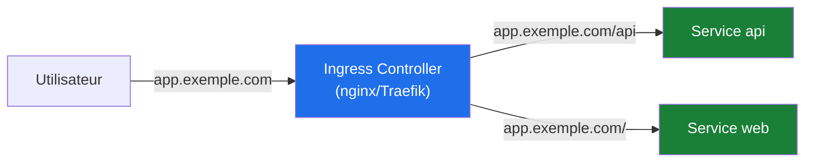

```yaml
apiVersion: networking.k8s.io/v1
kind: Ingress
metadata:
  name: app
  annotations:
    cert-manager.io/cluster-issuer: letsencrypt     # TLS auto (cert-manager)
spec:
  ingressClassName: nginx
  tls:
    - hosts: [ app.exemple.com ]
      secretName: app-tls
  rules:
    - host: app.exemple.com
      http:
        paths:
          - path: /api
            pathType: Prefix
            backend:
              service:
                name: api
                port: { number: 80 }
          - path: /
            pathType: Prefix
            backend:
              service:
                name: web
                port: { number: 80 }
```

> [!NOTE]
> Un Ingress **sans contrôleur installé** ne fait rien (pas d'IP externe) — première chose à vérifier quand « l'Ingress ne marche pas » : `kubectl get ingress` reste sans ADDRESS.

### 10.2 Gateway API : le successeur

La **Gateway API** (GA depuis 1.29+) est la génération suivante : des rôles séparés (`GatewayClass` = l'infra, `Gateway` = le point d'entrée, `HTTPRoute` = le routage), des routes par protocole (HTTP, gRPC, TLS, TCP), support natif du multi-tenant et pas de annotations propriétaires. Les nouveaux projets la privilégient ; Ingress reste partout en prod.

```yaml
apiVersion: gateway.networking.k8s.io/v1
kind: HTTPRoute
metadata:
  name: api-route
spec:
  hostnames: [ "app.exemple.com" ]
  parentRefs:
    - name: mon-gateway
  rules:
    - matches:
        - path: { type: PathPrefix, value: /api }
      backendRefs:
        - name: api
          port: 80
```

### 🎯 Quiz — partie 10

1. Que peut faire un Ingress que ne peut pas faire un Service NodePort ?
2. Pourquoi « l'Ingress ne fait rien » alors que le manifest est appliqué ?
3. Quels problèmes la Gateway API résout-elle par rapport à Ingress ?

<details><summary>✅ Réponses</summary>

1. Le routage L7 : noms de domaine, chemins d'URL, terminaison TLS, en un point unique — au lieu d'ouvrir un port brut par Service.
2. Il n'y a probablement pas de contrôleur Ingress installé dans le cluster (ou ingressClassName erroné) : l'objet Ingress existe mais rien ne l'implémente.
3. Rôles séparés (infra/portail/routage → séparation des responsabilités et RBAC propres), routes par protocole extensibles, portabilité sans annotations propriétaires.
</details>

---

## 11. Le stockage : volumes, PV, PVC, StorageClass

### 11.1 Le problème : les Pods meurent, les données non

Un Pod recréé perd son `emptyDir`. Le stockage persistant s'appuie sur 3 objets qui découplent la demande (l'app) de la provision (l'admin/le cloud) :

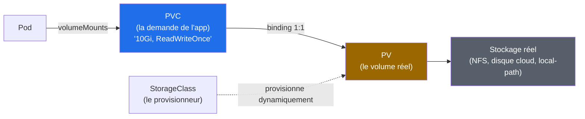

| Objet | Portée | Écrit par |
|---|---|---|
| **PV** (PersistentVolume) | cluster | l'admin, ou dynamiquement par la StorageClass |
| **PVC** (PersistentVolumeClaim) | namespace | l'auteur de l'application (« je veux 10Gi ») |
| **StorageClass** | cluster | l'admin (définit les « offres » : rapide, répliqué, NFS…) |

```yaml
apiVersion: v1
kind: PersistentVolumeClaim
metadata:
  name: data-postgres
spec:
  storageClassName: standard        # la « classe » d'offre
  accessModes: [ ReadWriteOnce ]    # RWO (1 nœud), ROX (lecture multi), RWX (lecture+écriture multi)
  resources:
    requests:
      storage: 10Gi
```

### 11.2 Reclaim policy et l'après-PVC

La `persistentVolumeReclaimPolicy` du PV décide de l'après : **Delete** (défaut dynamique : le volume et ses données sont détruits avec le PVC — lire deux fois) ou **Retain** (le PV survit, données conservées, réadoption manuelle).

> [!WARNING]
> **PVC supprimé = données supprimées** avec la policy Delete. La sauvegarde des PV (Velero, snapshots CSI) reste de votre responsabilité : Kubernetes garantit la persistance, pas la sauvegarde.

### 🎯 Quiz — partie 11

1. Qui écrit le PVC, qui écrit le PV, et quel objet fait le lien ?
2. Quelle différence entre ReadWriteOnce et ReadWriteMany ?
3. Que se passe-t-il des données si la policy du PV est Delete et qu'on supprime le PVC ?

<details><summary>✅ Réponses</summary>

1. Le PVC par l'auteur de l'app (namespace), le PV par l'admin ou dynamiquement, le lien par le **binding** PVC↔PV, déclenché par la StorageClass en provisionnement dynamique.
2. RWO : montable en lecture/écriture par un seul nœud (la plupart des disques). RWX : montable en lecture/écriture par plusieurs nœuds simultanément (NFS, EFS…).
3. Elles sont détruites avec le volume — d'où Retain pour les données critiques et une vraie stratégie de sauvegarde (Velero/snapshots).
</details>

---

## 12. La santé des Pods : probes, ressources, QoS

### 12.1 Les 3 probes

Kubernetes ne sait pas si votre application « fonctionne » tant que vous ne lui donnez pas de moyens de le savoir :

| Probe | Question | Conséquence en cas d'échec |
|---|---|---|
| **liveness** | « es-tu vivant ? » | le kubelet **redémarre** le conteneur |
| **readiness** | « es-tu prêt à servir ? » | le Pod est **retiré des Endpoints** (pas de trafic) |
| **startup** | « as-tu fini de démarrer ? » | gèle les autres probes pendant le boot des apps lentes |

```yaml
spec:
  containers:
    - name: web
      image: monapp:2.2
      livenessProbe:
        httpGet: { path: /healthz, port: 8080 }
        initialDelaySeconds: 10
        periodSeconds: 10
        failureThreshold: 3
      readinessProbe:
        httpGet: { path: /ready, port: 8080 }
        initialDelaySeconds: 5
        periodSeconds: 5
      startupProbe:
        httpGet: { path: /healthz, port: 8080 }
        failureThreshold: 30
        periodSeconds: 5
```

> [!IMPORTANT]
> **Règle d'or** : liveness doit tester « le process est-il bloqué ? » (léger, jamais dépendant d'un service externe) et readiness « puis-je servir ce client ? » (peut dépendre de la DB). Un liveness qui teste la DB = des redémarrages en cascade quand la DB a un hoquet — l'inverse du but.

### 12.2 Requests et limits : le contrat de ressources

```yaml
resources:
  requests: { cpu: 100m, memory: 128Mi }   # le scheduler réserve ça pour placer le Pod
  limits:   { cpu: 500m, memory: 256Mi }   # les bornes en exécution
```

- **requests** : ce que le scheduler garantit (somme des requests ≤ capacité du nœud).
- **limits** : ce qu'on ne peut pas dépasser — CPU : throttlé ; **mémoire : dépassée = conteneur tué (OOMKilled)**.
- `100m` = 0,1 CPU ; `128Mi` = 128 Mio binaire (vs `128M` décimal).

### 12.3 Les classes QoS

| QoS | Condition | En cas de pression mémoire |
|---|---|---|
| **Guaranteed** | limits == requests sur tout | évincé en dernier |
| **Burstable** | requests < limits ou partiels | évincé si dépasse ses requests |
| **BestEffort** | aucun resources | évincé en **premier** |

### 🎯 Quiz — partie 12

1. Différence de conséquence entre l'échec d'une liveness et d'une readiness probe ?
2. Un conteneur dépasse sa limite mémoire : que se passe-t-il ? Et sa limite CPU ?
3. Quel Pod est évincé en premier sous pression mémoire ?

<details><summary>✅ Réponses</summary>

1. Liveness échouée = le kubelet **redémarre** le conteneur. Readiness échouée = le Pod reste en vie mais est **retiré du Service** (plus de trafic).
2. Mémoire dépassée : le conteneur est tué (**OOMKilled**, restart). CPU dépassé : il est **throttlé** (ralenti), pas tué.
3. Le BestEffort (sans requests/limits) — d'où le LimitRange qui met des defaults dans les namespaces.
</details>

---

## 13. Le scheduling : où tournent mes Pods ?

### 13.1 Le processus de décision

Pour chaque Pod à placer, le **scheduler** filtre puis note :

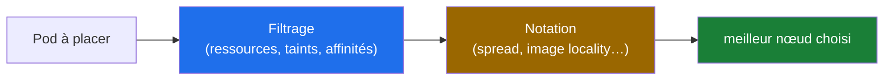

Les leviers qui influencent le placement :

```yaml
spec:
  nodeSelector:                   # simple : correspondance de labels nœud
    disktype: ssd
  affinity:
    nodeAffinity:
      requiredDuringSchedulingIgnoredDuringExecution:    # obligatoire
        nodeSelectorTerms:
          - matchExpressions:
              - key: kubernetes.io/arch
                operator: In
                values: [ amd64 ]
    podAntiAffinity:              # étaler les répliques (pas 2 sur le même nœud)
      preferredDuringSchedulingIgnoredDuringExecution:
        - weight: 100
          podAffinityTerm:
            labelSelector:
              matchLabels: { app: web }
            topologyKey: kubernetes.io/hostname
  tolerations:                    # tolérer les taints (réservés/protégés)
    - key: "dedicated"
      operator: "Equal"
      value: "gpu"
      effect: "NoSchedule"
```

### 13.2 Taints et tolerations

Un **taint** repousse les Pods d'un nœud (« réservé GPU », « nœud malade ») ; la **toleration** permet à un Pod de l'accepter quand même. Le control plane est protégé ainsi (taints par défaut) — on ne place pas d'applications dessus.

```bash
kubectl taint nodes node1 dedicated=gpu:NoSchedule
kubectl describe node node1 | grep -A3 Taints
kubectl label nodes node1 disktype=ssd        # pour le nodeSelector
```

> [!TIP]
> L'anti-affinité est votre assurance haute-dispo : `podAntiAffinity` sur `topologyKey: kubernetes.io/hostname` empêche que 2 répliques d'un même service meurent avec le même nœud. Sur 3 répliques et 2 nœuds, quelqu'un devra dire « non » à cette contrainte — c'est un vrai sujet d'architecture.

### 🎯 Quiz — partie 13

1. Quelles sont les deux phases du scheduling ?
2. Un taint `NoSchedule` est posé sur node1 : quels Pods y restent ?
3. Comment empêcher 2 répliques du même service sur le même nœud ?

<details><summary>✅ Réponses</summary>

1. **Filtrage** (nœuds viables : ressources, taints non tolérés, affinités) puis **notation** (meilleur candidat : spread, affinités préférées).
2. Tous ceux qui y sont déjà (NoSchedule n'expulse pas) + les nouveaux qui portent la toleration correspondante. Les nouveaux sans toleration vont ailleurs.
3. `podAntiAffinity` avec `matchLabels: {app: monservice}` et `topologyKey: kubernetes.io/hostname`.
</details>

---

## 14. L'autoscaling : HPA, VPA, Cluster Autoscaler

### 14.1 Trois niveaux de scaling

| Objet | Scale quoi | Sur quel signal |
|---|---|---|
| **HPA** (HorizontalPodAutoscaler) | le **nombre** de Pods | CPU/mémoire (metrics-server) ou métriques custom |
| **VPA** (VerticalPodAutoscaler) | les **requests/limits** des Pods | l'usage historique (recommande, ou recrée les Pods) |
| **Cluster Autoscaler / Karpenter** | le **nombre de nœuds** | les Pods **Pending** (plus de place) / nœuds sous-utilisés |

```yaml
apiVersion: autoscaling/v2
kind: HorizontalPodAutoscaler
metadata:
  name: web-hpa
spec:
  scaleTargetRef:
    apiVersion: apps/v1
    kind: Deployment
    name: web
  minReplicas: 3
  maxReplicas: 20
  metrics:
    - type: Resource
      resource:
        name: cpu
        target:
          type: Utilization
          averageUtilization: 70      # scale out si moyenne > 70 % des requests
```

> [!IMPORTANT]
> Le HPA a besoin du **metrics-server** (k3s l'embarque) et de **requests CPU définis** dans les Deployments — sans requests, pas de calcul de « 70 % », donc pas de scaling. C'est la raison n°1 des HPA qui ne scalent pas.

### 14.2 La hiérarchie en production

Typiquement : HPA ( Pods, réactif) → Cluster Autoscaler/Karpenter ( nœuds, quand plus de place pour les nouveaux Pods) ; le VPA plutôt en mode « recommandation » pour dimensionner les requests sans risque. Évitez VPA (mode auto) + HPA sur la même métrique CPU : ils se battent.

### 🎯 Quiz — partie 14

1. Que scale le HPA, le VPA, le Cluster Autoscaler ?
2. Un HPA ne fait rien : 2 causes classiques ?
3. Pourquoi ne pas mettre VPA auto + HPA CPU sur le même Deployment ?

<details><summary>✅ Réponses</summary>

1. HPA : le nombre de répliques. VPA : la taille (requests/limits) des conteneurs. CA : le nombre de nœuds (pour loger les Pods Pending).
2. metrics-server absent (pas de métriques) ; requests CPU absents des conteneurs (impossible de calculer un %). (Bonus : min==max.)
3. Ils interagissent en boucle : le VPA augmente les requests → le HPA voit des % différents et re-scale → le VPA réévalue… Instabilité. VPA en mode recommandation seulement.
</details>

---

## 15. Workloads spécialisés : StatefulSet, DaemonSet, Jobs

### 15.1 StatefulSet : l'identité stable

Le Deployment donne des Pods interchangeables (noms aléatoires). Les bases de données en cluster ont besoin du contraire : **identité stable** + **stockage dédié par réplique** + **démarrage ordonné**. C'est le StatefulSet : `postgres-0`, `postgres-1`, `postgres-2`, chacun avec son PVC `data-postgres-0`…

```yaml
apiVersion: apps/v1
kind: StatefulSet
metadata:
  name: postgres
spec:
  serviceName: postgres            # + un Service headless (clusterIP: None)
  replicas: 3
  selector:
    matchLabels: { app: postgres }
  template:
    metadata:
      labels: { app: postgres }
    spec:
      containers:
        - name: postgres
          image: postgres:17
          volumeMounts:
            - name: data
              mountPath: /var/lib/postgresql/data
  volumeClaimTemplates:            # un PVC PAR réplique, qui suit sa réplique
    - metadata: { name: data }
      spec:
        accessModes: [ ReadWriteOnce ]
        resources: { requests: { storage: 20Gi } }
```

- Démarrage **ordonné** (n-1 prêt avant n), suppression en ordre inverse.
- DNS stable : `postgres-0.postgres.prod.svc.cluster.local` — les pairs se trouvent malgré les recréations.

### 15.2 DaemonSet : un Pod par nœud

Un Pod **sur chaque nœud** (ou sélectionné par nodeSelector) : collecteurs de logs (fluentd), agents de monitoring (node-exporter), le CNI lui-même, kube-proxy. Idéal pour l'infra qui doit être « partout ».

### 15.3 Jobs et CronJobs

```yaml
apiVersion: batch/v1
kind: CronJob
metadata:
  name: backup-db
spec:
  schedule: "0 2 * * *"            # cron standard
  jobTemplate:
    spec:
      template:
        spec:
          restartPolicy: OnFailure
          containers:
            - name: backup
              image: postgres:17
              command: ["pg_dump", ...]
```

| Objet | Quand l'utiliser |
|---|---|
| Deployment | apps sans état, répliques interchangeables |
| StatefulSet | DB en cluster, files de messages, identité+stockage stables |
| DaemonSet | agents par nœud (logs, métriques, réseau) |
| Job / CronJob | tâches finies / planifiées (migrations, backups) |

### 🎯 Quiz — partie 15

1. Qu'apporte le StatefulSet que le Deployment n'a pas ?
2. À quoi sert `volumeClaimTemplates` ?
3. Trois exemples de ce qu'on met en DaemonSet ?

<details><summary>✅ Réponses</summary>

1. Des noms de Pods stables et prévisibles (postgres-0…), un stockage dédié par réplique, un ordre de démarrage/arrêt — nécessaire aux clusters DB et quorums.
2. Créer automatiquement un PVC par réplique, qui persiste et se réattache quand la réplique est recréée (les données suivent le numéro, pas le Pod physique).
3. Collecteur de logs, node-exporter (métriques), agent réseau/CNI ou sécurité par nœud.
</details>

---

## 16. Sécurité : RBAC, service accounts, contextes

### 16.1 ServiceAccount : l'identité des machines

Un humain s'authentifie avec son kubeconfig ; un **Pod** s'authentifie avec un **ServiceAccount** (monté automatiquement dans `/var/run/secrets/kubernetes.io/serviceaccount/`). Chaque Deployment devrait porter sa propre SA, aux droits minimaux — pas `default`.

```yaml
apiVersion: v1
kind: ServiceAccount
metadata:
  name: web-sa
  namespace: prod
---
apiVersion: apps/v1
kind: Deployment
spec:
  template:
    spec:
      serviceAccountName: web-sa            # le Pod parle à l'API avec cette identité
      automountServiceAccountToken: false   # si le Pod ne parle JAMAIS à l'API : désactiver
```

### 16.2 RBAC : qui peut faire quoi sur quoi

Quatre objets en paires : **Role** (permissions) + **RoleBinding** (qui les reçoit) dans un namespace ; **ClusterRole** + **ClusterRoleBinding** cluster-wide.

```yaml
apiVersion: rbac.authorization.k8s.io/v1
kind: Role
metadata:
  name: deploy-reader
  namespace: staging
rules:
  - apiGroups: [ "apps" ]
    resources: [ "deployments" ]
    verbs: [ "get", "list", "watch" ]
---
apiVersion: rbac.authorization.k8s.io/v1
kind: RoleBinding
metadata:
  name: ci-deploy-reader
  namespace: staging
subjects:
  - kind: ServiceAccount
    name: ci-bot
    namespace: ci
roleRef:
  kind: Role
  name: deploy-reader
  apiGroup: rbac.authorization.k8s.io
```

```bash
# Vérifier les droits : les 2 commandes d'audit
kubectl auth can-i delete pods -n prod                    # moi ?
kubectl auth can-i delete pods --as=system:serviceaccount:ci:ci-bot -n prod   # quelqu'un d'autre ?
```

> [!IMPORTANT]
> **Principe du moindre privilège** : une CI qui déploie n'a besoin que de `create/update` sur ses Deployments/Services/ConfigMaps du namespace cible — jamais de `cluster-admin`. Accorder `cluster-admin` « pour dépanner » est la dette de sécurité la plus courante des clusters.

### 16.3 Contextes et sécurité du Pod

```bash
kubectl config get-contexts                     # clusters + users + namespaces
kubectl config use-context lab-k3s              # changer de cluster
```

```yaml
spec:
  containers:
    - name: web
      securityContext:
        runAsNonRoot: true
        runAsUser: 10001
        readOnlyRootFilesystem: true
        allowPrivilegeEscalation: false
        capabilities: { drop: [ "ALL" ] }
```

> [!WARNING]
> Un conteneur qui tourne `root` est l'équivalent d'un serveur sans pare-feu : la moindre faille applicative donne un shell root dans le conteneur (et potentiellement sur le nœud selon les capabilities). Ce durcissement de base est le coût d'entrée de toute prod — reprenez la logique du cours Docker §12, versionnée en manifests.

### 🎯 Quiz — partie 16

1. Quelle différence entre Role et ClusterRole ?
2. Comment tester les permissions d'un ServiceAccount sans se connecter avec ?
3. Pourquoi désactiver l'automount du token quand le Pod ne parle pas à l'API ?

<details><summary>✅ Réponses</summary>

1. Role : permissions dans UN namespace ; ClusterRole : cluster-wide (ou réutilisable dans plusieurs namespaces via des RoleBindings).
2. `kubectl auth can-i <verbe> <ressource> --as=system:serviceaccount:<ns>:<nom-sa> -n <ns>`.
3. Le token monté est une credential vivante dans le conteneur : si le conteneur est compromis, l'attaquant hérite de son accès API. Pas de besoin = pas de token.
</details>

---

## 17. Distributions et écosystème : k3s, Helm, GitOps

### 17.1 k3s : Kubernetes en un binaire

k3s embarque tout (API, etcd/sqlite, containerd, flannel, CoreDNS, Traefik, local-path-provisioner, metrics-server) dans un binaire de ~70 Mo :

```bash
# Server (control plane + worker)
curl -sfL https://get.k3s.io | sh -
sudo k3s kubectl get node
# Agent (worker) — rejoint le server
curl -sfL https://get.k3s.io | K3S_URL=https://<ip-server>:6443 K3S_TOKEN=<token> sh -
```

Idéal lab/edge ; en prod, k3s est certifié CNCF (conforme = un vrai Kubernetes).

### 17.2 Helm : le gestionnaire de paquets

Un **chart** = des templates Go + des valeurs par défaut. Une release = une instance paramétrée :

```bash
helm repo add bitnami https://charts.bitnami.com/bitnami
helm install postgres bitnami/postgresql -n prod \
  --set auth.password=S3cr3t --set primary.persistence.size=20Gi
helm upgrade postgres bitnami/postgresql -n prod --reuse-values --set ...
helm rollback postgres 1 -n prod        # rollback de release
helm template postgres bitnami/postgresql --set ... > rendu.yaml   # voir le YAML final
```

> [!TIP]
> `helm template` avant tout : savoir exactement quels objets une release crée. Et versionnez vos `values.yaml` d'environnement dans Git — c'est votre source de vérité Helm.

### 17.3 GitOps : Argo CD / Flux

Le stade final : plus personne ne lance de `kubectl apply` à la main. Un **opérateur GitOps** (Argo CD, Flux) surveille Git et applique en continu l'état versionné ; un `git revert` EST le rollback ; la dérive est détectée et corrigée automatiquement.

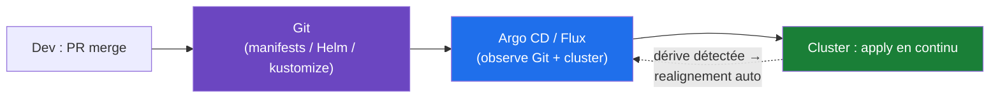

### 🎯 Quiz — partie 17

1. Qu'embarque k3s en plus du control plane ?
2. Pourquoi `helm template` avant `helm install` ?
3. Que fait Argo CD quand quelqu'un modifie un Deployment à la main dans le cluster ?

<details><summary>✅ Réponses</summary>

1. containerd, flannel (CNI), CoreDNS, Traefik (Ingress), local-path-provisioner (stockage), metrics-server — un cluster fonctionnel immédiatement.
2. Pour voir le YAML réellement rendu (templates + values) avant de l'appliquer : audit, revue, détection de surprises. `install` en aveugle = déployer des objets inconnus.
3. Il signale la **dérive** (status OutOfSync) et, selon la policy, **realigne automatiquement** le cluster sur Git — la modification manuelle du cluster vivant n'est plus une voie valide.
</details>

---

## 18. Kubernetes en entreprise : scénarios réels

### 18.1 Scénario 1 — Le déploiement sans coupure (zero-downtime)

**Contexte** : publier v3.2 d'une API exposée à 10 000 req/min sans une seule erreur.

```yaml
strategy:
  type: RollingUpdate
  rollingUpdate:
    maxSurge: 25%
    maxUnavailable: 0          # jamais moins de répliques disponibles
```

**La checklist complète** : readiness probe correcte (sinon du trafic part sur des Pods pas prêts), `maxUnavailable: 0`, `terminationGracePeriodSeconds` suffisant, **preStop hook** (drain du trafic en cours), répliques ≥ 3 réparties (anti-affinité). Le piège classique : sans preStop, les requêtes en cours meurent avec le Pod retiré des Endpoints (la propagation prend du temps).

### 18.2 Scénario 2 — OOMKilled en boucle après une montée en charge

**Contexte** : alerte `CrashLoopBackOff` sur le service `orders` dès que le trafic monte. Diagnostic en 4 commandes :

```bash
kubectl get pods -n prod | grep orders                            # RESTARTS qui grimpe ?
kubectl describe pod orders-xxx -n prod | grep -A3 "Last State"   # Reason: OOMKilled, exit 137
kubectl top pod orders-xxx -n prod                                # mémoire réelle vs limit
kubectl logs orders-xxx -n prod --previous                        # les logs AVANT la mort
```

**La correction structurée** : la limit mémoire était calée sur la consommation « à vide » (64 Mi) — l'app grossit avec le trafic (caches JVM…). `limits.memory: 512Mi` + réglage du heap JVM (`-XX:MaxRAMPercentage=75`). Leçon : **les limits se dimensionnent sur la charge haute, pas sur le repos** — et le `describe pod` raconte toujours la vérité (`Reason: OOMKilled`).

### 18.3 Scénario 3 — La migration vers l'Ingress cassée

**Contexte** : un Ingress modifié hier redirige `/api` vers le nouveau backend, mais l'app mobile reçoit des 404. Méthode :

1. `kubectl get ingress -A` : l'ADDRESS est-elle peuplée ? (vide = contrôleur absent)
2. `kubectl describe ingress app` : les règles rendues, les backends corrects ?
3. `kubectl get endpoints api` : des Pods derrière le Service ? (vide = selector cassé par le redéploiement d'hier)
4. `kubectl get endpointslices -l kubernetes.io/service-name=api` : les labels ont changé ?

La chaîne Ingress→Service→Pods n'a que trois maillons — chacun se vérifie en une commande.

### 18.4 Scénario 4 — Le nœud meurt pendant la nuit

**Contexte** : 3 h du matin, worker-2 tombe en panne matérielle. Ce qui se passe automatiquement :

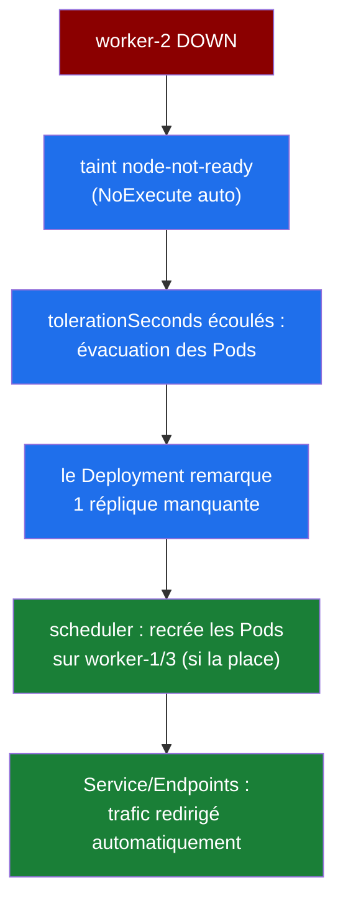

Les Pods avec PV RWO lié au nœud mort attendent le détachement du volume (le point dur des clusters bare-metal). Ce scénario est la raison d'être de Kubernetes : **aucune intervention nocturne**, l'état voulu (« 3 répliques ») prime sur la réalité dégradée. À condition que les répliques existent : un singleton sans réplique sur ce nœud = service mort.

### 🎯 Quiz — partie 18

1. Sans preStop hook, que perd-on lors d'un rolling update sous trafic ?
2. Que signifie `Reason: OOMKilled, Exit Code 137` et quelle est la première correction ?
3. Quand worker-2 meurt la nuit, quels Pods ne seront PAS recréés ailleurs automatiquement ?

<details><summary>✅ Réponses</summary>

1. Les requêtes en cours sur les Pods supprimés : le Pod quitte les Endpoints, mais la propagation + l'arrêt SIGTERM laissent mourir des connexions actives → erreurs 502/timeout.
2. Le conteneur a dépassé sa limit mémoire et a été tué (137 = SIGKILL). Première correction : augmenter la limit (dimensionnée sur la charge réelle) et vérifier l'app (fuite, heap non borné).
3. Les Pods « nus » (sans Deployment/StatefulSet parent) et ceux qui ne peuvent pas être replacés (PV RWO bloqué sur le nœud mort) — les Pods managés, si, à condition qu'il reste de la place ailleurs.
</details>

---

## 19. Pièges classiques et dépannage

### 19.1 Les 6 états d'un Pod qui souffrent — table de diagnostic

| Statut | Signification | Causes fréquentes | Remède |
|---|---|---|---|
| **Pending** | pas encore de nœud | ressources insuffisantes, PVC non lié, taints | `kubectl describe pod` → Events |
| **ImagePullBackOff** | image non tirable | tag erroné, registre privé sans secret | vérifier nom:tag, `imagePullSecrets` |
| **CrashLoopBackOff** | plante en boucle | bug app, config manquante, liveness trop agressive | `kubectl logs --previous` |
| **OOMKilled** | mémoire tuée | limit trop basse, fuite | augmenter la limit, profiler |
| **RunContainerError** | ne démarre pas | volume absent, permissions, cmd invalide | `describe pod` → Events |
| **Evicted** | évincé du nœud | pression disque/mémoire du nœud | nettoyer, re-dimensionner le nœud |

### 19.2 La méthode de dépannage (toujours dans cet ordre)

```bash
# 1. Panorama : qu'est-ce qui souffre et où ?
kubectl get pods -A | grep -Ev "Running|Completed"

# 2. Les Events : 90 % de la vérité est ici
kubectl describe pod <pod> -n <ns> | sed -n '/Events:/,$p'

# 3. Les logs (actuels puis précédents si crash)
kubectl logs <pod> -n <ns> --previous --tail=100

# 4. La chaîne de trafic si le problème est réseau
kubectl get endpoints <svc> -n <ns>          # des Pods derrière ?
kubectl exec -it <pod> -- nslookup <svc>     # le DNS répond ?

# 5. Les ressources consommées
kubectl top pods -n <ns> --sort-by=memory
```

> [!TIP]
> Le triptyque **describe → logs → events** résout la majorité des incidents. Les Events ont une rétention courte (~1 h par défaut) : en cas de mystère, capturez-les tout de suite, pas après l'analyse.

### 19.3 Les pièges qui coûtent des nuits

- **`image: monapp:latest`** : cache périmé selon les nœuds, rollbacks imprévisibles. Toujours un tag versionné (le SHA du CI est idéal).
- **selector ≠ labels** après un renommage : Service vide de Pods (§6.3) ; et le `selector` d'un Deployment est **immuable** — le modifier force à recréer l'objet.
- **liveness qui teste la DB** : cascade de redémarrages à chaque hoquet réseau → liveness léger, readiness métier.
- **requests absents** : Pod BestEffort, premier évincé ; HPA muet ; placement imprévisible.
- **un Pod nu en prod** : pas de réparation, pas de rollout — toujours encapsuler (Deployment/StatefulSet/Job).
- **`kubectl delete pod` sur un Pod managé** : le contrôleur le recrée tel quel — pour recharger une config, `kubectl rollout restart deploy/web` est la voie propre.
- **ConfigMap référencé inexistant** : le Pod reste en `CreateContainerConfigError` — vérifier les noms référencés.

### 🎯 Quiz — partie 19

1. `ImagePullBackOff` : les 3 premières vérifications ?
2. Pourquoi `latest` est-il un piège même quand « ça marche » ?
3. Quelle différence entre `kubectl delete pod` et `kubectl rollout restart` ?

<details><summary>✅ Réponses</summary>

1. `describe pod` (message exact : tag inexistant ? 401 ? réseau ?) ; vérifier nom:tag dans le manifest ; vérifier `imagePullSecrets` pour un registre privé.
2. Cache d'images + non-déterminisme : deux nœuds peuvent tourner des binaires différents derrière le même tag, et aucun rollback fiable n'est possible.
3. `delete pod` tue UNE instance (recréée avec le même template) ; `rollout restart` déclenche un rolling update de toutes les répliques, sans interruption — la voie propre pour recharger une config.
</details>

---

## 20. Aide-mémoire, exercices corrigés et glossaire

### 20.1 Cheat sheet

```bash
# ─── LECTURE ─────────────────────────────────────────────
kubectl get pods,svc,deploy -n prod             # l'essentiel d'un namespace
kubectl get pods -A --field-selector=status.phase!=Running
kubectl describe pod <pod> -n <ns>              # events + état détaillé
kubectl get pod <pod> -o yaml                   # l'objet complet
kubectl get events -A --sort-by=.lastTimestamp

# ─── DÉPLOIEMENT ─────────────────────────────────────────
kubectl apply -f manifest.yaml                  # déclaratif, toujours
kubectl set image deploy/web web=img:2.3        # update rapide
kubectl rollout status/history/undo deploy/web  # piloter le rollout
kubectl rollout restart deploy/web              # recharger les Pods proprement
kubectl scale deploy/web --replicas=5           # (provisoire ; Git reste la vérité)

# ─── DÉBOGAGE ────────────────────────────────────────────
kubectl logs -f <pod> --previous                # logs (et avant-crash)
kubectl exec -it <pod> -- sh                    # shell dans le conteneur
kubectl port-forward svc/api 8080:80            # accès local
kubectl top pods --sort-by=memory               # consommation
kubectl auth can-i '*' '*'                      # mes droits (admin complet ?)

# ─── RÉSEAU / STOCKAGE ───────────────────────────────────
kubectl get endpoints <svc>                     # Pods derrière un Service
kubectl get pv,pvc,storageclass                 # l'état du stockage
kubectl get ingress -A                          # les points d'entrée

# ─── HELM ────────────────────────────────────────────────
helm template <release> <chart> -f values.yaml  # prévisualiser
helm list -A                                    # releases installées
helm rollback <release> <rev>                   # retour arrière
```

### 20.2 Exercices et scénarios corrigés

> Les exercices 1 et 2 ont un script de setup dans [`exercices/`](../exercices/) ; il construit l'état initial (manifest « cassé » ou piègé) que vous devez diagnostiquer. Un cluster local (k3s, kind, minikube) est requis pour tous.

#### Exercice 1 — 🚨 Le manifest qui ne veut pas se déployer (setup : `setup-k8s-1-pod-echec.sh`)

```bash
bash exercices/setup-k8s-1-pod-echec.sh   # crée ~/k8s-exos/exo-1/
cd ~/k8s-exos/exo-1 && kubectl apply -f pod-casse.yaml
```

**Travail demandé** : ce Pod refuse de démarrer. Retrouvez pourquoi avec `kubectl describe pod` (indice : deux problèmes — un sur l'image, un sur la variable qui référence un Secret absent), corrigez le manifest, re-apply jusqu'à `Running`.

<details><summary>✅ Correction</summary>

```bash
kubectl describe pod pod-casse
# Events : Failed to pull image "nginx:1.9999"          → tag inexistant
#          CreateContainerConfigError: secret "db-secret" not found
```
```bash
# Deux corrections : image taguée + créer le Secret (ou retirer la référence)
kubectl create secret generic db-secret --from-literal=password=demo
# puis corriger image: nginx:1.9999 → nginx:1.27 dans le manifest et re-apply
```
</details>

#### Exercice 2 — 🚨 Le Service muet (setup : `setup-k8s-2-service-vide.sh`)

```bash
bash exercices/setup-k8s-2-service-vide.sh   # crée ~/k8s-exos/exo-2/
cd ~/k8s-exos/exo-2 && kubectl apply -f .
```

**Travail demandé** : le Deployment tourne (`1/1 Running`), mais le Service ne route rien (curl timeout). Détectez le maillon cassé de la chaîne Service→Pods, corrigez, vérifiez avec `curl` depuis un Pod temporaire.

<details><summary>✅ Correction</summary>

```bash
kubectl get endpoints web-svc        # <none> → le selector ne matche PAS
kubectl get pod --show-labels        # les Pods portent app: webapp (pas web)
```
```yaml
# Le selector du Service doit reproduire EXACTEMENT les labels du template :
selector:
  app: webapp                        # était : web
```
```bash
kubectl apply -f svc.yaml
kubectl get endpoints web-svc        # les IP apparaissent
kubectl run tmp --rm -it --image=curlimages/curl -- curl http://web-svc
```
</details>

#### Exercice 3 — Le rolling update interrompu (sans script)

Déployez `nginx:1.27` en 3 répliques, puis mettez à jour vers `nginx:1.27-bogus` (tag inexistant).

**Travail demandé** : observez que le rollout s'arrête (1 Pod `ImagePullBackOff`, les 3 anciens continuent de servir), puis restaurez de 2 façons : `rollout undo` et correction du manifest + `apply`. Que devient l'historique dans chaque cas ?

<details><summary>✅ Correction</summary>

```bash
kubectl rollout status deploy/web        # bloqué : "2 of 3 updated replicas..."
kubectl get pods                         # 1 ImagePullBackOff + 3 anciens Running
kubectl rollout undo deploy/web          # voie A : retour au ReplicaSet précédent
# voie B : corriger le tag dans le manifest puis kubectl apply -f deploy.yaml
kubectl rollout history deploy/web       # chaque voie crée une nouvelle révision
```
Le cluster n'a **jamais** perdu de trafic : le rolling update n'a pas tué les anciens Pods tant que les nouveaux n'étaient pas prêts — protection par défaut.
</details>

#### Exercice 4 — L'investigation OOMKilled (sans script)

Déployez un Deployment avec `limits: { memory: 32Mi }` et l'image `polinux/stress` (commande : `stress --vm 1 --vm-bytes 100M --vm-hang 0`).

**Travail demandé** : observez le cycle CrashLoopBackOff, retrouvez la preuve de l'OOMKilled dans `describe`, corrigez la limit, vérifiez la stabilisation.

<details><summary>✅ Correction</summary>

```bash
kubectl get pods -w                                # CrashLoopBackOff, RESTARTS ↑
kubectl describe pod stress-xxx | grep -A4 "Last State"
# Reason: OOMKilled   Exit Code: 137
kubectl set resources deploy/stress --limits=memory=256Mi
kubectl get pods -w                                # Running, RESTARTS se fige
```
Leçon : Exit Code 137 + `Reason: OOMKilled` = la limit mémoire, presque toujours.
</details>

#### Exercice 5 — 🎯 L'astreinte complète (sans script)

Un collègue en panique : « le site répond 502 depuis 20 minutes, j'ai juste mis à jour la config ce matin. » Jouez l'investigation sur votre lab : Deployments → Pods → endpoints → logs → ConfigMap référencé. Documentez : quel maillon a cassé, quelle commande l'a prouvé, quel correctif.

<details><summary>✅ Correction — la trame de réponse</summary>

1. `kubectl get deploy -n prod` : « web » a `READY 2/3` → un Pod pas prêt.
2. `kubectl describe pod web-xxx` : Events `Readiness probe failed: HTTP 500` → l'app répond mais se dit malade.
3. `kubectl logs web-xxx` : `FATAL: config: DB_HOST invalide` → le ConfigMap modifié ce matin a une typo.
4. `kubectl get configmap app-config -o yaml` : `db_host: ...cluster.local;` (point-virgule parasite).
5. Correctif : corriger le ConfigMap **dans Git**, `apply`, puis `kubectl rollout restart deploy/web` (variables d'env non rechargées à chaud).

La 502 venait du Service qui ne servait que des Pods partiellement prêts. La chaîne complète Deployment→Pod→probe→ConfigMap en 5 commandes.
</details>

### 20.3 Glossaire

| Terme | Définition |
|---|---|
| **API Server** | Composant central : toute lecture/écriture du cluster passe par son API REST |
| **ClusterIP** | Type de Service : IP virtuelle interne au cluster |
| **ConfigMap** | Objet portant de la configuration non sensible (clés/valeurs ou fichiers) |
| **Control plane** | Les nœuds maîtres : API Server, etcd, scheduler, controller manager |
| **CNI** | Plugin réseau réalisant le modèle réseau des Pods (flannel, Calico, Cilium) |
| **Controller** | Boucle de reconciliation : observe l'état réel, agit pour converger vers le voulu |
| **CronJob** | Job planifié (syntaxe cron) |
| **DaemonSet** | Garantit un Pod par nœud (agents logs/métriques/réseau) |
| **Deployment** | Gère des ReplicaSets : réplication + rolling update + rollback |
| **etcd** | Base clé-valeur : la source de vérité de tout l'état du cluster |
| **Gateway API** | Successeur d'Ingress : routage L7 par rôles (GatewayClass/Gateway/HTTPRoute) |
| **HPA** | HorizontalPodAutoscaler : ajuste le nombre de répliques sur les métriques |
| **Ingress** | Routage HTTP/HTTPS (domaines, chemins, TLS) vers des Services |
| **Job** | Exécution de tâches finies (avec redémarrage en cas d'échec) |
| **kubelet** | Agent des workers : crée les conteneurs et rend compte à l'API |
| **Liveness probe** | Sondage « es-tu vivant » : échec = redémarrage du conteneur |
| **Namespace** | Cloisonnement logique des objets (RBAC, quotas, DNS) |
| **NetworkPolicy** | Pare-feu L3/L4 entre Pods (liste blanche) |
| **Node** | Une machine du cluster (worker ou control plane) |
| **PV / PVC** | Le volume réel / la demande de stockage d'une application |
| **Pod** | Plus petite unité : 1+ conteneurs partageant IP et cycle de vie |
| **RBAC** | Contrôle d'accès : Role/RoleBinding, ClusterRole/ClusterRoleBinding |
| **Readiness probe** | Sondage « es-tu prêt » : échec = retrait du Service (plus de trafic) |
| **ReplicaSet** | Maintient N répliques identiques d'un Pod (managé par le Deployment) |
| **Secret** | Objet portant des données sensibles (base64 ; chiffrement au repos à activer) |
| **ServiceAccount** | Identité d'un Pod vis-à-vis de l'API |
| **StatefulSet** | Workload à identité stable + stockage dédié par réplique (DB en cluster) |
| **StorageClass** | Définit les « offres » de stockage et le provisionnement dynamique |
| **Taint / Toleration** | Repousse les Pods d'un nœud / leur permet de l'accepter |

### 20.4 Pour aller plus loin

- 📖 [Docs officielles](https://kubernetes.io/docs/home/) — la référence, avec tutoriels interactifs
- 🧪 [killercoda](https://killercoda.com/playgrounds/scenario/kubernetes) — cluster Playground gratuit dans le navigateur
- 🎓 [KCNA / CKA](https://www.cncf.io/training/certification/) — les certifications CNCF (fondamentaux / admin)
- 📦 [Artifact Hub](https://artifacthub.io/) — les charts Helm communautaires
- 🧰 [kubectl cheat sheet](https://kubernetes.io/docs/reference/kubectl/cheatsheet/) — la page officielle à garder sous la main
- 🏗️ [k3s](https://docs.k3s.io/) — la distribution légère pour votre lab
- 🔄 [Argo CD](https://argo-cd.readthedocs.io/) — le GitOps en pratique

---

> 📚 **Dans la même série** : [Git](../git/cours-git.md) · [Réseaux](../reseaux/cours-reseaux.md) · [Docker](../docker/cours-docker.md) · [Ansible](../ansible/cours-ansible.md) · *Prochain : Prometheus*
