# Réseaux — Le cours complet

   

> Cours à jour (IPv4 + IPv6, Wi-Fi, VPN, outillage moderne). Fil rouge : le réseau réel de mon lab VirtualBox (192.168.56.0/24 + NAT).
> Exercices pratiques : [dossier `exercices/`](../exercices/).

---

## 🧭 Parcours de lecture

| Vous êtes… | Parcours | Parties | Durée estimée |
|---|---|---|---|
| 🌱 **Débutant** | Fondations + LAN + IP + transport | 1 → 7 | ≈ 4 h |
| 🌿 **Praticien** | Routage, DNS, services, NAT, Wi-Fi | 8 → 14 | ≈ 3 h 30 |
| 🚀 **Confirmé** | Sécurité, VPN, IPv6, supervision, dépannage | 15 → 21 | ≈ 3 h |
| 🔍 **Révision rapide** | Cheat sheet + quiz | 22 + quiz | ≈ 30 min |

💡 **Méthode conseillée** : chaque partie contient un encadré « 💻 Sur ton lab » avec les commandes à jouer sur vos VMs. Un concept réseau ne rentre vraiment que quand on l'a **observé en vrai**.

---

## Table des matières

- [x] [1. Le fil rouge : le réseau de mon lab](#1-le-fil-rouge--le-réseau-de-mon-lab)
- [x] [2. Pourquoi des couches ? Les modèles OSI et TCP/IP](#2-pourquoi-des-couches--les-modèles-osi-et-tcpip)
- [x] [3. Couche 1 : le signal et les liens](#3-couche-1--le-signal-et-les-liens)
- [x] [4. Couche 2 : Ethernet, trames et commutateurs (switches)](#4-couche-2--ethernet-trames-et-commutateurs-switches)
- [x] [5. ARP : l'annuaire MAC ↔ IP](#5-arp--lannuaire-mac--ip)
- [x] [6. Adressage IPv4 : adresses, masques et sous-réseaux](#6-adressage-ipv4--adresses-masques-et-sous-réseaux)
- [x] [7. IP au travail : la table de routage](#7-ip-au-travail--la-table-de-routage)
- [x] [8. Le routage entre réseaux (routeurs)](#8-le-routage-entre-réseaux-routeurs)
- [x] [9. TCP et UDP : le transport](#9-tcp-et-udp--le-transport)
- [x] [10. DNS : l'annuaire du réseau](#10-dns--lannuaire-du-réseau)
- [x] [11. DHCP : qui distribue les adresses](#11-dhcp--qui-distribue-les-adresses)
- [x] [12. NAT : partager une seule adresse publique](#12-nat--partager-une-seule-adresse-publique)
- [x] [13. Applications : HTTP/HTTPS et le chemin complet d'une requête](#13-applications--httphttps-et-le-chemin-complet-dune-requête)
- [x] [14. Wi-Fi : la couche 2 sans fil](#14-wi-fi--la-couche-2-sans-fil)
- [x] [15. IPv6 : le futur déjà là](#15-ipv6--le-futur-déjà-là)
- [x] [16. Sécurité réseau : firewalls, filtrage, segmentation](#16-sécurité-réseau--firewalls-filtrage-segmentation)
- [x] [17. VPN : tunnels chiffrés](#17-vpn--tunnels-chiffrés)
- [x] [18. Outils d'observation et de diagnostic](#18-outils-dobservation-et-de-diagnostic)
- [x] [19. Services avancés : VLAN, bonds, tunnels, QoS](#19-services-avancés--vlan-bonds-tunnels-qos)
- [x] [20. Supervision et bonnes pratiques d'ingénieur](#20-supervision-et-bonnes-pratiques-dingénieur)
- [x] [21. Méthode de dépannage : la cascade](#21-méthode-de-dépannage--la-cascade)
- [x] [22. Aide-mémoire (cheat sheet)](#22-aide-mémoire-cheat-sheet)
- [x] [23. Exercices et scénarios corrigés](#23-exercices-et-scénarios-corrigés)
- [x] [24. Glossaire](#24-glossaire)

---

## 1. Le fil rouge : le réseau de mon lab

Tout ce cours se réfère à un réseau **réel et manipulable** — le mien. Le garder en tête : chaque concept s'illustre sur ces machines.

### 1.1 L'architecture du lab

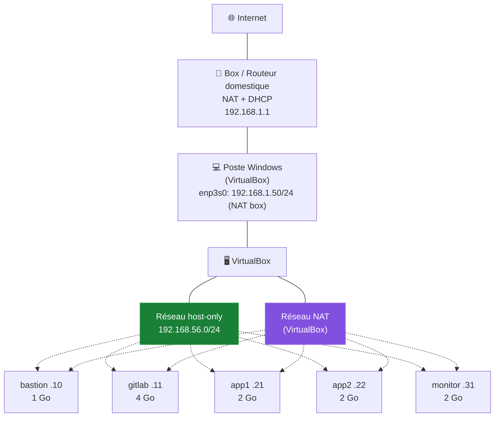

### 1.2 Les deux réseaux de chaque VM

Chaque VM possède **deux interfaces** :

| Interface | Réseau | IP (exemple : app1) | Rôle |
|---|---|---|---|
| `enp0s3` | host-only 192.168.56.0/24 | `192.168.56.21` | Administration, trafic interne du lab |
| `enp0s8` | NAT VirtualBox | `10.0.2.15` (fixe chez VirtualBox) | Accès Internet via le poste hôte |

C'est exactement la topologie d'une vraie entreprise miniature : **un réseau interne isolé** (comme une DMZ/production) + **une sortie Internet contrôlée** (comme un NAT d'entreprise).

### 1.3 Les questions auxquelles ce cours répond

Au fil des parties, on répondra concrètement à :

- Quand `app1` (192.168.56.21) parle à `gitlab` (192.168.56.11), **qui transporte la trame** et comment le sait-il ? *(§4, §5)*
- Pourquoi chaque VM a-t-elle **deux adresses MAC et deux adresses IP** ? *(§3, §6)*
- Comment `gitlab` atteint-il **Internet** alors que son réseau host-only est isolé ? *(§7, §8, §12)*
- Que se passe-t-il **exactement** quand on tape `apt update` sur le bastion ? *(§9, §10, §13)*
- Comment **isoler** le trafic des VMs app de celui du gitlab ? *(§16, §19)*

> [!TIP]
> Gardez une fenêtre SSH ouverte vers `app1` pendant la lecture. Chaque partie se termine par « 💻 Sur ton lab » : 1 à 3 commandes qui **montrent** le concept en vrai.

---

## 2. Pourquoi des couches ? Les modèles OSI et TCP/IP

### 2.1 Le problème que résolvent les couches

Faire communiquer deux machines est un problème **gigantesque** : signaux électriques, adresses, chemins, fiabilité, formats de données… La réponse des ingénieurs : **diviser pour régner**. Chaque couche résout un problème précis et rend un service à la couche au-dessus, sans en connaître les détails.

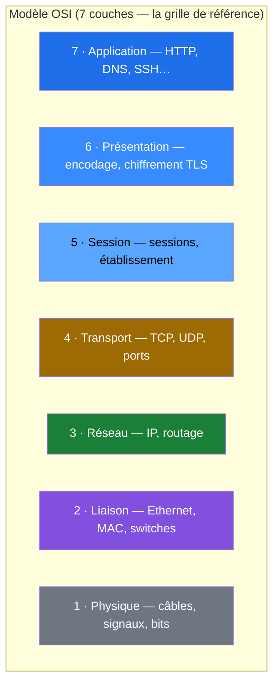

Le monde réel utilise le modèle **TCP/IP** (4 couches), plus simple :

| TCP/IP | Équivalent OSI | Exemples | Unité de données |
|---|---|---|---|
| Application | 5-6-7 | HTTP, DNS, SSH, SMTP | **Données / message** |
| Transport | 4 | TCP, UDP | **Segment** (TCP) / datagramme (UDP) |
| Internet (Réseau) | 3 | IP, ICMP | **Paquet** |
| Accès réseau (Liaison) | 1-2 | Ethernet, Wi-Fi, ARP | **Trame** / bits |

### 2.2 L'encapsulation : la valise russe

Quand tu envoies une requête HTTP, chaque couche **emballle** les données de la couche supérieure en y ajoutant son propre en-tête :

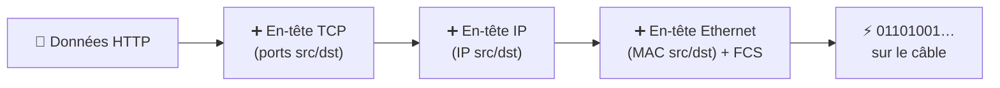

À la réception, le destinateur **désencapsule** dans l'ordre inverse. Le mot-clé à retenir par couche :

| Couche | En-tête contient surtout… | Adresse identifiante |
|---|---|---|
| Ethernet (2) | MAC source/destination | **MAC** (physique, locale au réseau) |
| IP (3) | IP source/destination, TTL, protocole | **IP** (logique, mondiale) |
| TCP/UDP (4) | Ports source/destination | **Port** (le service sur la machine) |

> [!IMPORTANT]
> **La clé de lecture de TOUT le cours** : les adresses MAC changent à **chaque saut** (hop), les adresses IP restent **identiques de bout en bout** (hors NAT). Si tu retiens une seule chose : c'est ça.

### 🎯 Quiz — Modèles et couches

1. Un switch travaille à la couche ___, un routeur à la couche ___.
2. Quelle est l'unité de données de la couche 3 ? De la couche 2 ?
3. Vrai ou faux : l'adresse MAC de destination d'une trame reste la même du départ à l'arrivée sur Internet.

<details>
<summary>✅ Réponses</summary>

1. Couche **2** (liaison), couche **3** (réseau).
2. Couche 3 : le **paquet**. Couche 2 : la **trame**.
3. **Faux** : les MAC sont réécrites à chaque saut ; seules les IP restent stables (hors NAT).
</details>

---

## 3. Couche 1 : le signal et les liens

### 3.1 Le rôle de la couche 1

Transporter des **bits** (0 et 1) entre deux équipements, sous forme de signaux : électriques (cuivre), lumineux (fibre), ondes radio (Wi-Fi). Elle ne connaît ni adresses ni structure — juste « transporter la séquence de bits ».

### 3.2 Les supports

| Support | Débit typique | Distance max | Où on le trouve |
|---|---|---|---|
| Paire torsadée cuivre (RJ45, Cat5e/6/6a) | 1/2.5/10 Gbit/s | 100 m | LAN, bureaux, datacenter cuivre |
| Fibre optique (monomode/multimode) | 10 → 400 Gbit/s | 550 m → 80+ km | Interbâtiment, opérateurs, datacenter cœur |
| Wi-Fi (sans fil) | ~0.1 → 2.4 Gbit/s radio | 30-100 m | Mobilité, terminaux |
| Série / console | 9,6-115,2 kbit/s | 15 m | Administration d'équipements (console RJ45/USB) |

Le câble RJ45 (paires torsadées) — les 8 fils, 4 paires dont certaines dédiées à l'émission/réception :

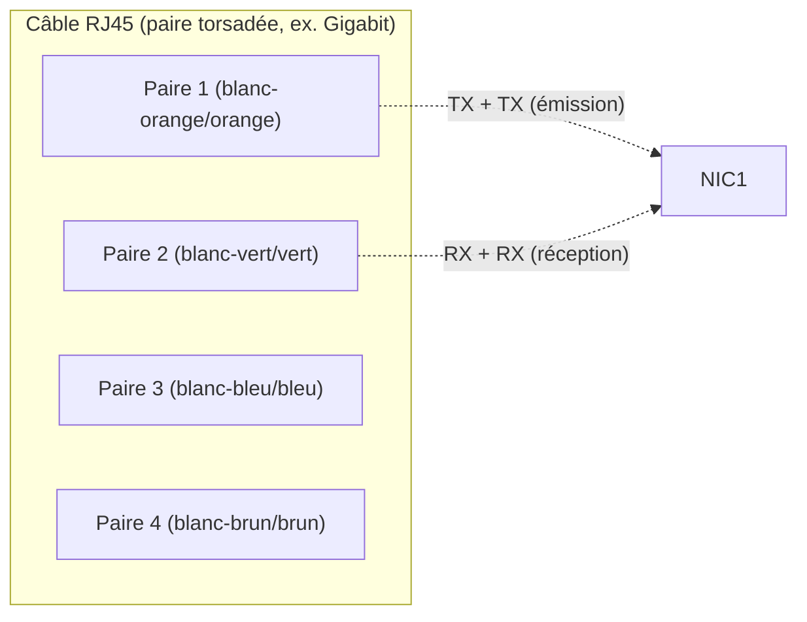

> [!NOTE]
> **Gigabit utilise les 4 paires** (émission ET réception bidirectionnelles). Le fameux « 100 m max » vient de l'**atténuation du signal** au-delà : les erreurs montent, la liaison se dégrade — la longueur est une contrainte physique, pas une convention.

### 3.3 Les équipements de couche 1

- **Câbles, connecteurs, prises murales** ;
- **Répéteurs / hubs** (obsolètes) : régénèrent et diffusent le signal **à tout le monde** — un domaine de collision partagé ;
- **Transceivers / SFP** : modules enfichables qui convertissent (cuivre ↔ fibre) ;
- **TAP** : point d'écoute passif pour capturer le trafic.

> [!IMPORTANT]
> Le **hub** est l'anti-modèle : tout le monde reçoit tout (sécurité nulle + collisions). Le switch (§4) l'a remplacé partout. Si un entretien demande « différence hub/switch » : hub = couche 1, diffuse tout, un domaine de collision ; switch = couche 2, apprend les MAC, isole les conversations.

### 3.4 Débit, bande passante, latence

Trois grandeurs distinctes qu'il ne faut pas confondre :

- **Bande passante** : capacité du lien (ex. 1 Gbit/s) — le « débit max théorique » ;
- **Débit réel** : ce que tu obtiens vraiment, toujours inférieur (overhead protocoles, retransmissions, pertes) ;
- **Latence** : le temps de traversée (ms) — **cruciale** plus que le débit pour la voix, les jeux, les bases de données. Elle combine : propagation (vitesse lumière dans le support), sérialisation (temps d'émettre les bits), et files d'attente (congestion).

```
ping vers gitlab (LAN host-only)     : ~0.3 ms
ping vers un site public (Internet)  : ~10-30 ms
```

### 💻 Sur ton lab

```bash
# Sur app1 : vitesse et état de mes interfaces (couche 1 en vue logicielle)
ip -br link
# Vois : state UP, et le débit négocié
ethtool enp0s3 2>/dev/null | grep -i speed || cat /sys/class/net/enp0s3/speed
```

### 🎯 Quiz — Couche 1

1. Pourquoi le hub est-il mort ? Deux raisons.
2. Bande passante vs latence : quel paramètre compte le plus pour une session SSH interactive ?

<details>
<summary>✅ Réponses</summary>

1. **Sécurité** : tout est diffusé à tous (écoute triviale). **Performance** : un seul domaine de collision, le débit s'effondre dès que plusieurs parlent.
2. La **latence** : SSH n'échange que quelques Ko/s ; c'est le ping (temps de réponse) qui fait la sensation de fluidité, pas le débit.
</details>

---

## 4. Couche 2 : Ethernet, trames et commutateurs (switches)

### 4.1 L'adresse MAC

Une adresse **MAC** (Media Access Control) identifie une interface réseau **au niveau local** :

- 48 bits, notés en hexadécimal : `08:00:27:aa:bb:cc` ;
- les 3 premiers octets (**OUI**) identifient le fabricant — `08:00:27` = VirtualBox (que tu verras partout dans le lab) ;
- gravée en usine (mais modifiable en logiciel — le *spoofing*), **unique par interface** ;
- **portée : le réseau local uniquement.** Une MAC ne passe jamais un routeur.

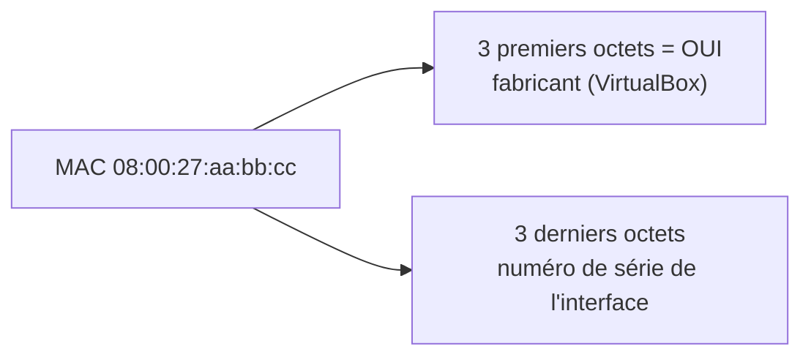

### 4.2 La trame Ethernet

```
┌─────────┬─────────┬──────┬──────────────────────────┬─────┐
│ MAC dst │ MAC src │ Type │       Données (paquet IP) │ FCS │
│ 6 octets│ 6 octets│ 2 o. │        46 à 1500 octets   │ 4 o.│
└─────────┴─────────┴──────┴──────────────────────────┴─────┘
   "À qui ?"  "De qui ?"  "Que contient-je ?"   le cargo    CRC
```

- **MAC destination / source** : les adresses physiques locales ;
- **Type** : ce que transporte la trame — `0x0800` = IPv4, `0x0806` = ARP, `0x86DD` = IPv6 ;
- **FCS** (Frame Check Sequence) : somme de contrôle — si le CRC ne colle pas, la trame est **jetée** (pas de retransmission à ce niveau) ;
- **MTU** : taille max des données = **1500 octets** en standard. Un paquet IP plus gros est **fragmenté** (à éviter — voir §9).

### 4.3 Le switch : apprendre et acheminer

Le switch est **l'équipement central de tout LAN**. Son travail tient en deux mécanismes :

```mermaid
flowchart TB
    subgraph SW["Switch (table CAM / table MAC)"]
        T["Port 1 → MAC 08:00:27:10:aa:01 (bastion)<br/>Port 2 → MAC 08:00:27:11:bb:02 (gitlab)<br/>Port 3 → MAC 08:00:27:21:cc:03 (app1)<br/>Port 4 → MAC 08:00:27:22:dd:04 (app2)"]
    end
    P1["🔌 bastion"] --- SW
    P2["🔌 gitlab"] --- SW
    P3["🔌 app1"] --- SW
    P4["🔌 app2"] --- SW
    style T fill:#0d1117
```

1. **Apprendre** : à chaque trame reçue, il note la MAC **source** et le port d'arrivée dans sa **table CAM** (durée de vie ~5 min) ;
2. **Acheminer** : la MAC destination est dans la table → il n'envoie la trame **que sur le bon port** (unicast). Inconnue → il **diffuse** sur tous les ports (et la réponse l'instruira).

> [!IMPORTANT]
> Conséquence sécurité : un switch **n'isole pas** les conversations au sens cryptographique — n'importe qui sur le LAN peut toujours usurper une MAC, tenter un ARP spoofing (§5) ou écouter en débordant la table CAM. L'isolation vient du chiffrement (TLS/VPN), pas de la couche 2 seule.

**Diffusion (broadcast)** : une trame destination `FF:FF:FF:FF:FF:FF` va à **tous** les ports. C'est comme ça que ARP demande (§5) et DHCP découvre (§11). **Domaine de broadcast** = un réseau IP (un /24 par exemple). Un LAN trop grand, c'est trop de broadcasts — d'où la segmentation (VLAN, §19).

**Boucles et STP** : si on câble deux switches en boucle sans protection, les trames de broadcast tourneraient à l'infini et satureraient tout. Le protocole **STP (Spanning Tree Protocol)** bloque une voie pour transformer la topologie en arbre logique. (Dans VirtualBox tu n'y exposeras jamais, mais dans un vrai réseau ça sauve.)

### 4.4 Types de cartes et modes

- **Half-duplex / full-duplex** : le full-duplex (émettre et recevoir en même temps) est le standard — un désaccord de négociation entre deux équipements crée des pertes massives ;
- **Autonégociation** : vitesse + duplex négociés au branchement ; un lien qui « flappe » (monte/descend) vient souvent d'un défaut de câble ou d'un désaccord de négociation ;
- **Mode promiscuité (promiscuous)** : la carte accepte **toutes** les trames, pas seulement les siennes — nécessaire pour tcpdump/Wireshark (§18) ;
- **Promiscuité dans VirtualBox** : c'est l'option « Promiscuous Mode » des cartes VM — autoriser ou non qu'une VM écoute le trafic des autres sur le même réseau virtuel (à laisser **Deny** sauf besoin d'analyse).

### 💻 Sur ton lab

```bash
# Sur app1 : mes adresses MAC par interface
ip -br link
# La table MAC du "switch" n'est pas visible depuis la VM, mais je peux voir mes voisins via ARP (§5)

# Quel fabricant ? (OUI de VirtualBox attendu sur les interfaces VM)
ip link show enp0s3 | grep ether
```

### 🎯 Quiz — Ethernet et switches

1. Une trame arrive au switch avec une MAC destination **inconnue** de sa table : que fait-il ?
2. Quelle est la MAC destination d'une requête ARP ? D'un DHCP Discover ?
3. Pourquoi une MAC ne traverse-t-elle jamais un routeur ?

<details>
<summary>✅ Réponses</summary>

1. Il **diffuse la trame sur tous les ports** (sauf celui d'origine). Si la machine existe, elle répondra et il l'apprendra.
2. **FF:FF:FF:FF:FF:FF** dans les deux cas : ARP et DHCP découvrent par broadcast.
3. Parce qu'un routeur **sépare deux réseaux** (deux domaines de broadcast) : la portée d'une MAC est un seul réseau local. Au-delà, seule l'adresse IP (couche 3) a un sens global.
</details>

---

## 5. ARP : l'annuaire MAC ↔ IP

### 5.1 Le problème qu'ARP résout

Je suis `app1` (192.168.56.21) et je veux parler à `gitlab` (192.168.56.11). Je connais **l'IP destination** (on verra au §7 comment j'ai su qu'elle est locale). Mais pour construire la **trame Ethernet**, il me faut **la MAC destination**. Comment la trouver ?

**C'est le rôle d'ARP** (Address Resolution Protocol) : *« Qui a 192.168.56.11 ? Donne-moi ta MAC. »*

### 5.2 Le déroulé complet

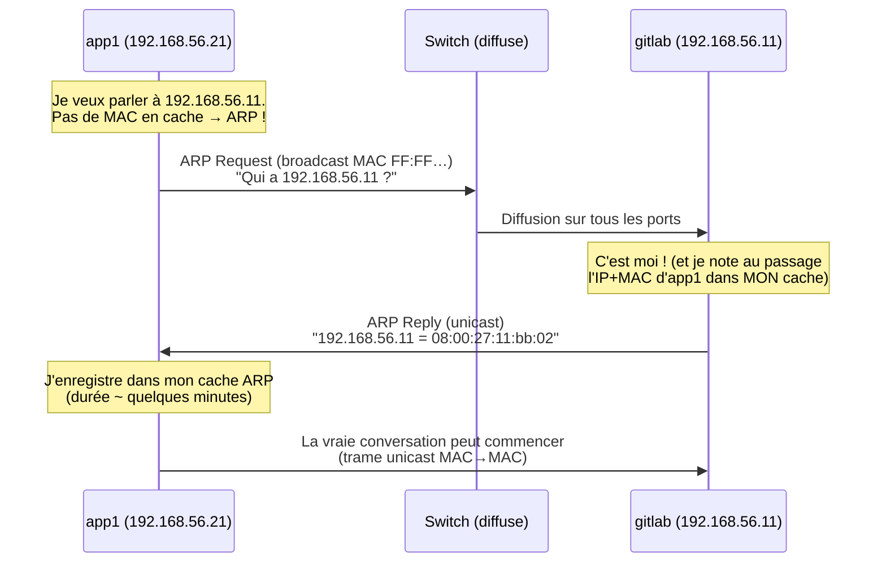

**Points clés :**

- La requête est un **broadcast** (tout le LAN la voit) ; la réponse est un **unicast** direct ;
- **Chacun** apprend au passage : gitlab note l'association d'app1 dans son propre cache ;
- Le cache ARP a une **durée de vie** (quelques minutes) : les entrées périmées sont re-demandées ;
- Un hôte peut **proclamer** son association sans demander (gratuituous ARP) — utilisé après un basculement d'IP (failover, VRRP).

### 5.3 Le piège : ARP spoofing

Rien ne **prouve** une réponse ARP. Un attaquant peut répondre : *« 192.168.56.1, c'est moi ! »* — et intercepter tout le trafic (**MITM**, Man In The Middle). C'est l'attaque LAN la plus classique.

Défenses : **Dynamic ARP Inspection** (switchs pro), port security, segmentation (VLAN), et surtout **chiffrement de bout en bout** (TLS/SSH/VPN) qui rend l'interception inutile même réussie.

### 💻 Sur ton lab

```bash
# Sur app1 : voir le cache ARP en action
ip neigh show
# 192.168.56.11 dev enp0s3 lladdr 08:00:27:xx:xx:xx REACHABLE  ← gitlab

# Forcer une résolution fraîche (on vide puis on parle)
sudo ip neigh flush all
ping -c1 192.168.56.11 >/dev/null
ip neigh show          # l'entrée est revenue !
```

### 🎯 Quiz — ARP

1. Pourquoi ARP est-il indispensable ? Quel lien avec le modèle en couches ?
2. Une machine sur le réseau 192.168.56.0/24 demande la MAC de 8.8.8.8 : que se passe-t-il ?
3. Pourquoi l'ARP spoofing est-il si dangereux ? Quelle défense « propre » ?

<details>
<summary>✅ Réponses</summary>

1. IP (couche 3) choisit la destination, mais **Ethernet (couche 2)** n'achemine que par MAC. ARP est le **pont** entre les deux : il traduit IP→MAC. Sans lui, aucune trame ne peut être construite.
2. Il ne demande **jamais** la MAC d'une IP distante : 8.8.8.8 n'est pas locale, donc il envoie à sa **passerelle** — et il ne demande à ARP… que la MAC de la passerelle.
3. Parce qu'ARP **n'authentifie rien** : n'importe qui peut prétendre être la passerelle et devenir MITM. Défense structurelle : le chiffrement de bout en bout (TLS/VPN), complété par DAI/port-security sur les switchs pro.
</details>

---

---

## 6. Adressage IPv4 : adresses, masques et sous-réseaux

### 6.1 L'adresse IPv4 : 32 bits qui ont un sens

Une adresse IPv4 = **32 bits**, notés en 4 octets décimaux : `192.168.56.21` = `11000000.10101000.00111000.00010101`.

Une adresse ne désigne pas « une machine » mais **une interface** (une carte réseau). Ton poste a une IP par réseau auquel il participe — d'où les deux IP de chaque VM du lab.

### 6.2 Le masque : séparer réseau et hôte

L'adresse se lit en deux parties : **le préfixe réseau** (quelle rue ?) et **l'identifiant d'hôte** (quel numéro dans la rue ?). Le **masque** dit où se fait la coupe :

```
192.168.56.21/24        ← notation CIDR : 24 premiers bits = réseau
masque : 255.255.255.0  ← la même chose en notation « historique »

Réseau    : 192.168.56.0     (les 24 premiers bits)
Hôtes     : de .1 à .254
Broadcast : 192.168.56.255   (parler à TOUS le réseau)
```

> [!IMPORTANT]
> **Le réflexe fondamental** : pour savoir si une IP destination est « locale » ou « distante », je fais un **ET logique** entre son adresse et **mon** masque, et je compare avec **mon** réseau. Identique → locale (je lui parle en direct, §4-5). Différent → distante (je passe par ma passerelle, §7-8). **C'est ce calcul que fait ta machine à chaque paquet.**

### 6.3 Les règles des sous-réseaux

Dans tout sous-réseau IPv4 :
- **l'adresse « tout à zéro »** (`192.168.56.0`) désigne **le réseau lui-même** — non attribuable ;
- **l'adresse « tout à un »** (`192.168.56.255`) est **le broadcast** — non attribuable ;
- il reste donc **2ⁿ − 2 hôtes** utilisables pour n bits d'hôte.

Tailles courantes (CIDR) :

| CIDR | Masque | Hôtes utiles | Usage typique |
|---|---|---|---|
| /30 | 255.255.255.252 | 2 | Liens point-à-point (routeur↔routeur) |
| /29 | 255.255.255.248 | 6 | Petite DMZ |
| /28 | 255.255.255.240 | 14 | Sous-réseau serveurs |
| /26 | 255.255.255.192 | 62 | Département |
| /24 | 255.255.255.0 | 254 | **Le LAN classique (notre lab)** |
| /23 | 255.255.254.0 | 510 | LAN moyen |
| /16 | 255.255.0.0 | 65 534 | Site entier |

### 6.4 Découper : le sous-réseauçage (subnetting)

Besoin : dans 192.168.56.0/24, séparer **serveurs** / **admin** / **apps**. On emprunte des bits au champ hôte :

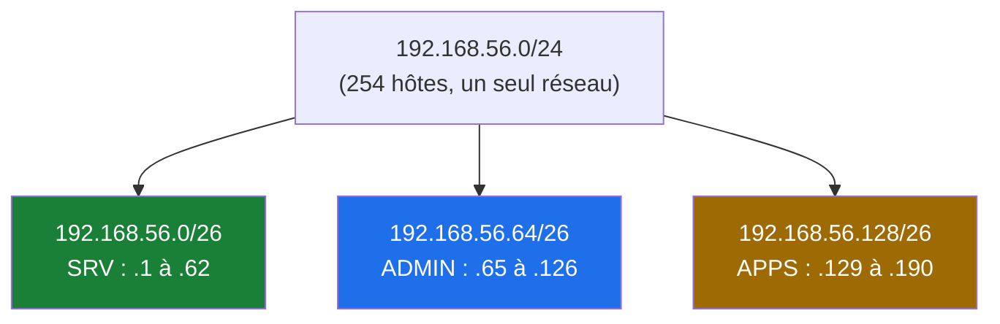

| Sous-réseau | Plage hôtes | Broadcast |
|---|---|---|
| 192.168.56.0/26 | .1 – .62 | .63 |
| 192.168.56.64/26 | .65 – .126 | .127 |
| 192.168.56.128/26 | .129 – .190 | .191 |

**La méthode en 3 questions** (à toujours se poser) : *combien de sous-réseaux ? quelle taille d'hôte ? où tombent les frontières ?* Les frontières d'un /26 tombent sur des multiples de 64 (0, 64, 128, 192) — les multiples du « pas ».

> [!TIP]
> Entraîne-toi à faire ce calcul **de tête** : « Où tombe 192.168.56.173/26 ? » → pas de 64 → 128 ≤ 173 < 192 → sous-réseau .128, broadcast .191. C'est LA question d'entretien réseau par excellence.

### 6.5 Les adresses particulières (à connaître par cœur)

| Bloc | Rôle |
|---|---|
| `127.0.0.0/8` (souvent `127.0.0.1`) | **Loopback** — « moi-même », jamais sur le fil |
| `10.0.0.0/8`, `172.16.0.0/12`, `192.168.0.0/16` | **Privé** (RFC 1918) — non routable sur Internet, le monde des LAN |
| `169.254.0.0/16` | **APIPA** (link-local) — s'auto-attribuée quand DHCP échoue. **La voir = signal d'alarme** (§21) |
| `0.0.0.0/0` | Route par défaut / « n'importe quelle adresse » |
| `255.255.255.255` | Broadcast limité (DHCP Discover) |
| `100.64.0.0/10` | CGNAT (NAT opérateur) |

> [!NOTE]
> Ton lab est entièrement dans le **privé** (192.168.56.0/24 host-only + 10.0.2.0/24 NAT VirtualBox) — c'est le cas de quasiment toute infrastructure d'entreprise. Le monde public n'est rejoint que via le NAT (§12).

### 💻 Sur ton lab

```bash
# Sur app1 : mon adresse, mon masque, mon réseau, mon broadcast
ip -br addr show enp0s3
ip calc 2>/dev/null || python3 -c "
ip='192.168.56.21/24'
import ipaddress
n=ipaddress.ip_interface(ip)
print(f'adresse {n.ip}  réseau {n.network.network_address}  broadcast {n.network.broadcast_address}')
"
```

### 🎯 Quiz — Adressage

1. Combien d'hôtes utiles dans un /28 ? Quelles sont les 2 adresses retirées ?
2. `app1` (192.168.56.21/24) veut parler à 192.168.56.11, puis à 8.8.8.8. Dans chaque cas, locale ou distante ? Comment le sait-il ?
3. Une machine affiche 169.254.10.30 : diagnostic ?

<details>
<summary>✅ Réponses</summary>

1. 2⁴ − 2 = **14 hôtes** ; on retire l'adresse du réseau (.0 du bloc) et le broadcast (la dernière).
2. 192.168.56.11 : **locale** (ET logique avec /24 → 192.168.56.0 = mon réseau). 8.8.8.8 : **distante** (8.8.8.0 ≠ 192.168.56.0) → j'envoie à ma passerelle.
3. **DHCP en échec** : la machine s'est auto-attribué une adresse APIPA. Vérifier le serveur DHCP, le câble/VLAN, ou le scope.
</details>

---

## 7. IP au travail : la table de routage

### 7.1 La décision de chaque paquet

À chaque paquet émis, la machine consulte sa **table de routage** :

> « Pour atteindre la destination X, par quelle **interface** et vers quel **prochain saut** (next-hop) ? »

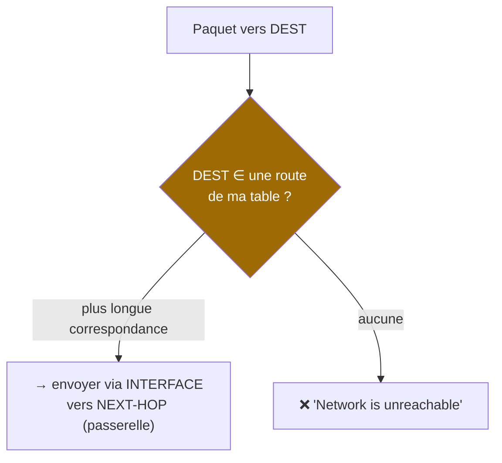

La table d'une VM du lab (typique) :

```
$ ip route
default via 10.0.2.2 dev enp0s8 proto dhcp metric 100     ← route par défaut
10.0.2.0/24 dev enp0s8 proto kernel scope link src 10.0.2.15
192.168.56.0/24 dev enp0s3 proto kernel scope link src 192.168.56.21
```

**Lecture** (c'est LA compétence) :
- `192.168.56.0/24 dev enp0s3` → toute destination dans ce /24 part sur `enp0s3`, **en direct** (ARP, §5) ;
- `default via 10.0.2.2 dev enp0s8` → **tout le reste** part vers la passerelle `10.0.2.2` (le routeur NAT de VirtualBox) ;
- `proto kernel` = route posée automatiquement par l'adresse IP elle-même (connected) ; `proto dhcp` = posée par DHCP.

### 7.2 La règle du préfixe le plus long (longest prefix match)

Si plusieurs routes correspondent, **la plus spécifique gagne** (le plus grand /n) :

```
192.168.0.0/16   via 10.0.2.9      ← route générique
192.168.56.0/24  dev enp0s3        ← route spécifique → ELLE gagne pour .56.x
```

> [!IMPORTANT]
> **Le concept qui explique tout le routage** : les routeurs ne « connaissent » pas Internet. Ils appliquent mécaniquement cette règle à leur table. Tout le métier de routage (statique, dynamique, BGP — §8) revient à **remplir et maintenir ces tables**.

### 7.3 La passerelle (gateway)

La passerelle est simplement **l'IP d'un routeur sur MON réseau** — atteignable en direct (couche 2/ARP), et qui sait continuer le chemin. Sans passerelle sur un réseau isolé : pas de sortie (le host-only du lab en est l'exemple parfait : pas de gateway configurée sur cette interface, donc aucune sortie possible par là).

### 💻 Sur ton lab

```bash
# Sur app1 : ma table de routage, puis tracer la décision
ip route
ip route get 192.168.56.11    # → via enp0s3 (local)
ip route get 8.8.8.8          # → via 10.0.2.2 dev enp0s8 (NAT)
```

### 🎯 Quiz — Table de routage

1. À quoi sert la route `default` ? Que se passe-t-il sans elle ?
2. Routes présentes : `10.0.0.0/8 via A` et `10.2.3.0/24 via B`. Où part un paquet vers 10.2.3.4 ?
3. D'où viennent les routes `proto kernel` sans intervention manuelle ?

<details>
<summary>✅ Réponses</summary>

1. Capturer **tout le reste** (0.0.0.0/0). Sans elle, toute destination hors des routes connues → « Network is unreachable » : réseau isolé.
2. Via **B** : /24 est plus spécifique que /8 (**longest prefix match**).
3. Elles sont **dérivées automatiquement** de l'adressage des interfaces : poser `192.168.56.21/24` sur une carte crée la route du /24 connecté.
</details>

---

## 8. Le routage entre réseaux (routeurs)

### 8.1 Le routeur : la machine qui relie les réseaux

Un **routeur** est un équipement qui possède **une interface dans chaque réseau** qu'il relie, et qui fait traverser les paquets de l'une à l'autre :

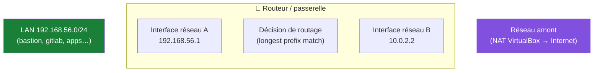

**Ce que fait le routeur en recevant un paquet** :
1. reçoit la trame sur l'interface A, vérifie le CRC, désencapsule le **paquet IP** ;
2. décrémente le **TTL** (anti-boucle : à 0, jeté + message ICMP « Time Exceeded ») ;
3. consulte **sa** table de routage pour la destination ;
4. **ré-encapsule dans une NOUVELLE trame** : MAC source = interface de sortie, MAC destination = résolue par ARP sur le réseau de sortie (les IP, elles, ne bougent pas — §2.2) ;
5. émet.

> [!IMPORTANT]
> C'est ici que le concept §2.2 se matérialise : **à chaque routeur, la trame est réécrite, le paquet est conservé.** TTL qui baisse, MAC qui changent, IP qui restent.

### 8.2 Routage statique vs dynamique

| | Statique | Dynamique (OSPF, BGP…) |
|---|---|---|
| Principe | Routes écrites à la main | Les routeurs **s'échangent** leurs routes |
| Où | Petits réseaux, liens fixes, lab | Grandes infrastructures, redondances |
| Avantage | Simple, prévisible, sûr | S'adapte aux pannes (convergence) |
| Limite | Ne survit pas à un changement de topologie | Complexité, nécessite confiance + filtrage |

```bash
# Route statique : "pour joindre 10.20.0.0/16, passe par 192.168.56.1"
sudo ip route add 10.20.0.0/16 via 192.168.56.1 dev enp0s3
```

Aperçu des protocoles dynamiques (pour culture d'ingénieur) : **OSPF** (IGP interne, à état de liens, converge vite) ; **BGP** (le protocole d'Internet : les opérateurs échangent ~1 million de préfixes ; c'est une faute de config BGP qui a fait tomber Facebook mondial en 2021).

### 8.3 ICMP : le messager du réseau

**ICMP** (Internet Control Message Protocol) transporte les messages d'erreur et de contrôle d'IP :

- **Echo request/reply** → le `ping` (test de joignabilité couche 3) ;
- **Time Exceeded** → le `traceroute` (chaque routeur décrémente le TTL et prévient quand il le jette) ;
- **Destination Unreachable** (réseau, port, filtrage…) — l'information de diagnostic la plus utile du monde.

```
$ traceroute 8.8.8.8
 1  10.0.2.2 (10.0.2.2)   0.4 ms   ← ma passerelle NAT
 2  192.168.1.1 (box)     2.1 ms   ← le routeur domestique
 3  orange.edge…          9.8 ms   ← le FAI
 ...                               ← chaque ligne = un routeur qui a "tué" une sonde TTL
```

> [!WARNING]
> ICMP est souvent **filtré**. Un `ping` qui échoue ne prouve pas que le service est mort — seulement que l'ICMP ne passe pas. À l'inverse, bloquer tout ICMP casse la découverte de MTU (PMTUD) et des erreurs utiles : filtrer sélectivement, pas aveuglément.

### 💻 Sur ton lab

```bash
# Sur app1 : tracer le chemin vers Internet — la chaîne des routeurs réelle
traceroute -n 1.1.1.1    # (ou tracepath 1.1.1.1)
# Ligne 1 : 10.0.2.2 (NAT VirtualBox) → ligne suivante : ton réseau domestique...

# Le TTL en action, vu autrement :
ping -c1 -t1 8.8.8.8     # TTL=1 : la passerelle répond "Time Exceeded" — elle est le 1er saut
```

### 🎯 Quiz — Routage

1. Qu'est-ce qui empêche un paquet de tourner en boucle infinie ? Quel outil s'en sert ?
2. Un paquet traverse 3 routeurs : combien de trames différentes, combien de paquets, combien de fois les IP changent-elles ?
3. Pourquoi le traceroute affiche-t-il des `* * *` sur certaines lignes ?

<details>
<summary>✅ Réponses</summary>

1. Le **TTL**, décrémenté à chaque routeur (jeté à 0). `traceroute` l'exploite volontairement (TTL=1, 2, 3…) pour cartographier le chemin.
2. **4 trames** (1 par segment + réémission à chaque routeur), **1 paquet** (le même), IP src/dst **jamais modifiées** (hors NAT).
3. Ces sauts **ne répondent pas en ICMP** (équipements qui dépriorisent/filtrent ICMP) — le saut est traversé quand même ; seules des `*` sur TOUTES les lignes ensuite signifieraient un vrai blocage.
</details>

---

---

## 9. TCP et UDP : le transport

### 9.1 Pourquoi une couche transport ?

IP achemine les paquets… mais ne garantit rien : pertes, doublons, désordre possibles. Et rien ne dit **quel programme** sur la machine est destinataire. La couche transport ajoute : les **ports** (multiplexage vers les applications) et, avec TCP, la **fiabilité** (reprises, ordre, contrôle de flux).

### 9.2 Les ports : le numéro d'appartement

Une IP = l'immeuble ; le **port** (16 bits, 0-65535) = l'appartement. Le couple **IP:port** identifie une conversation :

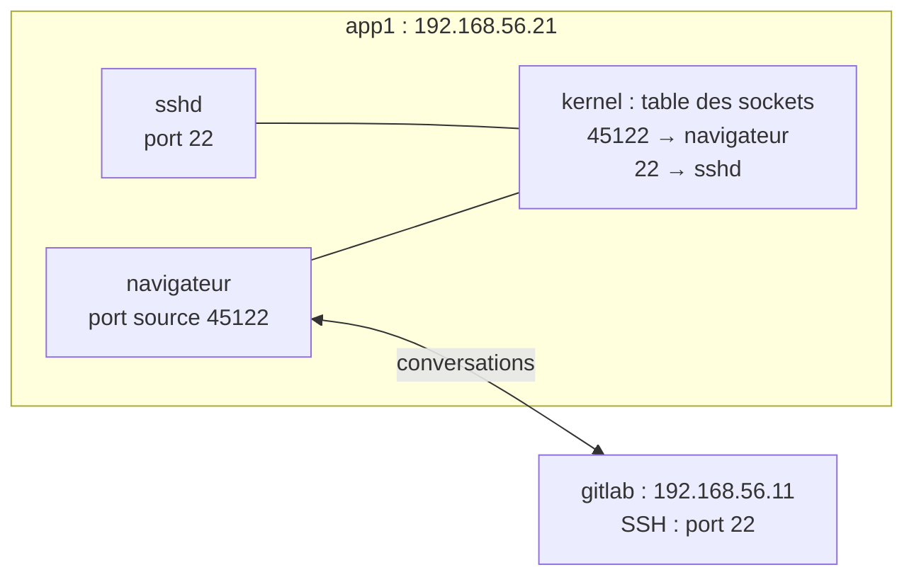

Plages de ports :

| Plage | Nom | Exemples |
|---|---|---|
| 0-1023 | **Well-known** (réservés, root pour écouter) | 22 SSH, 53 DNS, 80 HTTP, 443 HTTPS |
| 1024-49151 | Registered | 3306 MySQL, 5432 PostgreSQL, 8080 alt-HTTP |
| 49152-65535 | Éphémères (clients) | ports sources aléatoires des conversations |

> [!NOTE]
> Côté client : le système tire un **port éphémère** comme source (45122 ci-dessus) ; côté serveur : le **port well-known** connu (22, 443…). Le quad *(IP src, port src, IP dst, port dst)* identifie **une** conversation — c'est ainsi qu'un serveur web sert 10 000 clients sur un seul port 443.

### 9.3 TCP : la fiabilité par la conversation

**TCP** (Transmission Control Protocol) = connecté, fiable, ordonné. La conversation s'ouvre par le fameux **three-way handshake** :

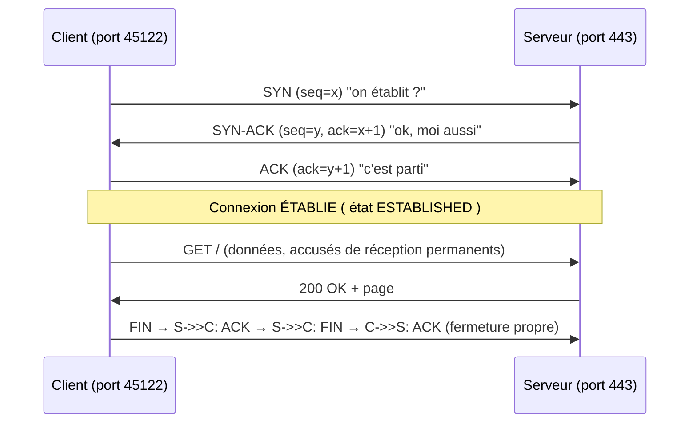

Les mécanismes qui font la fiabilité :

- **Numéros de séquence** : chaque octet numéroté → ordre garanti, pertes détectées ;
- **ACK** : accusés de réception ; pas d'ACK dans le délai → **retransmission** ;
- **Contrôle de flux** (fenêtre) : le récepteur annonce sa capacité — pas d'engorgement du récepteur ;
- **Contrôle de congestion** (slow start, AIMD) : le réseau est saturé ? On ralentit — c'est ce qui évite l'effondrement d'Internet.

> [!TIP]
> Le **handshake TCP est aussi un garde-fou de diagnostic** : `SYN` sans réponse = service down ou filtrage silencieux ; `SYN` puis `RST` = machine vivante mais port fermé ; SYN-ACK reçu = la chaîne IP+transport fonctionne. C'est exactement ce que fait `nmap` (§18).

### 9.4 UDP : simple et léger

**UDP** (User Datagram Protocol) = sans connexion, sans garantie, sans ordre — juste « envoie et prie ». 8 octets d'en-tête contre 20+ pour TCP.

| | TCP | UDP |
|---|---|---|
| Connexion | handshake | aucune |
| Fiabilité | retransmissions | pertes assumées |
| Ordre | garanti | aucun |
| Débit/latence | overhead | minimal |
| Usages | web, SSH, mail, transferts | **DNS (courts échanges)**, streaming, jeux, VoIP, DHCP |

Pourquoi DNS sur UDP ? Une requête/réponse tiennent dans un paquet : le handshake coûterait plus cher que l'échange utile. (DNS/53 passe en TCP pour les grosses réponses et les transferts de zone.)

### 💻 Sur ton lab

```bash
# Voir MES conversations TCP en cours (le quad en vrai)
ss -tan | head -15
# Colonnes : état (ESTAB/SYN-SENT/LISTEN), local IP:port, distant IP:port

# Lister les ports EN ÉCOUTE sur app1 (la surface d'exposition)
ss -tlnp
```

### 🎯 Quiz — Transport

1. Pourquoi un serveur web peut-il servir des milliers de clients avec UN seul port 443 ?
2. `SYN → rien` vs `SYN → RST` : deux diagnostics différents, lesquels ?
3. Pourquoi DHCP est-il forcément en UDP ?

<details>
<summary>✅ Réponses</summary>

1. Chaque client a un **port éphémère distinct** : le quad (IPsrc, portsrc, IPdst, 443) est unique par conversation — le noyau démultiplexe vers le bon socket.
2. Pas de réponse → **filtrage silencieux (DROP)** ou machine éteinte. RST → machine **vivante** mais **port fermé** (ou rejet explicite REJECT).
3. Le client DHCP n'a **pas encore d'IP** : impossible d'établir un TCP qui exigerait des adresses valides — DHCP diffuse en broadcast UDP depuis 0.0.0.0.
</details>

---

## 10. DNS : l'annuaire du réseau

### 10.1 Le problème

Les humains retiennent `github.com`, les machines n'acheminent que des IP. Le **DNS** (Domain Name System) traduit les noms en adresses — annuaire **distribué, hiérarchique et mis en cache**, ouvrage d'ingénierie parmi les plus robustes du monde.

### 10.2 La hiérarchie et la résolution

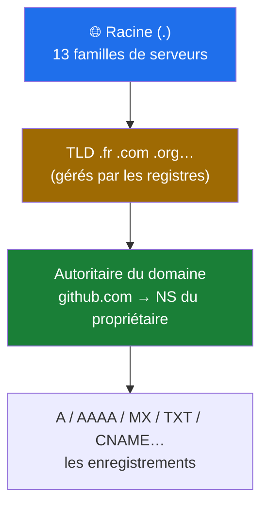

Quand tu résous `github.com` (première fois) :

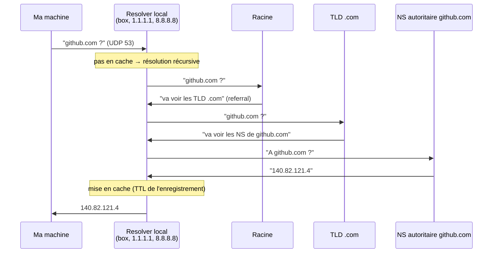

### 10.3 Les enregistrements à connaître

| Type | Rôle | Exemple |
|---|---|---|
| **A** | nom → IPv4 | `gitlab 192.168.56.11` |
| **AAAA** | nom → IPv6 | — |
| **CNAME** | alias vers un autre nom | `www → monsite.fr` |
| **MX** | serveurs mail du domaine (priorité) | `10 mail.mondomaine.fr` |
| **TXT** | texte libre : SPF, DKIM, vérifications | `v=spf1 …` |
| **NS** | serveurs de noms autoritaires | `ns1. registrar…` |
| **PTR** | inverse : IP → nom (rDNS) | `4.121.82.140.in-addr.arpa → github.com` |

### 10.4 Cache, TTL et le DNS du lab

Chaque réponse porte un **TTL** (durée de validité). Résolveur OS → resolver local → serveurs autoritaires : chaque niveau met en cache. Conséquences pratiques : un **changement de DNS se propage lentement** (jusqu'à expiration des TTL), et un `dig` montre de qui vient la réponse (flag `aa` = autoritaire, sinon cache).

Dans le lab : la phase GitLab CE ajoutera son propre DNS/masquerade — mais dès maintenant, les VMs utilisent le resolver de VirtualBox/box. Le réflexe pro : **tester la résolution séparément de la connectivité** (`dig` vs `ping`).

```bash
dig +short github.com          # réponse finale
dig github.com                 # tout : serveur interrogé, TTL, autorité…
dig -x 140.82.121.4            # résolution inverse (PTR)
```

> [!WARNING]
> « Ça ne marche pas » se split en deux causes totalement différentes : **résolution** (DNS : `dig` échoue) vs **connectivité** (`dig` OK mais `curl` KO). Toujours séparer les deux avant de chercher ailleurs. (§21.)

### 🎯 Quiz — DNS

1. Quelle différence entre un **résolveur récursif** et un serveur **autoritaire** ?
2. Tu viens de changer l'IP d'un enregistrement : pourquoi certains voient l'ancienne encore des heures ?
3. Quel type d'enregistrement prouve la légitimité d'envoi d'un domaine en mail ?

<details>
<summary>✅ Réponses</summary>

1. Le récursif **cherche pour vous** (descend l'arbre, met en cache) ; l'autoritaire **détient la réponse officielle** d'une zone (flag `aa`).
2. Les résolveurs intermédiaires gardent l'ancienne valeur **jusqu'à expiration du TTL** de l'enregistrement — la propagation suit les caches, pas la config.
3. **TXT** (SPF, et DKIM/DMARC) — les garde-fous anti-usurpation d'expéditeur.
</details>

---

## 11. DHCP : qui distribue les adresses

### 11.1 Le problème et la solution

Attribuer à la main IP/masque/passerelle/DNS sur chaque machine = ingérable. **DHCP** (Dynamic Host Configuration Protocol) distribue automatiquement un **bail** (lease) : IP, masque, passerelle, DNS, durée.

### 11.2 Le processus DORA

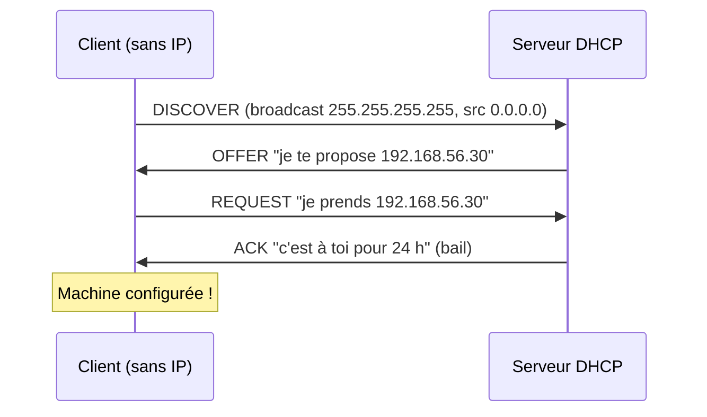

Tout se fait en **broadcast UDP** (le client n'a ni IP ni connaissance du serveur). Sur un réseau segmenté, un **DHCP relay** transmet les broadcasts vers le serveur central.

Le bail se renouvelle à mi-vie ; expiration → la machine rend l'IP (et retombe en APIPA si plus de serveur — le lien avec §6.5 !).

### 11.3 DHCP statique : le bon compromis du lab

Dans le lab, on veut des IP **fixes** (les playbooks Ansible ciblent des adresses) sans tout configurer à la main : **réservation DHCP** = le serveur attribue **toujours la même IP à une MAC donnée**. Alternative : adresses statiques dans la config réseau — mais la réservation centralise tout dans le DHCP.

> [!WARNING]
> **Deux serveurs DHCP actifs sur le même réseau = bombe à retardement** (réponses concurrentes, bails incohérents). Si des machines du lab prennent des IP inattendues, soupçonner un second DHCP (une VM mal configurée, par exemple) — le diagnostic s'appelle *rogue DHCP*.

### 💻 Sur ton lab

```bash
# Qui m'a donné mon bail et quand expire-t-il ?
journalctl -u systemd-networkd | grep -i dhcp | tail -5   # selon distro
nmcli dev show enp0s3 | grep -E 'DNS|GATEWAY'             # ce que DHCP a poussé
```

### 🎯 Quiz — DHCP

1. Quels 4 éléments minimum un bail DHCP transmet-il ?
2. Pourquoi le DISCOVER est-il broadcast et non unicast ?
3. Une machine affiche 169.254.x.x : quel lien avec DHCP ?

<details>
<summary>✅ Réponses</summary>

1. **IP + masque + passerelle + DNS** (+ domaines, NTP, durées…).
2. Le client n'a **aucune IP ni adresse du serveur** : seule la diffusion peut toucher « le » serveur, quel qu'il soit.
3. DHCP **échoué** : après plusieurs essais, la machine s'auto-attribue une APIPA (link-local). Voir §6.5 et §21.
</details>

---

## 12. NAT : partager une seule adresse publique

### 12.1 Le problème : pénurie d'IPv4

4,3 milliards d'adresses IPv4 pour des dizaines de milliards d'appareils. Solution mondiale provisoire (depuis 1994 !) : le **NAT** (Network Address Translation) — un monde intérieur d'adresses privées (RFC 1918, §6.5) qui sortent toutes sous **une** (ou quelques) adresse(s) publique(s).

### 12.2 Comment ça marche : la table de traduction

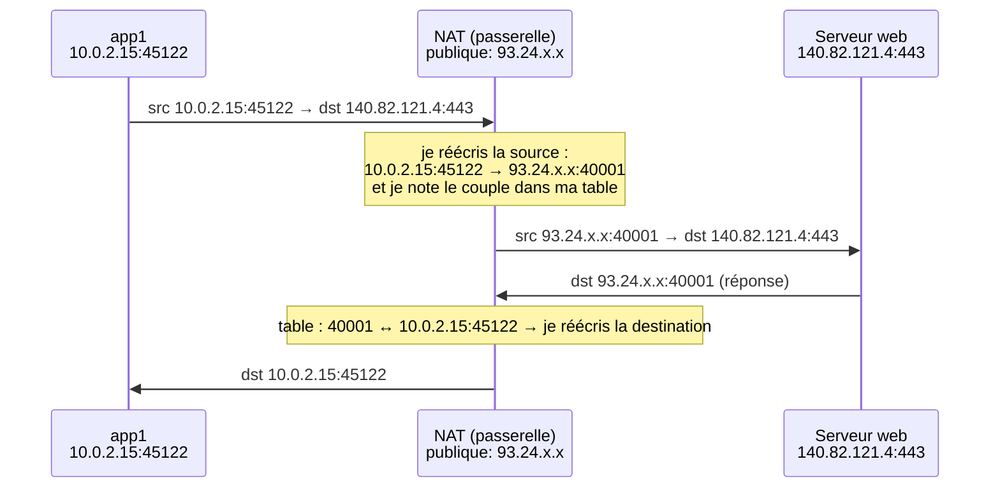

Le NAT fonctionne parce que les **ports** rendent chaque conversation **unique** (§9) : 65 535 conversations possibles derrière une seule IP publique. C'est du **NAPT/PAT** (« NAT overload »), le NAT que tout le monde pratique sans le savoir.

**Conséquences conceptuelles (niveau ingénieur)** :
- le NAT **casse le modèle de bout en bout** : l'initiateur doit être **depuis l'intérieur** ; l'extérieur ne peut pas « entrer » sans règle spéciale (**port forwarding / DNAT**) ;
- il rend l'intérieur **invisible** (effet de sécurité par masquage, mais **pas** un pare-feu) ;
- il complique certains protocoles qui embarquent des IP dans leurs données (FTP actif, SIP) — d'où les « NAT helpers » et la préférence moderne pour TLS/QUIC.

### 12.3 Le NAT dans ta vie, tous les niveaux

| Niveau | Qui NATte | Exemple |
|---|---|---|
| **VirtualBox NAT** | le moteur VirtualBox | tes VMs (10.0.2.15) sortent via l'IP du poste |
| **Box domestique** | ton routeur WiFi | tous tes appareils sortent sous l'IP publique du FAI |
| **CGNAT** | l'opérateur | des dizaines d'abonnés derrière UNE IP publique |
| **Entreprise** | pare-feu de bordure | sorties contrôlées et journalisées |

Ton paquet vers GitHub traverse **les trois** premiers niveaux — d'où l'intérêt de `traceroute` (§8.3) qui les montre.

### 💻 Sur ton lab

```bash
# Sur app1 : je vois MA source privée, mais le serveur distant voit autre chose
curl -s https://api.ipify.org && echo   # → l'IP PUBLIQUE de ta box, pas 10.0.2.15 !
ip route get 1.1.1.1                     # → via 10.0.2.2 : le NAT VirtualBox est le 1er traducteur
```

### 🎯 Quiz — NAT

1. Pourquoi le NAT est-il indispensable au bon fonctionnement des ports ?
2. Un collègue doit accéder depuis Internet à un service interne (192.168.56.11:443) : quelle règle NAT, et quelle réflexion sécurité avant ?
3. Le NAT est-il une mesure de sécurité suffisante ? Pourquoi ?

<details>
<summary>✅ Réponses</summary>

1. Il traduit IP **et ports** (PAT) : c'est le port source unique de chaque conversation qui permet de démêler les réponses et de partager une IP publique entre des milliers de flux.
2. Une règle **DNAT/port forwarding** : IP_publique:443 → 192.168.56.11:443. Réflexion sécurité : exposer publiquement un GitLab impose TLS, auth forte, mises à jour, restriction par IP source si possible — idéalement passer par un VPN (§17) plutôt qu'ouvrir.
3. **Non** : il masque l'intérieur mais ne filtre ni ne détecte rien ; dès qu'une règle DNAT existe, la machine est exposée. Le NAT est un mécanisme d'économie d'adresses, pas un pare-feu (§16).
</details>

---

---

## 13. Applications : HTTP/HTTPS et le chemin complet d'une requête

### 13.1 HTTP : le protocole du web

**HTTP** (HyperText Transfer Protocol) repose sur le modèle requête/réponse :

```
Requête                              Réponse
─────────                            ───────
GET /index.html HTTP/1.1             HTTP/1.1 200 OK
Host: gitlab.mondomaine.fr           Content-Type: text/html
User-Agent: curl/8.5.0               Content-Length: 5120
Accept: text/html                    <html>… (corps)
```

Méthodes principales : **GET** (lire), **POST** (créer/envoyer), **PUT** (remplacer), **PATCH** (modifier partiellement), **DELETE** (supprimer), **HEAD** (en-têtes seulement). Codes de réponse : **2xx** succès, **3xx** redirection, **4xx** faute du client (404 introuvable, 403 interdit, 401 non authentifié), **5xx** faute du serveur (500, 502/503 = souvent le reverse-proxy qui ne joint pas le backend — réflexe DevOps !).

- **HTTP/1.1** : une requête à la fois par connexion (pipelining limité) ;
- **HTTP/2** : multiplexé (plusieurs flux dans une connexion), compression d'en-têtes ;
- **HTTP/3** : sur **QUIC** (au-dessus d'UDP) — handshake plus rapide, résiste aux changements de réseau (mobile).

### 13.2 HTTPS = HTTP + TLS

**TLS** (Transport Layer Security) chiffre et authentifie la connexion. Le handshake simplifié :

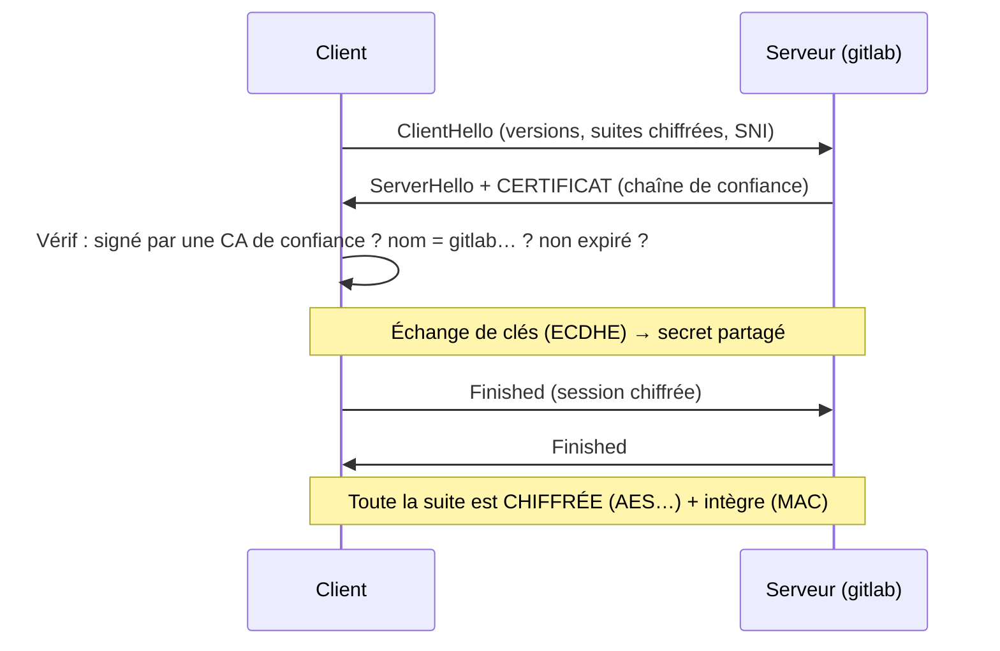

Trois garanties : **confidentialité** (chiffrement), **intégrité** (détection de modification), **authenticité du serveur** (certificat validé par une CA — c'est la chaîne de confiance de ton navigateur/OS). **SNI** (Server Name Indication) : le client annonce le nom visé en clair dans le hello (permet l'hébergement mutualisé ; existe en version chiffrée ECH).

> [!IMPORTANT]
> Certificats du lab : autosignés = avertissements, acceptable en local mais pas une habitude à prendre. La voie pro : une **CA interne** (ex. `step-ca`, smallstep) dont on installe le certificat racine sur les VMs — tout le TLS interne devient valide, réflexe d'entreprise.

### 13.3 Le chemin complet : « apt update » sur app1, décomposé

Assemblage final — que se passe-t-il entre la commande et la réponse ? C'est le **cours entier en une séquence** :

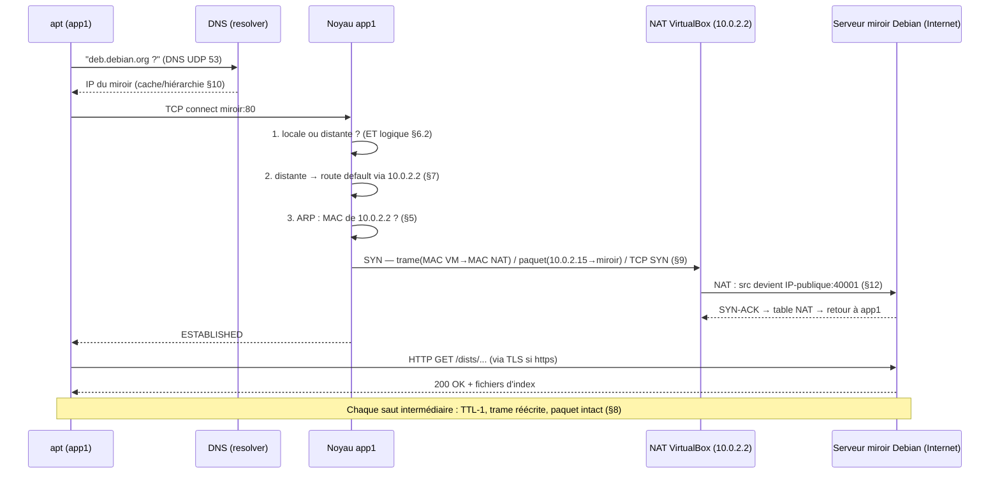

Le même déroulé vaut pour `git clone` (SSH/443 vers gitlab), un appel API, une télémétrie Prometheus. **Diagnostiquer un réseau = savoir sur quelle flèche de ce diagramme le déroulé s'arrête.** C'est l'objet du §21.

### 🎯 Quiz — Applications

1. Un `curl` renvoie **502 Bad Gateway** : le DNS et le réseau fonctionnent. Quelle hypothèse prioritaire ?
2. Pourquoi le certificat d'un serveur interne autosigné déclenche-t-il une alerte, et quelle solution propre ?
3. Dans la séquence 13.3, où les IP sources changent-elles ? Où les MAC ?

<details>
<summary>✅ Réponses</summary>

1. Le **reverse-proxy joignant le backend** : le proxy répond (il est vivant), mais l'application derrière ne répond pas/plus — vérifier le service upstream, son port, sa santé.
2. Le client ne peut pas rattacher le certificat à une **CA de confiance**. Solution : CA interne dont le certificat racine est déployé sur les clients (§13.2), pas l'habitude d'accepter les exceptions.
3. IP : **uniquement dans la table NAT** (G). MAC : **à chaque saut** (ici : app1→NAT puis NAT→box, etc.).
</details>

---

## 14. Wi-Fi : la couche 2 sans fil

### 14.1 Ce qui change par rapport au fil

Le Wi-Fi (802.11) réutilise le modèle : MAC, trames, broadcast — mais le support radio impose des solutions spécifiques :

- **CSMA/CA** : on écoute avant d'émettre et on attend un délai aléatoire (**collision avoidance**, pas détection comme en fil — on ne peut pas écouter et parler en même temps en radio) ;
- **Le signal n'a pas de frontière** : impossible de « câbler proprement » jusqu'au switch ; tout flotte dans l'air → d'où le chiffrement obligatoire ;
- **BSSID/SSID** : le SSID est le nom du réseau ; le BSSID, l'adresse MAC du point d'accès ; un AP peut servir plusieurs SSID (mappés sur des VLAN — §19) ;
- **Itinérance (roaming)** : plusieurs AP au même SSID, le terminal bascule — d'où les contrôleurs/protocoles 802.11k/v/r en entreprise.

### 14.2 Sécurité Wi-Fi : WEP → WPA2 → WPA3

| Norme | État | Pourquoi |
|---|---|---|
| WEP | ☠️ mort (craqué en minutes) | clé statique, RC4 cassé |
| WPA | obsolète | patch transitoire |
| **WPA2-PSK** | courant chez les particuliers | AES solide, mais **clé partagée** : qui a la clé a le réseau |
| **WPA2-Entreprise (802.1X)** | standard pro | chaque utilisateur s'authentifie individuellement (RADIUS) |
| **WPA3-SAE** | moderne | protège contre les attaques hors-ligne sur la passphrase |

> [!IMPORTANT]
> En entreprise : **jamais de PSK partagé** pour les usagers — 802.1X (identifiants individuels, révocation par personne, traçabilité). Le portail captif n'est pas une authentification, c'est un panneau d'affichage.

### 14.3 Le Wi-Fi dans l'ingénierie réseau

Un AP = un hub radio déguisé en switch : **le médium est partagé** — tous les clients d'un même canal/cellule se partagent le débit. Dimensionner un Wi-Fi d'entreprise, c'est compter les **cellules** (AP), leurs canaux (sans chevauchement 1/6/11 en 2,4 GHz), la puissance et l'atténuation des murs. La « fibre dans le mur » ne remplace pas une étude radio.

### 🎯 Quiz — Wi-Fi

1. Pourquoi dit-on que le Wi-Fi est un « hub déguisé » au niveau médium ?
2. WPA2-PSK vs WPA2-Entreprise : la différence structurelle ?

<details>
<summary>✅ Réponses</summary>

1. Tous les clients d'une cellule **partagent le même médium radio** : un seul parle à la fois (CSMA/CA), le débit se divise — comme l'ancien hub coaxial.
2. PSK = **une clé pour tous** (compromise = tout est perdu, aucune traçabilité) ; Entreprise = **802.1X/RADIUS** : identifiants individuels, révocables, journalisés.
</details>

---

## 15. IPv6 : le futur déjà là

### 15.1 Pourquoi IPv6 existe

IPv4 = 4,3 milliards d'adresses : épuisé depuis 2011 (les pools régionaux sont vides — d'où CGNAT partout, §12). **IPv6 = 128 bits** : 340 undécillions d'adresses — chaque grain de sable en aurait des milliards. Déployé massivement (Google mesure ~45 % de son trafic en IPv6, mobile en tête).

### 15.2 La notation

128 bits notés en **8 groupes hexadécimaux** séparés par `:` avec des règles de compression :

```
complet  : 2001:0db8:0000:0000:0000:8a2e:0370:7334
compressé: 2001:db8::8a2e:370:7334      ← :: = groupes de zéros (UNE seule fois)
```

Structure d'une adresse globale :

```
2001:0db8:1234:5678:0000:0000:0000:0001
└────┬────┘└──┬──┘└──────────┬─────────┘
  préfixe   sous-réseau   identifiant interface (64 bits)
  global    (RIR/FAI/soi)  ← souvent dérivé de la MAC (EUI-64) ou aléatoire
```

- **Préfixe standard** : un LAN reçoit un **/64** (toujours 64 bits d'interface) ; une entreprise typique : /48 → 65 536 sous-réseaux. **Fini la pénurie et le subnetting d'entretien** : on n'économise plus les adresses, on segmente largement ;
- **Link-local** `fe80::/10` : auto-configurée sur chaque interface, jamais routée (voisins, OSPF…) ;
- **ULA** `fd00::/8` : l'équivalent des RFC 1918 (privé) ;
- Plus de broadcast : **multicast** (ff02::1 = tous les nœuds du lien) et **anycast** ;
- **SLAAC** : auto-configuration sans serveur (le routeur annonce le préfixe, la machine se construit son adresse) — en complément de DHCPv6 ;
- **NDP** remplace ARP (résolution voisins via ICMPv6) ;
- La boucle : `::1`.

### 15.3 Dual-stack : la réalité de 2026

Presque partout on tourne en **double pile** : IPv4 + IPv6 simultanés, IPv6 préféré s'il est joignable. Dans le lab VirtualBox, les VMs ont par défaut une link-local IPv6 sur chaque interface — tu peux déjà l'observer.

> [!TIP]
> La compétence 2026 n'est pas « migrer tout en IPv6 » mais **bilinguisme** : lire une table de routage v6, comprendre qu'un service n'écoute que sur `::` (donc joignable en v6) et diagnostiquer « pourquoi ça passe en v4 mais pas v6 » (ou l'inverse). Beaucoup d'incidents « réseau » modernes sont des demi-piles mal appariées.

### 💻 Sur ton lab

```bash
ip -6 addr show        # ta link-local fe80::… déjà là
ip -6 route            # fe80::/10 dev … (la route "voisins")
ping -6 -c1 fe80::1%enp0s3   # ping v6 vers la passerelle du lien (si présente)
```

### 🎯 Quiz — IPv6

1. Pourquoi n'y a-t-il plus de « calcul de subnetting » d'entretien en IPv6 ?
2. ::1, fe80::/10, fd00::/8, ff02::1 : à quoi chacun sert-il ?
3. Quelle est la vraie compétence IPv6 de 2026 ?

<details>
<summary>✅ Réponses</summary>

1. Convention standard : **/64 par segment, /48 par site** — les frontières sont fixées, on ne bricole plus les bits (on segmente par sous-réseaux entiers).
2. `::1` loopback ; `fe80::/10` link-local (non routée) ; `fd00::/8` ULA privé ; `ff02::1` multicast de lien (remplace le broadcast).
3. Le **bilinguisme opérationnel** : diagnostiquer les interactions dual-stack (service qui n'écoute qu'en v6, DNS avec ou sans AAAA, préférence de source…).
</details>

---

---

## 16. Sécurité réseau : firewalls, filtrage, segmentation

### 16.1 La doctrine : défense en profondeur

Aucun mécanisme unique ne suffit. Le modèle d'ingénieur : **couches de contrôles** — segmentation (limiter le rayon d'action), filtrage (autorisations explicites), chiffrement (confidentialité même en cas d'interception), supervision (détecter), le tout sous une posture *zero-trust* : *never trust, always verify* — le fait d'être « sur le LAN interne » ne vaut plus autorisation.

### 16.2 Le pare-feu : filtrer les flux

Un **pare-feu** applique des règles aux paquets/connexions. Deux grandes familles :

- **Filtrage sans état** : chaque paquet jugé isolément (ACL de routeur) ;
- **Filtrage à état** (le standard) : le pare-feu suit les **connexions** — si un flux sorti est autorisé, ses réponses rentrent automatiquement (table d'états). C'est ce que fait **nftables/iptables** sur tes VMs.

Le modèle de règles de référence (chez soi comme en prod) :

```
# Politique par défaut : TOUT INTERDIRE, puis n'autoriser que le nécessaire
# (least privilege réseau — le même réflexe que pour les permissions fichiers)

1. Autoriser établies/related          (les réponses des flux sortants)
2. Autoriser loopback                  (127.0.0.1 doit toujours fonctionner)
3. Autoriser SSH depuis l'admin UNIQUEMENT   (192.168.56.10 → :22)
4. Autoriser 443 vers gitlab depuis le LAN
5. Tout le reste : DROP (et journaliser)
```

> [!IMPORTANT]
> **Défaut = refus**. Une règle « autoriser » qui manque se voit vite (le service ne marche pas). Un filtrage « tout autoriser sauf… » échoue silencieusement (personne ne connaît la liste complète de ce qu'il fallait interdire).

### 16.3 Zone de confiance : DMZ et segmentation

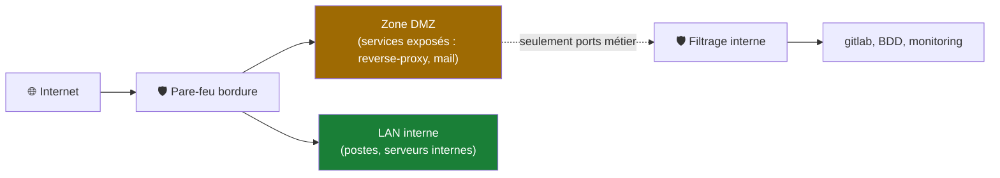

Principes : ce qui est **exposé** vit en DMZ, compromettable sans prendre l'intérieur ; l'intérieur n'accepte du DMZ **que les flux métier** ; le transit s'observe et se journalise. Dans le lab : le host-only joue le rôle d'« interne » ; ajouter un troisième réseau « DMZ » pour le futur reverse-proxy Traefik (phase 5) serait l'exercice parfait.

### 16.4 Les attaques LAN classiques (et leurs défenses)

| Attaque | Principe | Défenses |
|---|---|---|
| **ARP spoofing / MITM** | usurper la passerelle en ARP (§5.3) | DAI, chiffrement de bout en bout |
| **MAC flooding** | saturer la table CAM pour forcer le hub-mode | port security, limites de MAC |
| **DHCP rogue** | faux serveur DHCP (§11.3) | DHCP snooping |
| **Scan de ports** | cartographier les services (§9.3, nmap) | réduire la surface (§22), tarpit/rate-limit |
| **DoS/DDoS** | saturer une ressource | filtrage amont, rate limiting, CDN |

### 16.5 Pare-feu local : nftables sur tes VMs

Chaque VM doit se défendre **elle-même** (host firewall) — c'est le dernier rempart quand tout le reste a été traversé. Sous Linux moderne : **nftables** (successeur d'iptables).

```bash
# Exemple minimal pour app1 : SSH depuis bastion + établies, reste en drop
sudo nft add table inet filter
sudo nft add chain inet filter input '{ type filter hook input priority 0 ; policy drop ; }'
sudo nft add rule inet filter input iif lo accept
sudo nft add rule inet filter input ct state established,related accept
sudo nft add rule inet filter input tcp dport 22 ip saddr 192.168.56.10 accept
sudo nft list ruleset
```

> [!WARNING]
> Règle d'or quand on teste un pare-feu **à distance** : prévoir un **rollback** (une crontab qui désactive le ruleset dans 5 minutes, ou une console locale). Se barrer la route SSH à soi-même est la faute de filtrage la plus fréquente de l'histoire des sysadmins.

### 💻 Sur ton lab

```bash
sudo nft list ruleset            # l'état actuel (souvent vide par défaut)
sudo ufw status verbose 2>/dev/null  # si ufw est installé (frontal simple de nft)
```

### 🎯 Quiz — Sécurité

1. Pourquoi « défaut = refus » plutôt que « tout autoriser sauf la liste des interdits » ?
2. Un serveur en DMZ est compromis. À quoi sert exactement le filtrage DMZ→interne ?
3. Pourquoi le pare-feu local d'une VM reste-t-il utile alors qu'un pare-feu réseau existe déjà ?

<details>
<summary>✅ Réponses</summary>

1. Parce qu'on ne peut **pas énumérer ce qu'il faut interdire** (la menace évolue) ; on sait en revanche exactement ce qui est légitime. L'inverse échoue silencieusement.
2. À **limiter le rayon** : l'attaquant n'obtient que ce que la DMZ a le droit de toucher (souvent presque rien vers l'intérieur) — le rebond est bloqué ou au moins journalisé/ralentit.
3. **Défense en profondeur** : le trafic interne (VM↔VM, lateral movement) ne traverse jamais le pare-feu réseau ; seul le pare-feu local protège contre un pair compromis sur le même LAN.
</details>

---

## 17. VPN : tunnels chiffrés

### 17.1 À quoi ça sert vraiment

Un **VPN** crée un tunnel chiffré entre deux points à travers un réseau hostile, offrant : **confidentialité** (personne ne lit le contenu), **intégrité** (altération détectée), **authentification mutuelle** (seuls les légitimes entrent), et extension logique de réseau (le client distant « est » dans le LAN).

Usages d'ingénieur : accès distant des admins (remplace les ouvertures de ports), liaison inter-sites (site A ↔ site B), accès à un lab depuis l'extérieur (ton cas d'usage futur : joindre 192.168.56.x depuis ailleurs), trafic de management protégé.

### 17.2 Les deux familles

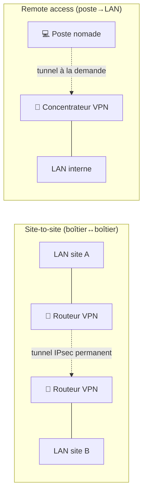

Technologies à connaître :

| Techno | Profil | Notes |
|---|---|---|
| **IPsec** | site-to-site historique, standard interopérable | IKEv2 pour l'établissement ; complexité de config |
| **WireGuard** | moderne, minimal (4 000 lignes), rapide, cryptographie à jour | le choix par défaut aujourd'hui pour tout ce qui n'a pas de contrainte héritée ; intégré au noyau Linux |
| OpenVPN | polyvalent, TLS-based | plus lourd, très répandu, historique |

**WireGuard en 4 idées** : clés publiques/privées par pair (comme SSH), chaque pair déclare les **réseaux autorisés derrière lui** (`AllowedIPs` — qui servent à la fois d'ACL et de table de routage), pas de handshake permanent (silencieux quand inactif), interface `wg0` classique. Un tunnel lab = ~10 lignes de config.

### 17.3 Le VPN dans ton lab (cas d'usage concret)

Objectif type : joindre le host-only (192.168.56.0/24) depuis un autre poste ou depuis ton téléphone (test mobile de Traefik plus tard) :

1. **bastion** héberge WireGuard (interface `wg0` en 10.10.0.1/24) ;
2. ton poste : client WireGuard (10.10.0.2), `AllowedIPs = 192.168.56.0/24, 10.10.0.0/24` ;
3. bastion : `ip_forward` activé + NAT/masquerade de 10.10.0.0/24 vers 192.168.56.0/24 ;
4. le client « voit » le LAN complet sans AUCUN port exposé sur Internet (juste UDP/51820 vers bastion).

> [!IMPORTANT]
> Exposer un service = agrandir la surface. Exposer **un VPN** = un seul port UDP chiffré, authentifié par clés, pour rejoindre tout le reste. C'est le réflexe des équipes sysadmin : *« on n'ouvre pas SSH au monde, on ouvre le VPN »*.

### 🎯 Quiz — VPN

1. Un VPN chiffre-t-il « tout Internet » ? Quelle nuance importante ?
2. Dans WireGuard, que font les `AllowedIPs` (deux rôles) ?
3. Pourquoi préférer un VPN à un port forwarding SSH direct sur Internet pour l'admin du lab ?

<details>
<summary>✅ Réponses</summary>

1. Il chiffre **le tronçon client↔concentrateur**, pas de bout en bout : après le concentrateur (serveur VPN commercial ou box), le trafic redevient classique (HTTPS reste chiffré lui-même). Le VPN protège le **transport**, pas les applications qui ne chiffrent pas.
2. **Routage** (quels destins partent dans le tunnel) et **ACL** (quels sources le pair est autorisé à présenter) — un seul champ, deux effets.
3. SSH exposé = un service d'attaque directe (brute force, CVE) sur une machine critique ; le VPN n'expose qu'un port UDP muet qui **ne répond même pas** aux pairs sans clés — et donne accès à tout le LAN, pas qu'à une machine.
</details>

---

## 18. Outils d'observation et de diagnostic

### 18.1 La trousse à outils par couche

| Couche | Outil | Question à laquelle il répond |
|---|---|---|
| 1-2 | `ip link`, `ethtool` | mon lien est-il UP ? vitesse, erreurs ? |
| 2 | `ip neigh` (ARP) | mes voisins sont-ils visibles ? |
| 3 | `ping`, `ip route get`, `traceroute` | l'IP répond ? par où passent mes paquets ? |
| 4 | `ss`, `nmap`, `nc` | quels ports ouverts ? mes connexions ? |
| 7 | `dig`, `curl -v` | la résolution ? la réponse applicative ? |
| tout | `tcpdump`, Wireshark | QUE passe-t-il, octet par octet ? |

### 18.2 tcpdump : voir les paquets réels

```bash
# Trafic SSH sur enp0s3, lisible
sudo tcpdump -i enp0s3 -nn tcp port 22
# 12:01:01.123456 IP 192.168.56.21.45122 > 192.168.56.11.22: Flags [P.], seq 1:45 ...

# Les ARP uniquement (voir §5 en direct !)
sudo tcpdump -i enp0s3 -nn arp
# "Who has 192.168.56.11? Tell 192.168.56.21"

# Écrire une capture pour l'analyser dans Wireshark
sudo tcpdump -i enp0s3 -w /tmp/cap.pcap port 443
```

Lecture d'un flag TCP : `[S]` SYN, `[S.]` SYN-ACK, `[.]` ACK, `[P.]` données (PSH+ACK), `[F]` FIN, `[R]` RST. Une poignée de main ratée se voit immédiatement (SYN, SYN, SYN… = personne ne répond).

### 18.3 nmap : cartographier proprement

```bash
nmap -sn 192.168.56.0/24        # qui est vivant sur le réseau (ping scan)
nmap -sV 192.168.56.11          # quels ports + versions de services
```

> [!WARNING]
> Scanner un réseau qui ne t'appartient pas (même « juste pour voir ») est illégal et repérable. Dans le lab : libre. Ailleurs : **écrit de la direction + fenêtre horaire**, toujours.

### 18.4 La méthode avant l'outil

L'outil ne vaut rien sans l'ordre des questions — c'est le §21. Mais un réflexe transversal : **comparer ce qui marche et ce qui ne marche pas** (gitlab joignable mais pas GitHub ? le problème est **derrière** le LAN ; dig OK mais curl KO ? le problème est **au-dessus** de la couche 3). Le réseau est un empilement : la comparaison localise l'étage en panne.

### 💻 Sur ton lab — la séance complète

```bash
# Sur app1, dans l'ordre : un diagnostic complet de bout en bout
ip -br link && ip -br addr          # couches 1-2-3 : mes interfaces
ip neigh show                       # couche 2 : voisins ARP
ip route && ip route get 8.8.8.8    # couche 3 : mes routes, ma décision
ping -c2 192.168.56.11              # LAN joignable ?
ping -c2 1.1.1.1                    # Internet joignable (sans DNS) ?
dig +short debian.org               # couche 7 : DNS ?
curl -sI https://debian.org | head -3   # HTTP répond ?
```

### 🎯 Quiz — Outils

1. `ping 192.168.56.11` échoue mais `ip neigh` montre l'entrée gitlab en `FAILED` : couche fautive ?
2. Dans tcpdump, je vois des SYN réémis sans SYN-ACK : diagnostic ?
3. Pourquoi `ss -tlnp` est-il un réflexe de sécurité aussi bien que de debug ?

<details>
<summary>✅ Réponses</summary>

1. Couche **2/3 locale** : ARP ne résout plus le voisin (machine éteinte, VLAN, IP changée) — on ne sort même pas du LAN.
2. Le serveur ne répond pas aux SYN : **service down**, **filtrage DROP**, ou saturation (SYN flood).
3. Elle montre **tous les services en écoute** (et leur propriétaire) : toute ligne inattendue est soit une brique oubliée, soit une intrusion — c'est l'inventaire de sa surface d'exposition.
</details>

---

## 19. Services avancés : VLAN, bonds, tunnels, QoS

### 19.1 Les VLAN : découper un switch en plusieurs réseaux

Un **VLAN** (IEEE 802.1Q) partitionne un (ou des) switch(s) physique(s) en réseaux logiques **isolés** : un ID de VLAN (1-4094) est ajouté dans la trame Ethernet (4 octets), et les trames du VLAN 10 ne joignent jamais celles du VLAN 20 sans routeur.

```mermaid
flowchart TB
    SW["Switch configuré en VLANs"]
    SW --> V10["VLAN 10 · SRV<br/>ports 1-8"]
    SW --> V20["VLAN 20 · ADM<br/>ports 9-16"]
    SW --> V30["VLAN 30 · APPS<br/>ports 17-24"]
    V10 -->|"[broadcast du V10 ne sort PAS du V10]"| ISO["🔒 Isolation"]
    V20 -.-> ISO
    V30 -.-> ISO
    SW --- TR["Port trunk (tagué 802.1Q)<br/>vers le routeur/firewall"] 
    style TR fill:#8250df,color:#fff
```

- **Port access** (untagged) : un port = un VLAN pour un hôte ;
- **Port trunk** (tagué) : transporte plusieurs VLAN (entre switchs, ou vers le firewall) ;
- **Router-on-a-stick** : le routeur relie tous les VLANs par un seul trunk (sous-interfaces) — le modèle mental du lab VirtualBox évolué (§16.3) ;
- **VLAN interne à Linux** : on peut créer des VLANs **logiciels** sur une seule carte (`ip link add link enp0s3 name enp0s3.10 type vlan id 10`) — parfait pour s'entraîner dans une VM.

> [!IMPORTANT]
> VLAN ≠ sécurité cryptographique : c'est une isolation logique (limitation des broadcasts + des joignabilités). La sécurité vient de ce qu'on **autorise à passer** entre VLANs (le firewall inter-VLAN) et du chiffrement.

### 19.2 L'agrégation (bonding/LACP) et la redondance

Un **bond** agrège plusieurs liens physiques en un lien logique : débit cumulé et/ou tolérance de panne. Modes usuels : `active-backup` (un actif, un secours — simple et robuste), LACP 802.3ad (négociation avec le switch, répartition). La règle d'or de la production : **aucun point de défaillance unique** — deux switchs, deux liens, deux alim, bonding partout.

### 19.3 Tunnels : gre, vxlan et la couche overlay

Un **tunnel** encapsule IP dans IP (GRE, IPsec, WireGuard) ou Ethernet dans UDP (VXLAN — le socle des réseaux SDN/Kubernetes). Le réflexe du lab : un tunnel GRE entre deux VMs pour connecter deux « sites » simulés, puis remplacer par WireGuard pour chiffrer — l'exercice parfait de compréhension overlay.

### 19.4 QoS : gérer la congestion quand on ne peut pas l'acheter

Quand la bande passante manque, la **QoS** priorise : classifier les flux (DSCP dans l'en-tête IP), mettre en file intelligemment (fq_codel, CAKE), réserver/garantir des débits (voix > admin > bulk). À l'échelle d'une entreprise c'est un chantier complet ; à l'échelle du lab, retenir le concept : **la latence des files** (bufferbloat) est souvent le vrai problème, pas le débit.

### 🎯 Quiz — Services avancés

1. Deux machines du même switch mais de VLANs différents se pinguent-elles ? Que faut-il entre elles ?
2. `active-backup` vs LACP : quand choisir l'un ou l'autre ?
3. Quel rapport entre VXLAN et Kubernetes ?

<details>
<summary>✅ Réponses</summary>

1. **Non** : leurs broadcasts (donc ARP) ne se voient pas. Il faut un **routeur inter-VLAN** (firewall) qui autorise le flux — et c'est précisément là qu'on applique la politique de sécurité.
2. `active-backup` : partout, même switch simple, zéro config côté réseau. **LACP** : besoin de switch compatible, mais répartition de charge réelle et détection de défauts meilleure — le choix datacenter.
3. VXLAN est l'**overlay réseau** de beaucoup de CNI Kubernetes : chaque pod vit dans un réseau virtuel encapsulé par-dessus le réseau physique — le concept §19.3 à l'échelle industrielle.
</details>

---

---

## 20. Supervision et bonnes pratiques d'ingénieur

### 20.1 Observer en continu, pas seulement en panne

La supervision réseau répond à deux questions : **est-ce que ça marche ?** (disponibilité) et **est-ce que ça va durer ?** (capacité, dérive). Le socle classique du lab : **Prometheus** (collecte) + **Grafana** (tableaux) — ta phase 2 exactement.

| Métrique | Source | Seuil d'alerte typique |
|---|---|---|
| Disponibilité (ping/ICMP, TCP check) | blackbox exporter | > 1 échec consécutif |
| Latence / gigue / pertes | ping, smokeping | pertes > 1 %, latence ×2 vs baseline |
| Erreurs/drops d'interface | `ip -s link`, SNMP | compteurs qui montent |
| Saturation (bande passante) | débit des interfaces | > 70-80 % soutenu |
| Services (ports métier) | sonde TCP/HTTP | échec du check applicatif |

> [!IMPORTANT]
> Un CPU à 90 % n'alarme personne s'il redescend ; une **tendance** qui monte depuis 3 semaines, si. La valeur d'une supervision est dans l'**historique** (voir la dérive) et dans des alertes **actionnables** — chaque alerte doit répondre à « que faire maintenant ? ». Sinon on désactive l'alerte, et là, tout le monde sait comment ça finit.

### 20.2 Documenter le réseau : le schéma vivant

Le vrai outil n°1 du réseau, c'est la **documentation à jour** : plan d'adressage (qui a quelle IP, quelles réservations DHCP), topologie (qui est branché où, quels trunks), flux autorisés (matrice source→destination), mots de passe (coffre-fort, pas dans le wiki). Dans le lab : le README + les inventaires Ansible **sont** cette documentation — versionnée, donc datée et diffable (le lien avec le cours Git §21).

### 20.3 Le changement : jamais à la main

Modifier une config réseau en prod se fait : en **binôme/rélecture** (PR), avec un **plan de retour** écrit (rollback), en **fenêtre**, et si possible via l'automatisation (Ansible) qui rend le changement **reproductible et réversible**. La config « temporaire » faite en SSH à 23 h qui devient permanente par oubli est un classique de l'incident de production.

### 20.4 Check-list de bonnes pratiques (résumé d'ingénieur)

- Plan d'adressage **écrit avant** la première machine (même au lab) ;
- IP fixes **réservées** (DHCP) ou statiques documentées — jamais « au hasard qui marche » ;
- Un hôte = un rôle = un nom DNS cohérent (`gitlab`, pas `vm-ubuntu-3`) ;
- SSH : par clés, jamais par mot de passe, accès limité à la source admin ;
- Pare-feu local sur chaque machine + politique réseau « défaut refus » entre zones ;
- Supervision **avant** d'en avoir besoin (la panne n'est pas le moment de découvrir qu'on n'a pas de métriques) ;
- Sauvegardes **testées** (une restauration jamais rejouée n'est pas une sauvegarde) ;
- Toute modif réseau passe par Git (IaC) — jamais à la main (règle n°1 du lab).

---

## 21. Méthode de dépannage : la cascade

### 21.1 Le principe : monter ou descendre les couches méthodiquement

Le réseau est un empilement (§2) : **toute panne se localise en testant couche par couche**, dans un ordre fixe. On ne « bricole pas des trucs au hasard » — on bissecte.

```mermaid
flowchart TB
    P["❌ 'Ça ne marche pas'<br/>(ex : curl vers un serveur échoue)"] --> L7{"curl -v : où bloqué ?"}
    L7 -->|"résolution KO"| DNS["resolver : dig +short<br/>bon serveur DNS ? /etc/resolv.conf ?"]
    L7 -->|"connect KO"| L4{"port ouvert ?<br/>nc -zv IP 443"}
    L4 -->|KO| L3{"ping IP"}
    L3 -->|KO| L2L3{"route correcte ?<br/>ip route get IP"}
    L2L3 -->|KO| CONF["Vérifier sa config :<br/>ip addr, masque, gateway"]
    L3 -->|"ping KO partout"| L2{"LAN vivant ?<br/>ping passerelle, ip neigh"}
    L2 -->|"voisins invisibles"| L1["lien/câble/VLAN : ip link, ethtool"]
    DNS --> FIX["✅ Réparer l'étage fautif, RIEN d'autre"]
    FIX --> RE["Re-tester de bout en bout"]
```

### 21.2 Les commandes-par-étage (résumé de la méthode)

| Étage | Test | Réponse attendue |
|---|---|---|
| 1-2 | `ip -br link` | interfaces UP, pas de compteur d'erreurs qui explose |
| 2 | `ip neigh show` | la passerelle en REACHABLE |
| 3 (local) | `ip addr`, `ip route` | bonne IP, bon masque, une route default |
| 3 (LAN) | `ping passerelle` | réponses < 1-2 ms |
| 3 (lointain) | `ping 1.1.1.1` | Internet atteignable sans DNS |
| chemin | `traceroute -n cible` | où le chemin s'arrête |
| 4 | `nc -zv IP port` | port ouvert (`succeeded!`) |
| 7 | `dig +short nom` | résolution correcte |
| 7+ | `curl -v URL` | code HTTP attendu ; sinon on lit la main TLS |

> [!IMPORTANT]
> **La règle de l'ingénieur** : à chaque étage, se demander *« qu'est-ce qui devrait être vrai ici ? »* et **vérifier cette chose précise**. « Testons plein de trucs » est la méthode qui transforme 15 minutes de panne en 4 heures.

### 21.3 Scénarios types (et leur lecture rapide)

**« Internet ne marche pas » (mais le LAN oui)** :
1. `ping 1.1.1.1` OK → le réseau va, c'est le **DNS** → `dig +short` → réparer resolv.conf/resolver.
2. `ping 1.1.1.1` KO mais `ping passerelle` OK → **NAT/FAI/routeur** → traceroute, voir où ça meurt.
3. `ping passerelle` KO mais `ip neigh` rempli → couche 2 (VLAN changé ? switch ? câble ?).

**« Lent mais ça marche »** : pertes (`ping -i 0.2 -c 50` → % de pertes), bufferbloat (latence sous charge), erreurs d'interface (`ip -s link`, compteurs CRC), duplex désaccordé. Le débit se mesure (`iperf3`), la latence **sous charge** se mesure aussi — c'est souvent elle, pas la bande passante.

**« Ça marchait hier »** : qu'est-ce qui a changé ? (`ip addr` modifié ? bail DHCP renouvelé vers une autre plage ? route ajoutée ? update ?) — le réflexe « dernier changement » résout la moitié des incidents. Dans le lab, c'est exactement `git log` sur les playbooks (§20.3) — et le reflog réseau existe aussi : les configs sont versionnées.

**Une machine affiche 169.254.x.x** : DHCP raté (§6.5) — serveur down ? scope plein ? rogue DHCP ? câble dans le mauvais VLAN ?

### 💻 Sur ton lab — l'exercice roi

Cassez délibérément (sur une VM jetable), puis répare avec la cascade :
1. retire la route default → constate l'erreur exacte (`connect: Network is unreachable`) ;
2. pose une mauvaise entrée DNS (`nameserver 192.0.2.99`) → dig timeout mais ping OK ;
3. vide le cache ARP et désactive l'interface un instant → observe les étages qui tombent un à un.

Chaque casse → identifie l'étage **avant** de réparer. C'est l'entraînement le plus proche de la vraie vie.

### 🎯 Quiz — Dépannage

1. `curl` KO, `ping` la même IP OK, `dig` OK : à quel étage chercher ?
2. Pourquoi tester `ping 1.1.1.1` plutôt que `ping google.com` en premier ?
3. La moitié des incidents « mystère » sont résolus par quelle première question ?

<details>
<summary>✅ Réponses</summary>

1. Le transport/application : la couche 3 passe (ping OK), le nom se résout (dig OK) → port fermé, service down, filtrage L4, ou problème HTTP/TLS → `nc -zv` puis `curl -v`.
2. Une **IP**, pas un nom : elle teste la couche 3 pure sans mélanger le DNS — une seule variable à la fois.
3. **« Qu'est-ce qui a changé ? »** — config, update, câblage, DNS, certificat expiré…
</details>

---

## 22. Aide-mémoire (cheat sheet)

### Lire sa machine

```bash
ip -br link              # interfaces et état (couche 1-2)
ip -br addr              # interfaces et adresses (couche 3)
ip route                 # table de routage
ip route get CIBLE       # quelle route prendrait CE dest ?
ip neigh show            # cache ARP (voisins)
ss -tlnp                 # ports en écoute
ss -tan                  # connexions en cours
```

### Tester

```bash
ping -c3 CIBLE           # joignabilité L3
traceroute -n CIBLE      # chemin (sans résolution DNS, plus rapide)
nc -zv IP PORT           # port TCP ouvert ?
dig +short NOM           # résolution DNS
dig @192.168.1.1 NOM     # interroger UN serveur précis
curl -v URL              # HTTP/TLS verbeux (où ça coince ?)
iperf3 -s / iperf3 -c HÔTE   # mesurer un débit réel
```

### Capturer

```bash
sudo tcpdump -i eth0 -nn arp                 # voir ARP en direct
sudo tcpdump -i eth0 -nn tcp port 443        # un flux précis
sudo tcpdump -i eth0 -w cap.pcap             # capturer pour Wireshark
```

### Configurer (temporaire — pour apprendre ; persistant = netplan/nmcli)

```bash
sudo ip addr add 192.168.56.99/24 dev enp0s3   # ajouter une IP
sudo ip link set enp0s3 up                      # monter une interface
sudo ip route add 10.20.0.0/16 via 192.168.56.1 # route statique
sudo ip neigh flush all                         # vider le cache ARP
```

### Les blocs à connaître par cœur

| Bloc / valeur | Rôle |
|---|---|
| 10/8, 172.16/12, 192.168/16 | privé RFC 1918 |
| 127.0.0.1 / ::1 | loopback |
| 169.254/16 | APIPA = DHCP en échec |
| 255.255.255.255 / ff02::1 | broadcast / multicast de lien |
| Ports : 22, 53, 80, 443 | SSH, DNS, HTTP, HTTPS |

### Subnetting en 10 secondes

```
/26 → pas de 64 → frontières 0, 64, 128, 192 (14… non : 62 hôtes)
/28 → pas de 16 → frontières 0, 16, 32… (14 hôtes)
Où tombe X ? → plus grand multiple du pas ≤ X = le réseau ; réseau + pas − 1 = broadcast
```

---

## 23. Exercices et scénarios corrigés

> 🛠️ Scripts de mise en place dans [`exercices/`](../exercices/) — ils créent les conditions du scénario sur une VM jetable.

### Exercice 1 — Reconnaissance de sa propre machine ⭐

Sans rien casser : sur app1, détermine (et justifie pour chaque réponse) : tes IP et leurs réseaux, ta MAC et son fabricant, ta passerelle, ta route vers gitlab vs Internet, tes voisins ARP, tes ports en écoute.

<details>
<summary>✅ Correction — la séquence complète</summary>

```bash
ip -br link                  # MACs (OUI 08:00:27 = VirtualBox)
ip -br addr                  # 192.168.56.21/24 (host-only) + 10.0.2.15/24 (NAT)
ip route                     # default via 10.0.2.2 (NAT) ; 192.168.56.0/24 connecté
ip route get 192.168.56.11   # → dev enp0s3 (direct, local)
ip route get 8.8.8.8         # → via 10.0.2.2 (NAT)
ip neigh show                # voisins vus récemment
ss -tlnp                     # services locaux en écoute
```
Chaque ligne répond à une question du §1.3 : c'est la **photo** de toutes les couches 1→4.
</details>

### Exercice 2 — Le subnetting à la main 🎯

On découpe 192.168.56.0/24 en 4 sous-réseaux égaux. Donne pour chacun : CIDR, plage d'hôtes, broadcast. Puis : dans quel sous-réseau tombe 192.168.56.173 ?

<details>
<summary>✅ Correction</summary>

4 sous-réseaux → 2 bits empruntés → **/26** (pas de 64) :

| Sous-réseau | Hôtes | Broadcast |
|---|---|---|
| 192.168.56.0/26 | .1–.62 | .63 |
| 192.168.56.64/26 | .65–.126 | .127 |
| 192.168.56.128/26 | .129–.190 | .191 |
| 192.168.56.192/26 | .193–.254 | .255 |

.173 : plus grand multiple de 64 ≤ 173 = **128** → sous-réseau 192.168.56.128/26, broadcast .191.
</details>

### Exercice 3 — Diagnostic en cascade 🚨

Sur une VM : `curl` vers debian.org échoue. `ping 192.168.56.11` marche ; `ping 1.1.1.1` marche ; `dig +short debian.org` timeout. Où est la panne ? Répare.

<details>
<summary>✅ Correction</summary>

Couche 3 saine (ping IP internes **et** publiques OK) → la panne est au-dessus : le **DNS** (dig timeout confirme). Fix :

```bash
cat /etc/resolv.conf                      # nameserver cassé ou vide ?
echo "nameserver 1.1.1.1" | sudo tee /etc/resolv.conf
dig +short debian.org && curl -sI https://debian.org | head -1   # ✅
```
La cascade a évité de chercher du côté câble/routage/pare-feu : deux tests ont suffi à localiser l'étage.
</details>

### Exercice 4 — Voir ARP et TCP de tes propres yeux 👀

Deux terminaux sur deux VMs. Terminal A : capture ARP. Terminal B : vide le cache et pingue gitlab. Note la requête broadcast et la réponse unicast. Puis capture le handshake TCP vers gitlab:22 (ssh) et identifie SYN / SYN-ACK / ACK.

<details>
<summary>✅ Correction</summary>

```bash
# Terminal A (app1) :
sudo tcpdump -i enp0s3 -nn arp
# → 12:00:00 ARP, Request who-has 192.168.56.11 tell 192.168.56.21
# → 12:00:00 ARP, Reply 192.168.56.11 is-at 08:00:27:11:bb:02

# Terminal A (même interface, autre fenêtre) :
sudo tcpdump -i enp0s3 -nn tcp port 22
# Terminal B :
sudo ip neigh flush all
ping -c1 192.168.56.11      # fait naître l'échange ARP
ssh 192.168.56.11            # fait naître : Flags [S] → [S.] → [.]  (§9.3)
```
Le broadcast `who-has` part à FF:FF:FF:FF:FF:FF ; la reply est unicast. Tu viens de voir les §4-5 en vrai.
</details>

### Exercice 5 — Mini-projet : isoler une DMZ dans le lab 🏗️

Objectif : donner à app2 un **troisième réseau** « DMZ » (192.168.57.0/24), faire du bastion le routeur inter-zones avec filtrage : bastion peut SSH vers la DMZ, la DMZ ne peut RIEN initier vers le host-only. Documente le plan d'adressage dans le repo du lab (commit signé !).

<details>
<summary>✅ Correction — les grandes étapes</summary>

1. VirtualBox : ajouter à app2 et bastion une carte sur un nouveau réseau host-only 192.168.57.0/24 ;
2. bastion : `sudo ip addr add 192.168.57.1/24 dev enp0s9` + `net.ipv4.ip_forward=1` ;
3. app2 : IP 192.168.57.22/24, **pas de gateway** (il ne doit rien initier dehors) ;
4. filtrage sur bastion (nftables, §16.5) : politique par défaut drop sur le forwarding ; autoriser `ct state established,related` (les retours) + `ip saddr 192.168.56.10 ip daddr 192.168.57.22 tcp dport 22 accept` — la DMZ répond mais n'initie pas ;
5. test : depuis bastion `ssh 192.168.57.22` OK ; depuis app2 `ping 192.168.56.21` doit échouer ;
6. documentation : plan d'adressage + règles nft dans `labo-devops/ansible/`, commit `docs: ajout DMZ 192.168.57.0/24 (exercice réseaux)`.

C'est le schéma §16.3 monté de tes mains : zones, filtrage inter-zones, défaut-refus.
</details>

---

## 24. Glossaire

| Terme | Définition |
|---|---|
| **ACL** | Liste de contrôle d'accès : règles d'autorisation/interdiction (paquets, routes…) |
| **ARP** | Résolution IP→MAC sur un réseau local (§5) |
| **Bail (lease)** | Attribution DHCP temporaire d'une IP (§11) |
| **Bond** | Agrégation de liens physiques en un lien logique (§19.2) |
| **Broadcast** | Envoi à tous les hôtes d'un segment (MAC FF:FF:FF:FF:FF:FF) |
| **CIDR** | Notation préfixe/masque (ex. /24) et système d'allocation des IP |
| **DMZ** | Zone isolée pour les services exposés (§16.3) |
| **DNS** | Résolution noms↔IP, hiérarchique et mise en cache (§10) |
| **Domaine de broadcast** | Périmètre où les broadcasts circulent = un réseau IP |
| **Domaine de collision** | Périmètre où deux émissions se perturbent (mort avec les switchs) |
| **DHCP** | Distribution automatique de la configuration IP (§11) |
| **Firewall à état** | Pare-feu qui suit les connexions, pas seulement les paquets (§16.2) |
| **Gateway (passerelle)** | IP du routeur de sortie de mon réseau (§7.3) |
| **Header (en-tête)** | Métadonnées ajoutées à chaque couche (encapsulation, §2.2) |
| **Host-only** | Réseau virtuel isolé, hôte + VMs seulement (le réseau du lab) |
| **HTTP / HTTPS / TLS** | Protocole web / sa version chiffrée / le protocole de chiffrement (§13) |
| **ICMP** | Messages de contrôle et d'erreur d'IP (ping, traceroute) (§8.3) |
| **IPsec / WireGuard / OpenVPN** | Technologies VPN (§17.2) |
| **Latence / gigue / pertes** | Temps de traversée / sa variation / paquets perdus — le trio santé réseau (§3.4, §20.1) |
| **MAC** | Adresse physique d'une interface, locale au segment (§4.1) |
| **MTU** | Taille maximale des données d'une trame (1500 octets standard) |
| **NAT / PAT** | Traduction d'adresses / de ports — sortir à plusieurs sous une IP publique (§12) |
| **nftables** | Pare-feu Linux moderne (successeur d'iptables) (§16.5) |
| **OSI / TCP/IP** | Modèles en couches de référence (§2) |
| **Port** | Numéro identifiant un service sur une machine (16 bits) (§9.2) |
| **Promiscuité** | Mode d'une carte qui accepte toutes les trames (captures) (§4.4) |
| **Résolveur récursif / autoritaire** | Deux rôles DNS : cherche pour vous / détient la réponse (§10) |
| **RFC 1918** | Les blocs d'adresses privées (10/8, 172.16/12, 192.168/16) |
| **Segment / trame / paquet / segment TCP** | Unités des couches 2 / 2 / 3 / 4 — attention aux deux « segments » (contexte !) |
| **SLAAC** | Auto-configuration d'adresses IPv6 sans serveur (§15.2) |
| **Subnetting** | Découpe d'un réseau en sous-réseaux (§6.4) |
| **Switch / routeur** | Équipement de couche 2 (par MAC) / de couche 3 (par IP) (§4, §8) |
| **TTL** | Compteur anti-boucle décrémenté par routeur (§8.1) ; en DNS : durée de cache (§10.4) |
| **VLAN** | Réseaux logiques isolés sur un même switch (§19.1) |
| **VPN** | Tunnel chiffré entre deux réseaux/points (§17) |
| **VXLAN** | Encapsulation Ethernet-over-UDP, socle des overlays SDN/K8s (§19.3) |
| **Wireshark / tcpdump** | Analyseurs de paquets graphique / en ligne de commande (§18.2) |

---

> 📚 **Pour aller plus loin** :
> - [OpenClassrooms — Apprenez le fonctionnement des réseaux TCP/IP](https://openclassrooms.com/fr/courses/8574471-apprenez-le-fonctionnement-des-reseaux-tcp-ip) — la base en français ;
> - [Les bases de l'adressage IP (IT-Connect)](https://www.it-connect.fr/cours/les-bases-de-ladressage-ip/) — subnetting bien vulgarisé ;
> - [Practical Networking (youtube)](https://www.youtube.com/@PracticalNetworking) — les meilleurs schémas animés sur ARP/TCP/NAT ;
> - [High Performance Browser Networking](https://hpbn.co/) — gratuit, la référence côté application/transport ;
> - [Wireshark Sample Captures](https://wiki.wireshark.org/SampleCaptures) — apprendre à lire de vraies traces.

*Fin du cours — le meilleur exercice reste ton lab : chaque phase du plan DevOps (GitLab, Traefik, monitoring) mettra en jeu ces concepts. Le réseau ne s'apprend pas, il s'observe.* 📡
